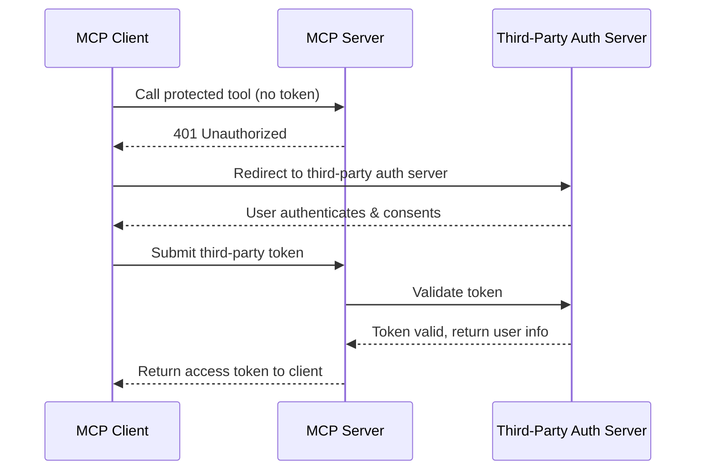

import { Callout } from "@/mdx/components";

# What is MCP Authorization?

Imagine giving an AI assistant the keys to your database, customer records, or financial systems. Since the Model Context Protocol allows agentic clients to access various parts of your systems as [tools](/tools) and [resources](/resources), how do you ensure that only the right agents can access the right tools?

This is where Authorization steps in.

Authorization determines:
- **Who** can access your MCP server
- **What** specific tools and resources they can use
- **When** their access is valid
- **How** they need to authenticate

## Authorization vs Authentication

Before diving deeper, let's clarify an important distinction:

- **Authentication** verifies identity, ie: confirming who or what is making the request.
- **Authorization** determines permissions, ie: deciding what the authenticated entity can access.

### Why is Authorization Important?

Suppose you have a powerful MCP server that can perform various tasks, like accessing sensitive data or executing critical operations. In that case, you need to ensure that **only authorized agents** can perform these actions.

Without proper authorization, you risk an agent accessing sensitive data its not supposed to, or even worse, [executing destructive commands.](https://x.com/jxnlco/status/1910131264566485502)

### OAuth 2.1 within MCP

The Model Context Protocol uses a subset of the [OAuth 2.1 framework](https://oauth.net/2.1/) for authorization. OAuth 2.1 is mandatory and the MCP specification establishes [specific requirements](https://modelcontextprotocol.io/specification/2025-03-26/basic/authorization) for implementing it in your server.

1. **Mandatory PKCE Implementation**: All MCP clients must use [Proof Key for Code Exchange](https://oauth.net/2/pkce/) (PKCE) to prevent authorization code interception attacks
2. **Metadata Discovery Support**: MCP servers should support [RFC8414](https://tools.ietf.org/html/rfc8414) for automatic endpoint discovery
3. **Dynamic Client Registration**: MCP servers should support [RFC7591](https://tools.ietf.org/html/rfc7591) to enable seamless client onboarding
4. **Standardized Error Handling**: Specific HTTP status codes (401, 403, 400) for different authorization scenarios

### Ways to implement OAuth in MCP

Here are a few ways you can implement OAuth when building your MCP server:

1. **Self-Contained OAuth**: Your MCP server acts as both the resource provider and the authorization provider.
2. **Third-Party OAuth Provider**: Your MCP server integrates with established providers like Auth0
3. **Custom OAuth Provider**: You use your existing OAuth infrastructure behind your own API's to provide authorization for your MCP server

Each approach has its own tradeoffs so you'll need to choose the one that best fits your needs.

## How MCP Authorization Works in Real-World Applications

Let's walk through an example to understand how you'd implement authorization in a real-world MCP server.

### Scenario: A Document Management System

Suppose you've built a document management MCP server that exposes these [tools](/mcp/tools):

- `createDocument`
- `readDocument`
- `updateDocument`
- `deleteDocument`
- `shareDocument`

You need to make sure different users have appropriate access levels:

| Role   | Access Level                           | Allowed Tools                                                                         |
|--------|----------------------------------------|---------------------------------------------------------------------------------------|
| Viewer | Can only read documents                | `readDocument`                                                                        |
| Editor | Can read, create, and update documents | `readDocument`, `createDocument`, `updateDocument`                                    |
| Admin  | Full access to all document operations | `readDocument`, `createDocument`, `updateDocument`, `deleteDocument`, `shareDocument` |


Here's the flow when an agent tries to access this system through an MCP client:

1. **Initial Request**: An MCP client tries to call the `deleteDocument` tool without an access token
2. **Challenge Response**: The MCP server responds with a `401 Unauthorized` status
3. **Authentication Initiation**: The client redirects the agent to an authorization URL
4. **User Consent**: The client authenticates and is granted the requested permissions, for example an `editor` role
5. **Token Exchange**: After consent, the authorization server issues an access token
6. **Authorized Request**: The client includes this token in subsequent requests, and can only access tools allowed by the role
   - For example, the `editor` role can call `readDocument`, `createDocument`, and `updateDocument`, but not `deleteDocument`
7. **Permission Verification**: The MCP server validates not just the token's authenticity but also the specific permissions it grants


Here's how you can implement authorization checks in a real MCP server:

```python mcp-server.py
from mcp.server import Server
from mcp.auth import TokenValidator

app = Server("document-manager")
token_validator = TokenValidator()

@app.tool("deleteDocument", description="Delete a document by ID", args={"id": str})
async def delete_document(id: str, context):
    # Check if user has admin role via token claims
    token = context.auth.token
    if not token:
        raise PermissionError("Authentication required")

    user_roles = token_validator.get_roles(token)
    if "admin" not in user_roles:
        raise PermissionError("Admin role required to delete documents")

    # Proceed with deletion if authorized
    result = await database.delete_document(id)
    return {"status": "deleted", "documentId": id}
```

In this example, the `deleteDocument` tool checks if the user has the `admin` role before allowing the deletion of a document. If not, it raises a `PermissionError`.

## Authorization Patterns

There are a few authorization patterns you can implement to enhance your MCP server's security.

### 1. Role-Based Access Control (RBAC)

Define roles (like Viewer, Editor, Admin) and assign permissions to these roles. Depending on the context, clients can then be assigned roles rather than individual permissions.

```json
{
  "roles": {
    "viewer": {
      "permissions": ["readDocument"]
    },
    "editor": {
      "permissions": ["readDocument", "createDocument", "updateDocument"]
    },
    "admin": {
      "permissions": ["readDocument", "createDocument", "updateDocument", "deleteDocument", "shareDocument"]
    }
  }
}
```

### 2. Attribute-Based Access Control (ABAC)

Make authorization decisions based on attributes (or claims) about the user, resource, action, and environment.

```python mcp-server.py
@app.tool("updateDocument", args={"id": str, "content": str})
async def update_document(id: str, content: str, context):
    document = await database.get_document(id)

    # Check if user is the document owner or has editor/admin role
    token = context.auth.token
    user_id = token_validator.get_user_id(token)
    user_roles = token_validator.get_roles(token)

    if (document.owner_id == user_id or
        any(role in ["editor", "admin"] for role in user_roles)):
        # Authorized to update
        return await database.update_document(id, content)
    else:
        raise PermissionError("Not authorized to update this document")
```

### 3. Third-Party Authorization

MCP also supports delegating authorization to third-party providers like Auth0, Okta, or even the existing auth setup behind your API. This is useful if you want to leverage existing identity management systems or if you have multiple MCP servers that need to share the same authorization logic.



1. The MCP server redirects the client to the third-party authorization server
2. The user authenticates with the third-party provider
3. The third-party server issues tokens that the MCP server validates
4. The MCP server maintains a secure mapping between third-party tokens and MCP tokens

This allows you to use your existing identity infrastructure.

### Authorization Code Flow with PKCE

For browser-based applications and most MCP clients, the specification recommends the Authorization Code flow with PKCE (Proof Key for Code Exchange). This is for public clients that cannot keep secrets.

The PKCE extension prevents authorization code interception attacks by requiring the client to generate a secret "code verifier" and its transformed value (the "code challenge"). This ensures that only the original requester can exchange the authorization code for tokens.

<Callout title="Note" type="info">
  Authorization in MCP is tightly integrated with the [transport layer](/mcp/transports). During the transport initialization handshake, the MCP server can immediately communicate its authorization requirements to the client.
</Callout>


## Authorization and Root Boundaries

MCP's [root's](/mcp/roots) can be used in tandem with authorization to provide an additional layer of access control. While authorization determines what actions a user can perform, roots determine **which resources are visible** to the client.

For example, you might implement both in a tool like `readDocument` to make sure that a client can only read documents within their authorized roots and only if they have the right permissions:

```python
@app.tool("readDocument", args={"id": str, "rootPrefix": str})
async def read_document(id: str, rootPrefix: str, context):
    # first check authorization
    if not has_permission(context.auth.token, "documents:read"):
        raise PermissionError("No permission to read documents")

    # then validate against roots
    if not context.roots.can_access(f"{rootPrefix}/{id}"):
        raise PermissionError("Document outside accessible roots")

    # return the document only if both checks pass
    return get_document(id)
```

## Some Best Practices for Secure MCP Authorization

Here are a few best practices to keep in mind when implementing authorization in your MCP server:

1. **Apply the Principle of Least Privilege**: Grant only the permissions necessary for the intended function
2. **Implement Short-Lived Tokens**: Set reasonable expiration times for access tokens
3. **Validate Tokens Properly**: Check signature, expiration, issuer, and audience claims
4. **Provide Clear Permission Errors**: Help users understand why access was denied
5. **Use TLS for All Communications**: Encrypt all authorization-related traffic
6. **Implement Rate Limiting**: Protect against brute force and denial-of-service attacks
