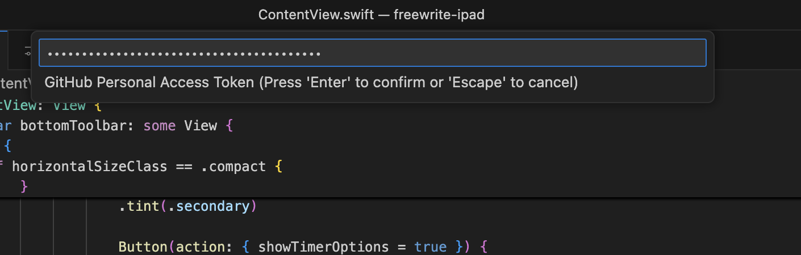

import { Callout, Spotlight } from "@/mdx/components";

<Callout title="Gram AI by Speakeasy">
  Unlock AI engineering by turning your API platform into an AI platform with
  [Gram](https://app.getgram.ai). Generate agent tools for internal services and
  connect to popular third party APIs from one platform. [Join the
  waitlist](https://app.getgram.ai) today.
</Callout>


The Model Context Protocol (MCP) connects your AI assistants to real-world tools and data sources. Instead of manually copying and pasting information between your tools and AI, MCP lets your AI assistant interact directly with services like GitHub, databases, file systems, and hundreds of other tools.

In this guide, we'll walk you through installing and configuring the Github MCP server in popular AI clients like Claude Desktop, Cursor, and Windsurf.

For a deeper understanding of MCP fundamentals, check out our [introduction to MCP](../intro.mdx) and [AI agents overview](../ai-agents-intro.mdx).

## The Github MCP Server

For this guide, we're using the Github MCP server, which allows your AI assistant to interact with GitHub repositories, issues, pull requests, and more.

Let's say you're working on a project and need to:

1. Check recent issues in a repository
2. Create a new pull request for a bug fix
3. Update the issue with your progress
4. Request a code review when done

You'd need to switch between your AI chat, GitHub's web interface, your terminal, and back again. With MCP, you can do all of this through a single conversation with your AI assistant, and if your client is agentic, it can even use MCP tools step by step to complete tasks on your behalf.

**With GitHub's MCP server installed, you could simply ask:**
> "Show me the highest priority open issues in my repo, create a pull request for issue #42, and let me know when you're ready for me to start coding."

Your client would then:
- Connect to GitHub through the MCP server
- Fetch and display the current issues
- Create a draft pull request using GitHub's API
- Keep track of the context for the entire workflow

You can find the MCP server for GitHub [here](https://github.com/github/github-mcp-server).

## How to Install MCP Servers

Installing MCP servers requires manual configuration in most clients through JSON config files. While this involves editing configuration files, the process is well-documented and gives you precise control over which tools your AI can access. 

For GitHub, we'll use the local Docker installation which gives you full control over the server instance and doesn't require external dependencies. This approach works consistently across all clients and keeps your data local.

Below are step-by-step instructions for the most popular clients using the Docker-based GitHub MCP server.

### System Requirements

Before you begin, we recommend ensuring you have the following prerequisites installed:

- **Docker**: Download from [docker.com](https://www.docker.com/) (only needed for local GitHub MCP server)
- **GitHub Personal Access Token**: Create a [personal access token](https://github.com/settings/personal-access-tokens/new) with the scopes you need for your workflow (`repo`, `read:org`, `read:user` etc.).


As we're using Docker for the GitHub MCP server, ensure you have Docker installed and running on your machine. You can verify this by running `docker --version` in your terminal. Alternatively, you can use the [remote hosted version of the GitHub MCP server](https://github.com/github/github-mcp-server/blob/main/docs/host-integration.md), but for this guide, we'll focus on the local Docker setup. 

## Claude Desktop

Claude Desktop requires manual configuration through a JSON config file to add MCP servers. While this requires a bit more setup than a one-click install, it gives you full control over which servers and tools you enable.

### Installing GitHub MCP Server in Claude Desktop

Let's take a look at how to install the GitHub MCP server in Claude Desktop.


**Open Claude Desktop Settings**

Start by accessing the Claude Desktop settings through the main menu. On macOS, click "Claude" → "Settings..." from the menu bar. On Windows, access the settings through the application menu.

**Access Developer Configuration**

Navigate to the "Developer" section in the left sidebar of the settings window. Click "Edit Config" to open the MCP configuration file. This will create or open the configuration file located at:
- **macOS**: `~/Library/Application Support/Claude/claude_desktop_config.json`
- **Windows**: `%APPDATA%\Claude\claude_desktop_config.json`

**Add GitHub MCP Server Configuration**

Replace the file contents with this configuration, substituting your actual GitHub personal access token:

```json
{
  "mcpServers": {
    "github": {
      "command": "docker",
      "args": [
        "run",
        "-i",
        "--rm",
        "-e",
        "GITHUB_PERSONAL_ACCESS_TOKEN",
        "ghcr.io/github/github-mcp-server"
      ],
      "env": {
        "GITHUB_PERSONAL_ACCESS_TOKEN": "<YOUR_GITHUB_TOKEN>"
      }
    }
  }
}
```

**Restart and Test**

Save the configuration file and completely close Claude Desktop, then reopen it. Once restarted, click the "🔨" icon to see available tools and test the connection by asking: "What repositories do I have access to?"

<Callout title="Important Note">
Claude Desktop will ask for your permission before executing any GitHub actions. You'll see a confirmation dialog for operations like creating issues or branches.
</Callout>

After configuring the GitHub MCP server, you can use natural language commands to interact with your repositories directly from Claude Desktop.


If the hammer icon fails to appear, it may be due to a syntax error in your JSON configuration. Double-check the syntax and ensure the file is saved correctly. Make sure to restart Claude Desktop completely after making changes to the configuration file. 


## Cursor IDE

Cursor integrates MCP servers through a simple configuration file in your project directory, giving you precise control over which tools are available for each project. As of Cursor version 1.0, MCP support is built-in, allowing you to easily add and manage servers from Cursor's settings.

### Installing GitHub MCP Server in Cursor

While Cursor has a built-in MCP server configuration for GitHub, we'll show you how to set it up manually using the MCP configuration for consistency across clients.

**Access MCP Configuration**

Open Cursor and navigate to **Settings**, then click on the **Integrations** tab. Look for the MCP section and click the **New MCP Server** button to access the configuration interface.


**Add GitHub Server Configuration**

This opens Cursor's global MCP configuration file. Add the GitHub MCP server configuration with your personal access token:

```json
{
  "mcpServers": {
    "github": {
      "command": "docker",
      "args": [
        "run",
        "-i", 
        "--rm",
        "-e",
        "GITHUB_PERSONAL_ACCESS_TOKEN",
        "ghcr.io/github/github-mcp-server"
      ],
      "env": {
        "GITHUB_PERSONAL_ACCESS_TOKEN": "YOUR_GITHUB_TOKEN_HERE"
      }
    }
  }
}
```


**Using GitHub Tools in Cursor**

Once configured, access the GitHub MCP functionality through Cursor's AI chat by clicking the chat icon or using Cmd/Ctrl + L. Cursor automatically discovers available MCP tools and allows you to interact with them using natural language commands.


You can now ask questions like "Show me recent issues in this repository" or check on your workflow with queries like "What PRs are waiting for my review?"


## Windsurf IDE

Installing MCP servers in Windsurf is fairly similar to Cursor.


**Access Windsurf Settings**

Click **Windsurf** in the top menu bar, then navigate to **Settings** > **Windsurf Settings** to open the main configuration interface.

**Open Plugin Management**

Under the "Plugins (MCP Servers)" section, click **Manage plugins** to access the plugin configuration area. In the "Manage plugins" page, click **View raw config** to open the configuration file editor.

**Configure GitHub MCP Server**

A new file named `mcp_config.json` will open in the editor. Replace the contents with this GitHub MCP server configuration:

```json
{
  "mcpServers": {
    "github": {
      "command": "docker",
      "args": [
        "run",
        "-i",
        "--rm", 
        "-e",
        "GITHUB_PERSONAL_ACCESS_TOKEN",
        "ghcr.io/github/github-mcp-server"
      ],
      "env": {
        "GITHUB_PERSONAL_ACCESS_TOKEN": "YOUR_GITHUB_TOKEN_HERE"
      }
    }
  }
}
```

Save the `mcp_config.json` file after adding your configuration.

**Activate the GitHub Plugin**

Return to the "Manage plugins" tab and click the **Refresh** button to reload the plugin configuration. The GitHub plugin will now appear in your available plugins and be ready to use.

You can now interact with your repositories, issues, and pull requests directly from Windsurf using natural language commands.


## VS Code with GitHub Copilot

VS Code supports MCP through GitHub Copilot with version 1.101 or later.

### Installing GitHub MCP Server in VS Code

Installing the GitHub MCP server in VS Code requires configuring the MCP settings file to run the server as a Docker container with GitHub authentication.

**Access MCP Configuration**

Open your VS Code settings and search for "MCP". Ensure you have **Chat->MCP** enabled. Under the **MCP** setting, click the "Edit in settings.json" link to open the configuration file.


**Configure GitHub MCP Server**

Add this configuration to your VS Code MCP `settings.json` file:

```json
{
  "servers": {
    "github": {
      "command": "docker",
      "args": [
        "run",
        "-i",
        "--rm",
        "-e",
        "GITHUB_PERSONAL_ACCESS_TOKEN",
        "ghcr.io/github/github-mcp-server"
      ],
      "env": {
        "GITHUB_PERSONAL_ACCESS_TOKEN": "${input:github_token}"
      }
    }
  },
  "inputs": [
    {
      "type": "promptString",
      "id": "github_token",
      "description": "GitHub Personal Access Token",
      "password": true
    }
  ]
}
```

The `${input:github_token}` placeholder will prompt you to enter your GitHub Personal Access Token when the server starts. Save the configuration file when done.

**Start the GitHub MCP Server**

Open the Command Palette (`Ctrl+Shift+P` or `Cmd+Shift+P`) and type `MCP: List Servers` to see available servers.


Click on the GitHub MCP server from the list to start it. VS Code will prompt you to enter your GitHub Personal Access Token.




Enter your token and press Enter. The server will start and display output indicating successful startup.


**Using GitHub Tools with Copilot**

Once configured, the GitHub MCP tools become available in the Copilot chat interface. You can enable and disable specific tools as needed by clicking the tool icon in the chat window.


You can now interact with your repositories, issues, and pull requests directly through Copilot using natural language commands.

## Beyond GitHub: Popular MCP Servers

Once you're comfortable with GitHub integration, explore these popular Docker-based MCP servers:

### Development Tools
- **[Docker MCP Server](https://github.com/ckreiling/mcp-server-docker)**: Manage Docker containers with agents
  ```json
  {
    "mcpServers": {
      "docker": {
        "command": "uvx",
        "args": ["mcp-server-docker"]
      }
    }
  }
  ```

- **[PostgreSQL](https://github.com/docker/mcp-servers)**: Database management and queries
  ```json
  {
    "mcpServers": {
      "postgres": {
        "command": "docker",
        "args": ["run", "-i", "--rm", "mcp-server-postgres"],
        "env": {
          "DATABASE_URL": "postgresql://localhost/mydb"
        }
      }
    }
  }
  ```

## Troubleshooting Common Issues

If you encounter issues while installing or using MCP servers, here are some common problems and solutions:

### Authentication Problems

**GitHub OAuth fails:**
You may see errors like "Invalid OAuth token" or "Insufficient permissions". You can fix this by using a Personal Access Token instead of OAuth:

```bash
"env": {
  "GITHUB_PERSONAL_ACCESS_TOKEN": "ghp_your_token_here"
}
```

**Token permissions insufficient:**
- Ensure your token has required scopes (usually `repo`, `read:org`)
- Check if your organization requires SSO

### Connection Issues

**Server won't start:**
1. Check if Docker is installed and running 
2. Verify the server package is properly installed
3. Look at error logs in your client

**Commands not working:**
1. Verify server is running: Look for green indicator in client
2. Check available tools: Each server exposes different capabilities
3. Try simpler commands first: "list repositories" before trying a complex prompt
