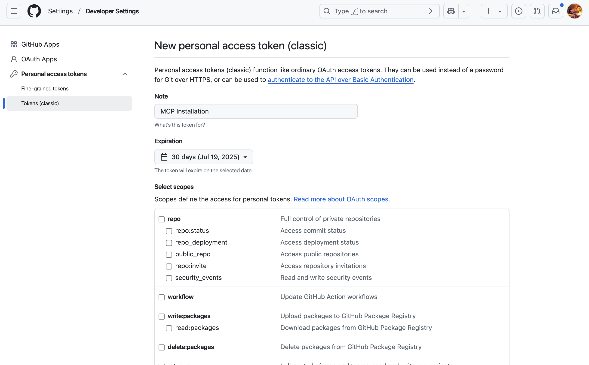
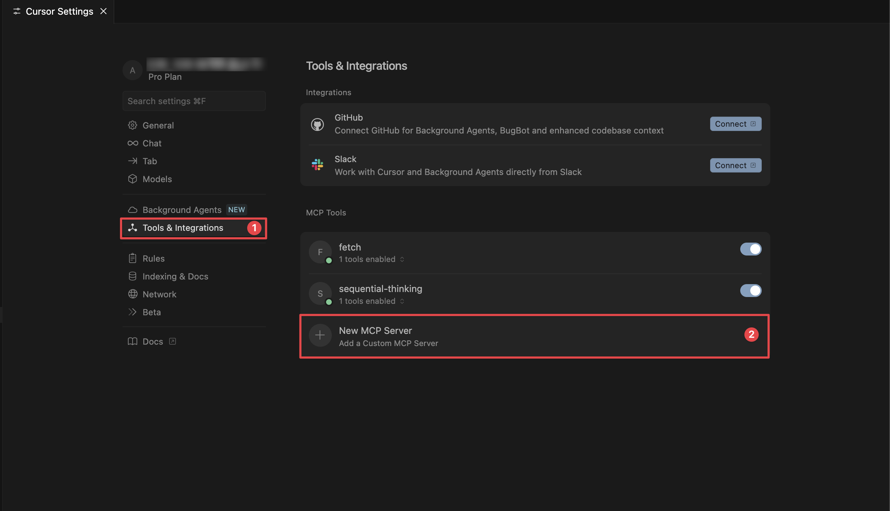
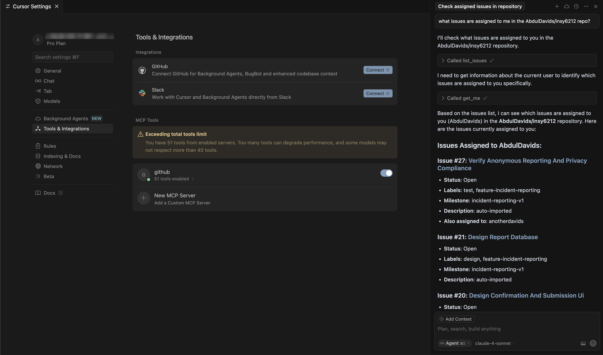
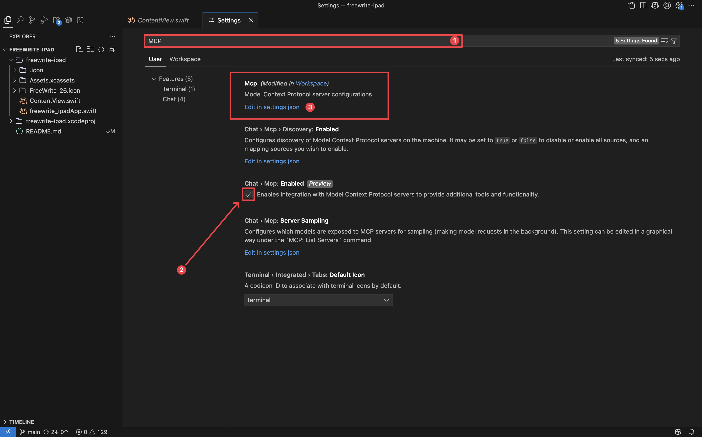
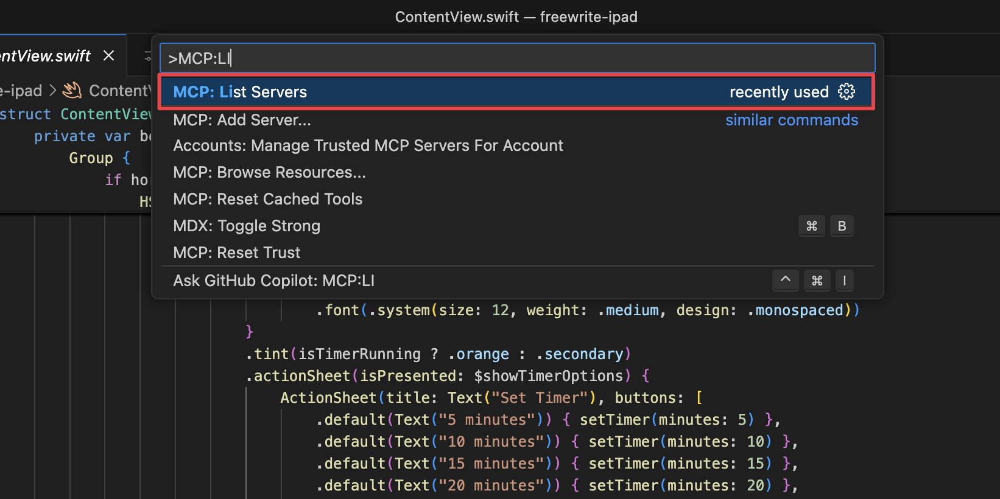
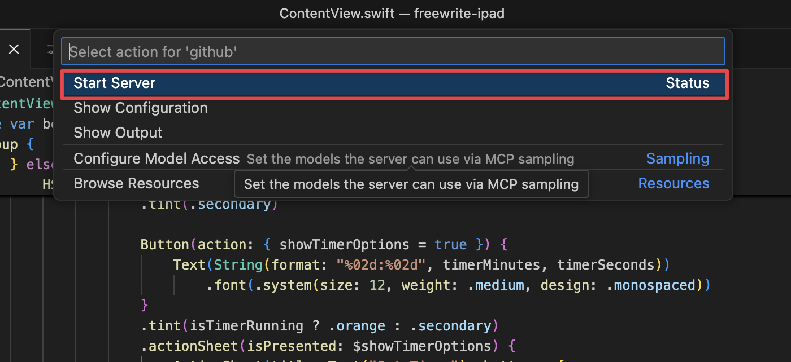
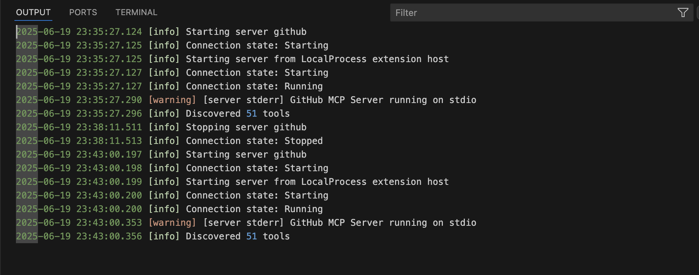
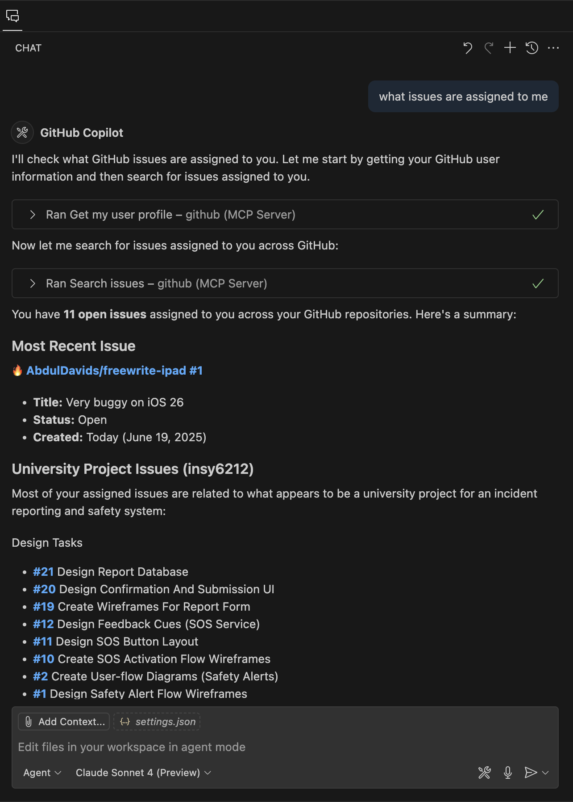

import { Callout, Spotlight } from "@/mdx/components";

<Callout title="Gram AI by Speakeasy">
  Unlock AI engineering by turning your API platform into an AI platform with
  [Gram](https://app.getgram.ai). Generate agent tools for internal services and
  connect to popular third-party APIs from one platform. [Join the
  waitlist](https://app.getgram.ai) today.
</Callout>


The Model Context Protocol (MCP) connects your AI assistants to real-world tools and data sources. Instead of requiring you to manually copy and paste information between your tools and your AI assistant, MCP lets your AI assistant interact directly with databases, file systems, services like GitHub, and hundreds of other tools.

This guide demonstrates how to install and configure the GitHub MCP Server in popular AI clients like Claude, Cursor, and Windsurf.

For a deeper understanding of MCP fundamentals, check out our [introduction to MCP](../intro.mdx) and [AI agents overview](../ai-agents-intro.mdx).

## The GitHub MCP Server

The [GitHub MCP Server](https://github.com/github/github-mcp-server) allows an AI assistant to interact with GitHub repositories, issues, pull requests, and more.

Let's say you're working on a project and need to:

- Check recent issues in a repository
- Create a new pull request for a bug fix
- Update the issue with your progress
- Request a code review when done

You'd need to switch between your AI chat, GitHub's web interface, your terminal, and back again. With MCP, you can do all of this through a single conversation with your AI assistant, and if your client is agentic, it can even use MCP tools step by step to complete tasks on your behalf.

With GitHub's MCP server installed, you could ask:

> Show me the highest priority open issues in my repo, create a pull request for issue #42, and let me know when you're ready for me to start coding.

Your client would then:

- Connect to GitHub through the MCP server
- Fetch and display the current issues
- Create a draft pull request using GitHub's API
- Keep track of the context for the entire workflow

## How to install MCP servers

In most clients, installing MCP servers requires manual configuration through JSON config files. While this involves editing configuration files, the process is well-documented and gives you precise control over which tools your AI assistant can access.

For GitHub, we'll use the local Docker installation, which gives us full control over the server instance and doesn't require external dependencies. This approach works consistently across all clients and keeps our data local.

Below, we provide step-by-step instructions for the most popular clients using the Docker-based GitHub MCP Server.

### System requirements

Before you begin, ensure you have the following prerequisites installed:

- **Docker**: Download Docker Desktop from [docker.com](https://www.docker.com/).
- **A GitHub personal access token**: Create a [personal access token](https://github.com/settings/personal-access-tokens/new) with the scopes you need for your workflow (such as `repo`, `read:org`, and `read:user`).



Run the `docker --version` command in your terminal to verify that Docker is installed and running on your machine.

Alternatively, you can use the instructions for the [remote-hosted version of the GitHub MCP Server](https://github.com/github/github-mcp-server/blob/main/docs/host-integration.md), which doesn't require the use of Docker. However, for this guide, we'll focus on the local Docker setup.

## Claude

Adding MCP servers to the Claude desktop app requires manual configuration through a JSON config file. While this requires a bit more setup than a one-click install, it gives you full control over which servers and tools you enable.

### Install the GitHub MCP Server in Claude

Let's take a look at how to install the GitHub MCP Server in Claude.

<video controls>
  <source src="./assets/installing-mcp-claude.mp4" type="video/mp4"/>
</video>

#### Open the Claude settings

Start by accessing the Claude settings through the main menu. On macOS, click **Claude** and select **Settings...** from the menu bar. On Windows, access the settings through the application menu.

#### Access the developer configuration in Claude

Navigate to the **Developer** section in the left sidebar of the settings window. Click **Edit Config** to open the MCP configuration file. This will create or open the configuration file at the following location:

- **In macOS**: `~/Library/Application Support/Claude/claude_desktop_config.json`
- **In Windows**: `%APPDATA%\Claude\claude_desktop_config.json`

#### Add the GitHub MCP Server configuration for Claude

Replace the file contents with this configuration, substituting your actual GitHub personal access token:

```json
{
  "mcpServers": {
    "github": {
      "command": "docker",
      "args": [
        "run",
        "-i",
        "--rm",
        "-e",
        "GITHUB_PERSONAL_ACCESS_TOKEN",
        "ghcr.io/github/github-mcp-server"
      ],
      "env": {
        "GITHUB_PERSONAL_ACCESS_TOKEN": "<YOUR_GITHUB_TOKEN>"
      }
    }
  }
}
```

#### Restart Claude and test the server configuration

Save the configuration file, completely close the Claude app, and then reopen it. Once restarted, click **🔨** (the hammer icon) to see the available tools and test the connection by asking:

> What repositories do I have access to?

<Callout title="Important Note">
Claude will ask for your permission before executing any GitHub Actions. You'll see a confirmation dialog for operations like creating issues or branches.
</Callout>

After configuring the GitHub MCP Server, you can use natural language commands to interact with your repositories directly from Claude.

<video controls>
  <source src="./assets/claude-desktop-showcase.mp4" type="video/mp4"/>
</video>

If the hammer icon fails to appear, it may be due to a syntax error in your JSON configuration. Double-check the syntax and ensure the file is saved correctly. Make sure to restart the Claude desktop app completely after making changes to the configuration file. 

## Cursor IDE

Cursor integrates MCP servers through a simple configuration file in the project directory, giving you precise control over which tools are available for each project. As of Cursor version 1.0, MCP support is built-in, allowing you to easily add and manage servers from Cursor's settings.

### Install the GitHub MCP Server in Cursor

Although Cursor has a built-in MCP server configuration for GitHub, for consistency across clients, we'll show you how to set it up manually using the MCP configuration.

#### Access the MCP configuration in Cursor

Open Cursor and navigate to **Settings -> Cursor Settings**, then open the **Tools & Integrations** tab. Look for the MCP section and click the **Add Custom MCP** button to access the configuration interface.



#### Add the GitHub MCP Server configuration for Cursor

This opens Cursor's global MCP configuration file. Add the GitHub MCP Server configuration along with your personal access token:

```json
{
  "mcpServers": {
    "github": {
      "command": "docker",
      "args": [
        "run",
        "-i", 
        "--rm",
        "-e",
        "GITHUB_PERSONAL_ACCESS_TOKEN",
        "ghcr.io/github/github-mcp-server"
      ],
      "env": {
        "GITHUB_PERSONAL_ACCESS_TOKEN": "YOUR_GITHUB_TOKEN_HERE"
      }
    }
  }
}
```

#### Use GitHub tools in Cursor

Once configured, access the GitHub MCP functionality through Cursor's AI chat by clicking the chat icon or using `Cmd` + `L` or `Ctrl` + `L`. Cursor automatically discovers available MCP tools and allows you to interact with them using natural language commands.



You can now make requests like, *"Show me recent issues in this repository,"* or check on your workflow with queries like *"Which PRs are waiting for my review?"*

## Windsurf IDE

Installing an MCP server in Windsurf is fairly similar to installing one in Cursor.

<video controls>
  <source src="./assets/windsurf-github-mcp-installation.mp4" type="video/mp4"/>
</video>

### Access the Windsurf settings

Click **Windsurf** in the top menu bar, then navigate to **Settings -> Windsurf Settings** to open the main configuration interface.

### Open the Windsurf plugin management

Under the **Plugins (MCP Servers)** section, click **Manage plugins** to access the plugin configuration area. In the **Manage plugins** page, click **View raw config** to open the configuration file editor.

### Configure the GitHub MCP Server for Windsurf

A new file, named `mcp_config.json`, will open in the editor. Replace the contents with this GitHub MCP Server configuration:

```json
{
  "mcpServers": {
    "github": {
      "command": "docker",
      "args": [
        "run",
        "-i",
        "--rm", 
        "-e",
        "GITHUB_PERSONAL_ACCESS_TOKEN",
        "ghcr.io/github/github-mcp-server"
      ],
      "env": {
        "GITHUB_PERSONAL_ACCESS_TOKEN": "YOUR_GITHUB_TOKEN_HERE"
      }
    }
  }
}
```

Save the `mcp_config.json` file after adding your configuration.

### Activate the GitHub plugin in Windsurf

Return to the **Manage plugins** tab and click the **Refresh** button to reload the plugin configuration. The GitHub plugin will now appear in your available plugins. It is ready to use.

You can now interact with your repositories, issues, and pull requests directly from Windsurf using natural language commands.

## VS Code with GitHub Copilot

VS Code supports MCP through GitHub Copilot with version 1.101 or later.

### Install the GitHub MCP Server in VS Code

Installing the GitHub MCP Server in VS Code requires configuring the MCP settings file to run the server as a Docker container with GitHub authentication.

#### Access the MCP configuration via VS Code

Open your VS Code settings and search for `MCP`. Ensure you have **Chat -> MCP** enabled. Under the **MCP** setting, click the **Edit in settings.json** link to open the configuration file.



#### Configure the GitHub MCP Server for Copilot

Add the following configuration to your VS Code MCP `settings.json` file:

```json
{
  "servers": {
    "github": {
      "command": "docker",
      "args": [
        "run",
        "-i",
        "--rm",
        "-e",
        "GITHUB_PERSONAL_ACCESS_TOKEN",
        "ghcr.io/github/github-mcp-server"
      ],
      "env": {
        "GITHUB_PERSONAL_ACCESS_TOKEN": "${input:github_token}"
      }
    }
  },
  "inputs": [
    {
      "type": "promptString",
      "id": "github_token",
      "description": "GitHub Personal Access Token",
      "password": true
    }
  ]
}
```

The `${input:github_token}` placeholder will prompt you to enter your GitHub personal access token when the server starts. Save the configuration file when done.

#### Start the GitHub MCP Server

Open the Command Palette (`Ctrl` + `Shift` + `P` or `Cmd` + `Shift` + `P`) and type `MCP: List Servers` to see available servers.



From the list, click on the GitHub MCP Server to start it. VS Code will prompt you to enter your GitHub personal access token.



Enter your token and press `Enter`. The server will start and display output indicating successful startup.



#### Use GitHub tools with Copilot

Once configured, the GitHub MCP tools become available in the Copilot chat interface. You can enable and disable specific tools as needed by clicking the tool icon in the chat window.



You can now interact with your repositories, issues, and pull requests directly through Copilot using natural language commands.

## Beyond GitHub: Popular MCP servers

Once you're comfortable with GitHub integration, explore these popular Docker-based MCP servers and the development tools they provide:

- **[The Docker MCP server](https://github.com/ckreiling/mcp-server-docker)**: Manage Docker containers with agents.

  ```json
  {
    "mcpServers": {
      "docker": {
        "command": "uvx",
        "args": ["mcp-server-docker"]
      }
    }
  }
  ```

- **[The PostgreSQL MCP server](https://github.com/docker/mcp-servers/tree/main/src/postgress)**: Manage databases and execute read-only queries.

  ```json
  {
    "mcpServers": {
      "postgres": {
        "command": "docker",
        "args": ["run", "-i", "--rm", "mcp-server-postgres"],
        "env": {
          "DATABASE_URL": "postgresql://localhost/mydb"
        }
      }
    }
  }
  ```

## Troubleshooting common issues

Here are some common problems and solutions to help you resolve any issues you encounter while installing or using MCP servers:

### Authentication problems

#### GitHub OAuth fails

If you see errors like `Invalid OAuth token` or `Insufficient permissions`, you can fix these errors by using a personal access token instead of OAuth:

```bash
"env": {
  "GITHUB_PERSONAL_ACCESS_TOKEN": "ghp_your_token_here"
}
```

#### Insufficient token permissions

If you receive a `Token permissions insufficient` error:

- Ensure your token has the required scopes (usually `repo` and `read:org`)
- Check whether your organization requires SSO

### Connection problems

#### The server won't start

If your MCP server doesn't start

- Check that Docker is installed and running
- Verify that the server package is properly installed
- Look at the error logs in your client

#### The commands don't work

If your commands aren't working:

- Verify the server is running by looking for a green indicator in the client
- Check the available tools to confirm the server has been installed correctly (each server exposes different capabilities)
- Try simpler commands like, *"List repositories,"* before trying more complex prompts
