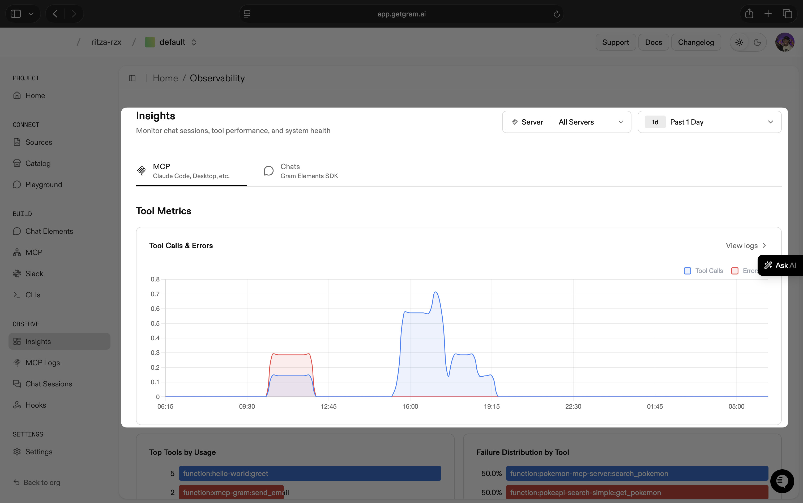
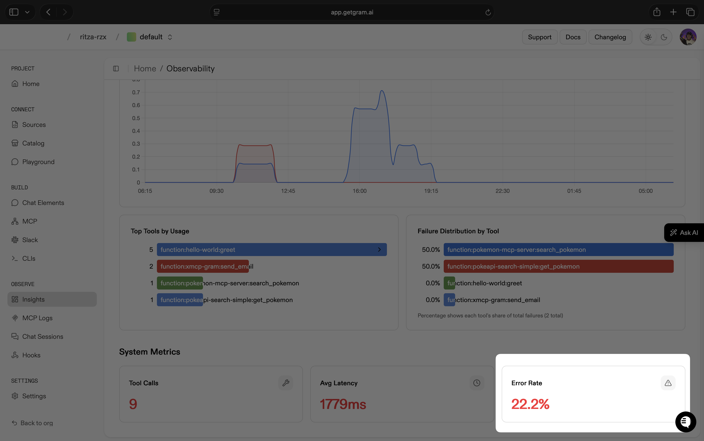
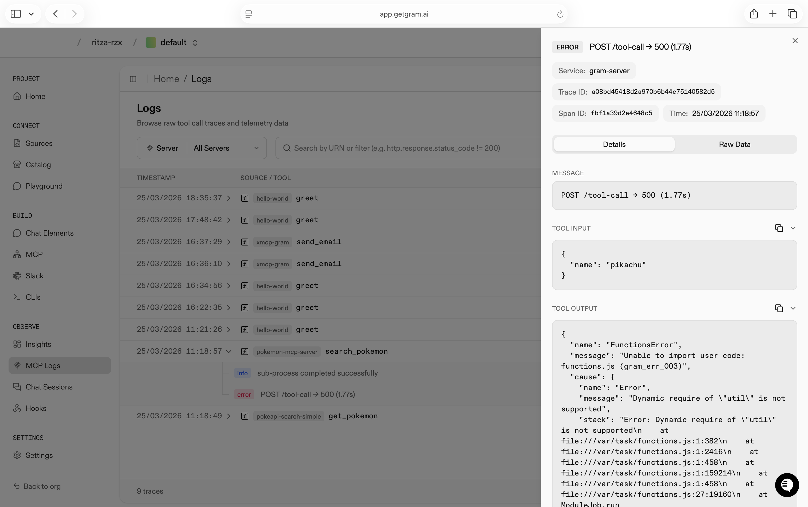
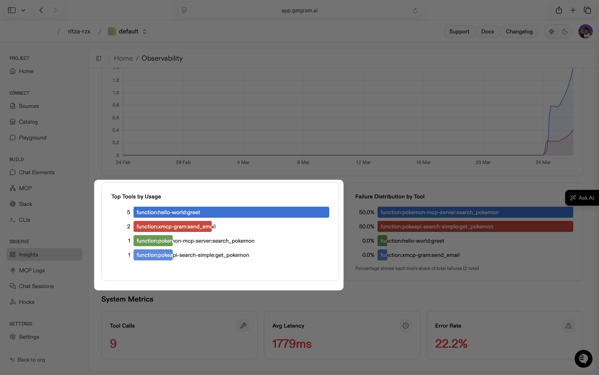
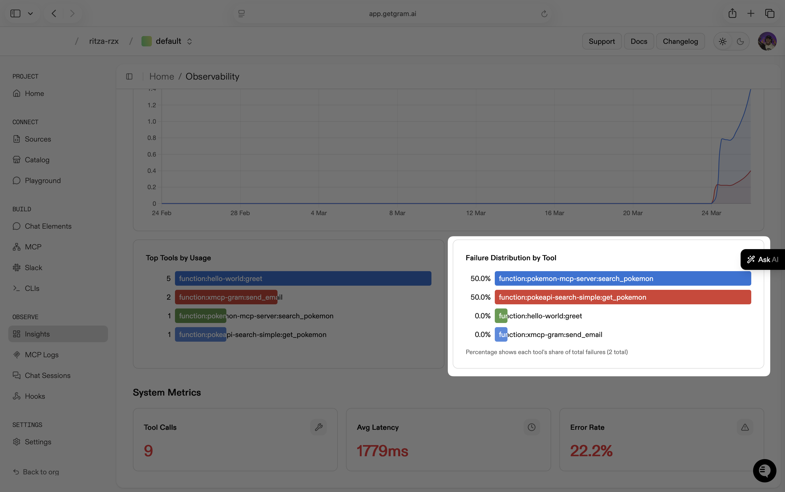
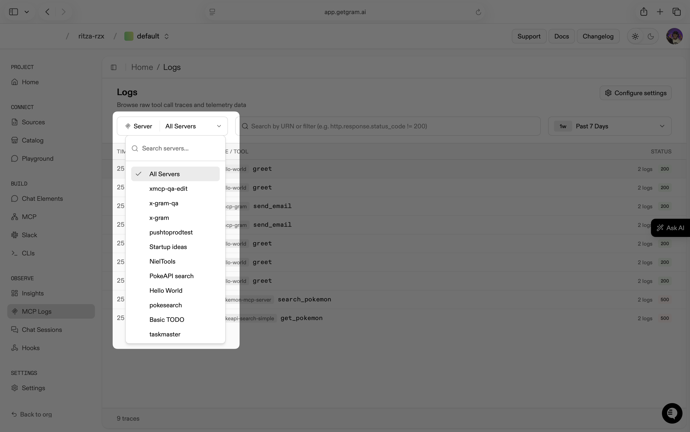
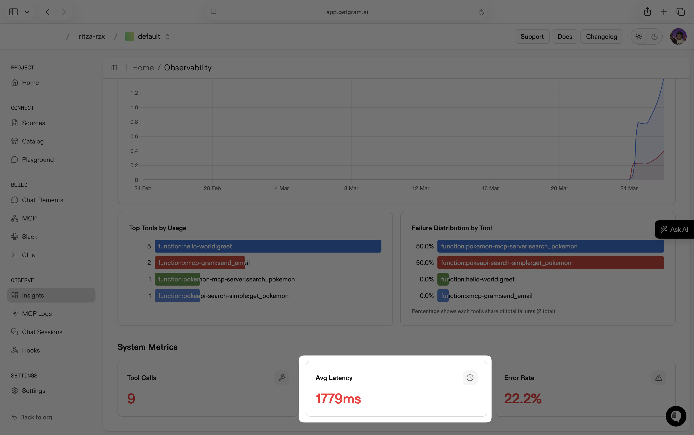
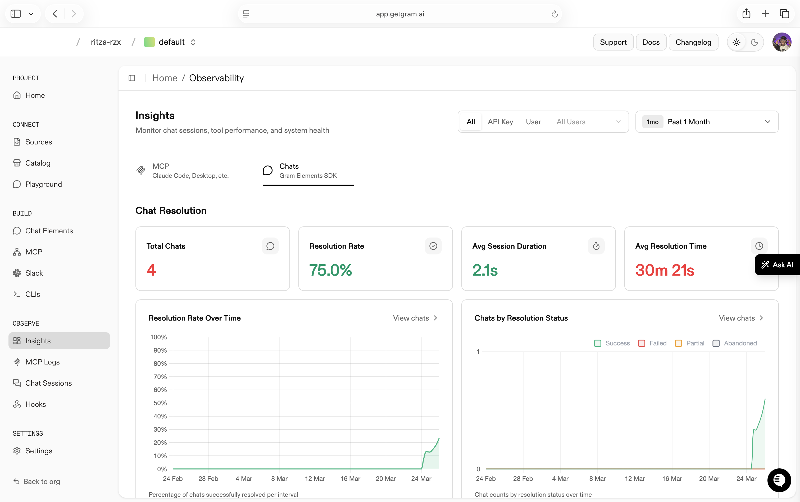
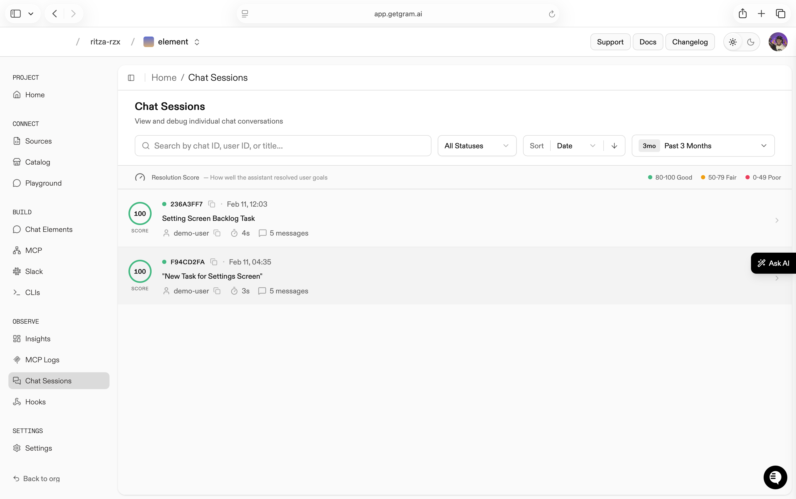
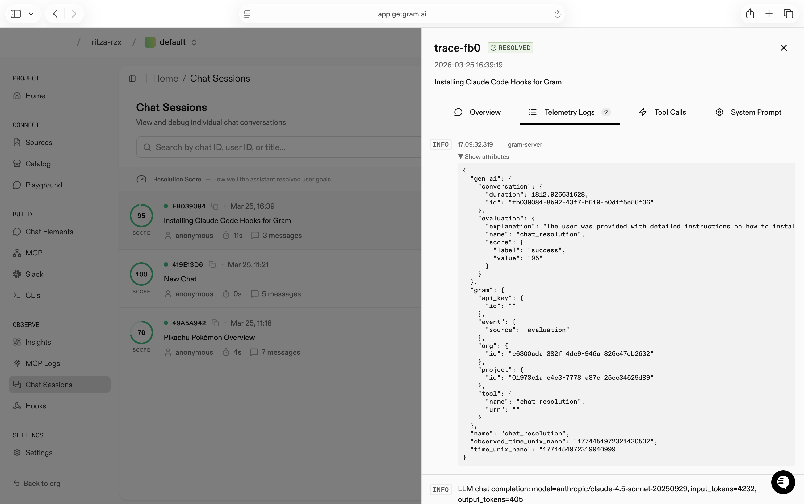

## Measuring AX performances with Gram

Gram provides essential MCP observability features to help you measure your AX performance. Once you have an MCP server running under Gram, you can start measuring the following metrics to determine AX performance:

- Task execution
- Feedback loop quality
- Discovery and context
- Efficiency

In this guide, you will learn how to use Gram MCP observability features to help you measure AX performance.

## Task execution

Task execution covers everything related to how an agent completes work. The primary signal is the tool call success rate, which indicates whether agents are completing tasks or failing.

In the Gram dashboard, navigate to **Observe -> Insights** to get the **Tool Calls & Errors**.

To measure the error rate, scroll down under **System Metrics**.

Once you see these metrics, check the failure distribution by tool, then go to **MCP Logs** to analyze the errors in detail.

## Feedback loop quality

Feedback loop quality measures how well a platform communicates the result of an agent's action back to the agent so it can decide what to do next. It requires qualitative analysis, not just numbers.

Gram helps you track this qualitatively using two features.

**Raw Tool Call Traces** under MCP Logs show you what tools an agent calls during a session and whether it self-corrects after a failure.

This data tells you how to fix your tools. If you see a long chain of sequential calls, you can combine them into one tool. If an agent calls a tool that fails before switching to another tool to complete the task, that tells you the first tool needs a better description or should be removed entirely.

**Hooks** at **Observe -> Hooks** let you set up telemetry collection with Claude Code. Claude Code sends pre-call, during-call, and post-call data to Gram so you can analyze the full execution context around every tool call.

## Discovery and context

Discovery and context measures how well a platform helps an agent find the right tool for a given intent and arrive at that tool with enough information to use it correctly on the first attempt.

Gram measures discovery and context using two metrics in combination.

**Top Tools by Usage** is under **Observe -> Insights**.

On its own, it shows you where agents land when they interpret intent. Combined with **Failure Distribution by Tool**, it reveals whether agents are picking the right tools or consistently gravitating toward the wrong ones.

The combination gives you a precise diagnosis. High usage and a low failure rate indicate that discovery and context are both working. High usage and a high failure rate mean agents find the tool but lack the context to use it correctly. Low usage, even with a failure rate, means agents are not finding the tool at all.

Once you identify a tool with a high failure rate in the Failure Distribution view, filter **MCP Logs** by the MCP server hosting that tool and analyze the raw traces.

The traces show you exactly what parameters the agent passed on every failed call, whether it hallucinated a field, skipped a required parameter, or passed the wrong type.

## Efficiency

Gram measures efficiency both quantitatively and qualitatively.

**Avg Latency** measures the time it takes for an agent to complete a tool call. A high average latency means the tool execution is slow, or the agent spends too many steps searching for the right tool before calling it.

**Chat Metrics** are available if you use Gram Elements for chat experiences. Under **Observe -> Insights**, navigate to the **Chats** tab.

The Chats tab surfaces resolution rate, average session length, and average session time. These metrics tell you whether agents are efficient with the tools available. A high average session time is a symptom worth investigating. It can mean users are spending too long before getting a useful response, or that the agent is taking too many steps to complete simple tasks.

After reviewing these metrics, go to **MCP Logs** or **Chat Sessions** to analyze the behavior behind the numbers.

Clicking on a session shows **Telemetry Logs** with tokens consumed, models called, tool calls, and prompts. This is where steps-to-completion and token cost per task become visible.

## Conclusion

Gram provides an easy pattern to follow to measure AX. Start with Insights to find the pattern. Go to MCP Logs or Chat Sessions to find the cause. Using the information collected, fix the tools or descriptions and measure again.

This is where using Gram hooks can help, as you can run them locally, and use the logs collected for debugging.
