# Guide to the OpenAI ecosystem

OpenAI ships something new almost every month. Models get renamed, preview features appear, and entire product lines arrive with little warning. If you're building agents, you need a clear picture: which pieces expect code, which ones are visual builders, and how they all fit together.

This guide walks through OpenAI's ecosystem with a focus on building agents. We'll compare code-first APIs against no-code builders, explain what each product does, and show how to integrate them with external tools using MCP where relevant.

## Code or no-code

OpenAI offers two main paths for building agents. The code-first route gives you full control over prompts, state, and infrastructure. The no-code route provides visual builders and managed hosting that business users can operate.

You'll likely start with one and migrate to the other, or run both in parallel. Here's how they compare:

|                  | Code-first APIs                                             | No-code builders                                             |
|------------------|-------------------------------------------------------------|--------------------------------------------------------------|
| Control level    | Total control over prompts, state, infrastructure           | Configuration only, OpenAI hosts                             |
| Who maintains it | Developers                                                  | Product managers, support staff, operations, also developers |
| Tool integration | Call any external service via code                          | Use built-in connectors or workspace-approved integrations   |
| When to use      | Custom apps, compliance-driven workloads, advanced copilots | Fast pilots, embedded assistants, business-run automations   |
| Key products     | Responses API, Realtime API, Agents SDK                     | AgentKit, ChatGPT GPT Builder, Workflows, Operator           |

The rest of this guide digs into each path and explains how they work.

## Building agents with code

You start here when you want full control over prompts, latency, and infrastructure. The APIs all sit behind the same pay-as-you-go account.

### Responses API: the foundation

The Responses API replaces the old chat completions endpoint and the legacy Assistants API. It accepts multimodal input, streams output, and handles tool calling, JSON mode, and supports the newer reasoning models (o1, o3). Compared to legacy Assistants it is stateless by default, so you decide where conversation history lives. Compared to the old completions API it adds first-class JSON schema validation and tool definitions.

Use the Responses API when you need a single request-response cycle: send a prompt, get a completion. The API supports function calling, so your agent can invoke tools mid-generation. You define tools using JSON Schema, the model decides when to call them, and you execute the tool logic in your code before sending the result back.

Here's a basic example calling the Responses API directly:

```ts
import OpenAI from "openai";

const openai = new OpenAI({ apiKey: process.env.OPENAI_API_KEY });

async function main() {
    const response = await openai.responses.create({
        model: "gpt-5",
        input: "What's the weather in San Francisco?",
        tools: [
            {
                name: "get_weather",
                type: "function",
                function: {
                    description: "Get current weather for a location",
                    parameters: {
                        type: "object",
                        properties: {
                            location: { type: "string" },
                        },
                        required: ["location"],
                    },
                },
            },
        ],
    });

    console.log(response.output_text);
}

main();
```


### Realtime API: voice and streaming

The Realtime API handles WebRTC or WebSocket sessions with sub-second latency. You stream audio, tool results, or screen events and the model responds in the same channel. Compared to plain Responses calls, you trade stateless requests for a session object that handles turn-taking.

Use the Realtime API for voice conversations, live transcription, or any scenario where you need continuous bidirectional communication. The API manages the session state, handles interruptions (when a user speaks over the model), and supports tool calling during the conversation.

The diagram below shows the Realtime API architecture. Your application establishes a WebSocket or WebRTC connection. Audio streams in both directions, and the model can invoke tools mid-conversation. When a tool call happens, the session pauses, your code executes the tool, and the result streams back into the conversation.


This architecture enables natural voice interactions. The model can ask clarifying questions, call tools to fetch data, and respond with synthesized speech in real time without breaking the conversation flow.

Check out our [Realtime Agents MCP Use Case guide](/mcp/using-mcp/use-cases) for an example of how to build a voice assistant with the Realtime API.

### Agents SDK: orchestration in code

The Agents SDK is for developers who want to define agent logic in code rather than configuration. It works with the Responses API and Realtime API, and lets you programmatically define workflows in Python (with Node.js support coming). The SDK is open source, so you can version control your agent definitions and test them locally before deploying.

**How it works:** You define agents with instructions, tool catalogs, and models in code. The SDK handles multi-step workflows, persistent state, and evaluation traces. Unlike the stateless Responses API, the SDK manages conversation history, tool outputs, and run metadata for you.

Here's a basic example:

```python
import asyncio
from typing import Annotated

from pydantic import BaseModel, Field

from agents import Agent, Runner, function_tool


class Weather(BaseModel):
    city: str = Field(description="The city name")
    temperature_range: str = Field(description="The temperature range in Celsius")
    conditions: str = Field(description="The weather conditions")


@function_tool
def get_weather(city: Annotated[str, "The city to get the weather for"]) -> Weather:
    """Get the current weather information for a specified city."""
    print("[debug] get_weather called")
    return Weather(city=city, temperature_range="14-20C", conditions="Sunny with wind.")


agent = Agent(
    name="Hello world",
    instructions="You are a helpful agent.",
    tools=[get_weather],
)


async def main():
    result = await Runner.run(agent, input="What's the weather in Tokyo?")
    print(result.final_output)
    # The weather in Tokyo is sunny.


if __name__ == "__main__":
    asyncio.run(main())
```

**Run steps and tool calls:** The SDK exposes run steps, which show you exactly what the agent did during execution: which tools it called, what parameters it used, and what the tools returned. This is critical for debugging and evaluation. You can inspect failed runs to see which tool timed out or which LLM call hallucinated.

Run steps also let you forward tool calls to MCP servers. When the agent decides to call a tool, you read the tool name and parameters, call your MCP server (via stdio or HTTP), and submit the tool output back. The agent resumes and continues the workflow.

**Multi-model runs:** The SDK can switch models mid-run. For example, start with GPT-5-mini for simple questions, but if the agent determines it needs deeper reasoning, it escalates to GPT-5. This saves cost on routine queries while maintaining quality for complex cases.

**Evaluation traces:** The SDK logs every decision the agent makes: which tools it considered, which it rejected, what prompts it sent to the model, and what responses it received. These traces can help you benchmark agent performance, spot regressions, and fine-tune instructions.

**MCP integration:** The Agents SDK uses the same tool schema as MCP, so you can define your tool catalog once and reference it from both your SDK agents and your MCP servers. When an agent needs to call a tool, you can delegate to an MCP server via stdio or HTTP, keeping your agent logic portable across runtimes.

> **Note:** OpenAI also offers the Assistants API, a REST API for building assistants with threads and runs. The Assistants API is being deprecated in 2026 in favor of the Responses API, which will incorporate all assistant features. For new projects, use the Agents SDK for code-based workflows or the Responses API for stateless interactions.

### Codex: AI for software development

Codex is OpenAI's specialized agent for coding tasks. It runs the GPT-5-codex family of models and integrates directly into your development workflow. Codex handles code generation, editing, review, and infrastructure automation. It's included with ChatGPT Plus, Team, and Enterprise subscriptions.

**Codex CLI:** Install globally with `npm i -g @openai/codex` and run it in your terminal. The CLI watches your repository, responds to natural language prompts, and executes file edits, git operations, and shell commands. It maintains context across your codebase, so you can ask it to refactor a function and it will find all the call sites.

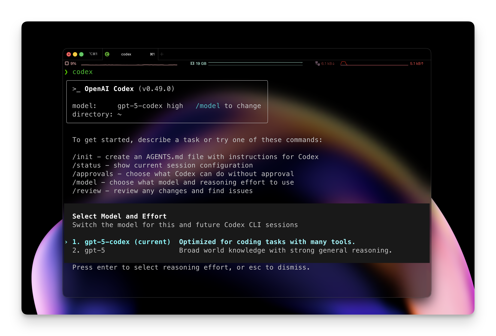

The CLI logs all operations and asks for confirmation before destructive actions (deleting files, force-pushing to git). You can integrate it into CI/CD pipelines or use it for one-off migrations. You can also run Codex CLI inside Docker containers for sandboxed code generation.

Codex maintains context across multiple exchanges: it reads files, proposes changes, and asks for approval before applying edits. The colored terminal output distinguishes between analysis (understanding your request), planning (what it intends to do), and actual file operations. Codex references specific files and line numbers when explaining changes, making it easy to spot when it misunderstood your intent.


**Codex UI and IDE extensions:** The web dashboard mirrors the CLI but adds a visual diff viewer and approval workflow. The interface splits into two panels: conversation on the left, side-by-side diffs on the right. You can approve all changes at once or review each file individually. Shell commands (tests, builds, git operations) require explicit approval before execution.

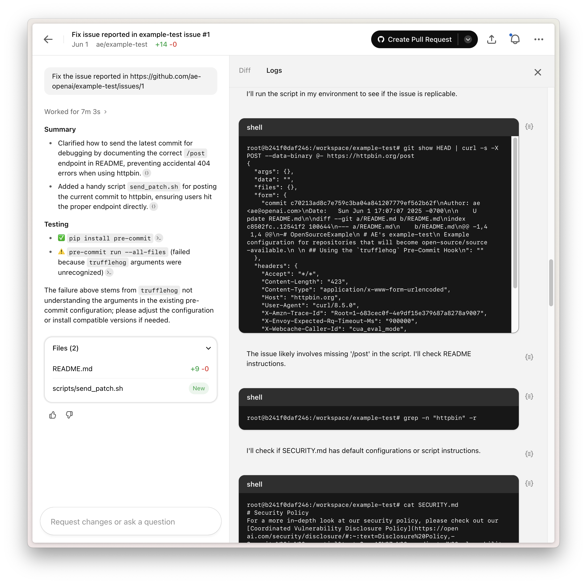

This visual approval workflow works well for code reviews. A reviewer can ask Codex to implement feedback, inspect the proposed changes, and approve or request modifications without switching to a terminal.

**Slack and GitHub integrations:** Connect Codex to Slack and it can respond to coding questions in channels, generate pull requests from feature requests, or review PRs when tagged. The GitHub integration hooks into PR workflows: Codex comments on PRs with suggestions, runs static analysis, and auto-generates changelog entries based on commits.

**MCP integration for Codex:** Codex uses MCP internally to call external tools. Register MCP servers in your Codex config (CLI or IDE), and Codex invokes them when it needs domain-specific functionality. For example, [register an MCP server that queries docs](https://context7.com), and Codex can look up endpoint schemas before generating integration code.


## Building agents without code

When you want distribution, guardrails, or quick experiments, you reach for these tools. These are great for non-technical users who want to launch agents without touching source code.

### AgentKit: visual agent building

AgentKit launched at OpenAI DevDay 2025 as a complete toolkit for building, deploying, and optimizing agents without writing orchestration code. It includes four main components.

#### Agent Builder

A visual canvas for building multi-agent workflows using drag-and-drop nodes. Think of it as "Canva for agents", you drag nodes onto a canvas and connect them with arrows to define logic.

Available node types include:

- Agent nodes: LLM processing steps that reason over inputs and generate outputs
- Logic nodes: Conditionals (if/else), loops, and branching
- Tool connectors: MCP servers, API calls, database queries
- User approval nodes: Pause workflows for human review
- Guardrail nodes: Enforce safety constraints on outputs
- Data transformation nodes: Format, filter, or restructure data between steps

The canvas includes versioning, preview runs, and templates for common patterns (customer service, data enrichment, document comparison). When you build a workflow, you test it live in a preview panel that shows which nodes execute and which branches the agent takes.

Agent Builder compiles workflows to Agents SDK runs, so you can copy your workflows as fully Agents-SDK compatible code. You can also connect MCP servers as nodes to extend your workflows with your own custom logic and data.


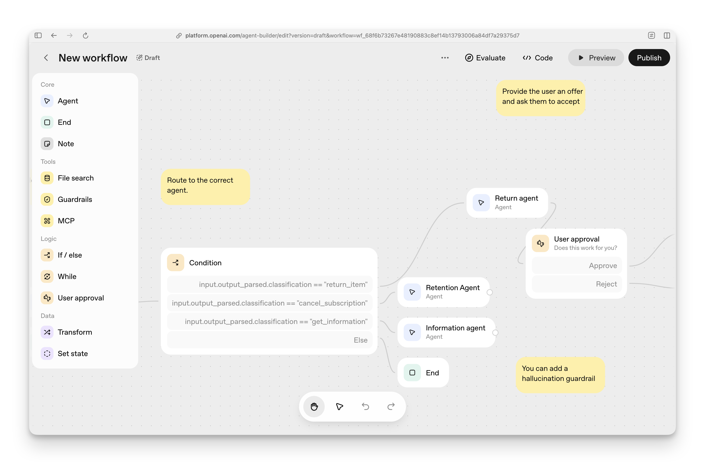

#### ChatKit

An embeddable chat interface that brings AI assistants into your own web and mobile apps. ChatKit provides a production-ready chat UI with conversation state, streaming responses, and tool integration built in.

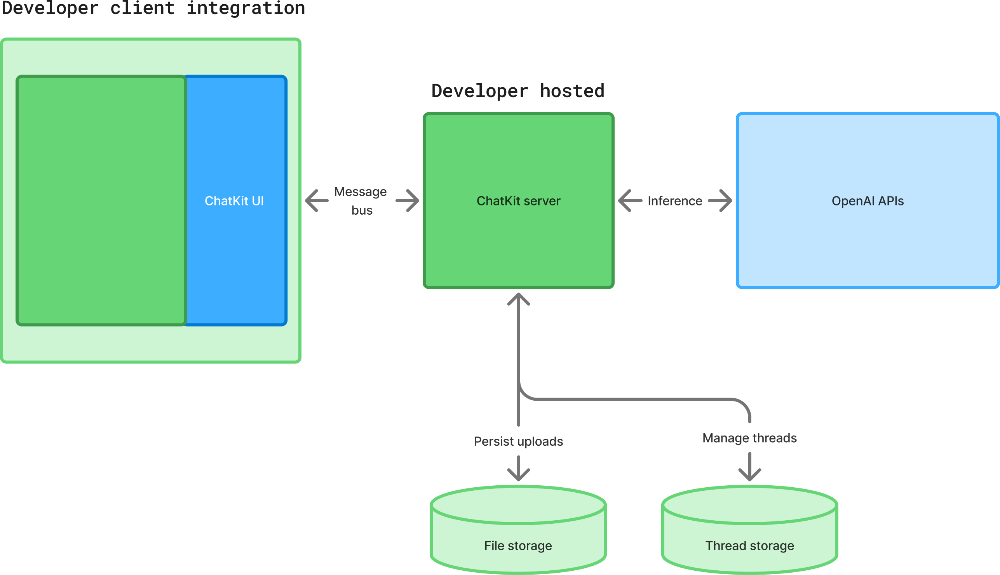

Embed ChatKit using the JavaScript library (supports React, Vue, Angular and vanilla JS):

```jsx
import { ChatKit } from "@openai/chatkit-react";

function App() {
  return (
    <ChatKit
      appId="your-app-id"
      userId={currentUser.id}
      theme="light"
      position="bottom-right"
    />
  );
}
```

ChatKit handles user identity automatically. Pass a `userId` and the assistant remembers context across sessions. The widget includes typing indicators, file uploads (PDFs, images), voice input, and conversation history. Users can scroll through past conversations or start new threads.

#### ChatKit Studio

A visual interface for building and configuring ChatKit instances without code. The studio lets you configure models, instructions, data sources, tools, and UI themes, with a live preview panel to test the assistant before deploying.

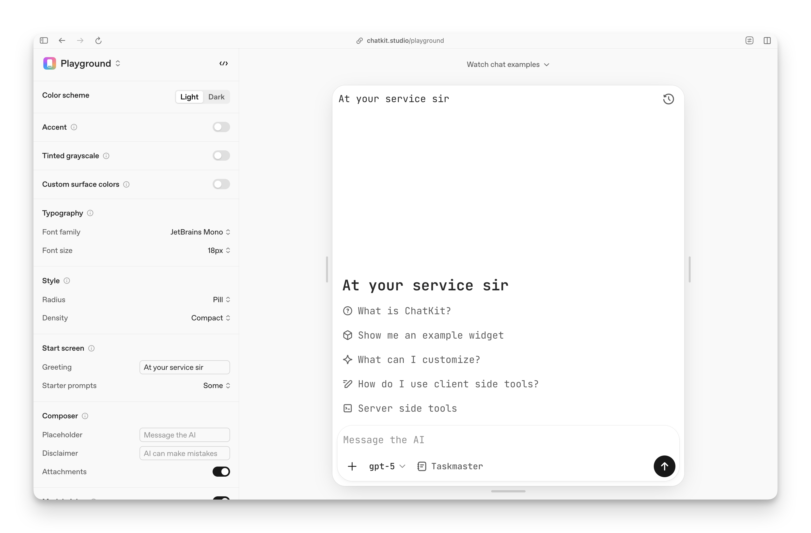

ChatKit can be OpenAI-hosted (recommended) where OpenAI handles hosting and scaling, or self-hosted where you run ChatKit on your own infrastructure using the ChatKit Python SDK.


### ChatGPT MCP connectors

ChatGPT supports MCP connectors across Plus, Pro, Team, Enterprise, and Edu tiers. Register your MCP servers through the Connectors interface, and ChatGPT can call them during conversations. Unlike earlier limitations, MCP connectors now support both read and write operations so ChatGPT can update tickets in your issue tracker, trigger workflows in your automation system, write to databases, or call internal APIs.

MCP servers connect to ChatGPT via remote endpoints using Server-Sent Events (SSE) or streaming HTTP protocols. OAuth handles authentication when needed. ChatGPT displays confirmation modals before executing write or modify actions, and workspace admins control which users can register custom connectors.

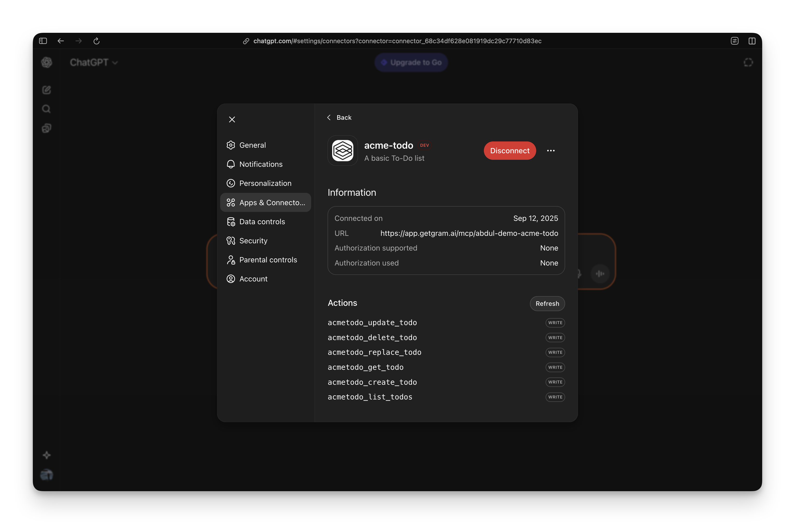

#### Atlas Browser

OpenAI launched ChatGPT Atlas in October 2025, a Chromium-based browser with ChatGPT built into the browsing experience.

Agent mode (available for Plus, Pro, and Business users) lets ChatGPT work autonomously within the browser, researching topics, automating tasks, planning events, or booking appointments while you browse.

Atlas also has first-class support for ChatGPT connectors as well as Apps SDK-based integrations.

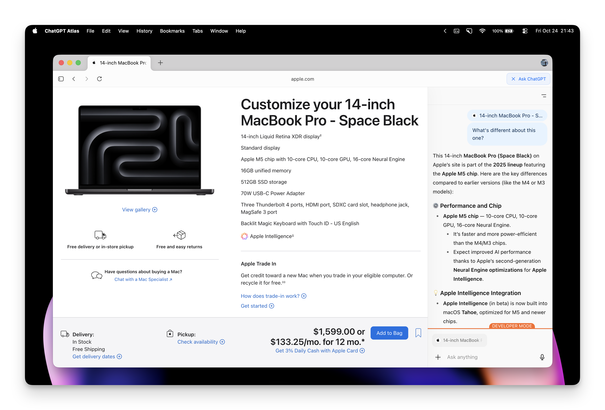

### Widget Builder and Apps SDK: from limited tools to full dev support

ChatGPT's development story started with `/search` and `/fetch` as the only tools available for deep research. Today, that's evolved into full developer support through Widget Builder and the Apps SDK.

#### Apps SDK

The foundation for building ChatGPT integrations. It bridges your backend services and ChatGPT, letting you define tools, handle authentication, and manage state across conversations. The SDK handles the protocol details so you focus on exposing your API's capabilities.

At its core, the Apps SDK is an MCP server that runs in your infrastructure. You define tools using the standard MCP schema (tool name, description, input schema, handler function). ChatGPT discovers these tools and calls them when users ask for something your app can do.

The SDK adds features beyond basic MCP: OAuth flows for user authentication, session persistence so your tools remember context across messages, and rate limiting per user or workspace. It handles error recovery automatically. If your tool times out or returns an error, the SDK retries or prompts the user for clarification.

Here's how you define a tool with the Apps SDK:

```ts
async function loadKanbanBoard() {
  const tasks = [
    { id: "task-1", title: "Design empty states", assignee: "Ada", status: "todo" },
    { id: "task-2", title: "Wireframe admin panel", assignee: "Grace", status: "in-progress" },
    { id: "task-3", title: "QA onboarding flow", assignee: "Lin", status: "done" }
  ];

  return {
    columns: [
      { id: "todo", title: "To do", tasks: tasks.filter((task) => task.status === "todo") },
      { id: "in-progress", title: "In progress", tasks: tasks.filter((task) => task.status === "in-progress") },
      { id: "done", title: "Done", tasks: tasks.filter((task) => task.status === "done") }
    ],
    tasksById: Object.fromEntries(tasks.map((task) => [task.id, task])),
    lastSyncedAt: new Date().toISOString()
  };
}

server.registerTool(
  "kanban-board",
  {
    title: "Show Kanban Board",
    _meta: {
      "openai/outputTemplate": "ui://widget/kanban-board.html",
      "openai/toolInvocation/invoking": "Displaying the board",
      "openai/toolInvocation/invoked": "Displayed the board"
    },
    inputSchema: { tasks: z.string() }
  },
  async () => {
    const board = await loadKanbanBoard();

    return {
      structuredContent: {
        columns: board.columns.map((column) => ({
          id: column.id,
          title: column.title,
          tasks: column.tasks.slice(0, 5) // keep payload concise for the model
        }))
      },
      content: [{ type: "text", text: "Here's your latest board. Drag cards in the component to update status." }],
      _meta: {
        tasksById: board.tasksById, // full task map for the component only
        lastSyncedAt: board.lastSyncedAt
      }
    };
  }
);
```

The `context` object gives you access to the authenticated user, their workspace, and any state you've stored in previous tool calls. This lets you build stateful agents that remember preferences, cache API responses, or track multi-step workflows.

**Authentication and OAuth:** The SDK supports multiple auth patterns. For workspace integrations, use OAuth to let users connect their accounts (Slack, Google Calendar, Salesforce). The SDK stores the OAuth tokens securely and refreshes them automatically. Your tool handlers receive the user's token via the context, so you make API calls on their behalf without exposing credentials to ChatGPT.

For internal tools, skip OAuth and rely on ChatGPT's workspace auth. If an admin registers your app in a Team or Enterprise workspace, the SDK trusts that all users in that workspace are authorized.

#### Widget Builder

Built on top of the Apps SDK, Widget Builder lets you return rich UI components from your MCP tools instead of plain text. When ChatGPT calls your tool, it responds with interactive widgets: data tables, forms, charts, or custom visualizations. The user sees these rendered directly in the ChatGPT interface.

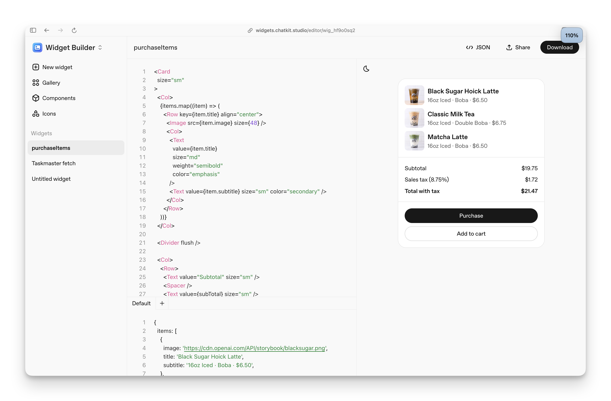

Widgets bind to data using placeholders like `{{task.title}}` that fill in when your tool returns results. You can rapidly develop widgets using the low-code Widget Builder.

With Widgets your MCP server does more than answer questions, it becomes interactive. A task management tool returns a widget with checkboxes to complete tasks. A CRM tool returns a customer card with click-to-call buttons. A metrics tool returns live charts that update when the user asks follow-up questions.

Your MCP server defines tools with a `_meta` field that points to a widget URI. When ChatGPT calls the tool, your server returns data and the widget template. ChatGPT renders the widget using your template and the returned data.

```ts
server.registerResource(
  "html",
  "ui://widget/widget.html",
  {},
  async (req) => ({
    contents: [
      {
        uri: "ui://widget/widget.html",
        mimeType: "text/html",
        text: `
<div id="kitchen-sink-root"></div>
<link rel="stylesheet" href="https://persistent.oaistatic.com/ecosystem-built-assets/kitchen-sink-2d2b.css">
<script type="module" src="https://persistent.oaistatic.com/ecosystem-built-assets/kitchen-sink-2d2b.js"></script>
        `.trim(),
        _meta: {
          "openai/widgetCSP": {
            connect_domains: [],
            resource_domains: ["https://persistent.oaistatic.com"],
          }
        },
      },
    ],
  })
);
```


### Workflows and Operator

Workflows let you pin deterministic steps around model calls. You define stages that can branch, await human review, or trigger tools. Operator is OpenAI's research preview agent that controls a browser and handles long-running tasks.

Both use the same tool definition format as the Responses API. Register your MCP tools once and make them available across these runtimes. Workflows is currently invite-only for enterprise customers; Operator is also on a waitlist and expects clear guardrails in your application.

## The supporting cast: models, creative tools, and infrastructure

These services share billing with the APIs but introduce their own review processes and constraints. We'll cover them briefly so you know where they fit.

### Models: naming and routing

OpenAI's model names shift frequently. As of early 2025, the main families are:

- **GPT-5:** The flagship model for complex reasoning and multi-step tasks.
- **GPT-5-mini:** Lightweight variant optimized for speed and cost. Good for high-volume tasks.
- **GPT-5-nano:** The smallest, cheapest model in the family. Fast responses for simple queries.
- **GPT-5-codex-high, GPT-5-codex-medium, GPT-5-codex-low:** Specialized models for code generation and software development tasks. High offers the most accuracy, low prioritizes speed.

All these models are available through the Responses API and ChatGPT (depending on your tier). The codex variants power the Codex developer tools. Pricing varies by model. Route expensive models through a dedicated MCP tool to audit usage.

### Creative endpoints: images, audio, video

**DALL-E 3 image generation:** DALL-E 3 handles prompt-to-image generation, inpainting, and image variation. The responses return URLs or base64 blobs. In MCP land you wrap the call in a tool and return a resource with the download link so the client can show a thumbnail or fetch the file later.

**Voice Engine and audio API:** Cover both text-to-speech and speech-to-text. Latency is low enough for real-time agents when paired with the Realtime API. A common pattern is an MCP tool that takes text, calls the audio API, uploads the result to object storage, and returns a resource URI for the client to stream. That's the same pattern OpenAI uses in ChatGPT's mobile apps when you ask about a photo and expect a spoken answer.

**Sora video:** Generates short, high-fidelity clips. Access is limited to creative partners and enterprise pilots. Rendering jobs take minutes, so treat them as asynchronous tasks: expose an MCP tool that submits the prompt, return a completion handle, and stream progress updates as the job advances.

### Infrastructure and retrieval

**Embeddings and vector stores:** Embeddings endpoints (`text-embedding-3-large`, `text-embedding-3-small`, and domain variants) power retrieval pipelines. Vector stores add metadata filtering and chunk management. These services are regional, so double-check availability if your MCP servers run in another region. Treat long-running jobs as MCP completables: queue the work, return a completion handle, and let the client poll or subscribe.

**Fine-tuning:** Adapts a base model to your tone or domain, but you still call the resulting model through Responses. The Fine-tuning API lets you designate jobs and use fine-tuned model IDs in subsequent calls.

**Batch jobs:** Batch processing lets you send tens of thousands of prompts for less cost. It pairs nicely with MCP. Expose a `submit_batch` tool and emit status updates as resources.

**Files API:** Stores training data or retrieval corpora and is the only sanctioned way to share larger documents with OpenAI services.

## Connecting it all: MCP integration patterns

MCP gives you one adapter surface as OpenAI's products evolve. Here are the main patterns for integrating your MCP servers with OpenAI's ecosystem.

### Direct integration: MCP server wraps OpenAI API

This is the pattern we showed earlier with the Responses API. Your MCP server keeps your OpenAI API key server-side and exposes a tool that calls the API. The client (Claude, Cursor, or another MCP host) calls your tool, and you forward the request to OpenAI.

This keeps secrets off the client and lets you audit all OpenAI usage in one place. Add rate limiting, cost tracking, or custom logging before forwarding calls.


### Reusable catalogs: call from multiple runtimes

The biggest MCP benefit is consistency. Once you model an internal API as an MCP server, you call it from Claude, ChatGPT, Cursor, and any other MCP-compatible runtime.

Define your tool schema once, register it in ChatGPT Team workspaces and Claude projects, and both runtimes use it. When OpenAI adds a new agent product (like Workflows or Operator), you don't rebuild integrations—you point it at your existing MCP catalog.

### Web search: built-in tools and Deep Research

**Responses API web search:** The Responses API includes a `web_search` tool that you enable per account. Pass the tool in your request, and the model decides when to use it. When triggered, the API returns responses with URL citations and source annotations.

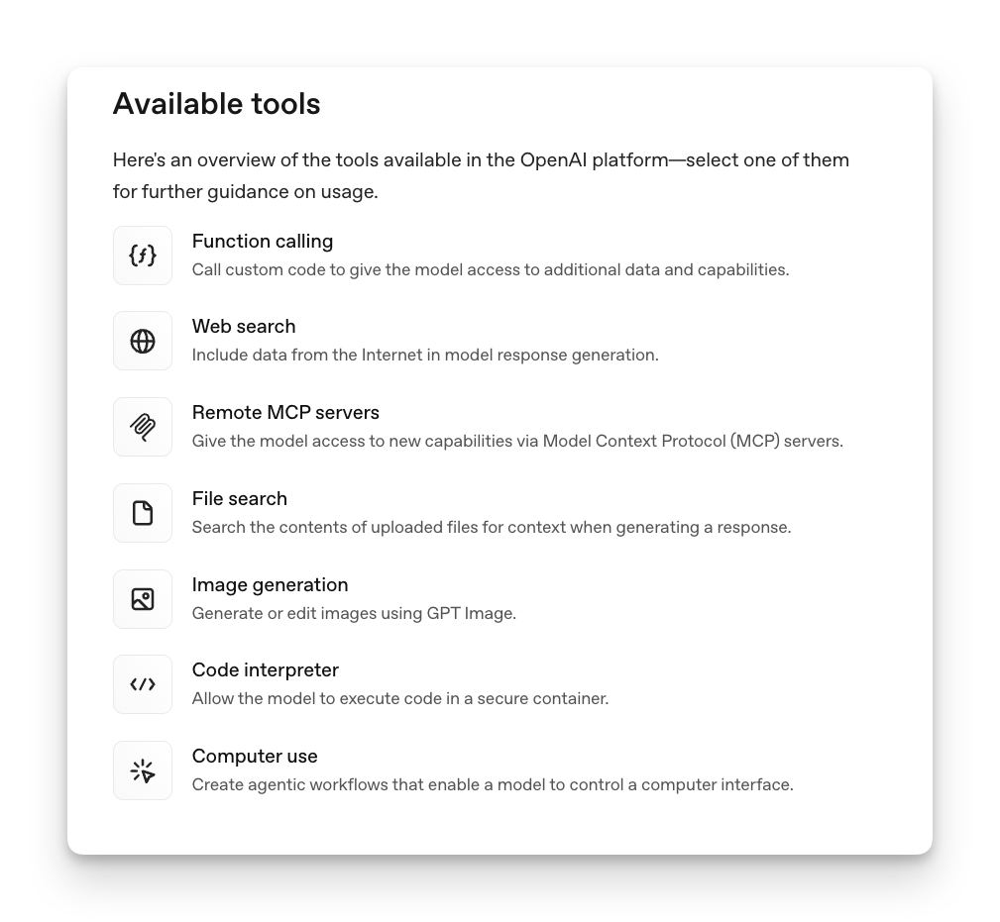

The limitation: you don't control the search provider, citation format, or result ranking.

**Deep Research:** ChatGPT's Deep Research feature (launched February 2025) is an autonomous agent that conducts multi-step web research. Give it a prompt, and it will search, analyze, and synthesize hundreds of sources to produce a comprehensive report. Deep Research takes 5-30 minutes and uses a version of the o4 model optimized for web browsing. Available in ChatGPT Plus, Team, Enterprise, and Pro tiers, with API access launched in June 2025.

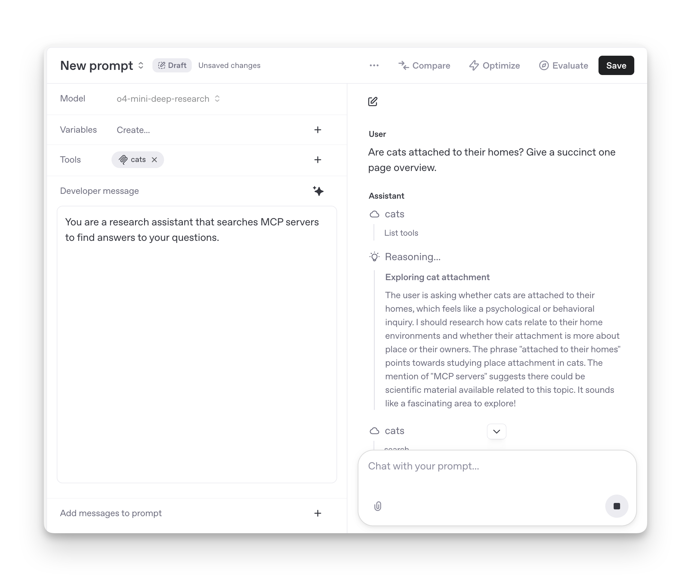

**Custom retrieval with MCP:** Instead of generic web search, Deep Research supports MCP tool queries which can fetch internal documentation, compliance databases, or proprietary data sources. This returns structured results (document titles, relevance scores, snippets, metadata) that the model can reason over. Custom retrieval gives you control and auditability: you can log every query and view citations you can verify.

## Plans, pricing, and requirements

OpenAI's offerings cluster into several pricing tiers. Here's a snapshot as of early 2025 to help you navigate what you need.

### API pay-as-you-go

Required for Responses API, Realtime API, Assistants API, embeddings, vector stores, fine-tuning, batch jobs, and creative endpoints. You pay per token or per request, with pricing varying by model.

Most regions require a verified billing method and a $5 prepayment to activate the account. Reasoning models (`o1`, `o3`) cost significantly more per token. Route them through a dedicated MCP tool to audit usage.

### Add-on Tools

Enables `web_search` and `url_get` tools in the Responses API. Still rolling out; Plus, Team, and Enterprise customers can usually flip it on through the dashboard, while some organizations need to email support to request access.

Pricing is per search query (roughly $10 per 1,000 searches). To avoid this cost, build your own search MCP tool instead.

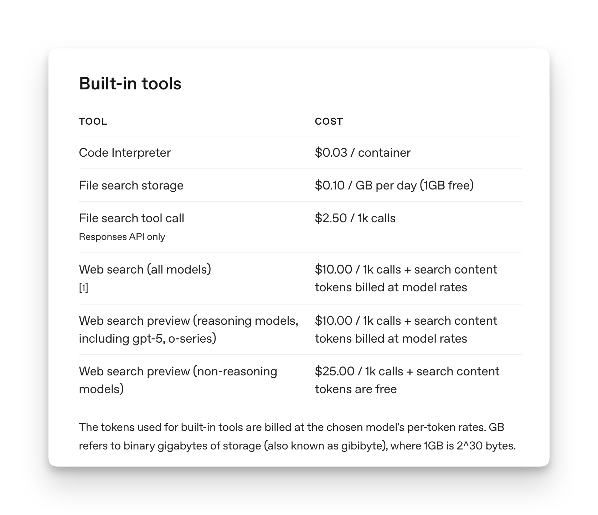

## Next steps for builders

If you're a developer, start by building MCP servers that expose your own tools and data sources. Create servers that query your databases, call your internal APIs, access your file systems, or integrate with services you use (GitHub, Stripe, CRMs). Define each tool using JSON Schema, handle authentication, and test locally before deploying. This gives you a reusable catalog of tools that works across Claude, Cursor, ChatGPT, and any other MCP-compatible runtime.

If you're building a platform, decide whether to centralize tools using the Agents SDK or expose them directly through ChatGPT workspaces with the Apps SDK. A common approach is both: maintain one MCP catalog that powers both SDK-driven agents and workspace GPTs.

For ChatGPT Team or Enterprise, register your MCP servers in the workspace so every GPT inherits them automatically. This model means you approve tools once and they become available everywhere, including ChatKit embeds and the desktop apps.

Keep an eye on OpenAI's release notes. This ecosystem shifts fast, but MCP gives you one adapter surface as the products evolve. The more you express your systems as MCP tools, the easier it is to evaluate whatever OpenAI launches next without rebuilding integrations.
