You've built an MCP server and now need to distribute it to users. You look for ways to expose your MCP server and then you find out that MCP allows many options:

- You can open source your MCP server and provide build instructions but it's directed to technical users.
- You can package your MCP server as an NPM package if you built it using JavaScript or TypeScript, a bit better than building the MCP server locally, but still requires to write some configuration.
- You can package your MCP server in [MCPB](https://github.com/anthropics/mcpb) (formerly DXT) extension installable, which is user-friendly.
- You can deploy your MCP server remotely, and then make it public or private but it requires financial and developer resources.

Each method comes with advantages and disadvantages, and depending on your resources and user types, your choice affects MCP server adoption.

In this guide, you'll learn how to distribute your MCP server by exploring each option, when to apply them, and tools that make the process easier.

## Prerequisites

You need to know a bit about [MCP transports](/mcp/building-servers/protocol-reference/transports) as they determine how you output your MCP server and how you receive inputs.

You also need Node.js 22 or later installed. In this guide, you'll learn how to package your MCP server as MCPB and NPM packages. For the actionable steps, we're using a simple MCP echo server that demonstrates all distribution methods without complex dependencies:

```bash
git clone https://github.com/speakeasy-api/examples.git
cd mcp-echo-input-server
```

## What option to choose when distributing your MCP server? 

Distributing your MCP server depends on two factors, in this priority order:

- **Your users**: Are they technical developers or non-technical business users?
- **Your resources**: Can you maintain and pay for a hosted service?

If your users are technical, distribute your MCP server as an open-source project that developers can build themselves, or as an NPM package for easier installation.

If your users are non-technical and you can't maintain a hosted server, use MCPB packaging. This creates a desktop installer that users can install in Claude Desktop with minimal steps.

If you have hosting resources, deploy your MCP server remotely. This costs more but provides the best user experience with minimal configuration for users and easy integration for developers building automated systems.

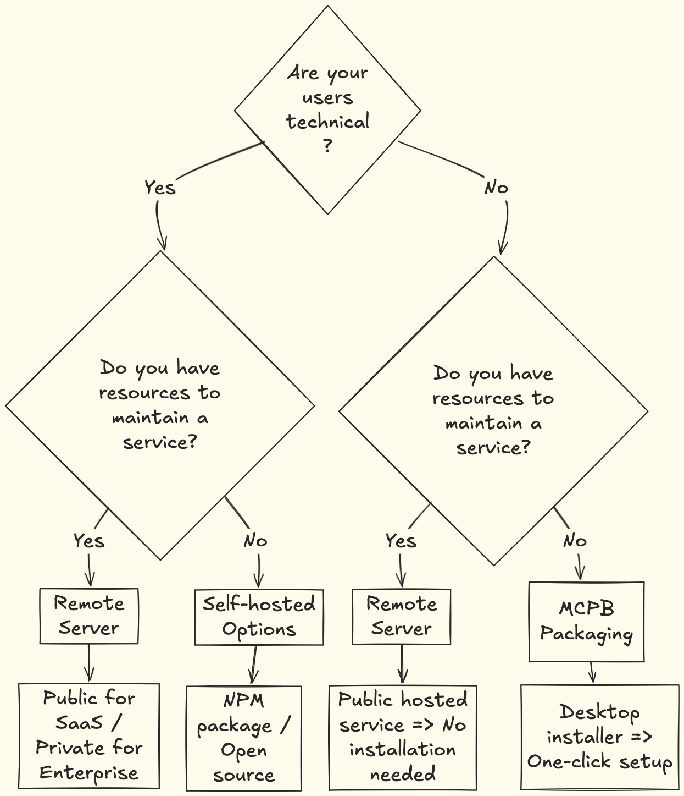

## Distribute your MCP server as an open source project

The simplest option is to open-source your MCP server project and provide instructions in a README on how to build and install the server. This works when:

- Your users are technical developers who are comfortable with command-line tools.
- You don't have resources for maintaining a remote server or you're starting out. You can get community input and contributions. Once the project matures, consider deploying as an NPM package or MCPB extension to reach non-technical users.

### How to distribute your MCP server as an open source project

You need to provide users with build steps and configuration instructions for their AI tools. For the `mcp-echo-input-server`, here's the process. Apply the same steps to your project.

- Install all dependencies

  ```bash
  npm install
  ```

- This project uses plain JavaScript, so no build step is needed. If your project uses TypeScript, build it first:

  ```bash
  npm build
  ```

- The entry point file is `index.js`. 

Here's the MCP server configuration for Claude Desktop:

```json
{
  "mcpServers": {
    "echo-server-local-build": {
      "command": "node",
      "args": ["<PATH-TO-PROJECT>/mcp-echo-input-server/index.js"],
      "env": {
        "USER_NAME": "<USERNAME>"
      }
    }
  }
}
```

Add this configuration to Claude Desktop and replace `<USERNAME>` and `<PATH-TO-PROJECT>` with your actual username and the absolute path to the project.

Reload Claude Desktop, open a new conversation and enter the following prompt.

```txt
Hi Claude. Use the MCP echo server to echo this. "This is a working MCP server as a local build package".

```

You will have a similar result.

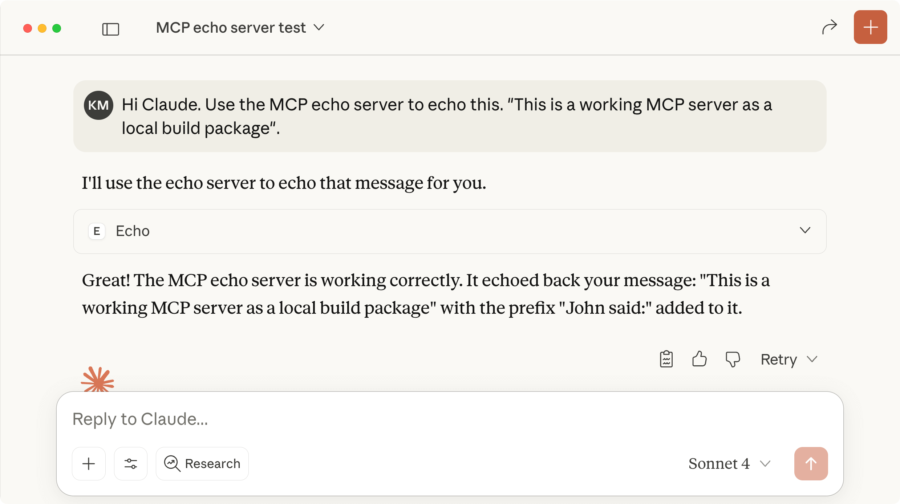

## Distribute your MCP server as an NPM project

If you built your MCP project with JavaScript or TypeScript, you can publish your MCP server as an NPM package. This works when:

- Your users are technical developers who can handle npm installations.
- You don't have resources to host and maintain a remote server.

If you're creating an MCP server that exposes API capabilities and you have an OpenAPI document, you can use [Speakeasy](/docs/standalone-mcp/build-server) to generate a TypeScript MCP server ready for deployment and distribution. You can learn more about the process here.

### How to package your MCP server as NPM package

Packaging your MCP server as an NPM package is straightforward. These steps apply to the `mcp-echo-input-server` but work for all Node.js packages. First, install all dependencies:

```bash
npm install
```

Once it's done, make sure the `package.json` file is ready for packaging. Add a name, description, author name, author email address, keywords, entry point (main) and the CLI command `bin` to run the project.

```json
{
  "name": "mcp-echo-input-server",
...
  "description": "A simple Model Context Protocol (MCP) server with an echo tool that returns user input with customizable user name",
  "main": "index.js",
  "bin": {
    "mcp-echo-server": "./index.js"
  },
 ...
  "keywords": [
    "mcp",
    "model-context-protocol",
  ],
  "author": {
    "name": "<your-name>",
    "email": "<your-mail-address>"
  },
  ...
}
```

NPM registry requires unique package names. You need to check if your package name is available before publishing.

First, ensure you're logged in:

```bash 
npm login
```

Then run the following command with the name of your project in the `package.json` file.

```bash
npm view <project-name>
```

If it returns a 404 error, you can proceed with the rest of the commands. Otherwise, try other combinations and once you find an unused name, modify it in the `package.json` file too.

Package and publish your NPM package

```bash
npm publish
```

Once it's published, you can show your users how to install the MCP server in Claude Desktop with a code snippet like this one they will enter in the `claude-desktop-config.json` file.

```json
{
  "mcpServers": {
    "echo-server": {
      "command": "npx",
      "args": ["-y", "<mcp-npm-package-name>"],
      "env": {
        "USER_NAME": "<YOUR-NAME>"
      }
    },
  }
}
```

Add the configuration above to your `claude-desktop-config.json` file. Reload Claude Desktop and you should see the MCP server in the chat.

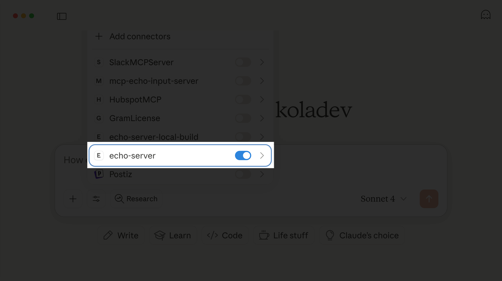

Enter the following prompt to test the functionality.

```txt
Hi Claude. Use the MCP echo server to echo this. "This is a working MCP server as an NPM package".
```

You should have a similar result.

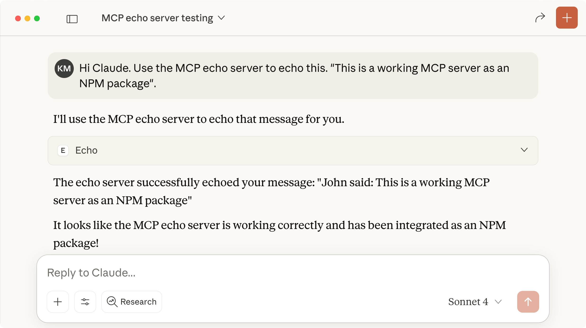

To make release and distribution easier, you should consider CI/CD tools to automate the process. You can find a GitHub Action for the automation [here](https://github.com/ritza-co/speakeasy-examples/blob/5068ddc569140b0a3da9177d6b0a6a73627dac65/mcp-echo-input-server/.github/workflows/npm-release.yml).

## Distributing your MCP server as an MCPB package

[MCP bundles](https://github.com/anthropics/mcpb) (formerly DXT) is a zip archive extension developed by Anthropic to make MCP server installation easier with one click. An MCPB package contains the local MCP server and a `manifest.json` file describing its capabilities.

It's useful when:

- Your target users are non-technical: Business users, marketing teams, or domain experts who need your MCP server but shouldn't handle npm installs or dependency management.
- You want distribution without infrastructure costs: Local installation means no hosting, scaling, or maintenance overhead on your end while still providing a professional installation experience.
- You're building cross-platform tools: MCPB packages work across operating systems and can bundle servers written in any language (Python, Node.js, Go, etc.) as long as they implement the MCP protocol.

### How to package your MCP server as MCPB

As of September 2025, Anthropic has renamed the DXT project to MCPB. We'll use the latest commands, meaning using the MCPB extension and commands. You can find the instructions for migrating at the beginning of the [README](https://github.com/anthropics/mcpb/blob/main/README.md) of the repository.

We're still using the `mcp-echo-input-server` project for these examples, but all commands can be applied to other MCP projects. Run this command to install the dependencies:

```bash
npm install
```

Once it's done, install the `@anthropic-ai/mcpb` package. It's a CLI that helps with the creation of both the `manifest.json` and the final `.mcpb` file. Install it with the following command:

```bash
npm install --dev @anthropic-ai/mcpb
```

> Note: The official documentation suggests installing it globally, but you can also install it as a dev dependency in your projects to maintain consistent versions.

Then, run the following command to create a `manifest.json` file. It's an interactive command that will prompt some options to configure the `manifest.json` file.

```bash
npx @anthropic-ai/mcpb init
```

You'll need to enter values such as author name, package name, and description, plus set user configurable options that will be used for the Username environment variable.

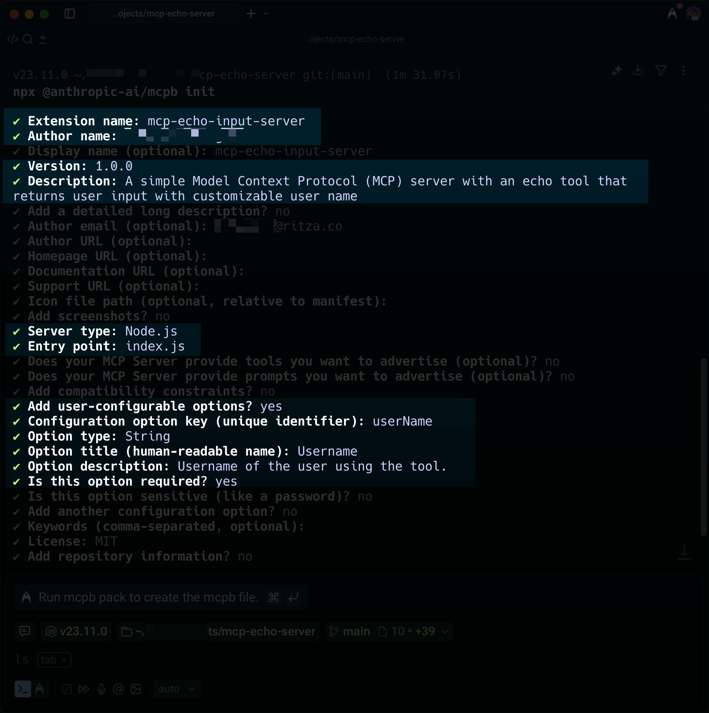

As of September 17th, there is a bug where Claude does not recognize the `manifest_version` key in the `manifest.json` file. Open the generated `manifest.json` file and replace `manifest_version` with `dxt_version`.

```diff
{
-	   "manifest_version": "0.1",
+    "dxt_version": "0.1",
  ...
}
```

Also, we need to reference the `USER_NAME` variable to point to the user configurable option `userName`.

```json
{
  ...
    "server": {
    ...
      "env": {
        "USER_NAME": "${user_config.userName}"
      }
    }
  },
  ...
}
```

Next, run the pack command to create the distributable file:

```bash
npx @anthropic-ai/mcpb pack
```

After running the command, you should see a file called `mcp-echo-server.mcpb` in the project directory. Let's open the file with Claude and install the MCP server.

Navigate to the settings of your Claude Desktop application, click on the Extensions screen, and click on the **Advanced settings** button.

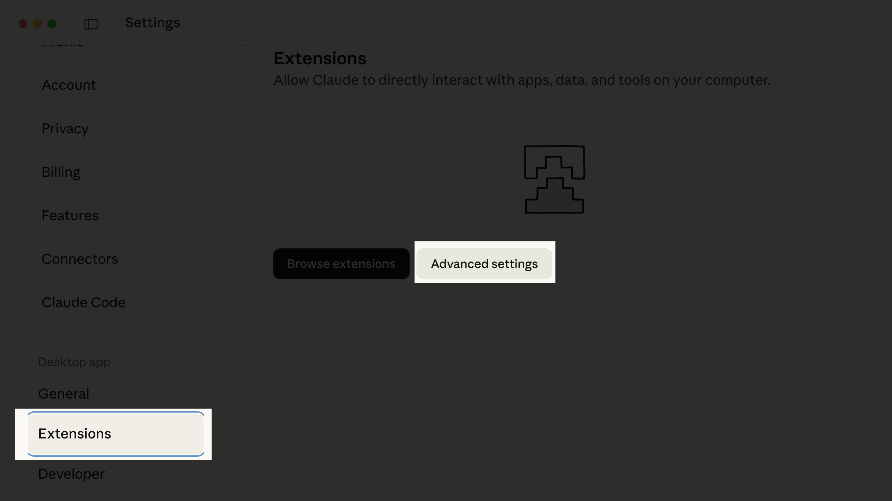

Once on the **Advanced settings** page, scroll to the end of the page and click on the **Install Extension...** button to browse and select the `.mcpb` file we created earlier. Once the file is selected, Claude will display a modal with the extension description. You can click on the **Install** button to confirm the installation.

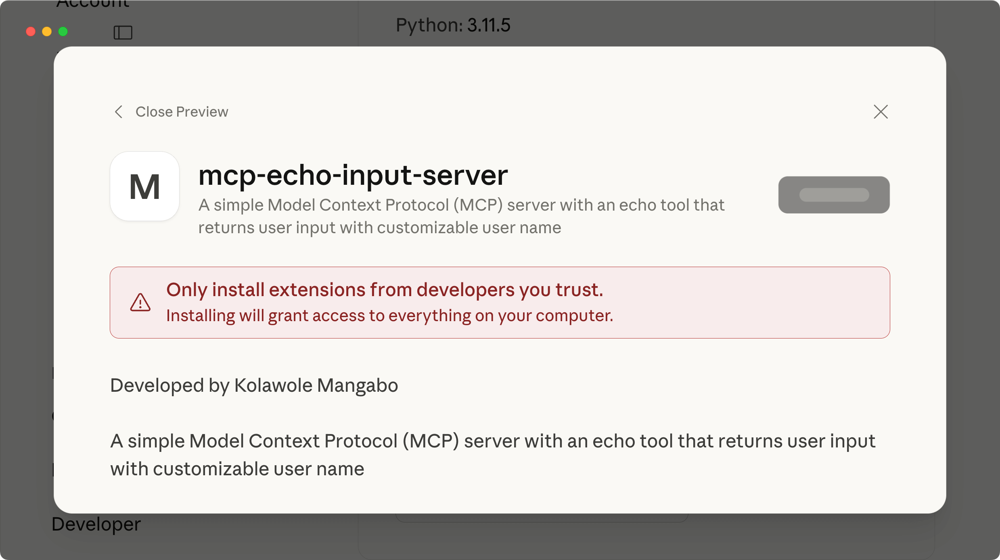

It will then ask you to enter the username value that will be used as an environment variable by the project. Feel free to enter your name.

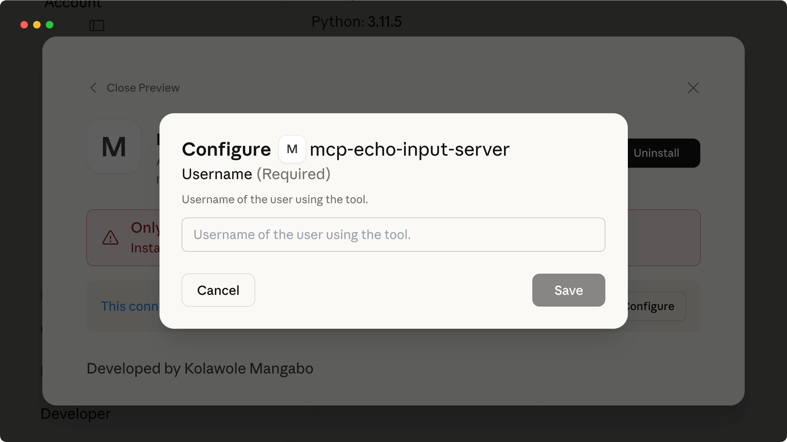

Once the name is entered, save the changes and open a new conversation in Claude. Make sure the MCP server is activated.

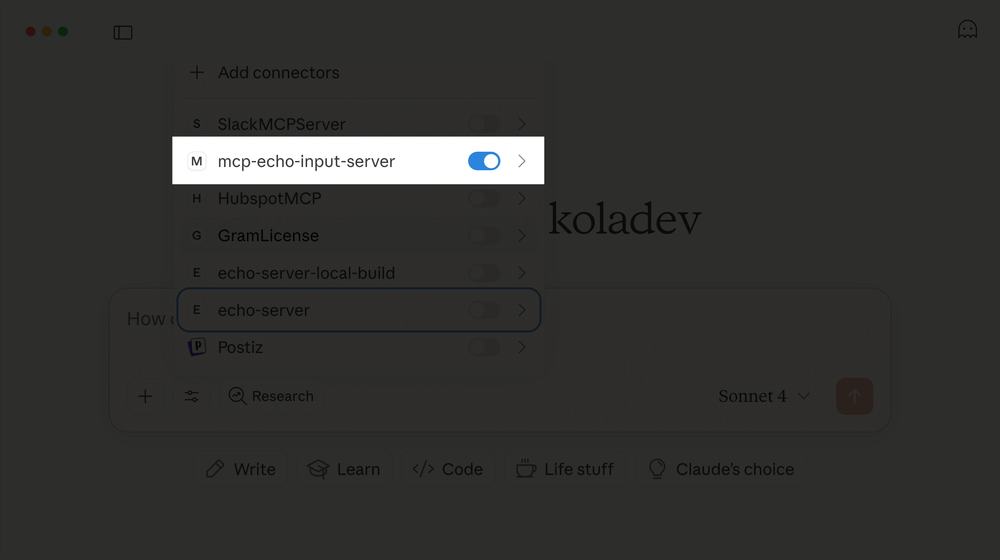

Then enter a message to test the MCP server.

```txt
Hi Claude. Use the MCP echo server to echo this. "This is a working MCPB server".
```

You will have a similar output

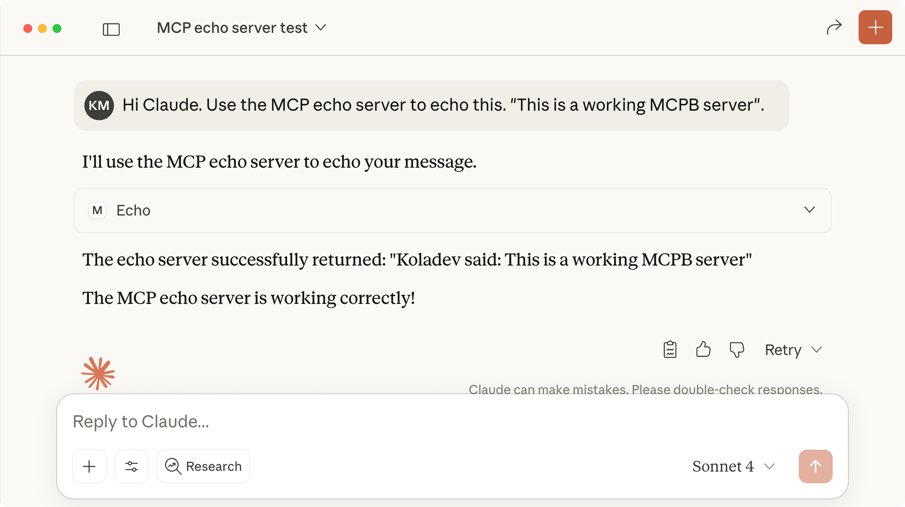

We have a working `.mcpb` file that you can upload to artifact repositories so users can download and install your MCP server. If you're using CI/CD pipelines, we have a GitHub Action [here](https://github.com/ritza-co/speakeasy-examples/blob/5068ddc569140b0a3da9177d6b0a6a73627dac65/mcp-echo-input-server/.github/workflows/mcpb-release.yml) that builds your `.mcpb` file and publishes it to the GitHub registry automatically on new releases.

> Note: You might see some Claude alerts regarding typing issues. You can ignore them by clicking on the **X** button. To avoid these alerts, type your projects accordingly.

## Distribute your MCP server remotely

If you have resources to maintain a remote server, distributing your MCP server remotely offers the best solution from both technical and business perspectives.Monitoring, logging and tracking infrastructure on tool calls, authentication and users. 

### Benefits of remote distribution

Here are the benefits of remote distribution. You can:

- Monitor, log, and track tool calls, authentication, and user activity.
- Implement business models for monetizing your MCP server.
- Maintain control over data in sensitive fields.

Remote servers also provide the smoothest user experience. You get:

- Simple installation in Claude Desktop where remote MCP servers appear as Connectors.

  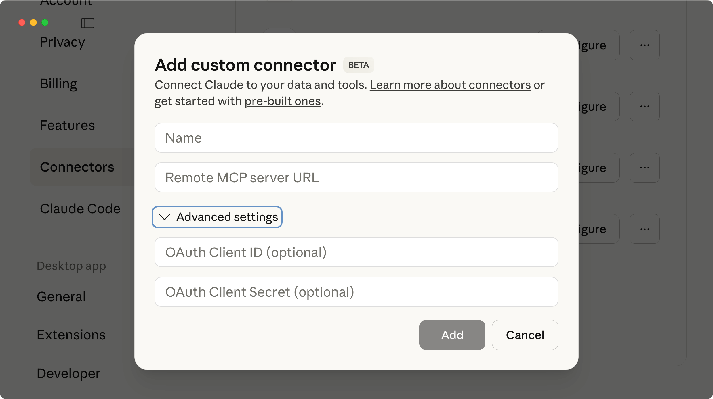

  And if your users are technical, then you can provide them documentations so they can enter Oauth configurations. And if they are not technical, once the server is added,  there is a connect button that they can click, that will redirect to an oAuth 	authorization page, you will have coded to give access to your API or services.

- Easy setup for non-technical users who just click connect and complete OAuth authorization in their browser.

- Manual configuration options for technical users who prefer to enter OAuth settings themselves.

- Integration capabilities with Anthropic SDK and OpenAI Agents SDK for developers building automated workflows.

Now choosing a type of remote server will be between public or private. Your security requirements determine your server type:

- Private servers work best for enterprise teams like internal marketing tools. You handle user configuration variables on the server side and control access tightly.
- Public servers work for broader distribution but require solid OAuth authentication. Users can set their own configuration variables, but you still need secure authorization flows.

### Implementation options

If you're exposing your API capabilities through MCP tools, you have two options:

- Build the infrastructure yourself and handle architecture and maintenance.
- Use [Gram](/product/gram), a platform we developed to create, host and distribute MCP servers with just an OpenAPI document.

## Final thoughts

In this guide, we've explored how to distribute your MCP server across different options.

Distributing an MCP server depends on your user types and resources. You can differentiate yourself by following these recommendations:

- **For local installations**, provide multiple distribution options like MCPB, local build, and NPM packages. This gives developers alternatives if they encounter issues with any single method. MCPB is well-maintained, so non-technical users will rarely have problems.
- **In your documentation**, provide configuration examples for popular AI agents like Claude, Cline, Cursor, and VS Code.
- **Publish your MCP server** on the official Anthropic MCP registry. If you're using Gram, we have a guide on how to reference your MCP server in the registry.