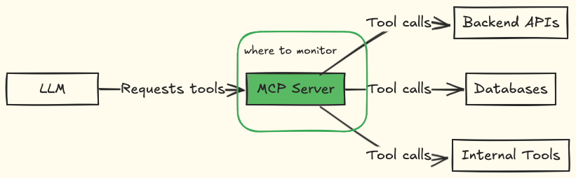
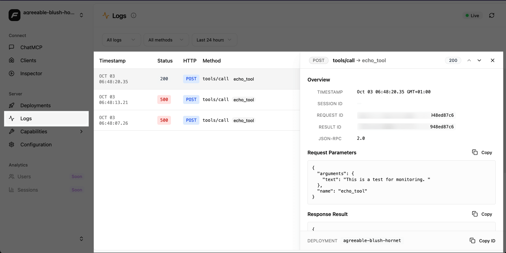

MCP servers sit between LLM agents and external services, such as databases, APIs, or internal tools. When something breaks, you need to know where: Is your MCP server failing? Is the LLM making bad tool calls? Is there latency from your backend services or LLM processing?

API or web server monitoring involves tracking HTTP response times, error rates, HTTP call patterns, and other key metrics. MCP requires more. The LLM interprets user intent and decides which tools to call. You need to monitor both server performance and LLM tool usage patterns.

Without monitoring your MCP server, you're blind to:

- Tool call patterns staying hidden:  You can't optimize which tools to improve or remove.

- Failures going undiagnosed: Tool calls fail silently, and you don't know if it's bad parameters, backend issues, or LLM errors.

- Latency problems compound: Slow tools delay every agent response, but you need per-tool latency metrics to identify which one is the bottleneck.

- Security breaches going undetected: Unusual access patterns indicating prompt injection or data exfiltration are missed.

This guide covers what to monitor and how to set up monitoring for both self-hosted and distributed MCP servers.

## What to monitor in MCP servers

Your MCP server acts as the bridge between LLM agents and your backend services. The LLM requests tools, resources, or prompts from your MCP server, your MCP server executes those requests.



Your monitoring should focus on the MCP server layer, which includes the tools that agents access, how they perform, and whether usage patterns appear normal or suspicious.

### Tool call metadata

Every time an agent calls a tool, you need structured data about that invocation. This creates an audit trail that shows what agents did, when they did it, and whether the action was successful. Here is what to capture:

- **Tool name and timestamps** to identify which tool was called and when. This allows you to correlate tool calls with user complaints or backend issues that coincide.
- **Input parameters (sanitized if sensitive)** to see what data the agent passed to the tool. When a tool fails, verify whether the agent sent malformed input, missing required fields, or invalid values.
- **Success or failure statuses** to track failure rates per tool. This identifies which tools are unreliable and need optimization or better error handling.
- **Client or session identifiers** to link tool calls to specific users or sessions. When a user reports an issue, you can trace their entire interaction history across multiple tool calls.
- **Error messages when tools fail** to understand why the failure happened. Backend timeout? Database connection error? Invalid API key? Error messages indicate where to begin debugging.

### Tool usage patterns

Beyond individual tool calls, you need to understand the bigger picture: which tools get used most, which ones fail together, and whether usage patterns change suddenly. Here is what to capture:

- **Tool call frequency per client** to establish a baseline of normal behavior. A client that typically makes 5 calls per hour, suddenly making 60 calls, signals a problem, either a runaway LLM agent or potential abuse.
- **Tool call sequences** to identify which tools are commonly used in workflows. When agents consistently chain tool A with tool B, these patterns reveal optimization opportunities – see our [optimization guide](/mcp/productizing-mcp/optimizing-your-mcp-server).
- **Sudden spikes in specific tool usage** to catch anomalies. A 10x increase in database query tools might indicate a prompt injection attack attempting data exfiltration, or an agent stuck in a loop making the same call repeatedly.

For security-focused monitoring, such as authentication failures and unauthorized access attempts, refer to our [guide on securing MCP servers](/mcp/productizing-mcp/security-for-mcp-servers).

### Tool performance metrics

Some tools respond in milliseconds. Others take seconds. Some return compact JSON. Others dump massive payloads. These differences matter because slow or bloated tools block the entire agent workflow. Here is what to track:

- **Latency per tool** to identify which tools slow down your entire system. Track p50, p95, and p99 percentiles – a tool with a 100ms average latency, but a 5-second p99 means some requests block the agent for 5 seconds, degrading the user experience.
- **Response payload size per tool** to catch tools returning excessive data. A tool that dumps 10KB when 1KB would suffice wastes tokens and clogs the LLM's context window. Large payloads also increase network transfer time and processing overhead.

### Server-level metrics

Your MCP server's overall health determines whether it can handle the load agents throw at it. High error rates, resource exhaustion, or rate limiting all degrade performance before they cause complete outages. Monitoring server-level metrics allows you to catch these capacity problems early, giving you time to scale resources or optimize them before users experience failures. Here is what you should monitor:

- **Overall error rate across all tools** to detect infrastructure issues. Suppose error rates spike across multiple tools simultaneously. In that case, the problem is likely to be in shared infrastructure (such as database connections, authentication services, or network issues) rather than individual tool logic.

- **Request volume and rate-limiting hits** to understand if you need to scale capacity or if specific agents are making excessive calls. Rate limit hits indicate whether your infrastructure can't keep up with demand or if a single client requires throttling.

- **Memory and CPU usage during high tool call volume** to identify resource constraints before they cause crashes. High memory usage during peak hours signals when to add resources or optimize tool implementations that leak memory or consume excessive CPU.

## How to monitor your MCP server

Your monitoring approach depends on how you deploy your MCP server. Remote servers offer complete control over your infrastructure and tooling. Packaged servers require opt-in telemetry that respects user privacy.

### Remote servers

When you host your MCP server on your own infrastructure, you control the entire monitoring stack and can use standard production tooling.

#### Logging

Logging captures what your tools are doing in real time. When a tool fails, logs provide information on the parameters passed, the external APIs called, and the location of the failure.

If you're using FastMCP:

```python
import logging
from fastmcp import FastMCP, Context

# Server-side logging
logger = logging.getLogger(__name__)

mcp = FastMCP("MCPServer")

@mcp.tool
async def search_data(query: str, ctx: Context):
    logger.info("Tool called: search_data", extra={"query": query})

    try:
        results = perform_search(query)
        logger.info("Search completed", extra={"result_count": len(results)})

        return results
    except Exception as e:
        logger.error("Search failed", exc_info=True)
        raise
```

You can send these logs to Elasticsearch, CloudWatch, Datadog, or your preferred aggregation platform. Structured logging (using the `extra` parameter) enables logs to be searchable and filterable.

For centralized monitoring across multiple server instances, [FastMCP Cloud](https://gofastmcp.com/deployment/fastmcp-cloud) aggregates logs from all your servers into one dashboard.



### Server-level monitoring with Sentry

Server-level monitoring tracks your MCP server's overall health: error rates, uptime, resource usage. Sentry captures errors with full context, showing you what was happening when failures occurred. You can instrument MCP tool calls for distributed tracing using @sentry/node (manual instrumentation example below):

```ts
import * as Sentry from "@sentry/node";

const registerTool = (server, name, schema, handler) => {
  server.tool(name, schema, async (args) => {
    return await Sentry.startNewTrace(async () => {
      return await Sentry.startSpan(
        {
          name: `mcp.tool/${name}`,
          attributes: {
            "tool.name": name,
            // Avoid logging raw tool parameters; sanitize or omit sensitive input
            "tool.params_present": args != null
          }
        },
        async (span) => {
          try {
            const result = await handler(args);
            span.setAttribute("tool.status", "success");
            return result;
          } catch (err) {
            span.setAttribute("tool.status", "error");
            Sentry.captureException(err);
            throw err;
          }
        }
      );
    });
  });
};

registerTool(server, "search_data", { query: z.string() }, async ({ query }) => {
  // Your tool implementation
  const results = await searchDatabase(query);
  return results;
});
```

The code snippet above captures:

- Tool call latency from invocation to completion.
- Input parameters passed to each tool.
- Success or failure status.
- Full error stack traces when tools fail.
- Distributed traces showing downstream API calls.

Each tool invocation creates a trace you can inspect in Sentry's dashboard. When a tool fails, you see the exact parameters that caused the failure, which backend API calls were made, and where the error originated.

For complete implementation, including error handling, user context binding, and Cloudflare Workers setup, see [Sentry's MCP monitoring guide](https://blog.sentry.io/monitoring-mcp-server-sentry/).

### Packaged servers (distributed)

When you distribute your MCP server as an npm package, GitHub repository for cloning, or MCPB file, users run it on their own machines. You have no access to their infrastructure, so monitoring requires opt-in telemetry.

#### OpenTelemetry for distributed servers

OpenTelemetry provides vendor-neutral telemetry collection. Users must explicitly enable it through environment variables.

```python
import os
from opentelemetry import trace
from opentelemetry.sdk.trace import TracerProvider
from opentelemetry.sdk.trace.export import BatchSpanProcessor
from opentelemetry.exporter.otlp.proto.grpc.trace_exporter import OTLPSpanExporter

# MONITOR: Check if user enabled telemetry (disabled by default)
TELEMETRY_ENABLED = os.getenv("MCP_TELEMETRY_ENABLED", "false").lower() == "true"
TELEMETRY_ENDPOINT = os.getenv("MCP_TELEMETRY_ENDPOINT", "https://your-telemetry-endpoint")

if TELEMETRY_ENABLED:
    # MONITOR: Initialize OpenTelemetry only when user opts in
    provider = TracerProvider()
    processor = BatchSpanProcessor(
        OTLPSpanExporter(endpoint=TELEMETRY_ENDPOINT)
    )
    provider.add_span_processor(processor)
    trace.set_tracer_provider(provider)

tracer = trace.get_tracer(__name__)

def search_data(query: str):
    if TELEMETRY_ENABLED:
        # MONITOR: Track tool execution when telemetry enabled
        with tracer.start_as_current_span("mcp.tool/search_data") as span:
            span.set_attribute("tool.name", "search_data")
            # PRIVACY: Never log user input
            span.set_attribute("tool.invoked", True)

            try:
                results = perform_search(query)
                # MONITOR: Track success metrics only
                span.set_attribute("tool.status", "success")
                span.set_attribute("result.count", len(results))
                return results
            except Exception as e:
                # MONITOR: Track error type, not error details
                span.set_attribute("tool.status", "error")
                span.set_attribute("error.type", type(e).__name__)
                span.record_exception(e)
                raise
    else:
        # No telemetry, execute normally
        return perform_search(query)
```

Users need to know what data you collect and how to control it. You can document such information in a README file. Telemetry should also be disabled by default.

```bash
MCP_TELEMETRY_ENABLED=false
```

You should allow users of your MCP server to enable or disable telemetry in configuration. For a complete OpenTelemetry implementation with multiple language examples, see [SigNoz's guide on MCP observability](https://signoz.io/blog/mcp-observability-with-otel/).

## What to avoid monitoring

MCP is a new technology, but it's built on software and APIs subject to compliance, security, and privacy regulations. Avoid collecting these types of information:

- **User output data:**
  - Tool response content (search results, API responses, generated content).

  - Conversation history or session data.

- **Authentication and credentials:**

  - API keys, access tokens, or passwords.

  - OAuth tokens or session identifiers.

  - Database connection strings or credentials.

- **Personal identifiable information (PII):**

  - Email addresses, phone numbers, or physical addresses.

  - Names, usernames, or user IDs that can be used to identify individuals.

  - IP addresses or device identifiers.

  - Any data subject to GDPR, CCPA, or similar privacy regulations.

- **Business-sensitive information:**

  - Customer data or business records accessed through tools.

  - Internal system paths, database schemas, or infrastructure details.

  - Third-party API responses that may contain proprietary data.

When in doubt, don't collect it. If you need to debug issues, use correlation IDs or session identifiers that can't be traced back to individuals without additional context you control.

## Final thoughts

Monitoring tells you when tools fail, which ones are slow, and how users interact with your server. Start with error tracking and basic logging. Add distributed tracing when you need to debug complex failures.

For self-hosted servers, use standard monitoring platforms. For distributed servers, implement opt-in telemetry and avoid collecting user data.

Use monitoring data to optimize your MCP server's performance and strengthen its security. See our [MCP server optimization guide](/mcp/productizing-mcp/optimizing-your-mcp-server) and [MCP server security best practices](/mcp/productizing-mcp/security-for-mcp-servers).
