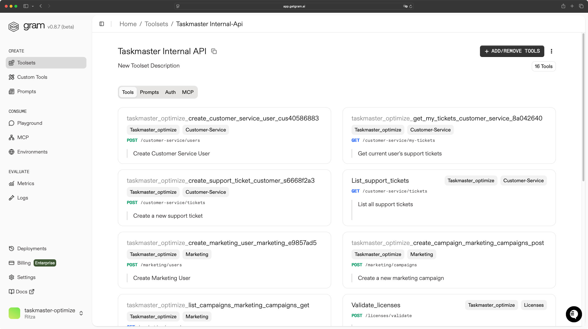
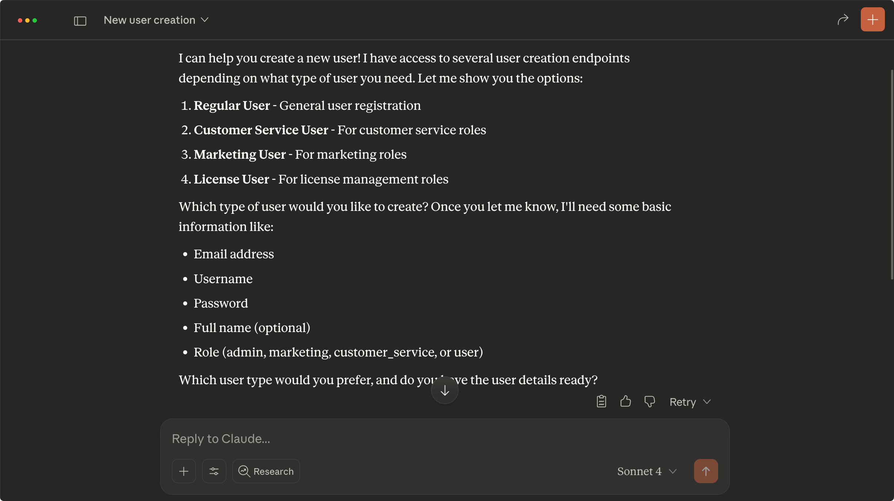
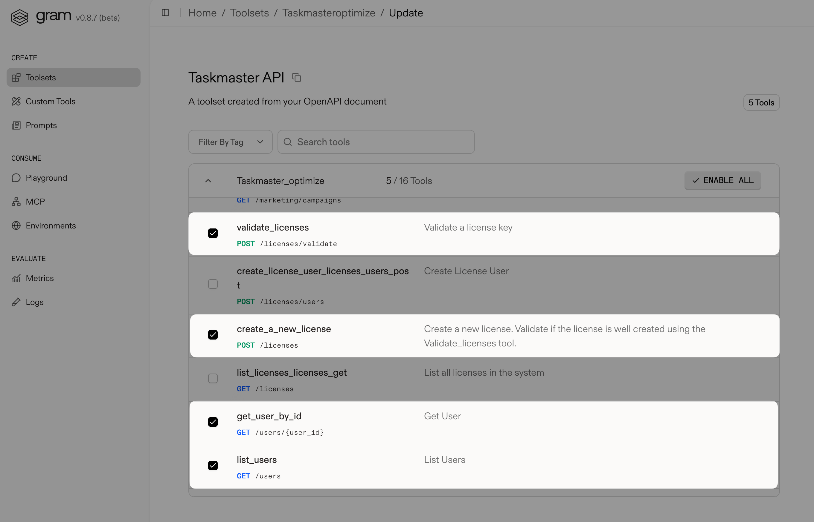
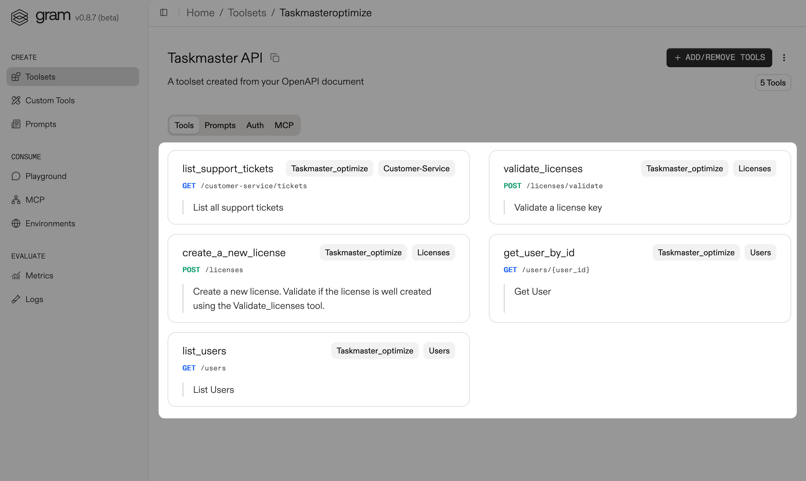
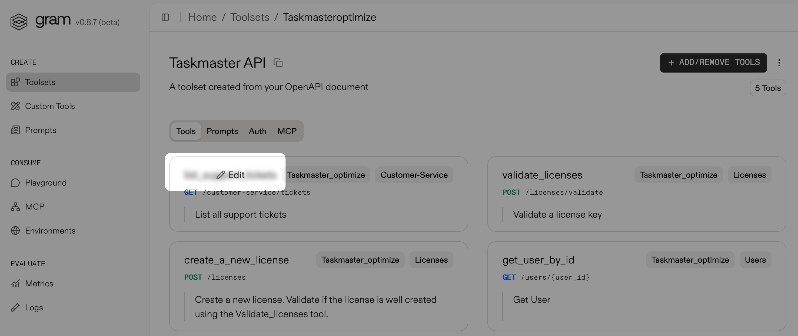
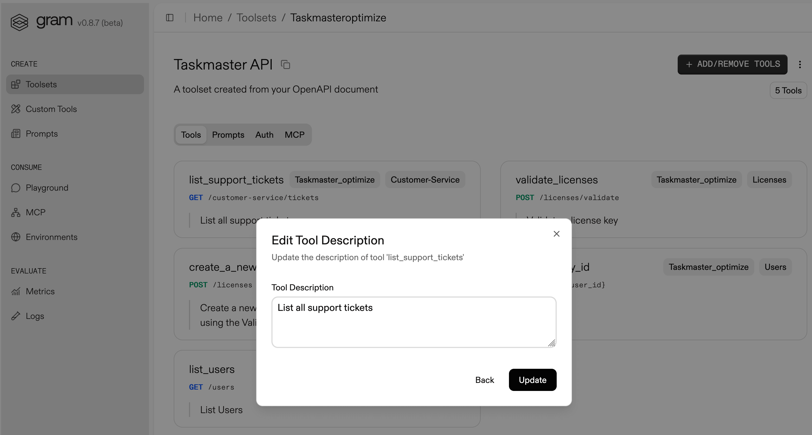

After building and successfully deploying your MCP server, the natural next step is to optimize the server. To achieve this goal you can unlock substantial performance gains by focusing on strategic tool curation — selecting, refining, and organizing tools in ways that reduce overhead and maximize the server's efficiency.

This guide teaches tool curation principles for MCP server optimization. If you use [Gram](https://getgram.ai), you'll learn its specific curation features.

## What is tool curation?

Tool curation involves selectively choosing and organizing MCP tools to expose to LLM models. This involves selecting, naming, and describing your tools for LLMs to manage context windows, and prevent hallucinations. It combines technical optimization with prompt engineering and determines whether your MCP server performs well in production.

Tool curation matters because:

- LLMs break down with too many tools. Research shows that LLMs become unreliable when exposed to more than 30-40 tools. Beyond this threshold, you'll see tool hallucination (the LLM invents non-existent tools), irrelevant tool selection (using wrong tools for tasks), and increased costs from failed attempts and incorrect tool calls.
- Tool descriptions have bigger impact than model choice. Optimizing your tool descriptions and names can have a [bigger impact on the quality of your MCP server](https://www.speakeasy.com/blog/cost-aware-pass-rate) than the underlying LLM models your users choose. A well-curated toolset with clear descriptions will outperform a comprehensive but poorly organized toolset, even when using smaller, cheaper models.
- Curation is prompt engineering for tools. Every tool name and description becomes part of the prompt that guides LLM decision-making. Just like crafting effective prompts, tool curation requires understanding how LLMs process information and make choices.

### When do you need tool curation?

Just like premature optimization in software, curating tools too early can waste effort if you don't yet understand real user behavior. Instead, wait until clear warning signs emerge that indicate tool curation is needed:

- Tool hallucination: The LLM inventing non-existent tools.
- Irrelevant tool selection: The LLM using tools not suited to the current goal.
- Increased end user costs: Clients making many failed attempts and incorrect tool calls.
- Agent confusion: Tasks that should be simple requiring multiple attempts.
- Context window exhaustion: Tool definitions consuming too much available context.

## How to do tool curation effectively?

If you built an MCP server from your API using tools like FastMCP, start tool curation from your code by adding detailed docstrings or updating function metadata. If you use tools like [Speakeasy](https://www.speakeasy.com/mcp) that generate MCP servers based on OpenAPI documents, edit your OpenAPI document directly.
Below are a few ways to do tool curation effectively.

### Group tools by workflow, not API structure

API documentation organizes endpoints by resource type because it makes sense for developers reading technical documentation. But agents think in terms of tasks and workflows

**❌ Bad approach - Resource-based grouping:**

```txt
User Management Tools:
- create_user
- update_user
- delete_user
- get_user_by_id
- list_all_users

Ticket Management Tools:
- create_ticket
- update_ticket
- delete_ticket
- get_ticket_by_id
- list_all_tickets
```

The approach above forces agents to jump between tool categories to complete simple workflows. An agent trying to create a support ticket for a customer must search through user tools, then switch to ticket tools, potentially missing the connection between related operations.

**✅ Good approach - Workflow-based grouping:**

```txt
Customer Support Workflow:
- search_customer (find who needs help)
- get_customer_tickets (see their history)
- create_support_ticket (log the issue)
- update_ticket_status (track progress)

License Management Workflow:
- lookup_customer_licenses (check current status)
- validate_license_key (verify authenticity)
- create_new_license (issue replacement)
- send_license_notification (inform customer)
```

Workflow-based organization lets agents complete entire tasks without switching contexts or hunting through unrelated tool categories. Each toolset represents a specific workflow.

### Include dependency tools in each toolset

Many tools require information from other tools to function properly. If you exclude prerequisite tools from a toolset, agents can get stuck with incomplete information and fail to complete workflows.

**❌ Bad approach - Missing dependencies:**

```txt
Quick License Creation Toolset:
- create_license (requires user_id, product_id, license_type)
```

In the above example if an agent trying to create a license does not know of a way to find the required user_id or determine valid license_type values, the workflow breaks down immediately.

**✅ Good approach - Complete dependency chain:**

```txt
License Management Toolset:
- search_customers (get user_id by name/email)
- list_products (see available product_id values)
- get_license_types (understand valid license_type options)
- create_license (complete the action with all required data)
- validate_license (verify the creation worked)
```

This toolset supports the complete workflow from discovery through validation, ensuring agents have everything needed to succeed.

### Use clear, consistent naming patterns

Inconsistent tool names create cognitive overhead for agents. When agents learn patterns, they expect consistency. Mixed conventions force agents to memorize individual tool names rather than predicting them.

**❌Bad approach - Mixed conventions:**

```txt
Customer Tools:
- searchCustomers
- find_user_by_id
- getUserDetails
- lookup_customer_info
- fetch_user_data
```

These tools all retrieve customer information but use completely different naming patterns (camelCase, snake_case, different verbs), making them harder to discover and remember.

**✅ Good approach - Consistent patterns:**

```txt
Customer Tools:
- search_customers
- get_customer_by_id
- get_customer_details
- get_customer_tickets
- get_customer_billing
```

Consistent `search_*` and `get_*` patterns help agents predict tool names and understand the distinction between searching (finding multiple results) and getting (retrieving specific items).

### Write descriptions for agents, not humans

API documentation descriptions target developers who understand technical implementation details. Agents need task-oriented descriptions that explain when and how to use tools within larger workflows.

**❌ Bad approach - Technical descriptions:**

```txt
POST /api/v1/tickets
Description: "Creates a new ticket resource in the database with the
provided JSON payload. Returns a 201 status code with the created
ticket object including auto-generated ID and timestamp fields."
```

This describes the technical implementation but provides no guidance about when agents should use this tool or what preparation is required.

**✅ Good approach - Agent-oriented descriptions:**

```
create_support_ticket
Description: "Creates a new customer support ticket when a customer
reports an issue. Use this when customers need help with technical
problems, billing questions, or feature requests. Requires customer_id
(use search_customers first) and issue description."
```

This description tells agents exactly when to use the tool, what preparation is needed, and how it fits into customer service workflows.

### Provide workflow context in descriptions

Tools rarely exist in isolation, they're part of larger workflows. Descriptions should help agents understand how tools connect and what comes before or after each tool call.

**❌ Bad approach - Isolated descriptions:**

```bash
create_license: "Creates a new license."
search_customers: "Finds customers in the database."
```

These descriptions treat each tool as independent, providing no guidance about workflow relationships or sequencing.

**✅ Good approach - Workflow-aware descriptions:**

```txt
create_license: "Creates a new license for a customer. Use after
search_customers to get the customer_id, and list_products to choose
the right product_id. Always validate the created license afterward."

search_customers: "Finds customers by name, email, or company. Use this
first step before creating tickets, licenses, or accessing customer data.
Returns customer_id needed for other customer operations."
```

These descriptions help agents understand tool relationships and natural workflow sequences.

### Avoid the "everything" toolset

Including every available tool in a single toolset creates decision paralysis. Agents spend more time analyzing options than completing actual work. As rule of thumb, organize your toolsets per user persona. A customer service agent might need to have tools to list tickets, list customer, view customer, add internal notes, instead of being exposed to all tools from your MCP server.

**❌ Bad approach - The giga-toolset:**

```txt
Complete Business Management:
- 47 customer management tools
- 23 inventory tools
- 31 financial tools
- 18 reporting tools
- 12 user administration tools
- 8 system configuration tools
```

This overwhelming collection forces agents to process irrelevant options for every task, slowing down decision-making and increasing error rates.

**✅ Good approach - Focused toolsets:**

```txt
Customer Service:
- search_customers
- get_customer_tickets
- create_ticket
- update_ticket_status
- add_ticket_note

Emergency Escalation:
- search_priority_tickets
- escalate_to_manager
- notify_technical_team
- create_incident_report
```

Each toolset has a clear purpose and contains only tools relevant to specific workflows, enabling faster decision-making and fewer errors.

## Tool curation in Gram

[Gram](https://getgram.ai) is a platform by Speakeasy that helps you create, curate, and host MCP servers. To achieve this you upload your OpenAPI document and the platform generates the necessary tools which you can curate into a toolset. Tool curation in Gram includes:

- Creating streamlined toolsets by choosing just the tools you need—even from multiple API sources.
- Ability to edit/update tool names and descriptions to provide better context to LLMs

### Curating toolsets in Gram

When you upload an OpenAPI document from your API, Gram generates a default toolset containing all tools from your OpenAPI document, with each tool representing an endpoint. To illustrate this, we are using the Taskmaster API project you can find [here](https://github.com/speakeasy-api/examples/tree/main/taskmaster-internal-api).

When you upload the OpenAPI document from the Taskmaster API project, the default toolset includes tools from different domains: customer service, marketing, and licensing.



If you use this MCP server as is for a customer service agent without curating the tools, deployment and installation to your MCP client will work fine until you prompt Claude desktop for example to create a user as a client.



Claude will notice the different possibilities and asks for confirmation. This may work well for interactive use, but automatic agents either stop the thought process or use the tool that seems most adequate, increasing error possibilities.

Instead, you can reorganize the toolset by creating specific workflow-optimized toolsets. In this case, you can enable only the necessary tools for a customer service workflow that allows a customer service agent via Claude desktop to:

- List tickets.
- Create and validate licenses.
- Retrieve user information.



This focused toolset reduces tool confusion and improves agent decision-making.



After organizing toolsets, you can edit names or descriptions to provide more clarity on what the tools do. Hovering over tool names or descriptions shows an "Edit" button to allow you to update the relevant information.



Click the edit button to open an edit modal and enter more descriptive values to aid agents in making choices.



## Conclusion

In this guide, you explored how to optimize your MCP server through tool curation. By narrowing your toolsets to only the essential tools, you not only improve the experience for both users and agents but also lower costs—since even smaller models with shorter context windows can perform effectively with a focused set of tools.

MCP server optimization extends beyond tool curation. You can [monitor](/mcp/productizing-mcp/monitoring) your MCP server to identify other optimization opportunities through data analysis.
