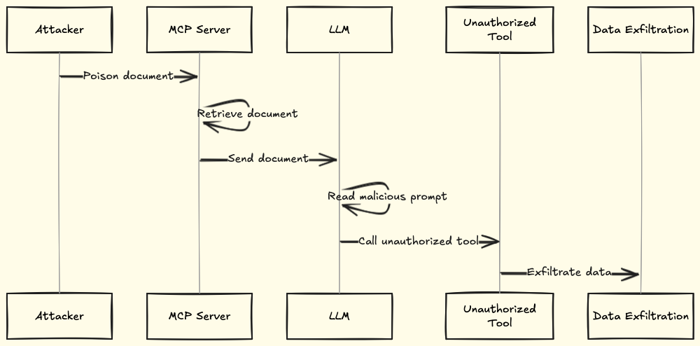
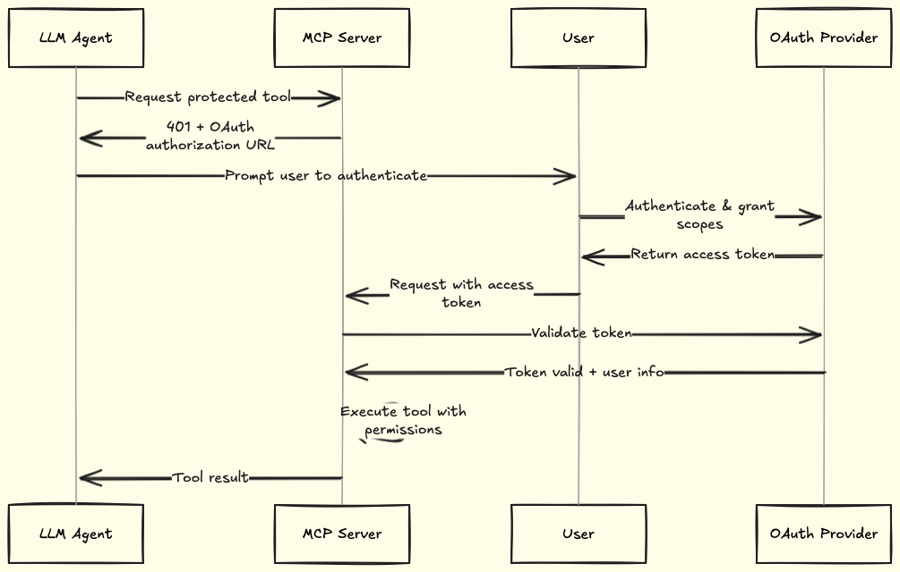

MCP servers handle requests from LLM agents, not users. When a user calls your API, you will have a good idea of what they're requesting. When an LLM agent calls your MCP server, you're trusting the agent's interpretation of what the user wanted.

This creates new attack vectors. An attacker doesn't need to compromise your server directly. They can inject malicious instructions into content the LLM reads, and the LLM will execute those instructions, thinking it's following the user's intent.

This guide first explains the threats facing MCP servers, then shows you which controls to implement and why: authentication and authorization, credential protection, prompt‑injection defenses, encrypted transport, and monitoring.

## Understanding MCP security threats

MCP servers face unique threats because LLM agents sit between users and your tools. Attackers exploit this intermediary to bypass traditional security controls.

### Prompt injection attacks

Prompt injection happens when the attacker manipulates LLMs into performing harmful acts using malicious prompts. This comes in two types:

- **Direct prompt injection:** The Attacker delivers prompts through input fields in the AI application.

- **Indirect prompt injection:** Attackers hide malicious prompts in content that the LLM will consume, such as images and PDF documents.

Many prompt injection methods don't require any specialist knowledge or even coding ability. Attackers will just need a basic understanding of how LLMs function, their vulnerabilities, and where to insert malicious prompts effectively. Here is how an attack can go:

- The attacker poisons the document.
- The MCP server retrieves the document.
- The LLM reads the malicious prompt.
- LLM calls an unauthorized tool.
- Data is exfiltrated.



### Unauthorized access

Without proper authentication, anyone can connect to your MCP server and call your tools. This type of threat includes:

- **Missing authentication:** Your server accepts tool calls from any client without verifying identity.

- **Weak authentication:** API keys passed through prompts can be intercepted or leaked through logs.

- **Credential theft:** Attackers steal valid tokens and impersonate legitimate users.

### Data exfiltration

Compromised agents can extract sensitive data through legitimate tool calls:

- **High-frequency queries:** An agent makes thousands of database queries in minutes, extracting customer records.

- **Unauthorized tool access:** A support agent's session unexpectedly initiates calls to admin-only tools to access restricted data.

- **Prompt-triggered exfiltration:** Malicious instructions in retrieved content tell the LLM to send data to external URLs.

With these threats in mind, the first control to put in place is robust authentication and authorization.

## Implement authentication and authorization

Authentication controls who can access your server. Authorization controls what users can do once they are connected.

### Use OAuth 2.1 for authentication

MCP servers connect users to external APIs. You could accept API keys directly, but this creates three problems:

- **Tokens in prompts are vulnerable.** Attackers intercept credentials through man-in-the-middle attacks. Tokens leak through logs. Your server becomes a tool for credential theft.
- **Users can't manage scopes correctly.** Users don't know what permissions your tools need. They either grant excessive permissions (security risk) or insufficient permissions (tools break).
- **API keys are long-lived.** If compromised, attackers have access until the key is manually revoked.

OAuth 2.1 fixes all three:

- Authentication occurs outside the LLM context; users authenticate directly with your OAuth provider (e.g., Auth0, Okta, FusionAuth).
- You define the required scopes, not users.
- Tokens are short-lived and expire automatically.
- You can revoke access without requiring users to regenerate their keys.

MCP integrates with standard OAuth 2.1. The high‑level flow in an MCP context looks like this:

- **AI requests protected tool** → Your MCP server returns 401 with an OAuth authorization URL, triggering the authentication flow.
- **User completes OAuth flow** → They authenticate with your OAuth provider (Auth0, Okta, etc.) and grant permissions for specific scopes.
- **MCP client receives access token** → The token is stored securely by the MCP client and included in subsequent requests as a Bearer token.
- **MCP server validates token** → On each tool call, your server validates the token against the OAuth provider using token introspection.
- **Tool executes with user context** → Your server uses the validated user information to call the tool with appropriate permissions and attribution.

The key difference from traditional OAuth is that _AI models trigger the authentication flow_ when they need protected tools, rather than users manually initiating login flows.



Learn how to add OAuth 2.1 to your MCP server in this [guide](https://docs.getgram.ai/examples/oauth-external-server).

### Encrypt communications with mutual TLS

Standard TLS (HTTPS) only authenticates the server. The client knows it's talking to the real server, but the server doesn't know who the client is.

Mutual TLS (mTLS) authenticates both sides. Both the client and server present certificates and verify each other's identity before exchanging data. This prevents unauthorized clients from connecting to your MCP server and stops man-in-the-middle attacks.

| Without mTLS                                                     | With mTLS                                                  |
|------------------------------------------------------------------|------------------------------------------------------------|
| Anyone can attempt to connect to your server                     | Only clients with valid certificates can connect           |
| Client identity verified at application level (API keys, tokens) | Client identity verified at transport layer (certificates) |
| API keys can be stolen and reused                                | Certificates require both public cert and private key      |
| No cryptographic proof of client identity                        | Cryptographic verification of both parties                 |
| Logging shows IP addresses                                       | Logging shows verified client identities                   |

Here's how to set up mTLS for your Python MCP server using uvicorn:

```python
import ssl
import uvicorn

# Create SSL context
ssl_context = ssl.SSLContext(ssl.PROTOCOL_TLS_SERVER)

# Load server certificate and private key
ssl_context.load_cert_chain("server.crt", "server.key")

# Load CA certificate to verify clients
ssl_context.load_verify_locations("client_ca.crt")

# Require client certificates
ssl_context.verify_mode = ssl.CERT_REQUIRED

# Run server with mTLS
uvicorn.run("app:app", ssl_context=ssl_context)
```

For optimal protection, combine mTLS with OAuth 2.1:

- **mTLS** operates at the transport layer, ensuring the identity and secure channel between the client and server.
- **OAuth 2.1** operates at the application layer, providing granular, policy-driven authorization and delegation of access.

By combining them, you can build a more secure MCP server that protects against a broader range of threats, such as token replay and man-in-the-middle attacks.

### Choose your authentication model

Your authentication approach depends on your use case.

#### Pass-through authentication

In pass-through authentication, users provide their own API keys or credentials directly to your MCP server. The server uses these credentials to access external services on behalf of the user.
Never accept credentials through prompts. If you build an MCP server that accepts API tokens directly from LLM prompts, you create multiple attack vectors:

- Man-in-the-middle attacks can intercept credentials in transit.
- Credentials can leak through logging or monitoring systems.
- Your server becomes an explicit attack tool for credential theft.

If you use pass-through authentication, accept credentials only through:

- Environment variables.
- Secure configuration files outside the MCP context.
- OAuth flows (recommended).

#### Managed authentication

In managed authentication, you handle user credentials on the server side. Users don't provide their own API keys; you manage access control and use your own service accounts to perform actions on their behalf.

This works best for:

- Internal enterprise tools where you control who has access.
- Situations where you require strict control over the actions users can perform.
- APIs where individual user credentials aren't necessary.

## Apply defense controls

Before exploring specific practices to address specific threats, it is essential to establish foundational controls that work together to mitigate the impacts when attacks succeed.

### Grant minimum necessary permissions

Excessive permissions expand your attack surface. A compromised search tool with write access can modify or delete data it should only read. Grant each tool only the permissions required for its function. A customer search tool needs read access, not the ability to modify or delete customer records.

A customer search tool should request for example only `customers:read` permissions:

```json
{
    "name": "search_customers",
    "description": "Search customer database",
    "permissions": ["customers:read"]
}
```

Not full CRUD access:

```json
{
  "name": "search_customers",
  "description": "Search customer database",
  "permissions": ["customers:read", "customers:write", "customers:delete", "billing:read"]
}
```

To apply the principle of least privilege on your MCP server:

- Determine the minimum access each tool needs to function.
- Strip away any extra permissions.
- Review and adjust permissions on a regular basis.

### Restrict tool access by client role

Limit which tools each client can use based on their role. A customer support agent doesn't need access to billing modification or database deletion tools.

### Mask sensitive data

When attackers exfiltrate data through prompt injection, masked values protect your credentials and customer information. Replace sensitive data, such as social security numbers, API keys, and passwords, with substitutes before transmission.

Before masking:

```json
{
  "customer": {
    "name": "John Smith",
    "ssn": "123-45-6789",
    "email": "john.smith@email.com",
    "api_key": "sk_live_abc123xyz456"
  }
}
```

After masking:

```json
{
  "customer": {
    "name": "John Smith",
    "ssn": "XXX-XX-6789",
    "email": "j***@email.com",
    "api_key": "[REDACTED]"
  }
}
```

### Never expose secrets in LLM-readable content

How you handle credentials determines whether your MCP server is a security asset or a liability. The first rule: never put secrets where LLMs can read them. This includes:

- Tool descriptions or metadata.
- Tool output messages.
- Error messages.
- Documentation strings.
- Example parameters.
- Configuration files that get returned to clients.


## Defend against prompt injection

To defend against prompt injection, you should:

- **Apply input filtering:** Strip or flag suspicious patterns in user-supplied text before it reaches your model. Here is how you can do it in Python.

  ```python
  def sanitize_input(user_input: str) -> str:
      suspicious_patterns = [
          'ignore previous instructions',
          'disregard your rules',
          'system prompt'
      ]

      for pattern in suspicious_patterns:
          if pattern in user_input.lower():
              raise SecurityException("Suspicious input detected")

      return user_input
  ```

- **Scan retrieved content.** Check all data from MCP servers for obvious payloads like script tags, tool command patterns, SQL queries, or suspicious phrases.

- **Monitor for unusual behavior.** Watch for agents attempting to access or share restricted data.

## Monitor and detect threats

Without monitoring, attackers can operate in your system undetected. Monitoring helps you catch attacks in progress. You should watch for:

- Unusual tool access patterns (support agent suddenly using admin tools).
- High-frequency API calls suggesting data exfiltration.
- Failed authentication attempts.
- Tools are being called with unexpected parameter patterns.
- Log every tool call with structured data, including the invocation ID, timestamp, client ID, tool name, and parameters.

For production monitoring setup, performance metrics, and alerting strategies, see our [guide on monitoring MCP servers](/productizing-mcp/monitoring-mcp-servers).

## Final thoughts

This guide covered the security controls your MCP server needs in production: authentication with OAuth 2.1, credential management, prompt injection defenses, mTLS for enterprise deployments, and foundational controls like data masking and least privilege.
To translate these recommendations into action, use the checklist below as a quick reference.

- Use OAuth 2.1 for authentication and scope management.
- Enforce mutual TLS (mTLS) where you need strong client authentication.
- Apply least privilege: minimal tool permissions and role‑based access.
- Never expose secrets to LLM‑readable content; use managed secrets and masking.
- Add prompt‑injection defenses on inputs and retrieved content.
- Log every tool call and monitor for anomalies.

Security isn't a one-time setup. Threats evolve as attackers discover new techniques targeting LLM-based systems, and that's why [monitoring](/productizing-mcp/monitoring-mcp-servers) your MCP server is important, as you can identify and take defensive measures as soon as possible.

If you're looking for a platform that handles MCP server hosting with SOC 2 compliance built in, [Gram](https://getgram.ai/) provides managed MCP infrastructure, allowing you to focus on curating tools instead of managing security.
