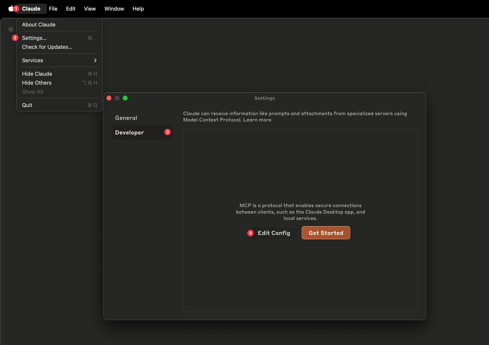

import { Callout } from "@/mdx/components";

<Callout title="Gram AI by Speakeasy">
  Unlock AI engineering by turning your API platform into an AI platform with
  [Gram](https://app.getgram.ai). Generate agent tools for internal services and
  connect to popular third party APIs from one platform. [Join the
  waitlist](https://app.getgram.ai) today.
</Callout>

This guide will walk you through connecting your first MCP server to an AI agent in under 10 minutes. We'll use Claude Desktop as our AI client to add a file to a new project directory on your computer.

## Prerequisites

- [Claude Desktop](https://claude.ai/download) installed.
- [Node.js](https://nodejs.org) installed.

## Step 1: Install an MCP server

We'll use the [Desktop Commander MCP server](https://desktopcommander.app/), which lets AI agents use your local filesystem as a tool.

You have two options, depending on your preference:

**The Desktop Commander auto-install script**

To let Desktop Commander install the MCP server for you, run this command in your terminal:

```bash
# Install the Desktop Commander MCP server
npx @wonderwhy-er/desktop-commander@latest setup
```

**Manual installation**

If you prefer to install the MCP server manually (and learn how to install other MCP servers), open Claude Desktop and follow these steps:



1. In the top menu bar, click on the **Claude** menu item.
2. Select **Settings**.
3. Go to the **Developer** tab.
4. Click on **Edit Config**.

This will open a finder or file explorer window showing the configuration file for Claude Desktop. Open the `claude_desktop_config.json` file in a text editor.

Paste the following configuration into the file:

```json
{
  "mcpServers": {
    "desktop-commander": {
      "command": "npx",
      "args": [
        "-y",
        "@wonderwhy-er/desktop-commander"
      ]
    }
  }
}
```

Save the configuration file.

## Step 2: Restart Claude Desktop

Close Claude Desktop completely and reopen it. The MCP server will now be available.

## Step 3: Test the connection

In Claude Desktop, try asking:

> "Add a folder to `~/Desktop` called `mcp-test` and create a file called `hello.txt` with the content `Hello, MCP!`"

<video
  controls={false}
  loop={true}
  autoPlay={true}
  muted={true}
  width="100%"
  className="mt-10"
  poster="./assets/quick-start/mcp-test-poster.png"
>
  <source src="./assets/quick-start/mcp-test.webm" type="video/webm" />
  <source src="./assets/quick-start/mcp-test.mp4" type="video/mp4" />
</video>

As shown in the video above, Claude Desktop executes the command using the MCP server, creating the folder and file on your desktop. The file contains the text "Hello, MCP!".

## What just happened?

1. **Claude Desktop** sent your prompt to Claude's API along with a message indicating which tools it can use.
2. **Claude's API** responded with a message that included the MCP server's name and the command to execute (first, `create_directory`, then `write_file`).
3. **Claude Desktop** sent the commands to the Desktop Commander MCP server.
4. **Desktop Commander** executed the commands on your local file system, creating the folder and file as requested.

Steps 2 to 4 are repeated for each command, allowing the AI agent to see the results of its actions and continue the conversation.

In the end, you see a confirmation message in Claude Desktop that the folder and file were created successfully:

> Done. I've created the mcp-test folder in your Desktop directory and added the hello.txt file with the content 'Hello, MCP!' inside it.


## Next steps

Now that you have MCP working, explore more:

- **Try other MCP servers**: [Installing MCP Servers: A quickstart guide](/mcp/installing-mcp-servers)
- **Build your own**: [Creating MCP servers](/mcp/protocol-deep-dive)
