## Introduction 

Customer service workflows break down when teams coordinate across multiple systems. Agents might qualify leads in HubSpot, discuss approvals in Slack, then switch to an internal license system to provision access. Each context switch slows response times and introduces errors.

Building an internal dashboard means weeks of development, UX research, and ongoing maintenance. You'd build API integrations, design interfaces, handle authentication, deploy infrastructure, and train your team on another tool. You're adding technical debt instead of reducing complexity.

There's a simpler approach: build an MCP server in a few hours, connect it to your existing API, and let your customer service team work through Claude conversations instead. If you already have an API with an OpenAPI document, Gram can have your MCP server ready in minutes.

This guide demonstrates complete customer service automation using three MCP servers: HubSpot for lead data, Slack for team communication, and Gram hosting an internal License MCP server.

## What are we building? 

We're building a customer service workflow that connects HubSpot, Slack, and an internal License API through MCP servers. Customer service agents will identify qualified leads in HubSpot, check team discussions in Slack, then create licenses in the internal system, all through Claude conversations.

We're technically building one MCP server. HubSpot provides an official MCP server. For Slack, we'll use the existing [slack-mcp-server](https://github.com/korotovsky/slack-mcp-server) package. For the internal License API, we'll create and host an MCP server on Gram.

The goal here is to allow customer service agents to use Claude to distribute licenses for successful leads.


You can replace the License API with your inventory system, user provisioning service, or any internal tool that has an API and OpenAPI specification.

## Prerequisites

For this guide, you will need:

- Python 3.11 or higher. 
  - uv installed on your machine.
- A Gram account.
- Slack and HubSpot MCP servers installed in Claude Desktop. Follow the guides:
  - [Using Slack with MCP quickstart guide](/mcp/using-mcp/slack-claude-quickstart)
  - [Using HubSpot with MCP quickstart guide](/mcp/using-mcp/hubspot-claude-quickstart)
- Ngrok CLI.

## Gram Concepts

Before building with Gram, you need to understand these core components.

### Toolsets

MCP standardizes how LLMs access different tools. Instead of writing custom integrations for each service, there's one consistent interface that agents can use across any platform. Tools are functions that LLMs can call to execute actions like reading files, making API requests, or querying databases.

Gram organizes tool definitions into toolsets, enabling specific workflows. When you upload an OpenAPI document, Gram converts every operation into a tool definition that follows MCP specifications.

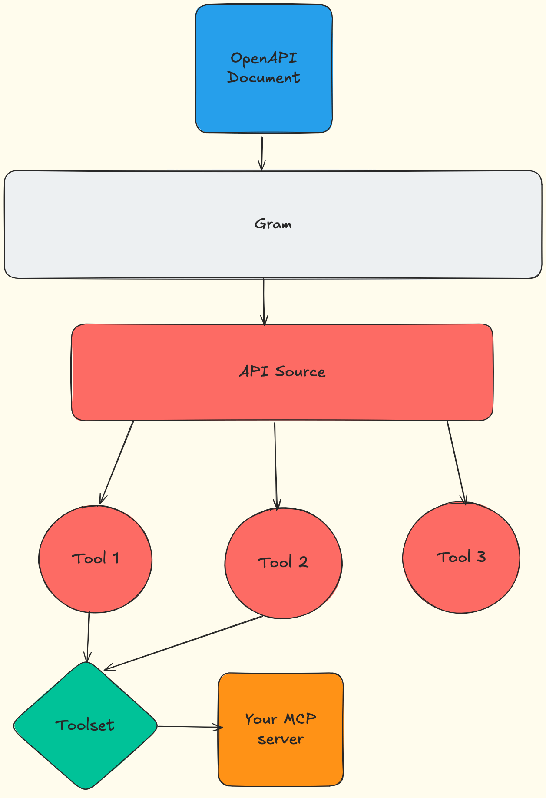

Giving an LLM access to too many tool definitions exhausts the context window and causes agents to choose wrong tools. Toolsets enable you to curate only the tool definitions needed for specific tasks. You can scope separate toolsets for different teams (sales, marketing, support) ensuring agents access only relevant tool definitions.

### Tool Variations

OpenAPI endpoints often lack clear summaries and descriptions. When tool definitions inherit vague descriptions, LLMs struggle to understand when and how to invoke tools properly.

Gram provides **Tool Variations** to improve tool descriptions. You can edit tool names and descriptions to improve LLM understanding. This is prompt engineering for your API tool definitions.

## Create the License MCP server

We'll create an MCP server for the TaskMaster License API. This represents any internal service with an OpenAPI specification that you want to connect to Claude.

### Install and run the TaskMaster License API

First, clone the project. 

```bash
git clone https://github.com/ritza-co/speakeasy-examples.git
```

Then, navigate to the TaskMaster License API project. 

```
cd taskmaster/license-api
```

Once it's done, run the following command to install dependencies, and run the server.

```
chmod +x setup.sh
./setup.sh
```

The project should be running at http://127.0.0.1:8000.

### Create the MCP server on Gram

You have two options for creating MCP servers:

- Code the server yourself using MCP SDKs, TypeScript, or FastMCP
- Use solutions like Speakeasy to generate an MCP server

Both options require managing infrastructure: monitoring, scaling, and tracking usage. Instead of building, you end up maintaining. Gram eliminates this overhead by generating MCP servers from OpenAPI documents.

### Upload an API source document

Let's create the MCP server on Gram by adding an API source first. On the Gram dashboard, navigate to the Toolset Page. 

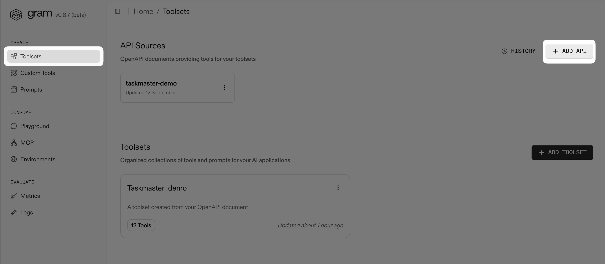

Then, on the **Toolsets** page, click on the **+ ADD API** button. 

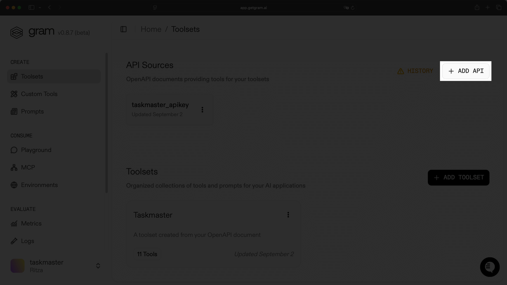

A modal appears where you'll upload an OpenAPI document and name the API. The License API project contains OpenAPI files in both JSON and YAML formats. Upload the YAML file and name it "License API". Gram will convert each API operation into a tool definition.

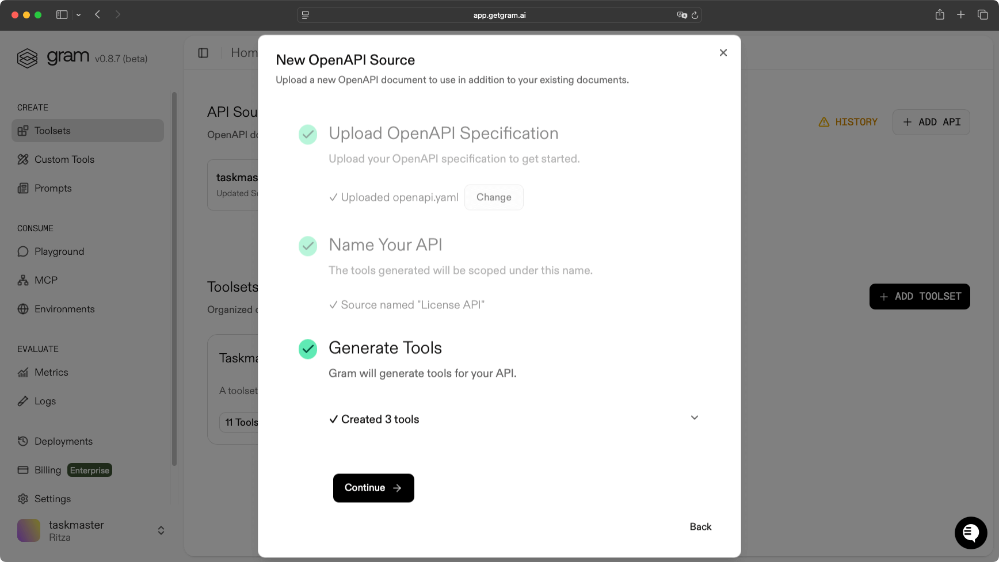

Click on **Continue ->** to close the modal. You will see the new License API listed under the API sources.

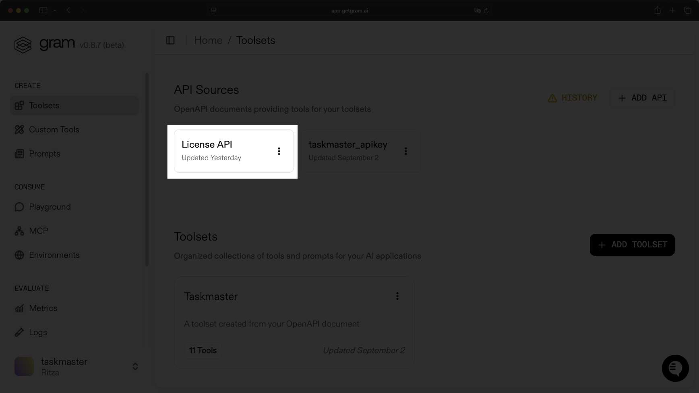

### Create a toolset

Next, create a toolset. A toolset is a collection of tool definitions that your MCP server will access. In Gram, toolsets can contain tool definitions from different API sources, enabling cross-service workflows. Selecting only the tool definitions you need reduces tool explosion and improves LLM efficiency.

Click on the **+ ADD TOOLSET** button on the Toolsets page. 

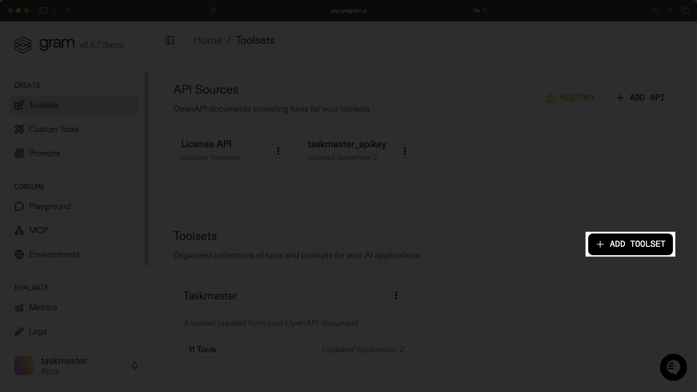

A modal will be displayed, where you will enter the name of the Toolset. You can enter License.

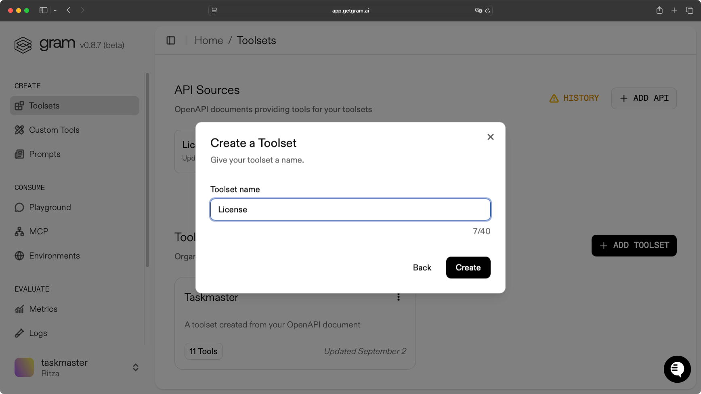

Click **Create** to open the tool selection page. Find the API source named `License_api` and click **Enable all** to add all tool definitions from the License API.

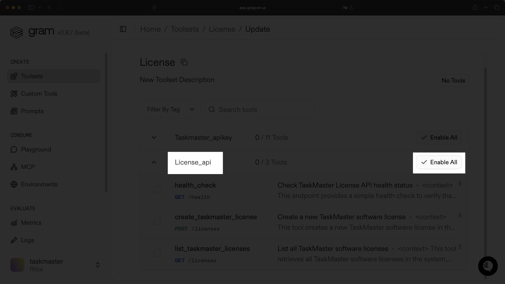

Navigate back to the Toolsets page and select the License toolset. A warning appears at the top with a **Set up now** link that opens the environment variables configuration page. If you can't see the warning, navigate to the **Auth** tab.

The License API running locally can't be accessed from the internet. Use ngrok to create a tunnel and get a public URL for the `LICENSE_API_SERVER_URL` variable.

In your terminal, run this command to expose the local License API:

```bash
ngrok http 127.0.0.1:8000
```

You will see a forwarding URL displayed by Ngrok. 

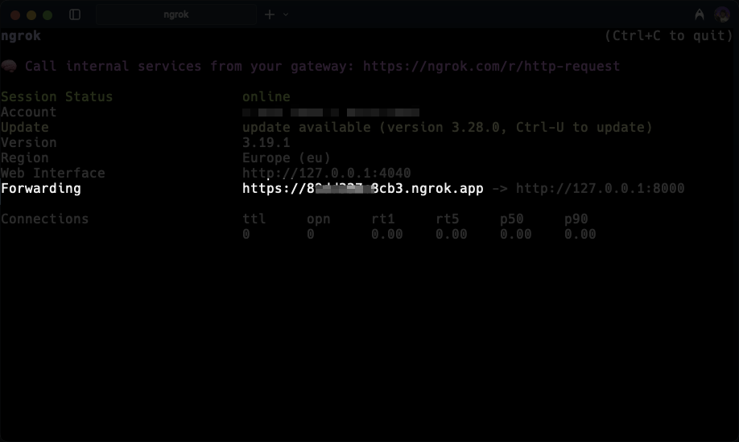

Copy the URL and fill the `LICENSE_API_SERVER_URL` variable with the URL and save the changes.

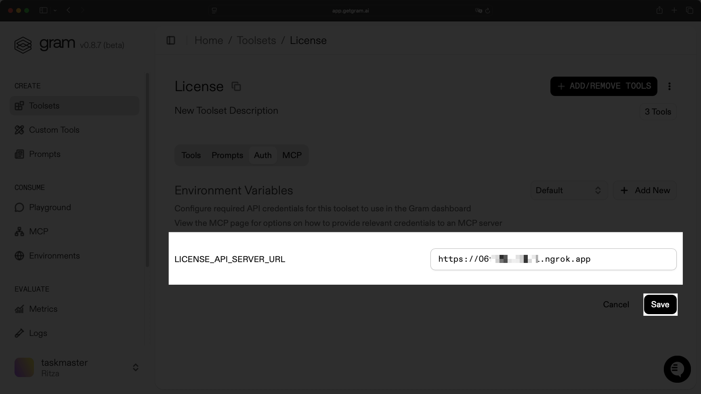

### Create a Gram key

Before adding the configuration to `claude_desktop_config.json` , let's create a Gram key.  In your Gram dashboard, go to **Settings** and click **Create API Key**.

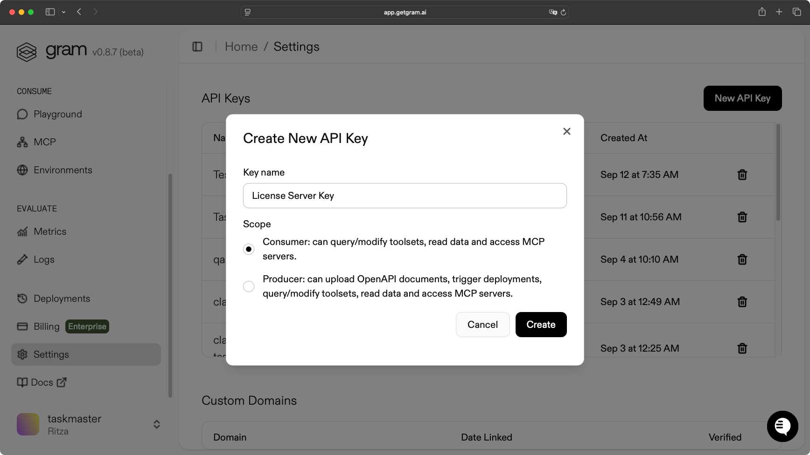

Copy the API key somewhere safe. You'll need it to configure Claude Desktop in the next section.

### Install the Slack MCP server in Claude Desktop 

Navigate to the MCP tab on the License Toolset page. Click on the **ENABLE** button to enable MCP hosting. 

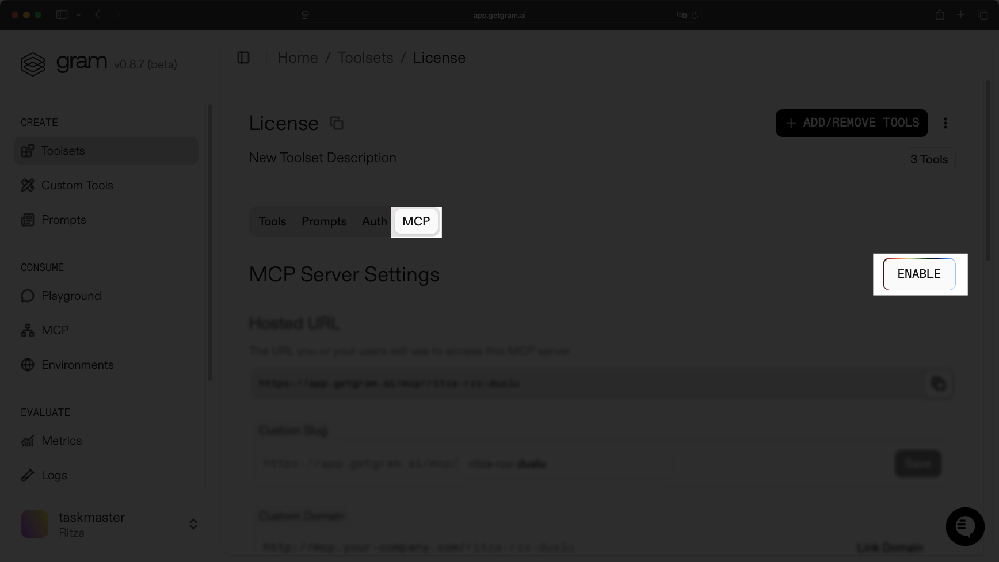

Once enabled, scroll down the page. You'll see two configurations for installing the MCP server:

- **Pass-through authentication**: Environment variables are passed directly in the MCP server configuration.
- **Managed authentication**: Gram stores and manages environment variables.

You will use managed authentication for this guide.

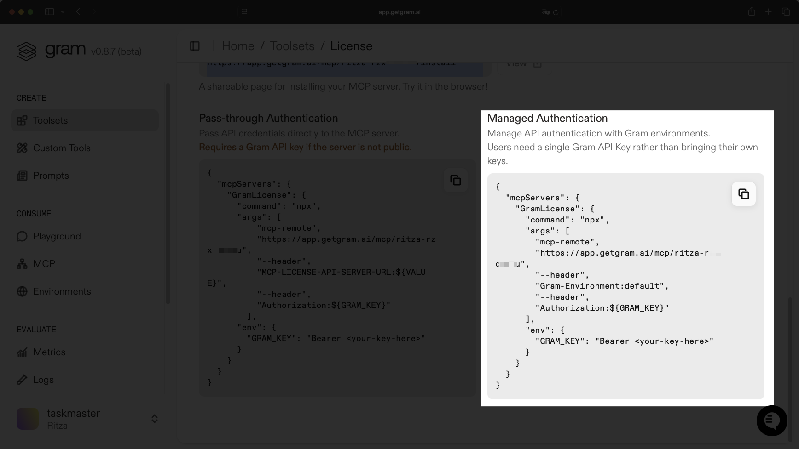

Open the Claude Desktop application, navigate to **Settings -> Developers** and click on the Edit Config button.

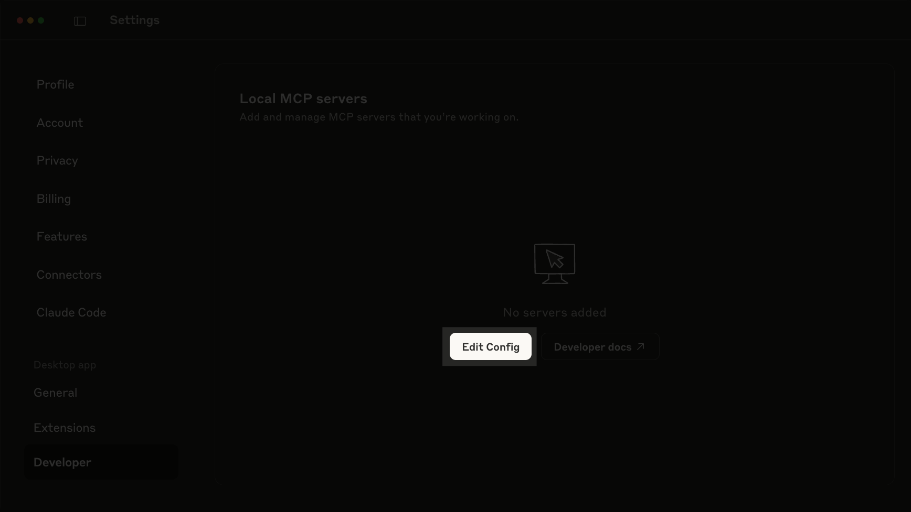

Open the `claude_desktop_config.json` file, copy the configuration for Managed authentication from Gram, and replace `<your-key-here>` with the value of the Gram key you have created. 

```json
{
  "mcpServers": {
    "GramLicense": {
      "command": "npx",
      "args": [
        "mcp-remote",
        "https://app.getgram.ai/mcp/xxxxxlu",
        "--header",
        "Gram-Environment:default",
        "--header",
        "Authorization:${GRAM_KEY}"
      ],
      "env": {
        "GRAM_KEY": "Bearer YOUR_GRAM_KEY"
      }
    }
  }
}
```

Restart Claude Desktop, open a new chat, and ask Claude to create a license for a test user to verify the integration works.

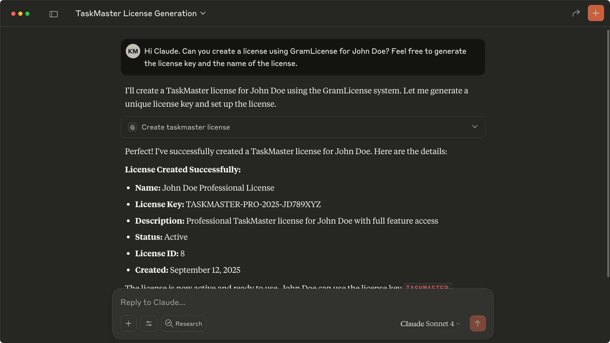

## The Complete Customer Service Workflow

Open Claude Desktop and test the complete workflow with this prompt:

```txt
Hi Claude. Access the leads channel in Slack using the Slack MCP server and the leads data in HubSpot using the HubSpot MCP server.

Pull and aggregate lead information from both sources.

Analyze the data to determine which leads are qualified and considered successful.

For each successful lead, create a license for the corresponding contact using the License MCP server.

Provide a summary of which leads were processed and confirm license creation.
```

The specific response will vary based on your actual data, but you'll observe Claude:

- Pull lead information from HubSpot, check related discussions in Slack, and analyze the data to determine which leads are qualified.

  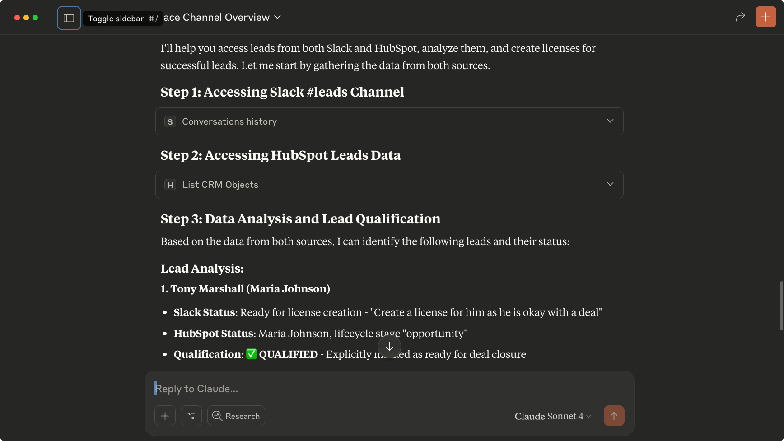

- Create licenses for qualified leads using the TaskMaster License MCP server you've created.

  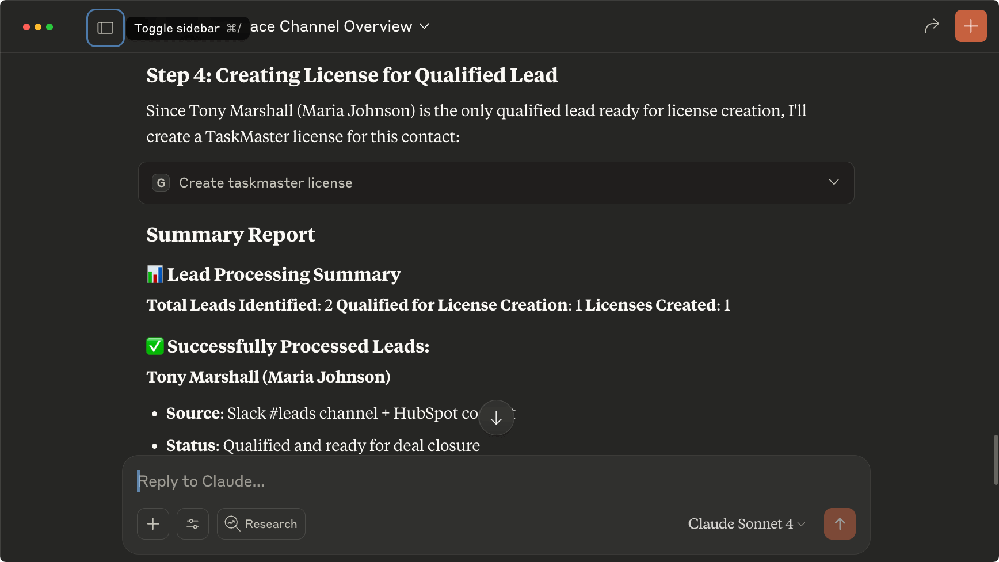

You can improve the prompt by including more details on:

- Specific lead qualification criteria (deal value over $X, lead score above Y, or contains keywords like "enterprise" or "urgent").
- Exact date ranges for Slack searches ("messages from the last 7 days" or "since September 1st").
- Validation steps like checking existing licenses, verifying contact information, or confirming lead status hasn't changed.

## Optimize the MCP server

In the Gram concepts section, we discussed tool curation and tool variations. Let's see how to implement both in Gram.

### Tool curation

Navigate to the License toolset page and click the **+ ADD/REMOVE TOOLS** button.

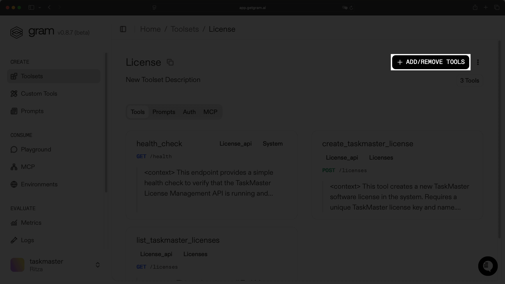

The health check tool can be removed since it's not used in customer service workflows. Disable it by toggling it off.

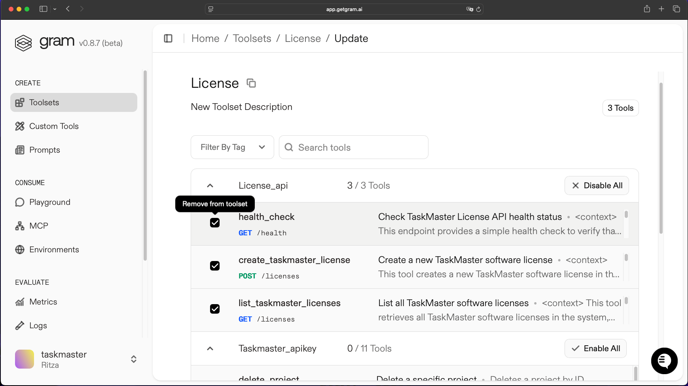Return to the License toolset page. The health check tool no longer appears in your toolset. This demonstrates tool curation in practice. With larger APIs containing dozens of endpoints, you can remove irrelevant tools to improve LLM performance and reduce context window usage.

### Tool variations

You can edit tool names and descriptions to improve LLM understanding. Hover over the `create_taskmaster_license` tool name to see an **Edit** button.

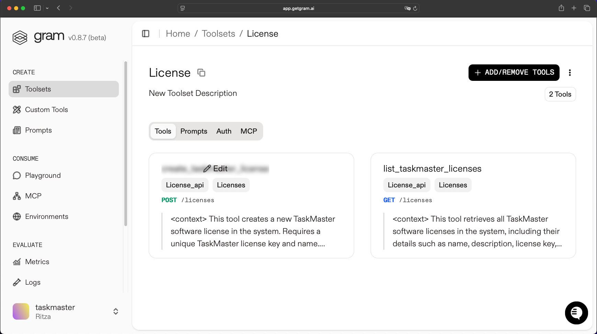Click the button to open the editing modal. You can improve the tool name, but the description is more important for LLM guidance. Hover over the description of the create taskmaster license tool.

Tool descriptions tell the LLM what the tool does and guide it through workflows. Here's the current description for Create a TaskMaster license:

```txt
<context>
  This tool creates a new TaskMaster software license in the system. Requires a unique
  TaskMaster license key and name. Useful for adding new TaskMaster licenses to the system.
</context>

<prerequisites>
  - TaskMaster license key must be unique across all licenses
  - Name is required and should be descriptive
  - Description is optional but recommended
  - TaskMaster license will be active by default unless specified otherwise
</prerequisites>
```

The XML structure in tool descriptions helps LLMs parse information systematically. The `<context>` section explains the tool's purpose, while `<prerequisites>` provides specific conditions the LLM should verify before execution. This structured format makes it easier for LLMs to understand not just what the tool does, but when and how to use it appropriately.

It looks fine, but you specify in the description what the LLM should make sure before creating licenses. Add this bullet under `<prerequisites>`. 

```txt
- Before creating a license, check for leads in Slack and Hubspot first.
```

This addition ensures Claude validates lead information before creating licenses, demonstrating how tool variations customize the MCP experience for your specific workflows.

## Final thoughts

You've built a customer service workflow that connects HubSpot, Slack, and an internal License API through MCP servers. Gram hosted the internal API integration without requiring infrastructure management or custom MCP server code.

The TaskMaster License API can represent any internal service with an OpenAPI specification. You can replace it with your existing systems to create workflows like:

- **User provisioning**: Combine Slack approvals with HubSpot lead data to automatically create user accounts in your SaaS platform.
- **Inventory management**: Use customer requests from support tickets and sales data to trigger inventory updates or purchase orders.
- **Financial reporting**: Aggregate data from CRM, communication tools, and internal billing systems for automated revenue reporting.
