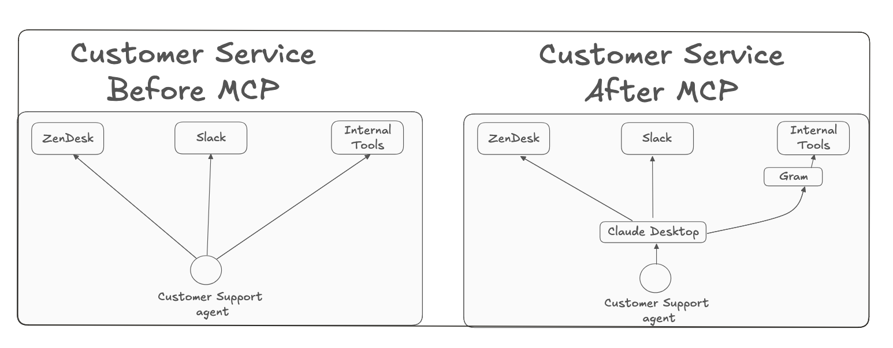
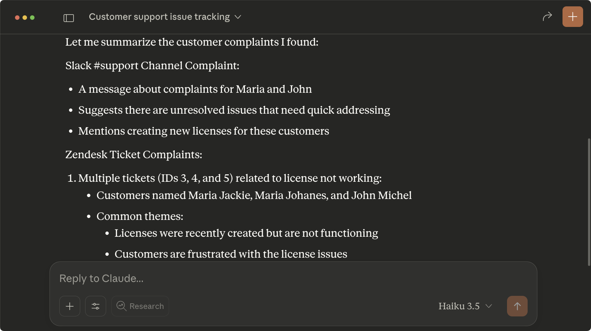
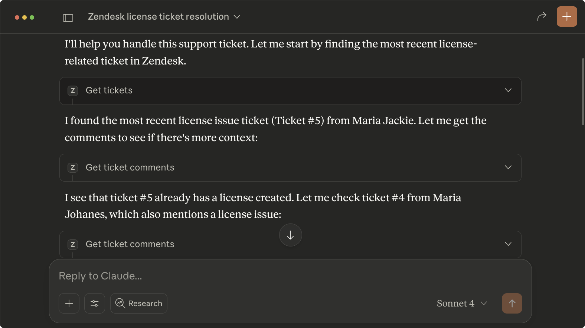
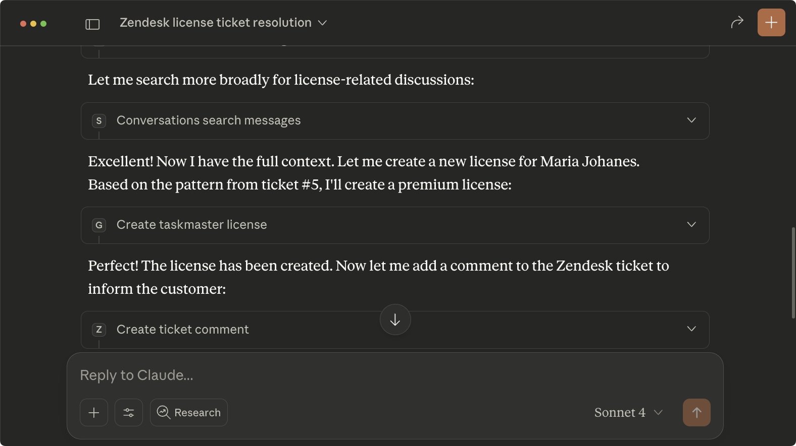

## Introduction

Customer service teams switch between tools constantly: checking Slack for context about customer issues, finding tickets in Zendesk, adding comments, and then handling the issues in internal dashboards or waiting for dedicated teams to do it.

For customer service teams handling dozens of tickets daily, more time is spent context switching and navigating interfaces when this time could be used to handle more customers or updates. 

What if you could help more customers faster without losing that context?

There's a simpler approach: use MCP servers to connect all your tools. Instead of switching between Slack, Zendesk, and your internal systems, handle everything through Claude conversations.

This guide shows you how to connect Zendesk, Slack, and your internal license API through MCP servers, so customer agents can resolve tickets in minutes instead of juggling multiple systems.

## What are we building?

We're building a customer service workflow that connects Zendesk, Slack, and an internal License API through MCP servers.

When a manager posts in Slack that a customer called about their delayed license, the agent asks Claude to handle it. Claude finds the customer's ticket in Zendesk, checks related Slack discussions, and provisions the license through the internal API.

<video
  controls={false}
  loop={true}
  autoPlay={true}
  muted={true}
  width="100%"
  className="mt-10"
>
  <source src="./assets/demo.mp4" type="video/mp4" />
</video>

**We'll set up three MCP servers:**

- Zendesk MCP server (existing package) to find tickets and add comments.
- Slack MCP server (existing package) to find context about customer issues.
- License API MCP server (built with Gram) to provision licenses through your internal tool.



## Prerequisites

You need:

- Claude Desktop installed
- Access to Zendesk and Slack accounts
- An internal API with OpenAPI documentation (we'll use a sample License API)

## Setting Up Zendesk and Slack

Follow these guides to set up the first two MCP servers:

- [Using Slack with MCP](/mcp/using-mcp/slack-claude-quickstart)
- [Using Zendesk with MCP](mcp/using-mcp/zendesk-claude-quickstart)

Once you've added both servers to your `claude_desktop_config.json` and restarted Claude Desktop, test the setup.

### Testing the flow

Open Claude Desktop and enter the following prompt. 

```txt
Find recent support tickets about license issues and check if there are any discussions about them in our #support Slack channel.
```

Claude will search both systems and present the information. At this point, the customer service agents have the customer's details and context about their issue. 



They can now log into the internal license system and fix the problem manually.

This integration of Zendesk and Slack already saves time. Instead of hunting through Zendesk and scrolling through Slack channels, Claude gathers everything in seconds. But the customer service agent still has to switch to another system to handle the license issue.

The manual step is tedious. The agent logs into the license dashboard, searches through customer records, creates new licenses, updates existing ones, or handles other license operations. If your customer service team is handling dozens of tickets daily, this adds up quickly to hours of repetitive work.

You can automate this final step by creating an MCP server for your internal License API. If you have an OpenAPI document for your API, Gram can generate the MCP server in minutes.

## Create the License MCP server

Now we'll automate that final manual step by creating an MCP server for the License API.

### Install and run the Taskmaster License API

For this guide, we'll use a sample License API. Clone and run it:

```bash
git clone https://github.com/speakeasy-api/examples.git
cd examples/license-api
chmod +x setup.sh
./setup.sh
```

The API runs at `http://127.0.0.1:8000` with OpenAPI documentation included. In production, you'd use your actual internal tool API instead.

### Create the MCP server on Gram

Gram generates MCP servers directly from OpenAPI documents, eliminating the need to write server code or manage infrastructure.

[Sign up for Gram](https://getgram.ai) and follow these steps:

1. On the Toolsets page, upload the License API's OpenAPI document
2. Create a toolset named "License" and enable the tools you need or all.


3. In the Auth tab, set `LICENSE_API_SERVER_URL` to the URL of your internal tool API. If you're following this guide with the local License API, expose it with ngrok and use the forwarding URL


4. In Settings, create a Gram API key.

### Install the MCP server in Claude Desktop

In your License toolset's MCP tab, copy the Managed Authentication configuration.


Open the Claude Desktop application, navigate to **Settings -> Developer**, and click **Edit Config**.


Open the `claude_desktop_config.json` file, copy the **Managed Authentication** configuration from Gram, and replace `<your-key-here>` with the value of the Gram key you created.

```json
{
  "mcpServers": {
    "GramLicense": {
      "command": "npx",
      "args": [
        "mcp-remote",
        "https://app.getgram.ai/mcp/xxxxxlu",
        "--header",
        "Gram-Environment:default",
        "--header",
        "Authorization:${GRAM_KEY}"
      ],
      "env": {
        "GRAM_KEY": "Bearer `<your-key-here>`"
      }
    }
  }
}
```

Restart Claude Desktop, open a new chat, and verify that the integration works by asking Claude to create a license for a test user.


## The complete customer service workflow

Now, your `claude_desktop_config.json` should look like this:

```json
{
  "mcpServers": {
    "GramLicense": {
      "command": "npx",
      "args": [
        "mcp-remote",
        "https://app.getgram.ai/mcp/<your-mcp-server-slug>",
        "--header",
        "Gram-Environment:default",
        "--header",
        "Authorization:${GRAM_KEY}"
      ],
      "env": {
        "GRAM_KEY": "Bearer <your-gram-api-key>"
      }
    },
    "zendesk": {
      "command": "uv",
      "args": [
        "--directory",
        "/path/to/zendesk-mcp-server",
        "run",
        "zendesk"
      ]
    },
    "SlackMCPServer": {
      "command": "/path/to/slack-mcp-server",
      "args": [
        "-transport",
        "stdio"
      ],
      "env": {
        "SLACK_MCP_XOXC_TOKEN": "YOUR_XOXC_TOKEN",
        "SLACK_MCP_XOXD_TOKEN": "YOUR_XOXD_TOKEN",
        "SLACK_MCP_USERS_CACHE": "PATH_TO_MCP_SERVER/.users_cache.json",
        "SLACK_MCP_CHANNELS_CACHE": "PATH_TO_MCP_SERVER/.channels_cache.json"
      }
    }
  }
}
```

To test the complete workflow, open Claude Desktop and send the following prompt:

```txt
Hi Claude. Find the most recent support ticket about license issues in Zendesk. Check if there are any related discussions in the #support Slack channel. Once you have the customer's information and context about their issue, create a new license for them using the License API.
```

The specific response will vary based on your actual data, but you'll observe Claude:

- Finding the support ticket in Zendesk, checking related discussions in Slack, and gathering context about the customer's issue.

  

- Creating licenses for the customer having issues using the License MCP server you created and adding a comment to the Zendesk ticket.

  

## Final thoughts

You've built a customer service workflow that connects Zendesk, Slack, and an internal License API through MCP servers. Gram hosted the internal API integration without requiring infrastructure management or custom MCP server code.

The License API represents any internal service with an OpenAPI document. You can replace it with your existing systems to create workflows for:

- User provisioning: Combine Slack discussions with Zendesk tickets to automatically create user accounts in your SaaS platform.
- Inventory management: Use customer requests from support tickets to trigger inventory updates or purchase orders.
- Financial reporting: Aggregate data from your support system, communication tools, and internal billing systems for automated reporting.
