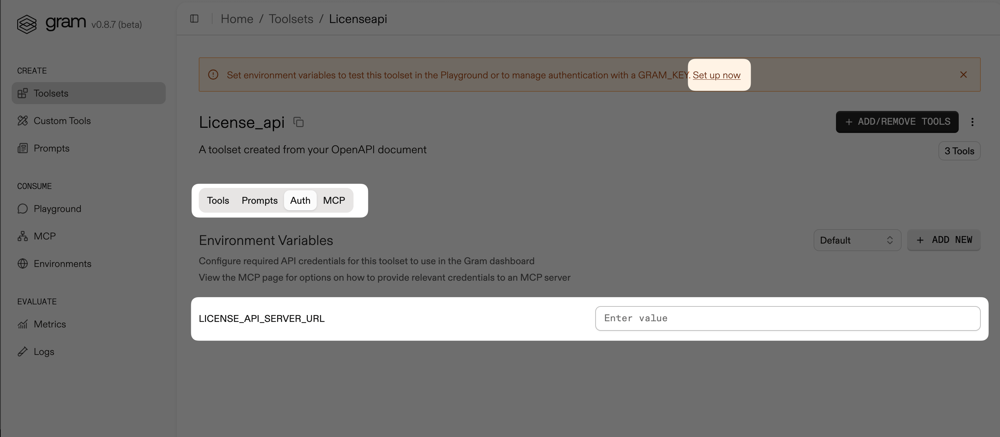

## Introduction

Customer service workflows break down when teams coordinate across multiple systems. Agents might qualify leads in HubSpot, discuss approvals in Slack, and then switch to an internal license system to provision access. Each context switch slows response times and introduces errors.

Building an internal dashboard means weeks of development, UX research, and ongoing maintenance. Often this process - building API integrations, designing interfaces, handling authentication, deploying infrastructure, and training the customer service team to use another tool - adds technical debt instead of reducing complexity.

There's a simpler approach: Build an MCP server in a few hours, connect it to your existing API, and let your customer service team work through LLM conversations instead. If you already have an API with an OpenAPI document, Gram can have your MCP server ready in minutes.

This guide demonstrates complete customer service automation using three MCP servers: a HubSpot MCP server for lead data, a Slack MCP server for team communication, and an internal Gram-hosted License MCP server.

## What are we building?

We're building a customer service workflow that connects HubSpot, Slack, and an internal License API through MCP servers. Customer service agents will identify qualified leads in HubSpot, check team discussions in Slack, and then create licenses in the internal system, all through Claude conversations.

We're technically building one MCP server. We'll use the official [HubSpot MCP server](https://developers.hubspot.com/mcp) and the existing [slack-mcp-server](https://github.com/korotovsky/slack-mcp-server) package. We only need to create and host the MCP server for the internal License API, which we'll do on Gram.

The goal here is to allow customer service agents to use Claude to distribute licenses for successful leads.


You can replace the License API with your inventory system, user provisioning service, or any internal tool that has an API and OpenAPI specification.

## Prerequisites

For this guide, you need:

- Python 3.11 or higher, with uv installed on your machine
- A [Gram account](https://getgram.ai)
- The ngrok agent CLI
- The Slack and HubSpot MCP servers installed in Claude Desktop

Follow the quickstart guides to install the MCP servers:

- [Using Slack with MCP](/mcp/using-mcp/mcp-server-providers/slack)
- [Using HubSpot with MCP](/mcp/using-mcp/mcp-server-providers/hubspot)

## Gram concepts

Before building an MCP server with Gram, you need to understand these core components.

### Toolsets

Tools are functions that LLMs can call to execute actions like reading files, making API requests, or querying databases. MCP standardizes how LLMs access different tools. Instead of developers having to write custom integrations for each service, it provides a standardized interface that agents can use to access tools.

When you upload an OpenAPI document, Gram converts every operation into a tool definition that follows the MCP Specification. Gram then organizes tool definitions into [toolsets](https://docs.getgram.ai/concepts/toolsets), enabling specific workflows.


Giving an LLM access to too many tool definitions exhausts the context window and causes agents to choose the wrong tools. Toolsets enable you to curate only the tool definitions needed for specific tasks. You can scope separate toolsets for different teams (such as sales, marketing, and support) to ensure agents access only relevant tool definitions.

### Tool variations

OpenAPI endpoints often lack clear summaries and descriptions. When tool definitions inherit vague descriptions, LLMs struggle to understand when and how to invoke tools properly.

Gram provides a [tool variations](https://docs.getgram.ai/concepts/tool-variations) feature for improving tool descriptions. You can edit tool names and descriptions to enhance LLM understanding. This is prompt engineering for your API tool definitions.

## Create the License MCP server

We'll create an MCP server for the Taskmaster License API. This represents any internal service with an OpenAPI specification that you want to connect to Claude.

### Install and run the Taskmaster License API

First, clone the project.

```bash
git clone https://github.com/speakeasy-api/examples.git
```

Navigate to the Taskmaster License API project.

```
cd license-api
```

Then run the following command to install dependencies, and once it's done, run the server.

```
chmod +x setup.sh
./setup.sh
```

The project should be running at http://127.0.0.1:8000.

### Create the MCP server on Gram

You have two options for creating MCP servers:

- Code the server yourself using MCP SDKs, TypeScript, or FastMCP.
- Use a solution like Speakeasy to generate an MCP server.

Both options require managing infrastructure: monitoring, scaling, and tracking usage. Instead of building, you end up maintaining. Gram eliminates this overhead by generating MCP servers from OpenAPI documents.

### Upload an API source document

Let's create the MCP server on Gram by adding an API source first. On the Gram dashboard, navigate to the **Toolsets** page and click on the **+ Add API** button.


In the **New OpenAPI Source** dialog, you need to upload an OpenAPI document and name the API. The License API project contains OpenAPI files in both JSON and YAML formats. Upload the YAML file and name it `License API`. Gram will convert each API operation into a tool definition.


Click **Continue** to close the modal. You will see the new **License API** listed under **API Sources**.


### Create a toolset

Click the **+ Add Toolset** button on the **Toolsets** page.


In the **Create a Toolset** dialog, enter a name such as `License`.


Then, click **Create** to open the tool selection page.

Find the API source named **License_api** and click **Enable all** to add all the tool definitions from the License API.


Return to the **Toolsets** page and select the **License** toolset. A warning appears at the top of the page with a **Set up now** link that opens the environment variables configuration page. Click on the link, or if you can't see the warning, navigate to the **Auth** tab.



The License API running locally can't be accessed from the internet. Use ngrok to create a tunnel and get a public URL for the `LICENSE_API_SERVER_URL` variable.

In your terminal, run this command to expose the local License API:

```bash
ngrok http 127.0.0.1:8000
```

Copy the forwarding URL displayed by ngrok.


Return to Gram, paste the forwarding URL into the **LICENSE_API_SERVER_URL** variable field, and **Save** the changes.


### Create a Gram key

Before adding the License MCP server configuration to `claude_desktop_config.json`, you need to create a Gram key.

In your Gram dashboard, go to **Settings** and click **New API Key**.


Copy the API key and save it somewhere safe. You need it to configure Claude Desktop in the next section.

### Install the MCP server in Claude Desktop

Still in Gram, navigate to the **MCP** tab on the **License** toolset page. Click the **Enable** button to enable MCP hosting.


Once enabled, scroll down the page. You'll see two configurations for installing the MCP server:

- **Pass-through Authentication:** Environment variables are passed directly in the MCP server configuration.
- **Managed Authentication:** Gram stores and manages environment variables.

For this guide, use **Managed Authentication**.


Open the Claude Desktop application, navigate to **Settings -> Developer**, and click **Edit Config**.


Open the `claude_desktop_config.json` file, copy the **Managed Authentication** configuration from Gram, and replace `<your-key-here>` with the value of the Gram key you created.

```json
{
  "mcpServers": {
    "GramLicense": {
      "command": "npx",
      "args": [
        "mcp-remote",
        "https://app.getgram.ai/mcp/xxxxxlu",
        "--header",
        "Gram-Environment:default",
        "--header",
        "Authorization:${GRAM_KEY}"
      ],
      "env": {
        "GRAM_KEY": "Bearer `<your-key-here>`"
      }
    }
  }
}
```

Restart Claude Desktop, open a new chat, and verify that the integration works by asking Claude to create a license for a test user.


## The complete customer service workflow

Now, your `claude_desktop_config.json` should look like this:

```json
{
  "mcpServers": {
    "GramLicense": {
      "command": "npx",
      "args": [
        "mcp-remote",
        "https://app.getgram.ai/mcp/<your-mcp-server-slug>",
        "--header",
        "Gram-Environment:default",
        "--header",
        "Authorization:${GRAM_KEY}"
      ],
      "env": {
        "GRAM_KEY": "Bearer <your-gram-api-key>"
      }
    },
    "HubspotMCP": {
      "args": ["-y", "@hubspot/mcp-server"],
      "command": "npx",
      "env": {
        "PRIVATE_APP_ACCESS_TOKEN": "your-access-token"
      }
    },
    "SlackMCPServer": {
      "command": "PATH_TO_MCP_SERVER/slack-mcp-server",
      "args": ["-transport", "stdio"],
      "env": {
        "SLACK_MCP_XOXC_TOKEN": "YOUR_XOXC_TOKEN",
        "SLACK_MCP_XOXD_TOKEN": "YOUR_XOXD_TOKEN",
        "SLACK_MCP_USERS_CACHE": "PATH_TO_MCP_SERVER/.users_cache.json",
        "SLACK_MCP_CHANNELS_CACHE": "PATH_TO_MCP_SERVER/.channels_cache.json"
      }
    }
  }
}

```

To test the complete workflow, open Claude Desktop and send the following prompt:

```txt
Hi Claude. Access the leads channel in Slack using the Slack MCP server and the leads data in HubSpot using the HubSpot MCP server.

Pull and aggregate lead information from both sources.

Analyze the data to determine which leads are qualified and considered successful.

For each successful lead, create a license for the corresponding contact using the License MCP server.

Provide a summary of which leads were processed and confirm license creation.
```

The specific response will vary based on your actual data, but you'll observe Claude:

- Pulling lead information from HubSpot, checking related discussions in Slack, and analyzing the data to determine which leads are qualified

  

- Creating licenses for qualified leads using the Taskmaster License MCP server you created

  

You can improve the prompt by including more details about:

- **Specific lead qualification criteria:** For example, *"deal value over $X"*, *"lead score above Y"*, or *"contains keywords like 'enterprise' or 'urgent'"*
- **Exact date ranges for Slack searches:** For example, *"messages from the last 7 days"* or *"since September 1st"*
- **Validation steps:** For example, checking existing licenses, verifying contact information, or confirming lead status hasn't changed

## Optimize the MCP server

In the Gram concepts section, we discussed tool curation and tool variations. Let's see how to implement both in Gram.

### Tool curation

Navigate to the License toolset page and click the **+ Add/Remove Tools** button.


The **health_check** tool can be removed since it's not used in customer service workflows. Disable it by toggling it off.


Return to the **License** toolset page. The **health_check** tool no longer appears in your toolset. This demonstrates tool curation in practice. With larger APIs that contain dozens of endpoints, you can remove irrelevant tools to improve LLM performance and reduce context window usage.

### Tool variations

You can edit tool names and descriptions to improve LLM understanding. Hover over the **create_taskmaster_license** tool name to reveal an **Edit** button.


Click **Edit** to open the editing modal. Here, you can improve the tool name, but the description is more important for LLM guidance. Hover over the description of the **create_taskmaster_license** tool.

Tool descriptions tell the LLM what tools do and guide it through workflows. Here's the current description for **create_taskmaster_license**:

```txt
<context>
  This tool creates a new Taskmaster software license in the system. Requires a unique
  Taskmaster license key and name. Useful for adding new Taskmaster licenses to the system.
</context>

<prerequisites>
  - Taskmaster license key must be unique across all licenses
  - Name is required and should be descriptive
  - Description is optional but recommended
  - Taskmaster license will be active by default unless specified otherwise
</prerequisites>
```

The XML structure in tool descriptions helps LLMs parse information systematically. The `<context>` section explains the tool's purpose, while `<prerequisites>` provides specific conditions the LLM should verify before execution. This structured format makes it easier for LLMs to understand not just what the tool does, but when and how to use it appropriately.

You need to specify in the description what the LLM should make sure of before creating licenses. Add this bullet under `<prerequisites>`.

```txt
- Before creating a license, check for leads in Slack and HubSpot first.
```

This addition ensures Claude validates lead information before creating licenses, demonstrating how tool variations customize the MCP experience for your specific workflows.

## Final thoughts

You've built a customer service workflow that connects HubSpot, Slack, and an internal License API through MCP servers. Gram hosted the internal API integration without requiring infrastructure management or custom MCP server code.

The Taskmaster License API can represent any internal service with an OpenAPI document. You can replace it with your existing systems to create workflows for:

- **User provisioning:** Combine Slack approvals with HubSpot lead data to automatically create user accounts in your SaaS platform.
- **Inventory management:** Use customer requests from support tickets and sales data to trigger inventory updates or purchase orders.
- **Financial reporting:** Aggregate data from your CRM, communication tools, and internal billing systems for automated revenue reporting.
