This guide shows you how to connect your Google Sheet data to Claude Desktop using the Model Context Protocol (MCP). Once connected, you can create a document, list documents, edit the spreadsheet, and manipulate columns and rows. 

With this setup, you can ask Claude "summarize the Q3 financial report" or "add a row for John's $15K sale" without switching to Google Sheets. You stay in one interface instead of opening multiple tabs.

<video src="./assets/demo.mp4" controls=""></video>

## Prerequisites

- A [Google Cloud](https://cloud.google.com) account.

- An MCP client like [Claude Destkop](https://claude.ai/download).
- [uv](https://docs.astral.sh/uv/getting-started/installation/) Python package manager is installed on your machine.

## Setting up Google Cloud configuration

Google doesn't provide an official MCP server. You'll use [mcp-google-sheets](https://github.com/xing5/mcp-google-sheets), an open-source server that connects Claude to Google Spreadsheets.

This server requires Google Cloud credentials, specifically an OAuth configuration JSON file with necessary permissions configured.

### Enabling OAuth

On the GCP console, navigate to **APIs & Services** -> **OAuth consent screen**. 

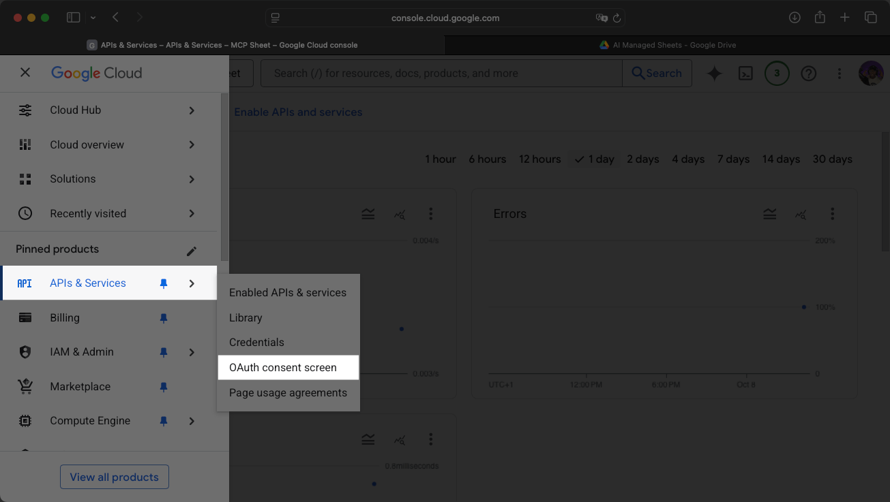

Click **Get started**, enter `MCP Sheets` as the application name, and select an email address.

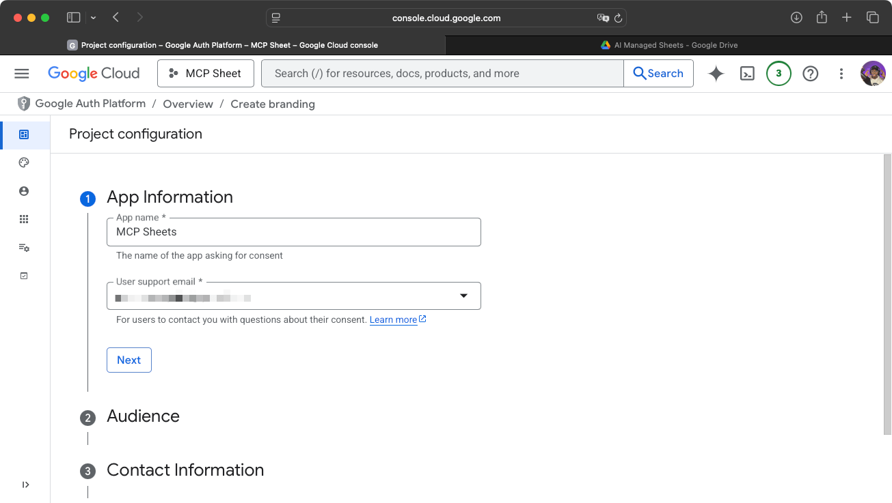

Select **External** for the the Audience.

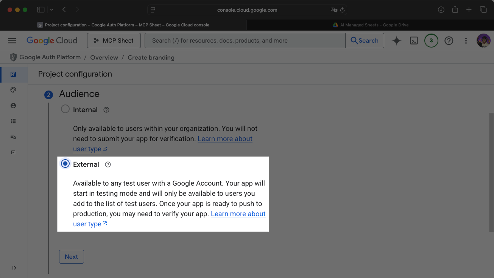

> **Note:** Add your email address to the test users list. Without this, authentication will fail when you connect Claude Desktop.

Create the project and navigate to the **Data access** page. 

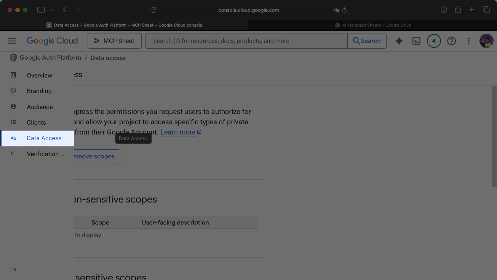

Click on **Add or remove scopes** and add the following scopes: 

- **.../auth/spreadsheets**
- **.../auth/drive**

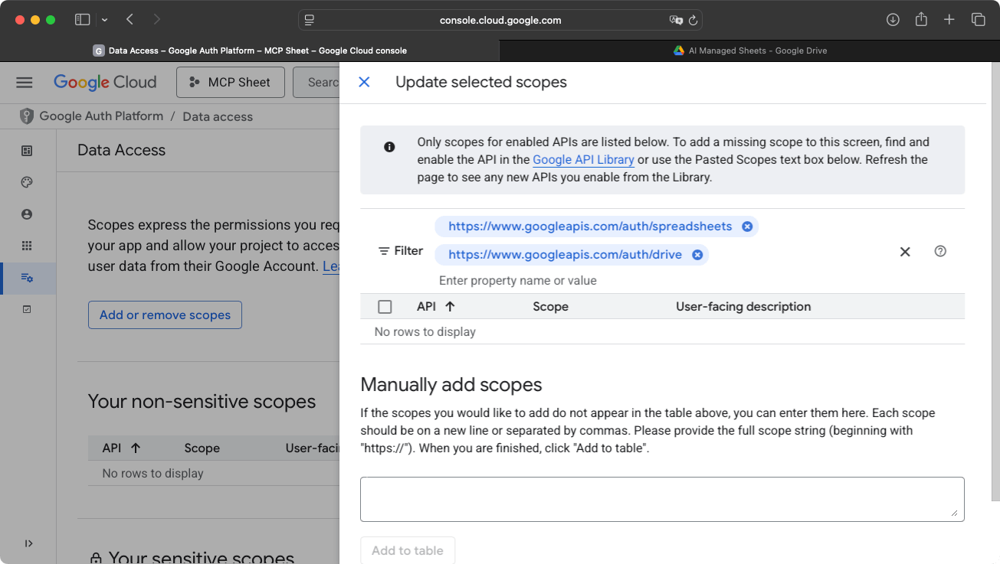

Save the page to validate the changes.

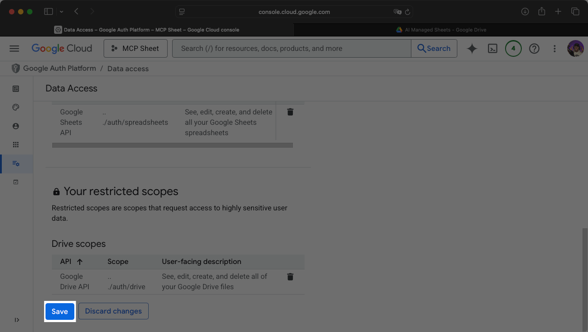

### Adding OAuth credentials

In the GCP console, navigate to **APIs & Services** -> **Credentials**.

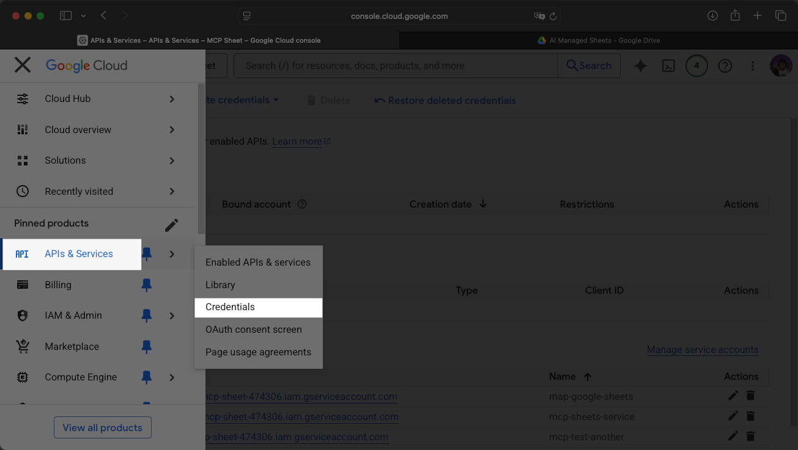

Click the **+ Create credentials** then the **Oauth client ID** option.

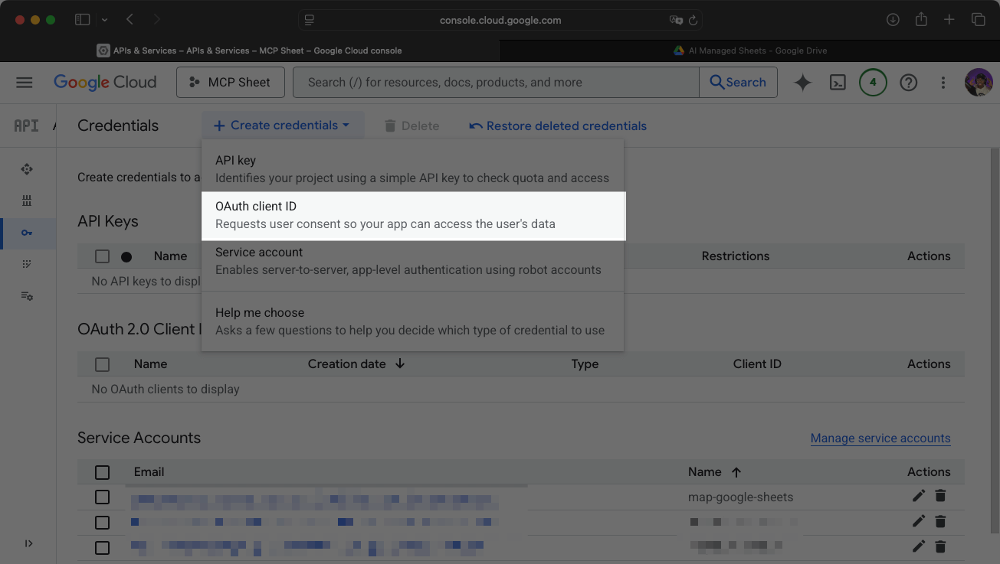

Select Desktop app for Application type and name it **MCP Sheet Desktop App**.

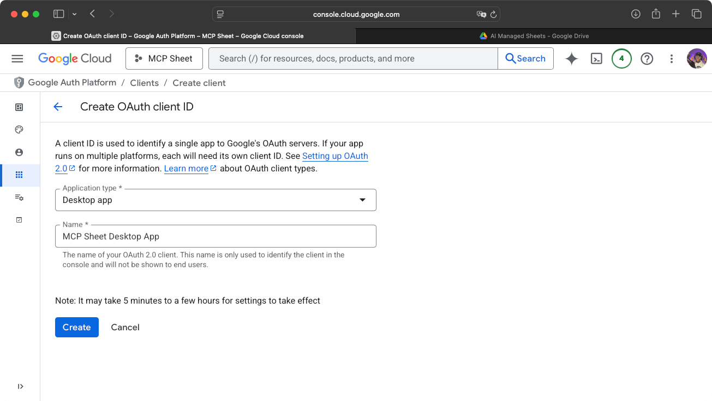

Create the OAuth client and download the JSON file.

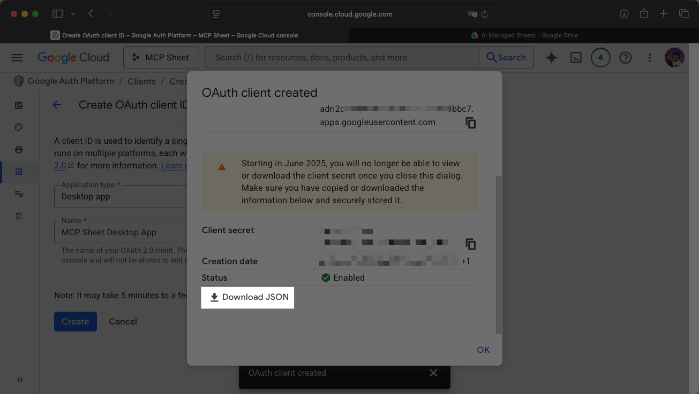

## Adding the MCP Google Sheets server in Claude Desktop

Now update your Claude Desktop configuration to include the MCP server.

In **Settings**, go to **Developer** > **Edit Config**.

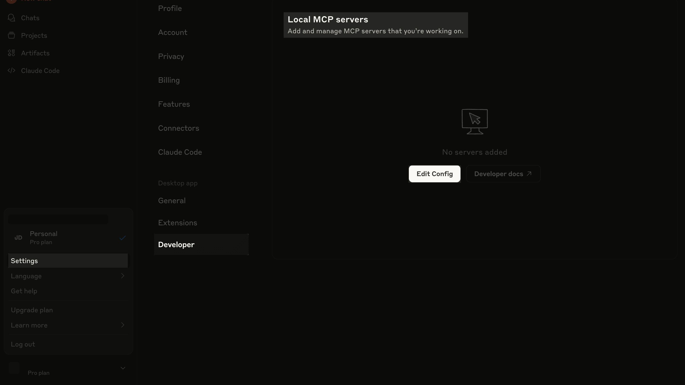

In the `claude_desktop_config.json` file, add this configuration:

```json
{
  "mcpServers": {
    "google-sheets": {
      "command": "uvx",
      "args": ["mcp-google-sheets@latest"],
      "env": {
        "CREDENTIALS_PATH": "/path/to/your/credentials.json",
        "TOKEN_PATH": "/path/to/your/token.json"
      }
    }
  }
}
```

Replace `CREDENTIALS_PATH` with the path to your downloaded OAuth credentials. Replace `TOKEN_PATH` with the absolute path where the token will be stored. The token can be in the same directory as the credentials file.

Reload Claude Desktop. You'll be redirected to a login page. Validate and select all services for MCP Auth access.

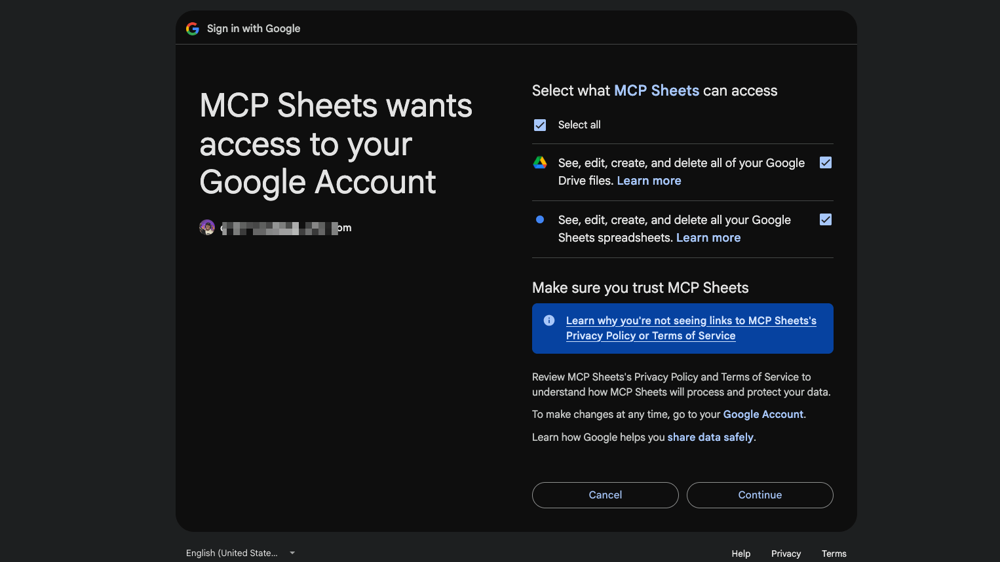

## Testing the connection

In Claude Desktop, start a new chat. Click **Search and tools** to see the MCP Google Sheets server listed. Enable all tools if they're disabled.

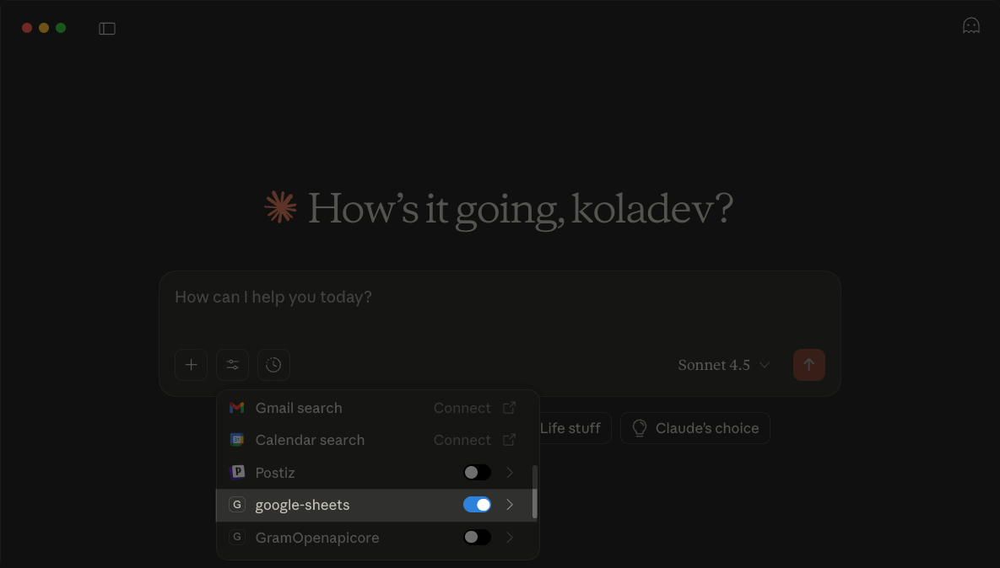

Ask Claude to create a new spreadsheet with a template for an annual user growth report.

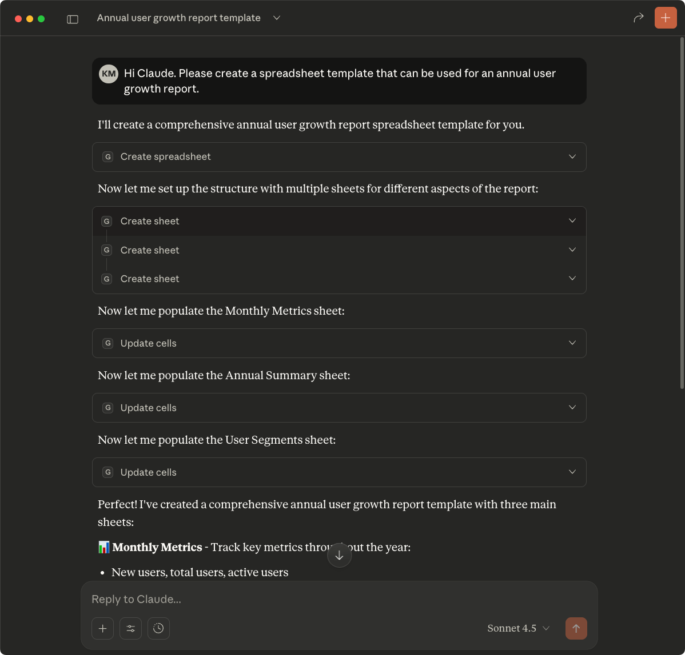

## Conclusion

Claude can now create and update Google spreadsheets through natural language. Explore other MCP servers in the [official MCP servers repository](https://github.com/modelcontextprotocol/servers) to connect more tools.