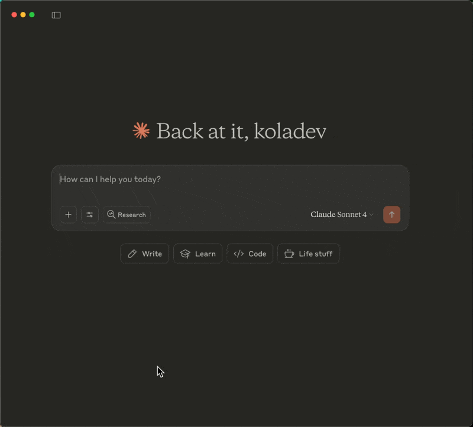

# Using HubSpot with MCP quick start guide

If you're in sales or customer management, you know the pain of switching between HubSpot and other tools to manage your pipeline. The HubSpot MCP server lets you connect your CRM directly to Claude Desktop, so you can analyze deals, update contacts, and manage your sales pipeline using natural language commands.


In this guide, you will learn how to install the official HubSpot MCP in Claude Desktop.



## Prerequisites

For this guide, you will need: 

- **[Claude Desktop](https://claude.ai/download)** – For the MCP-powered workflow interface.
- A HubSpot account with admin access.

## Install the HubSpot MCP Server in Claude Desktop 

The HubSpot MCP Server allows AI assistants like Claude to connect and interact with HubSpot data in real-time. 

You need to create a HubSpot private application, assign scopes for the actions Claude will execute, and get an API key before you add the HubSpot MCP Server to Claude Desktop.

Follow these steps to create a private application.

On the HubSpot dashboard, click the settings icon in the top navigation bar. 


In your HubSpot account settings, go to **Integrations -> Private Apps** and click **Create a private app**.


Enter a name for the application.


Navigate to the **Scopes** tab and add the following scopes:

- `crm.lists.read` and `crm.lists.write` 
- `crm.objects.companies.read` 
- `crm.objects.contacts.read` and `crm.objects.contacts.write`
- `crm.objects.deals.read` and `crm.objects.deals.write` 
- `crm.objects.appointments.read` and `crm.objects.appointments.write`
- `crm.objects.leads.read` and `crm.objects.leads.write` 
- `crm.objects.custom.read` and `crm.objects.custom.write` 


You can add as many scopes as you want Claude Desktop to be able to do a lot of things.

Click **Create app** in the top-right corner and validate the creation. 

In the modal that opens, copy the API key and store it safely. You'll use this key when you add the MCP server to Claude Desktop.


### Add the HubSpot MCP Server to Claude Desktop

Add the HubSpot MCP Server configuration to `claude_desktop_config.json`:

```json
{
  "mcpServers": {
    "HubspotMCP": {
      "command": "npx",
      "args": ["-y", "@hubspot/mcp-server"],
      "env": {
        "PRIVATE_APP_ACCESS_TOKEN": "YOUR_HUBSPOT_KEY"
      }
    }
  }
}
```

Replace `YOUR_HUBSPOT_KEY` with the API key you copied from HubSpot.

Restart Claude Desktop to load the server.

## Test the integration 

Open Claude Desktop and start a new chat. Click the settings button to verify the HubSpot MCP server appears in the list. Enable all tools if they're disabled.


Ask Claude to use the HubSpot MCP server to list the current contacts in your HubSpot application.


## Conclusion

You've connected HubSpot to Claude Desktop. Claude can now read your contacts, deals, and companies, plus update records when you have write permissions enabled.

To expand capabilities, add more scopes to your private app for features like custom objects, or advanced reporting.