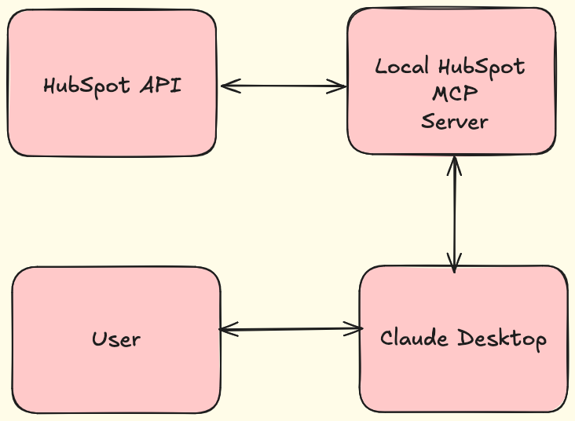
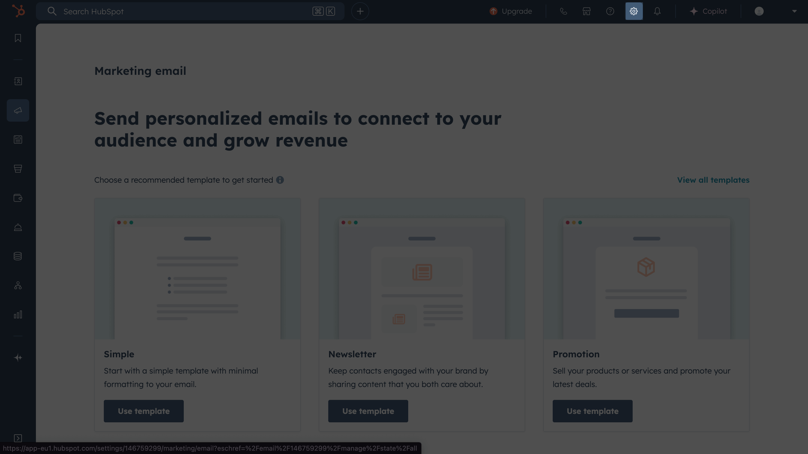
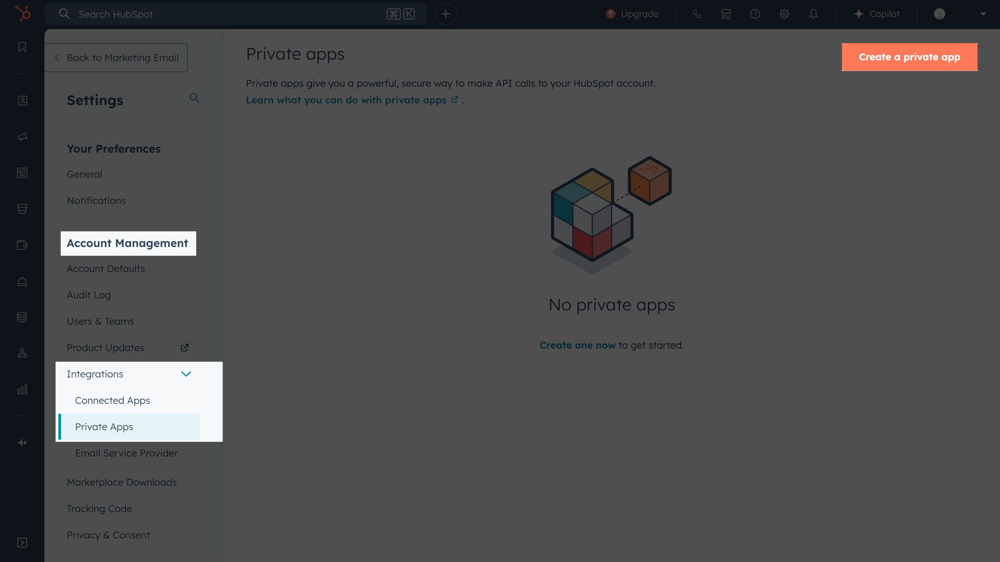
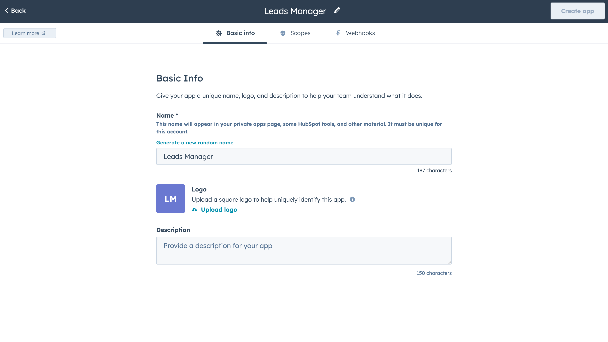
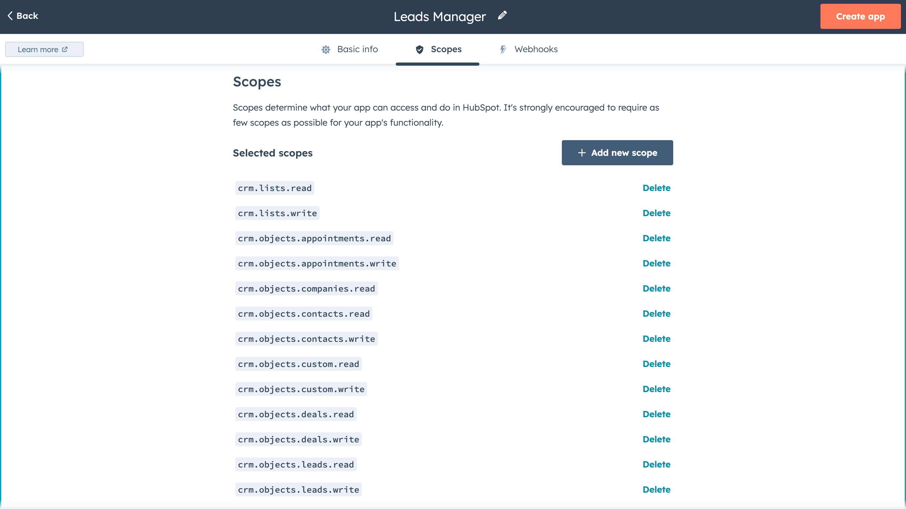
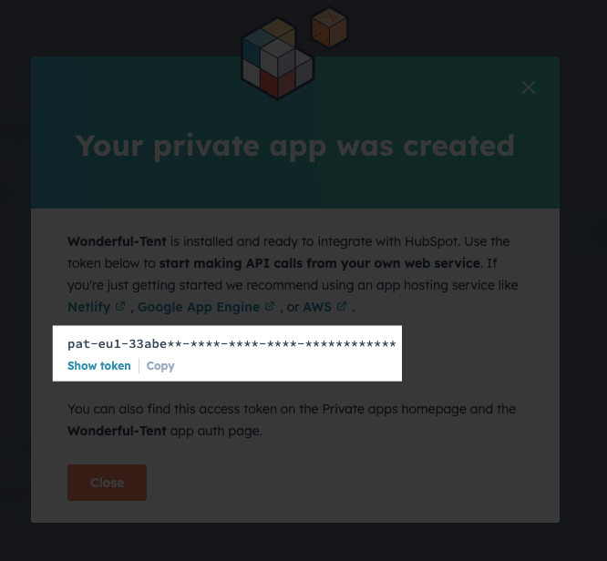
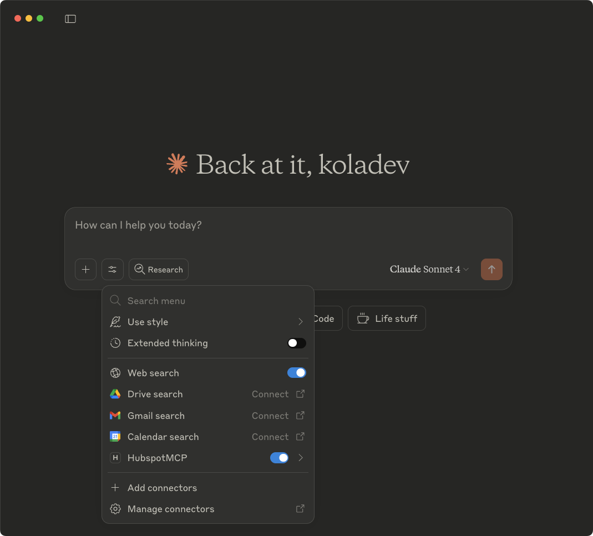
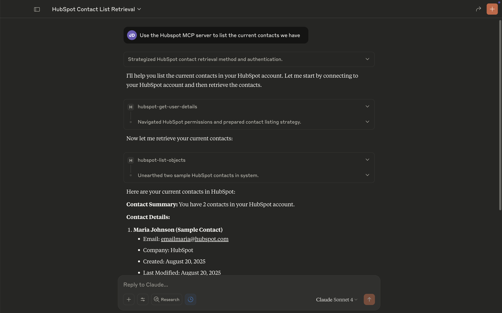

# Using HubSpot with MCP quick start guide

Managing customer relationships often means juggling between HubSpot and multiple other tools, breaking your workflow and slowing down sales processes. The HubSpot Model Context Protocol (MCP) server eliminates this friction by connecting your CRM directly to Claude Desktop, enabling you to analyze deals, update contacts, and manage your sales pipeline through natural language conversations.



This integration transforms how sales teams work with their CRM data. Instead of navigating through HubSpot's interface, you can ask Claude to "show me all deals in the negotiation stage" or "update the contact information for John Smith" and get immediate results.

In this guide, you'll learn how to set up the official HubSpot MCP server with Claude Desktop to unlock AI-powered CRM workflows.


## Prerequisites

For this guide, you will need:

- [Claude Desktop](https://claude.ai/download) – For the MCP-powered workflow interface.
- A [HubSpot account](https://www.hubspot.com) with admin access.

## Set up the HubSpot MCP server

The HubSpot MCP server enables real-time integration between Claude and your HubSpot CRM data.

Before connecting Claude to your CRM, you'll create a HubSpot private application with the necessary permissions and generate an API key for secure access.

### Create a HubSpot private application

On the HubSpot dashboard, click the settings icon in the top navigation bar.



In your HubSpot account settings, go to **Integrations -> Private Apps** and click **Create a private app**.



Enter a name for the application.



Navigate to the **Scopes** tab and add the following scopes:

- `crm.lists.read` and `crm.lists.write`
- `crm.objects.companies.read`
- `crm.objects.contacts.read` and `crm.objects.contacts.write`
- `crm.objects.deals.read` and `crm.objects.deals.write`
- `crm.objects.appointments.read` and `crm.objects.appointments.write`
- `crm.objects.leads.read` and `crm.objects.leads.write`
- `crm.objects.custom.read` and `crm.objects.custom.write`



Add additional scopes based on the specific HubSpot features Claude needs to access in your workflow.

Click **Create app** in the top-right corner and validate the creation.

In the modal that opens, copy the API key and store it safely. You'll use this key when you add the MCP server to Claude Desktop.



### Add the HubSpot MCP Server to Claude Desktop

Next, update your Claude Desktop configuration to include the MCP server. To find and edit the `claude_desktop_config.json` file, go to **Settings** in Claude Desktop, then navigate to **Developer** > **Edit Config**.


Replace `YOUR_HUBSPOT_KEY` with the API key you copied from HubSpot:

```json
{
  "mcpServers": {
    "HubspotMCP": {
      "command": "npx",
      "args": ["-y", "@hubspot/mcp-server"],
      "env": {
        "PRIVATE_APP_ACCESS_TOKEN": "YOUR_HUBSPOT_KEY"
      }
    }
  }
}
```

Replace `YOUR_HUBSPOT_KEY` with the API key you copied from HubSpot.

Restart Claude Desktop to load the server.

## Test the integration

Open Claude Desktop and start a new chat. Click the **Search and tools** button to verify the HubSpot MCP server appears in the list. Enable all tools if they're disabled.



Ask Claude to use the HubSpot MCP server to list the current contacts in your HubSpot application.



## Conclusion

The HubSpot MCP integration transforms your CRM workflow by bringing AI-powered assistance directly into your sales process. Claude can now access and update your HubSpot data through natural language conversations.

### Next steps

**Expand integration capabilities:**
- Add more scopes to your private app for custom objects, advanced reporting, or marketing tools
- Explore additional MCP servers from the [official MCP servers repository](https://github.com/modelcontextprotocol/servers) to connect other tools in your sales stack

**Optimize your workflow:**
- Create [custom slash commands](https://docs.anthropic.com/en/docs/claude-code/tutorials) for common queries like pipeline analysis or contact updates
- Set up regular data reviews using Claude's analytical capabilities
- Train your team on natural language commands for faster CRM interactions

**Learn more about MCP:**
- Explore the [Model Context Protocol documentation](https://docs.anthropic.com/en/docs/mcp) to understand advanced integration patterns
- Check the [HubSpot MCP server package documentation](https://www.npmjs.com/package/@hubspot/mcp-server) for additional configuration options and troubleshooting