Picture this: Someone forgot their password and submits a HubSpot ticket to have it reset. Your IT team starts working on it in Slack. Meanwhile, the person who submitted the ticket has no idea what's happening. They just want to know whether anyone is working on resetting their password.

Right now, they'd have to log into HubSpot, find their ticket, decipher the status updates, and maybe check if there's any chatter in Slack. Most people don't bother; they just call IT and ask the same question over and over again.

What if they could just say, "Hey, what's the status of my password reset request?" and get an instant, spoken answer? Better yet, what if that same voice agent could post updates to your IT team's Slack channel?

<video
  controls={true}
  autoPlay={true}
  muted={true}
  loop={true}
  width="100%"
  className="mt-4 mb-4">
  <source src="./assets/realtime-agent-demo.mp4" type="video/mp4" />
</video>

In this guide, we demonstrate how to set up an IT helpdesk AI agent by first creating a Tech Support MCP server, then connecting it to a Realtime voice agent. We'll teach you to:

- Enable Gram's prebuilt Slack MCP tools
- Create HubSpot Tickets MCP tools by uploading a custom OpenAPI document
- Combine selected HubSpot Tickets and Slack tools into a curated Tech Support toolset
- Host the Tech Support toolset as an MCP server


## What are we building?

AI agents can chat, but how do you give one the ability to check HubSpot tickets or post Slack messages? That's exactly the question the Model Context Protocol (MCP) answers.

We'll use MCP to create a toolset that connects an AI voice agent to your existing helpdesk systems. Instead of the agent just talking about tickets, it can actually look them up, check their statuses, and even coordinate with your team through Slack.

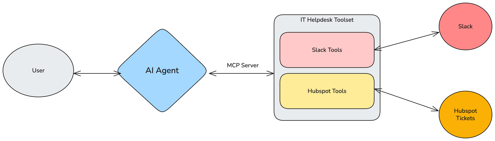

For the purposes of the guide, we've used the OpenAI [Realtime Agent SDK](https://platform.openai.com/docs/guides/voice-agents?voice-agent-architecture=speech-to-speech) to create an IT helpdesk voice agent, which you can access in the
[demo app](https://github.com/ritza-co/taskmaster-realtime-agent-demo).

We'll use Gram to curate the perfect set of MCP tools from HubSpot and Slack APIs and to host that toolset as a single MCP server. By connecting to this server, the voice agent gains real-world capabilities, not just conversational ones.

### What is Gram?

[Gram](https://gram.ai) allows you to convert APIs into MCP tools and host them as MCP servers. Instead of building your own MCP servers from scratch, you can upload OpenAPI documentation to Gram, and it automatically generates MCP-compatible tools that AI agents can call. You can then curate these tools into focused toolsets for specific use cases.

In this case, instead of exposing HubSpot's entire CRM API to the IT helpdesk agent, you can create a toolset with just the ticket-related operations you need. Let's take this a step further: Supposing you also want the agent to access Slack to check on the team responsible for addressing tickets, you can **curate** a custom toolset with both the Slack tools and the HubSpot tools that the agent needs to call.

Gram has a few key concepts that we explored in this use case:

- **Tool curation:** Curating focused toolsets from multiple APIs without exposing unnecessary endpoints keeps your agents efficient and reduces errors.
- **Hosted MCP servers:** Using Gram to host your toolsets as MCP servers means you don't need to manage server infrastructure or handle MCP details.
- **Tool refinement:** Customizing your tool names and descriptions allows you to give your AI agent better context about when and how to use each tool.

## Prerequisites

To follow this guide, you need:

- Node.js 18+ (for the Realtime agent app)
- An OpenAI API key (for accessing Realtime + Responses)
- A Gram account
- HubSpot Private App token (for accessing service tickets)
- Slack Web API credentials (for example, using a bot or user token) to post messages via `chat.postMessage`

If you want to add an internal API, you also need:

- Python 3.11+
  - uv installed on your machine (for local API samples)

## Create a Tech Support MCP server

Before we can set up the IT helpdesk AI agent, we first need to create the Tech Support MCP server for it to connect to.

In this section, we'll use Gram to:

- Enable prebuilt Slack MCP tools
- Create HubSpot Tickets MCP tools by uploading a custom OpenAPI document
- Combine selected HubSpot Tickets and Slack tools into a curated Tech Support toolset
- Host the Tech Support toolset as an MCP server

## Upload the HubSpot Tickets OpenAPI document to Gram

We'll use an altered version of the HubSpot API for fetching ticket details because the [official HubSpot OpenAPI spec](https://developers.hubspot.com/docs/api/crm/tickets) requires modification before it can be used with token-based authentication in Gram.

First, upload the [modified HubSpot OpenAPI document](https://github.com/ritza-co/taskmaster-realtime-agent-demo/blob/main/openapi/custom-hubspot-openapi.json) and name it `HubSpot Tickets`.

**Important:** Ensure the name `HubSpot Tickets` is spelled correctly, as this affects the environment variable naming convention. The server name gets converted to `HUBSPOT_TICKETS_BEARER_AUTH` in the environment variables.

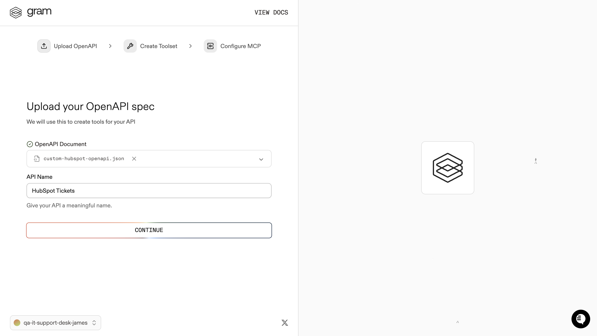

When you complete the upload process, Gram converts the endpoints to MCP tool definitions.

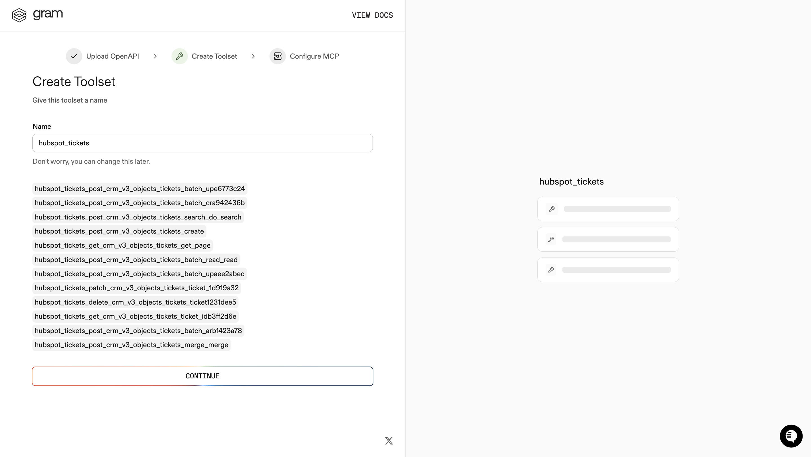

At this point, all the HubSpot Tickets tools are available but they aren't yet enabled for specific use cases.

For more information on creating a toolset using Gram, refer to the Gram [quickstart guide](https://docs.getgram.ai/gram-quickstart).

### Enable Slack integration

Instead of uploading the Slack OpenAPI document, we'll use Gram's prebuilt Slack integration, which provides a curated set of Slack tools.

Navigate to `https://app.getgram.ai/<your-org>/<your-project>/integrations` and enable the Slack integration:

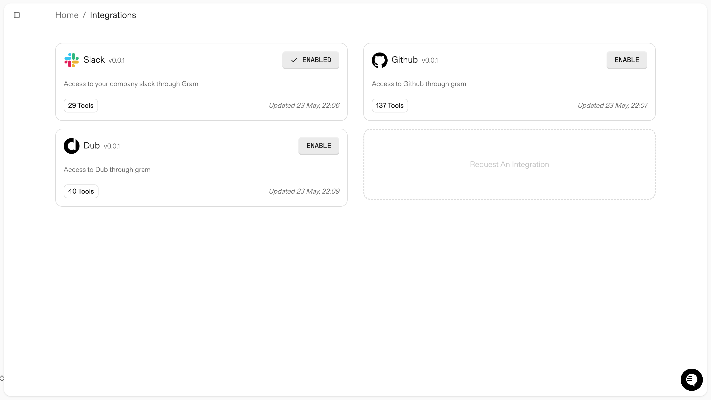

This gives you access to essential Slack tools, like `chat.postMessage`, without needing to manage your own OpenAPI document.

### Create a curated Tech Support toolset

Next, we'll combine only the essential HubSpot and Slack tools in a single, curated toolset. This focused approach [reduces tool explosion and improves LLM efficiency](/mcp/building-servers/less-is-more).

Go to **Toolsets** and click the **+ Add Toolset** button.

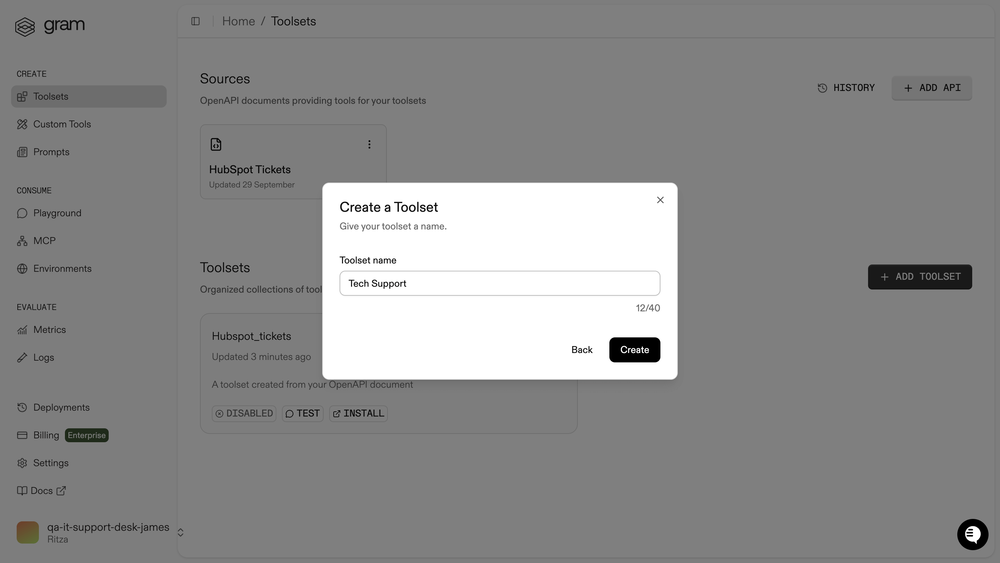

Name the toolset `Tech Support` and click **Create**.

When curating your **Tech Support** toolset, select just the tools needed for your specific use case.

From **HubSpot Tickets**, enable only:

- **`get_crm_v3_objects_tickets_ticket_idb3ff2d6e`:** For getting tickets by ID
- **`post_crm_v3_objects_tickets_search_do_search`:** For finding tickets by contact email
- **`get_crm_v3_objects_tickets_get_page`:** For reading the status, assignee, and summary fields

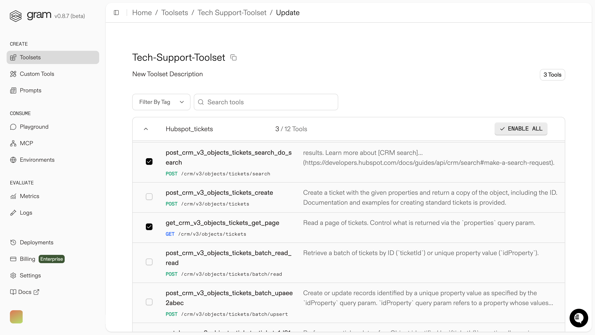

From **Slack**, enable only:

- **`conversations_list`:** For fetching conversations
- **`conversations_info`:** For fetching conversations by ID (for example, for getting a full thread)
- **`chat.postMessage`:** For posting messages to the channel and sending DMs

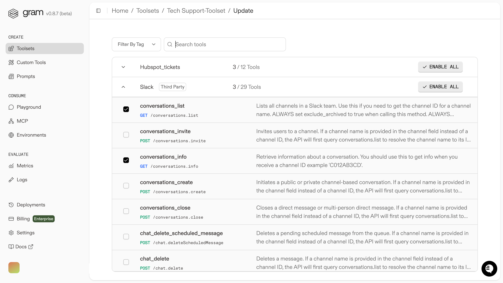

Leave all other tools disabled to keep your agent focused.

Configure authentication for both HubSpot and Slack by setting up the environment variables in the Gram UI:

- Navigate to **Environments** in the sidebar.
- Enter the **Default** environment.
- Open the three-dot menu next to the **Add Variable** button, in the top right.
- Click **Fill for toolset**.
- Select the **Tech Support** toolset from the dropdown.
- Click **Fill variables**.
- Populate the following variables with your actual keys:

   - **`HUBSPOT_TICKETS_BEARER_AUTH`:** Enter your HubSpot Private App token
   - **`HUBSPOT_TICKETS_SERVER_URL`:** Enter `https://api.hubapi.com`.
   - **`SLACK_SERVER_URL`:** Enter `https://slack.com/api`.
   - **`SLACK_TOKEN`:** Enter your Slack Bot User OAuth token.

- Click **Save**.

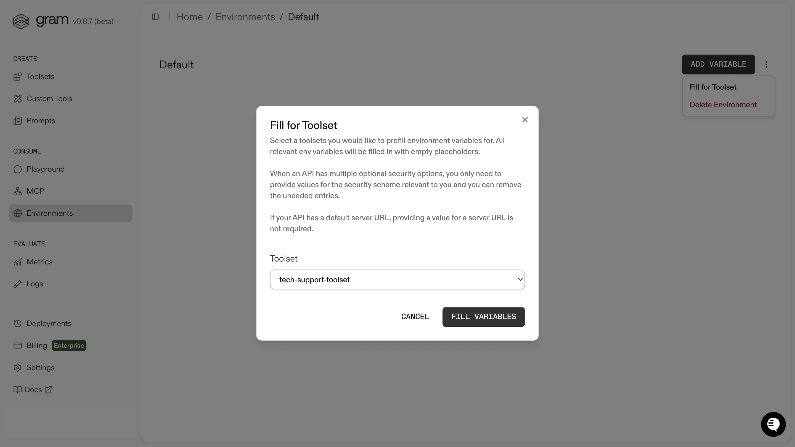

### Enable MCP hosting for the toolset

Navigate to the **MCP** tab on the **Tech Support** toolset page. Click the **Enable** button to enable MCP hosting.

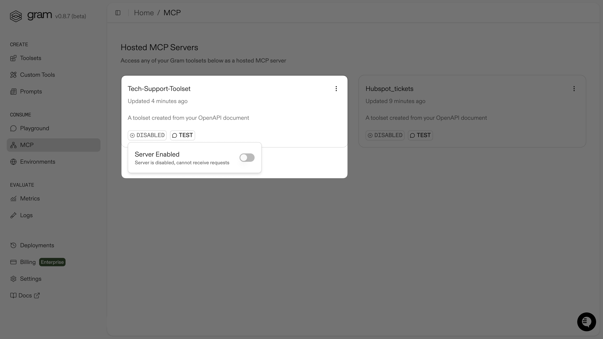

Make the server public by clicking the **Public** button and toggling the **Server Privacy** to public.

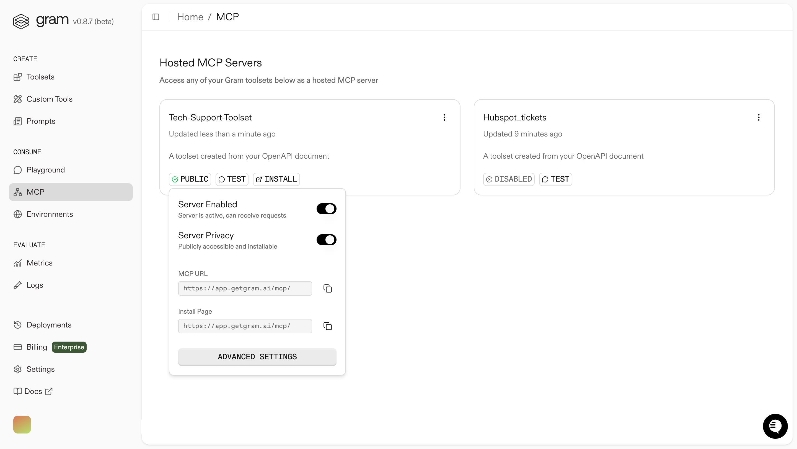

Save the MCP server endpoint for later by clicking on your MCP server and copying the **Hosted URL** from the **MCP Details** page:

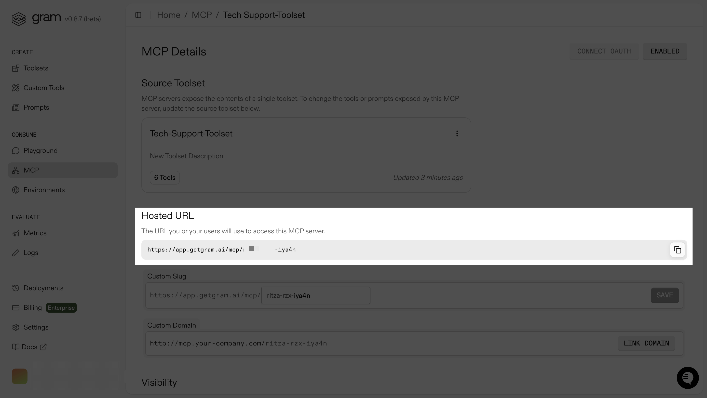

## Set up an IT helpdesk AI agent

The [Realtime voice agent demo](https://github.com/ritza-co/taskmaster-realtime-agent-demo) uses the OpenAI [Realtime Agent SDK](https://platform.openai.com/docs/guides/voice-agents?voice-agent-architecture=speech-to-speech) to handle both voice interaction and tool calling directly.

When you speak to the agent, it can provide:

- **Direct tool calls:** It calls your Gram-hosted MCP tools (the Tech Support MCP server) directly and relays the results in conversational language.
- **Voice responses:** It converts tool results to natural speech in real time.
- **Conversational flow:** It maintains natural conversation while executing complex workflows.

Altogether, this gives you seamless voice-to-tool integration without needing separate APIs for different functions.

### Set up the Realtime voice agent app

The Realtime agent app allows you to connect to your Gram-hosted MCP toolset through an MCP JSON configuration. The app reads remote MCP servers from this JSON and passes them to the model. Let's set it up.

Clone the [demo repository](https://github.com/ritza-co/taskmaster-realtime-agent-demo):

```bash
git clone https://github.com/ritza-co/taskmaster-realtime-agent-demo
cd taskmaster-realtime-agent-demo
```

Install the dependencies:

```bash
npm install
```

Set your OpenAI API key:

```bash
cp .env.sample .env
# edit .env and set OPENAI_API_KEY=sk-...
```

Start the app:

```bash
npm run dev
```

Open the app by navigating to http://localhost:3000 in your browser.

### Connect the Tech Support MCP server to the Realtime voice agent

Now, let's add the MCP JSON configuration to the app.

In the **Realtime Agent Demo** app, navigate to the **Settings** page and paste the following code in the **Remote MCP Configuration** field:

```json
{
  "mcpServers": {
    "GramTechsupporttoolset": {
      "command": "npx",
      "args": [
        "mcp-remote",
        "https://app.getgram.ai/mcp/<your-gram-it-helpdesk-endpoint>",
        "--header",
        "MCP-SLACK-TOKEN:<your-slack-bot-token>",
        "--header",
        "MCP-HUBSPOT-TICKETS-BEARER-AUTH:<your-hubspot-private-app-token>"
      ]
    }
  }
}
```

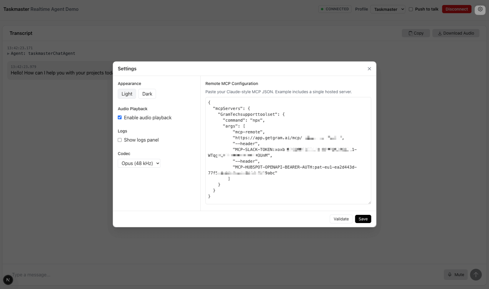

Replace the placeholders with your actual tokens and endpoint.

If you want to, enable **Logs** and pick a **Codec** (Opus is the default and PCMU/PCMA simulates PSTN). Otherwise, leave the settings as is.

Click **Save**.

### Try it with voice

You can replicate the following trial or create a similar scenario to test your Realtime voice agent.

To test the the IT helpdesk voice agent, we set up a sample ticket in HubSpot with a password reset request:

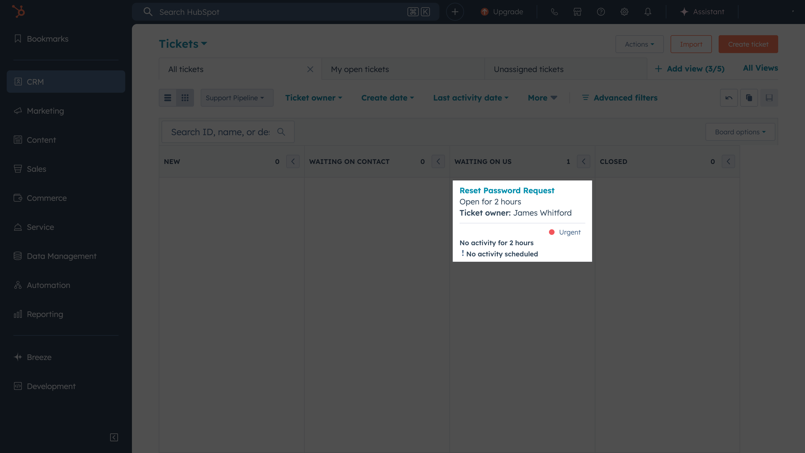

We also set up a channel called `#it-support` in Slack, where the IT support team was discussing the ticket:

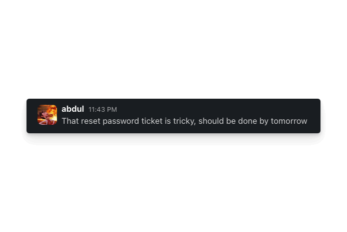

Then, we connected to the agent and asked it to check the status of the ticket:

<video
  controls={true}
  autoPlay={true}
  muted={true}
  loop={true}
  width="100%"
  className="mt-4 mb-4">
  <source src="./assets/realtime-agent-demo.mp4" type="video/mp4" />
</video>

Awesome! We could see that the IT support team was working on our ticket and the IT helpdesk agent had also posted a follow up message in the `#it-support` channel:

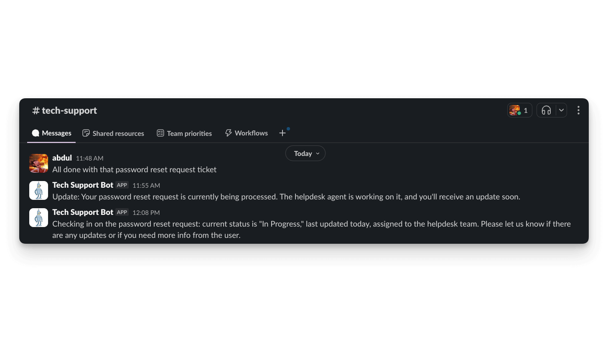

## What's next?

Pretty cool, right? You just built a voice agent that can check HubSpot tickets and post Slack updates without breaking a sweat. No more digging through support portals or playing phone tag with IT.

The real power here is in the curation. Instead of dumping every possible API endpoint into your agent, you picked exactly what you needed. This makes it actually useful, not just impressive.

You can use the same approach for other IT workflows too. You could extend the agent's capabilities so that it can:

- Add password resets from your identity provider
- Let people request software licenses through voice chats
- Handle phone calls and "hand off" to a human agent if needed

Your helpdesk just got a lot more helpful.

## Further reading

- [Gram](https://getgram.ai)
- [The OpenAI Realtime Agent SDK](https://platform.openai.com/docs/guides/voice-agents?voice-agent-architecture=speech-to-speech)
- [Tool curation: Why less is more for MCP](/mcp/building-servers/less-is-more)
- [Advanced tool curation with Gram](https://docs.getgram.ai/build-mcp/advanced-tool-curation)
