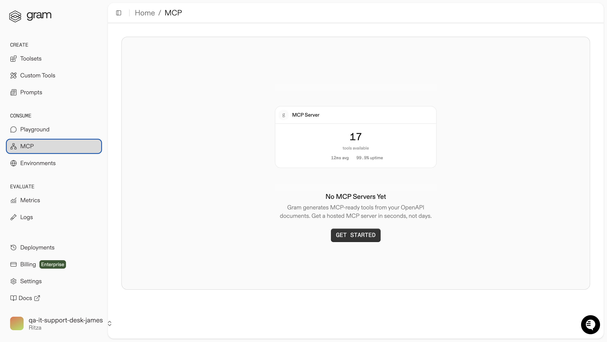

Picture this: Someone forgets their password and submits a HubSpot ticket to have it reset. Your IT team starts working on it in Slack. Meanwhile, the person who submitted the ticket has no idea what's happening. They just want to know whether anyone is working on resetting their password.

Right now, they'd have to log in to HubSpot, find their ticket, decipher the status updates, and maybe check for any chatter in Slack. Most people don't bother. Instead, they call IT and ask the same question over and over again.

What if they could just ask, "Hey, what's the status of my password reset request?" and get an instant, spoken answer? Better yet, what if the same voice agent they ask could post updates to your IT team's Slack channel?

<video
  controls={true}
  autoPlay={true}
  muted={true}
  loop={true}
  width="100%"
  className="mt-4 mb-4">
  <source src="./assets/realtime-agent-demo.mp4" type="video/mp4" />
</video>

## What are we building?

AI agents can chat, but how do you give one the ability to check HubSpot tickets or post Slack messages? That's precisely the problem the Model Context Protocol (MCP) solves.

We'll use MCP to connect an AI voice agent to your existing helpdesk systems. Instead of the agent just talking about tickets, it can actually look them up, check their statuses, and even coordinate with your team through Slack.


For the purposes of the guide, we've used the OpenAI [Realtime Agent SDK](https://platform.openai.com/docs/guides/voice-agents?voice-agent-architecture=speech-to-speech) to create an IT helpdesk voice agent, which you can access in the
[demo app](https://github.com/ritza-co/taskmaster-realtime-agent-demo).

We'll use Gram to create a curated set of MCP tools from the HubSpot API, and combine that with a standalone Slack MCP server for messaging capabilities. By connecting to both MCP servers, the voice agent gains real-world capabilities, not just conversational ones.

### What is Gram?

[Gram](https://app.getgram.ai/) allows you to convert APIs into MCP tools and host them as MCP servers. Instead of building your own MCP servers from scratch, you can upload OpenAPI documentation to Gram, and it automatically generates MCP-compatible tools that AI agents can call. You can then curate these tools into focused toolsets for specific use cases.

In this case, instead of exposing HubSpot's entire CRM API to the IT helpdesk agent, you can create a toolset with just the ticket-related operations you need. For Slack functionality, we'll use a dedicated Slack MCP server that provides messaging capabilities.

This guide demonstrates a few key MCP concepts:

- **Tool curation:** Curating focused toolsets from APIs without exposing unnecessary endpoints keeps your agents efficient and reduces errors.
- **Multiple MCP servers:** Connecting to multiple specialized MCP servers (one for HubSpot, one for Slack) allows you to combine capabilities from different sources.
- **Hosted MCP servers:** Using Gram to host your HubSpot toolset means you don't need to manage server infrastructure or handle MCP details for that integration.

## Prerequisites

To follow this guide, you need:

- Node.js 18+ (for the Realtime agent app)
- An OpenAI API key (for accessing Realtime + Responses)
- A Gram account
- HubSpot Private App token (for accessing service tickets)
- Slack authentication token (xoxp user token or xoxc/xoxd browser tokens)
- npm or npx installed for running the Slack MCP server

## Set up the MCP servers

Before we can set up the IT helpdesk AI agent, we need to configure the MCP servers it will connect to.

In this section, we'll:

- Create HubSpot Tickets MCP tools by uploading a custom OpenAPI document to Gram
- Curate a focused HubSpot Tickets toolset with only the necessary tools
- Host the HubSpot Tickets toolset as an MCP server on Gram
- Set up the standalone Slack MCP server for messaging capabilities

### Upload the HubSpot Tickets OpenAPI document

Let's create the HubSpot Tickets MCP tools. We'll use an altered version of the HubSpot API for fetching ticket details because the [official HubSpot OpenAPI spec](https://developers.hubspot.com/docs/api/crm/tickets) requires modification before it can be used with token-based authentication in Gram.

Navigate to **MCP** in the sidebar and click **Get Started**.



Upload the [modified HubSpot OpenAPI document](https://github.com/ritza-co/taskmaster-realtime-agent-demo/blob/main/openapi/custom-hubspot-openapi.json) and name it `HubSpot Tickets`.

**Important:** Ensure the name `HubSpot Tickets` is spelled correctly, as this affects the environment variable naming convention. The server name gets converted to `HUBSPOT_TICKETS_BEARER_AUTH` in the environment variables.


When you complete the upload process, Gram converts the endpoints to MCP tool definitions.


At this point, all the HubSpot Tickets tools are available, but we haven't yet enabled them for specific use cases.

For more information on creating a toolset using Gram, refer to the Gram [quickstart guide](https://docs.getgram.ai/gram-quickstart).

### Create a curated HubSpot Tickets toolset

Next, we'll create a focused toolset with only the essential HubSpot Tickets tools. This focused approach [reduces tool explosion and improves LLM efficiency](/mcp/building-servers/less-is-more).

Go to **Toolsets** and click the **+ Add Toolset** button.


Name the toolset `Tech Support` and click **Create**.

When curating your **Tech Support** toolset, select just the tools needed for your specific use case.

Enable only the following HubSpot Tickets tools:

- **`get_crm_v3_objects_tickets_ticket_idb3ff2d6e`** for getting tickets by ID
- **`post_crm_v3_objects_tickets_search_do_search`** for finding tickets by contact email
- **`get_crm_v3_objects_tickets_get_page`** for reading the status, assignee, and summary fields


Leave all other tools disabled to keep your agent focused.

Configure authentication for HubSpot by setting up the environment variables in the Gram UI:

- Navigate to **Environments** in the sidebar.
- Enter the **Default** environment.
- Open the three-dot menu next to the **Add Variable** button, in the top right.
- Click **Fill for toolset**.
- Select the **Tech Support** toolset from the dropdown.
- Click **Fill variables**.
- Populate the following variables with your actual keys:

   - **`HUBSPOT_TICKETS_BEARER_AUTH`:** Enter your HubSpot Private App token
   - **`HUBSPOT_TICKETS_SERVER_URL`:** Enter `https://api.hubapi.com`.

- Click **Save**.


### Host the Tech Support toolset as an MCP server

Navigate to the **MCP** tab on the **Tech Support** toolset page. Click the **Enable** button to enable MCP hosting.


Make the server public by clicking the **Public** button and toggling the **Server Privacy** to public.


Save the MCP server endpoint for later by clicking on your MCP server and copying the **Hosted URL** from the **MCP Details** page:


### Set up the Slack MCP server

For Slack functionality, we'll use the [slack-mcp-server](https://github.com/korotovsky/slack-mcp-server), a standalone MCP server that provides Slack messaging capabilities.

This server will run locally and connect to your Slack workspace using authentication tokens. The Realtime agent will connect to both this Slack MCP server and the Gram-hosted HubSpot MCP server.

The Slack MCP server provides essential tools for:

- Listing channels and conversations
- Posting messages to channels and threads
- Searching messages across your workspace
- Retrieving conversation history

You'll configure this server in the next section when we set up the Realtime voice agent.

## Set up an IT helpdesk AI agent

The [Realtime voice agent demo](https://github.com/ritza-co/taskmaster-realtime-agent-demo) uses the OpenAI [Realtime Agent SDK](https://platform.openai.com/docs/guides/voice-agents?voice-agent-architecture=speech-to-speech) to handle both voice interaction and tool calling directly.

When you speak to the agent, it can provide:

- **Direct tool calls:** It calls your MCP tools (from both the HubSpot and Slack MCP servers) directly and relays the results in conversational language.
- **Voice responses:** It converts tool results to natural speech in real time.
- **Conversational flow:** It maintains natural conversation while executing complex workflows.

Altogether, this gives you seamless voice-to-tool integration without needing separate APIs for different functions.

### Set up the Realtime voice agent app

The Realtime agent app allows you to connect to multiple MCP servers through an MCP JSON configuration. The app reads these MCP server configurations and passes their tools to the model. Let's set it up.

Clone the [demo repository](https://github.com/ritza-co/taskmaster-realtime-agent-demo):

```bash
git clone https://github.com/ritza-co/taskmaster-realtime-agent-demo
cd taskmaster-realtime-agent-demo
```

Install the dependencies:

```bash
npm install
```

Set your OpenAI API key:

```bash
cp .env.sample .env
# edit .env and set OPENAI_API_KEY=sk-...
```

Start the app:

```bash
npm run dev
```

Open the app by navigating to http://localhost:3000 in your browser.

### Connect the MCP servers to the Realtime voice agent

Now, let's configure both the HubSpot and Slack MCP servers in the app.

In the **Realtime Agent Demo** app, navigate to the **Settings** page and paste the following code in the **Remote MCP Configuration** field:

```json
{
  "mcpServers": {
    "tech-support": {
      "command": "npx",
      "args": [
        "mcp-remote",
        "https://app.getgram.ai/mcp/<your-gram-endpoint>",
        "--header",
        "Mcp-Hubspot-Tickets-Bearer-Auth:<your-hubspot-private-app-token>"
      ]
    },
    "Slack": {
      "command": "npx",
      "args": [
        "-y",
        "slack-mcp-server@latest",
        "--transport",
        "stdio"
      ],
      "env": {
        "SLACK_MCP_XOXC_TOKEN": "xoxc-...",
        "SLACK_MCP_XOXD_TOKEN": "xoxd-...",
        "SLACK_MCP_ADD_MESSAGE_TOOL": "true"
      }
    }
  }
}

```


Replace the placeholders with your actual tokens and endpoint:

- `<your-gram-endpoint>`: Your Gram MCP endpoint. To find this, navigate to **Toolsets** in the sidebar, click on your **Tech Support** toolset, and look at the URL. The endpoint is the last part of the URL (for example, if the URL is `https://app.getgram.ai/<your-org>/<your-workspace>/toolsets/tech-support`, your endpoint is `tech-support`).
- `<your-hubspot-private-app-token>`: Your HubSpot Private App token.
- `SLACK_MCP_XOXC_TOKEN` and `SLACK_MCP_XOXD_TOKEN`: Follow the instructions in the [Slack MCP server documentation on GitHub](https://github.com/korotovsky/slack-mcp-server/blob/master/docs/01-authentication-setup.md).

**Note on naming conventions:** When using `mcp-remote` with Gram, the header format follows a specific pattern. You configured the environment variable in Gram as `HUBSPOT_TICKETS_BEARER_AUTH` (all uppercase with underscores), the header name in the `mcp-remote` configuration uses title case with hyphens: `Mcp-Hubspot-Tickets-Bearer-Auth`. 

If you want to, enable **Logs** and pick a **Codec** (Opus is the default and PCMU/PCMA simulates PSTN). Otherwise, leave the settings as is.

Click **Save**.

### Try it with voice

You can replicate the following trial or create a similar scenario to test your Realtime voice agent.

To test the IT helpdesk voice agent, we set up a sample ticket in HubSpot with a password reset request:


We also set up a channel called `#it-support` in Slack, where the IT support team was discussing the ticket:


Then, we connected to the agent and asked it to check the status of the ticket:

<video
  controls={true}
  autoPlay={true}
  muted={true}
  loop={true}
  width="100%"
  className="mt-4 mb-4">
  <source src="./assets/realtime-agent-demo.mp4" type="video/mp4" />
</video>

Awesome! We could see that the IT support team was working on our ticket, and that the IT helpdesk agent had posted a follow-up message in the `#it-support` channel:


## What's next?

Pretty cool, right? You just built a voice agent that can check HubSpot tickets and post Slack updates without breaking a sweat. No more digging through support portals or playing phone tag with IT.

The real power lies in tool curation. Instead of dumping every possible API endpoint into your agent, you picked exactly what you needed. This makes it actually useful, not just impressive.

You can use the same approach for other IT workflows too. Think about how else you could extend the Realtime voice agent's capabilities to carry out functions like:

- Adding password resets from your identity provider
- Letting people request software licenses through voice chats
- Handling phone calls (with the option to "hand off" to a human agent if needed)

Your helpdesk just got a lot more helpful.

## Further reading

- [Gram](https://getgram.ai)
- [The OpenAI Realtime Agent SDK](https://platform.openai.com/docs/guides/voice-agents?voice-agent-architecture=speech-to-speech)
- [Slack MCP Server](https://github.com/korotovsky/slack-mcp-server)
- [Tool curation: Why less is more for MCP](/mcp/building-servers/less-is-more)
- [Advanced tool curation with Gram](https://docs.getgram.ai/build-mcp/advanced-tool-curation)
