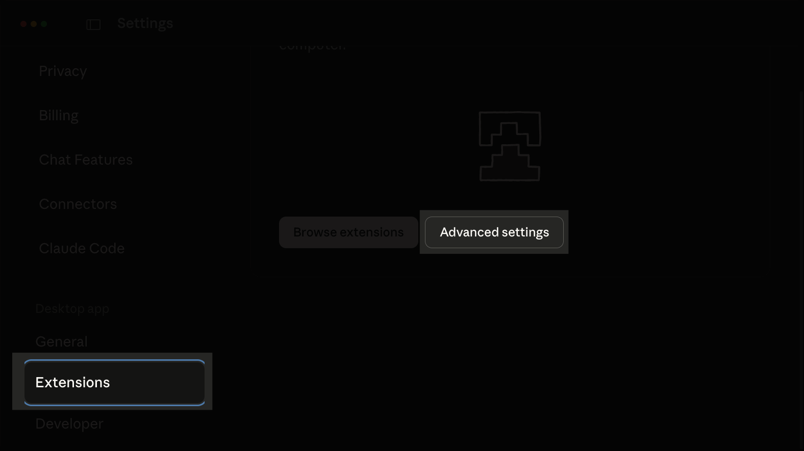
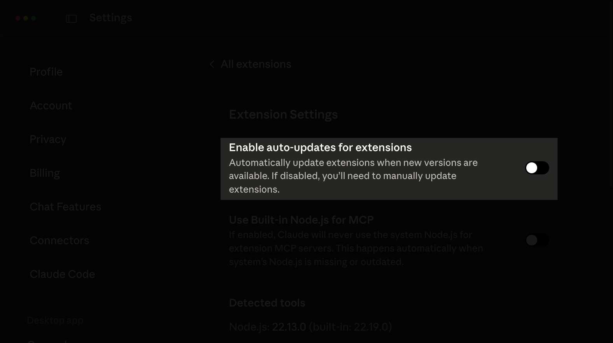
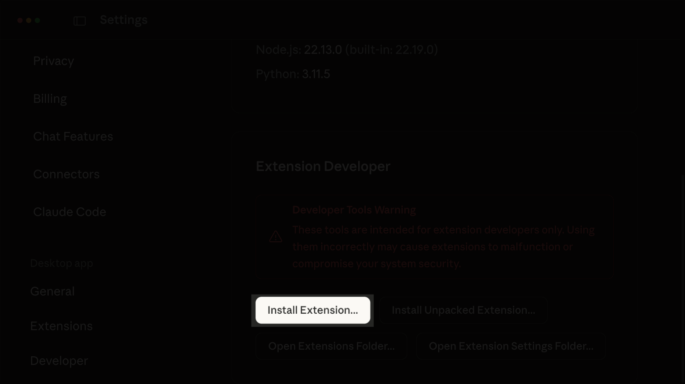
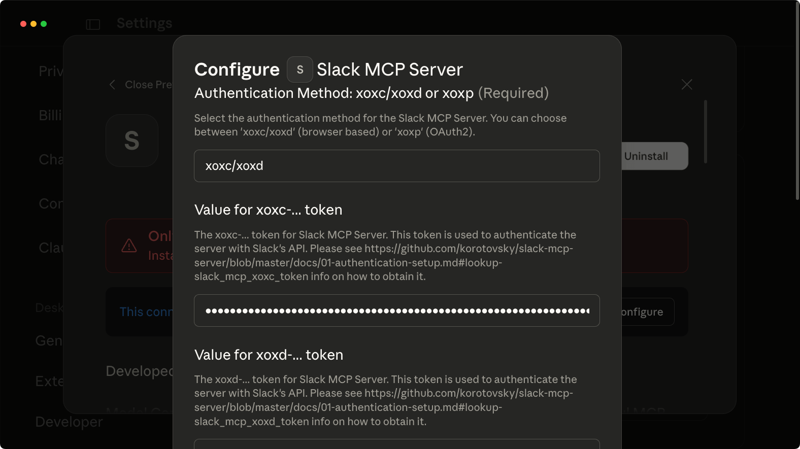
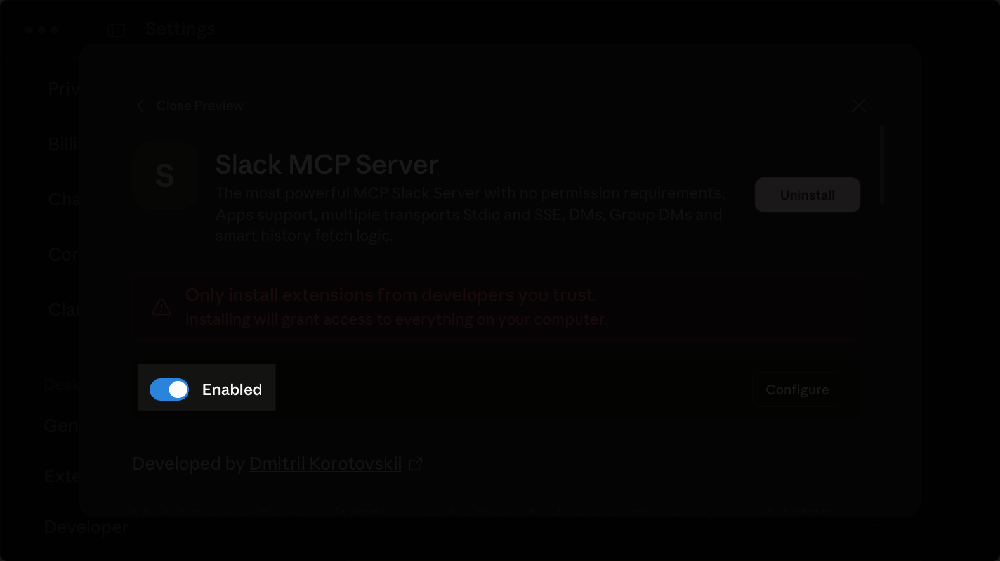

# Use Slack from your MCP Client

This guide demonstrates how to connect your Slack workspace to your MCP Client. 

As Slack doesn't provide an official MCP server, and Anthropic's reference implementation was deprecated due to [security vulnerabilities](https://embracethered.com/blog/posts/2025/security-advisory-anthropic-slack-mcp-server-data-leakage/), this guide uses the open-source [`slack-mcp-server`](https://github.com/korotovsky/slack-mcp-server) instead.

After following this guide you'll be able to read and summarize conversations, search message history, and analyze team communications without leaving Claude Desktop or whatever client you prefer. Here's an example where Claude finds all messages with reactions in a specific channel:

<video
  controls={false}
  loop={true}
  autoPlay={true}
  muted={true}
  width="100%"
  className="mt-10"
>
  <source src="/assets/mcp/using-mcp/slack-claude-quickstart/demo.mp4" type="video/mp4" />
</video>

## Prerequisites

To follow along, you'll need

* A user account on a Slack workspace
* An MCP Client like Claude Desktop
* Ideally some familiarity with editing JSON files and using your browser's developer tools

## Getting your Slack `xoxc` and `xoxd` auth tokens 

Instead of connecting to the Slack API, which would require admin access, we'll use the browser session tokens to authorize the Slack MCP Server to connect to your Slack workspace. Your MCP client will then have access to anything that you would in Slack. To get these, you'll need to log into your Slack workspace using a browser like Google Chrome.

To get the `xoxc` token:

1. Open the Slack workspace in your browser.
2. Open the developer console by pressing `Ctrl+Shift+I` (`Cmd+Option+I` on macOS) or `F12`.
3. Switch to the **Console** tab.
4. Type "allow pasting" into the console and press `Enter`.
5. Paste the following snippet into the console and press `Enter`:

   ```text
   JSON.parse(localStorage.localConfig_v2).teams[document.location.pathname.match(/^\/client\/([A-Z0-9]+)/)[1]].token
   ```

The token will be returned in the console. It starts with `xoxc-`. Save this somewhere.


To get the `xoxd` token:

1. Switch to the **Application** tab (**Storage** in Firefox and Safari).
2. In the sidebar, under **Storage**, click **Cookies**.
3. Find the cookie named `d` in the table.
4. Copy the cookie's value to the clipboard.


The token value starts with `xoxd-`. Save this somewhere.

## Downloading the DXT file

Claude Desktop supports MCP installations using DXT files. The [`slack-mcp-server`](https://github.com/korotovsky/slack-mcp-server) releases provide DXT files you can install in Claude Desktop. Download the release file on [GitHub](https://github.com/username/slack-mcp-server/releases).

## Installing the MCP server in Claude

Open Claude Desktop and go to **Settings** >  **Extensions** > **Advanced settings**. 



Disable auto-updates for extensions. This prevents Claude from looking for the latest version of the locally installed package in its MCP servers directory, which would cause an error when Claude tries to start the MCP server.



Scroll down and click on **Install Extension**.



Select the downloaded DXT file and validate the installation.


On the configuration page, set the authentication method to `xoxc/xoxd` as you're using browser-based tokens. Fill in the values for the `xoxc-` and `xoxd-` tokens.



Enable the extension after saving the changes.



To test that the connection is working, ask Claude to list the current channels in your Slack workspace.

## Testing reaction functionality

In Claude Desktop, start a new chat. Click the **Search and tools** button to see the MCP server listed. Enable all tools if needed.


Add reaction emojis to messages in your Slack workspace, then ask Claude to show you messages with reactions to test the server's reaction-reading functionality.


## Conclusion

Claude Desktop can now access your Slack workspace and read message reactions through the customized MCP server.
