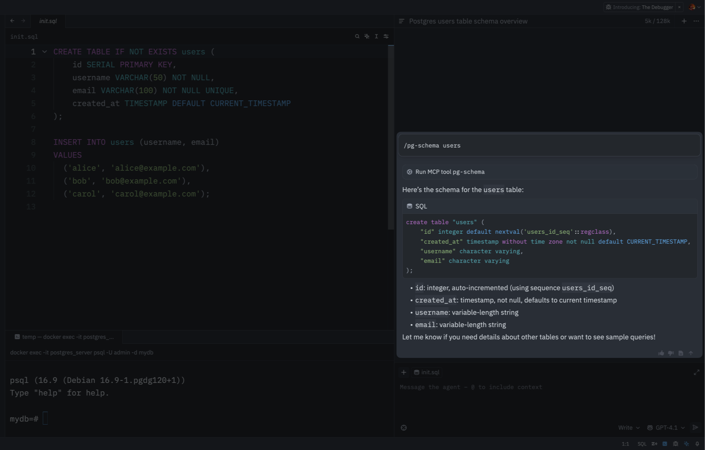
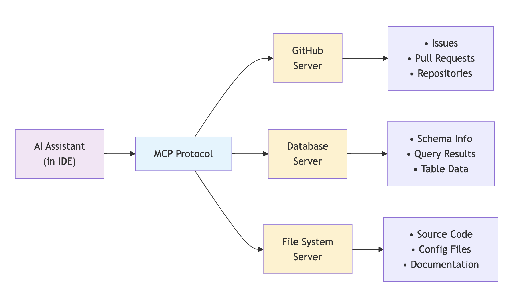
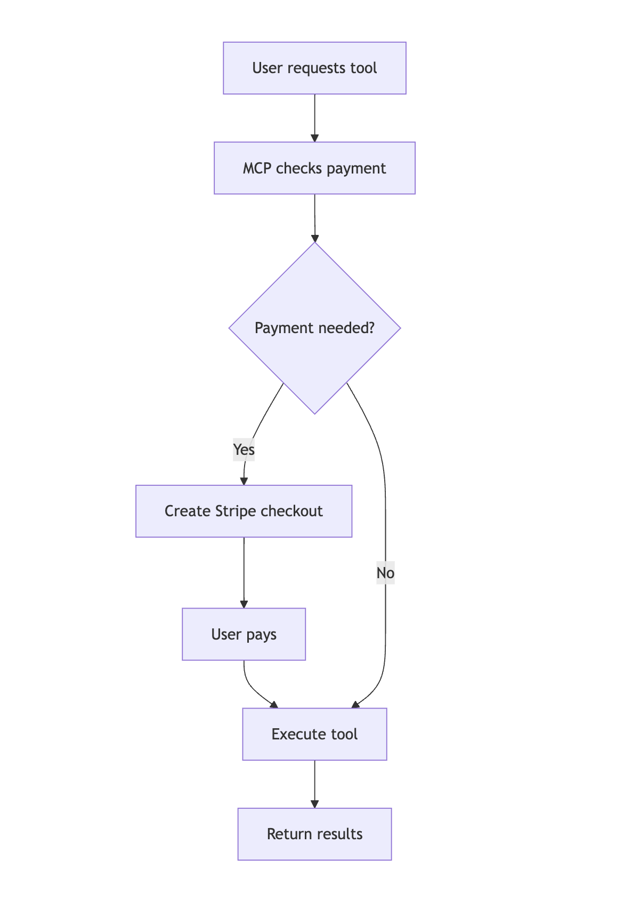

import { Callout} from "@/mdx/components";
import GramCallout from "../.partials/gram-callout.mdx";

<GramCallout />

# How companies are using MCP in production today

When Anthropic released the [Model Context Protocol (MCP)](https://modelcontextprotocol.io/introduction) in November 2024, the usual suspects started building. But here's the thing: instead of being a demo on GitHub, MCP quietly started showing up in actual production systems.

In this article, we'll look at how [Block](https://block.xyz/) has deployed MCP tools to thousands of employees, with engineers reporting 8-10 hours saved per week. [Solana](https://solana.com/) developers are using MCP to manage DeFi protocols through conversational interfaces. While [Stripe](https://stripe.com/) is using MCP to monetize AI tools.

Here's what we learned.

## Block's MCP implementation

[Block](https://block.xyz/) (formerly [Square](https://squareup.com/)) operates [Cash App](https://cash.app/) and Square payment systems. Cash App handles billions in payments, while Square provides payment processing through card readers used by merchants. When you make a payment at many businesses, Block's infrastructure processes the transaction.

Block built [`goose`](https://github.com/block/goose) and used [Claude in Databricks](https://www.anthropic.com/customers/block) as their default model. What started as a coding assistant now powers work across the entire company. About 4,000 of Block's 10,000 employees actively use goose across 15 different job roles, from sales and design to customer success and operations.

This system democratizes data access at Block. Employees who don't know SQL can now solve their own data problems by describing what they need in plain English. Security analysts create detection rules by describing threats naturally instead of wrestling with complex query syntax.

Block uses MCP to connect `goose` with their internal systems. They can build an MCP server for any tool and instantly make it available to AI agents. The setup uses OAuth with short-lived credentials, so employees don't need to manage API keys.

Three-quarters of Block's engineers report saving 8-10 hours per week using goose. [One engineer noted that](https://www.anthropic.com/customers/block#:~:text=Axen%20said%2C%20%22goose,become%20that%20effective.%22) "90% of my lines of code are now written by goose" because the tool has become that effective.


## Zed made MCP feel native

[Zed](https://zed.dev/) is a code editor built in Rust by the team that previously created [Atom](https://atom.io/) at [GitHub](https://github.com/). It's designed for performance when working with large codebases, using native compilation rather than [Electron](https://www.electronjs.org/) to avoid the performance issues common in other editors.

Zed built their Agent Panel around MCP from the start, rather than adding AI features to an existing architecture.

Take their database integration. You can type `/pg-schema users` and get the schema for your users table instantly.




But it gets more interesting with their Neon integration, which lets you safely modify production databases:

```
User: "Can you add a created_at column to the table?"
→ Agent runs prepare_database_migration
→ Creates temporary branch for safe schema changes  
→ User confirms with "yes do it"
→ Agent runs complete_database_migration
→ Production schema updated safely
```

That's the kind of workflow that would be nerve-wracking without proper guardrails, but MCP's stateful sessions make it possible to build safely.

The technical implementation is clean. MCP servers run as separate processes that communicate with Zed's Agent Panel via stdio, with HTTP/SSE support coming soon. Extension developers can register servers in their `extension.toml` and implement a simple `context_server_command` method.

## Replit's MCP playground

[Replit](https://replit.com/) is a cloud-based development environment that handles the setup and hosting for coding projects. It supports multiple programming languages and lets you run code directly in the browser without installing anything locally.

Recently, Replit has pivoted to agent-powered coding, positioning itself as an AI-first development platform where you can vibe code entire applications with zero setup, as all the infrastructure is managed by Replit.

Replit has built MCP templates that come with pre-configured servers. You can start a new environment and have working AI integrations without installing or configuring anything yourself.

Their "Learn About MCP Template" includes YouTube processing, filesystem access, and external API integration out of the box. The configuration lives in a simple JSON file:

```json
{
  "systemPrompt": "You are an AI assistant helping a software engineer",
  "llm": {
    "provider": "openai",
    "model": "gpt-4o-mini",
    "temperature": 0.2
  },
  "mcpServers": {
    "fetch": {
      "command": "uvx",
      "args": ["mcp-server-fetch"],
      "requires_confirmation": ["fetch"]
    },
    "youtube": {
      "command": "uvx",
      "args": [
        "--from",
        "git+https://github.com/adhikasp/mcp-youtube",
        "mcp-youtube"
      ]
    },
    "filesystem": {
      "command": "npx",
      "args": ["-y", "@modelcontextprotocol/server-filesystem", "./"]
    }
  }
}
```

Here's where it gets interesting. You can type something like "Summarize this video https://youtu.be/1qxOcsj1TAg and write the summary to summary.txt" and watch the AI coordinate between multiple services: fetch the video transcript, process it, and save the output, all through standardized MCP interfaces.

Replit Agent takes this further by automatically integrating services like EmailJS and Mailtrap when you describe what you want to build. Ask for a React app with email functionality, and it configures the MCP servers, sets up the integrations, and builds the app. It's the kind of seamless experience that makes MCP's complexity worthwhile.

## Code intelligence platforms embrace MCP

[Sourcegraph](https://sourcegraph.com/) and [Codeium](https://codeium.com/) both saw MCP as a way to differentiate their code intelligence platforms. The implementations are telling—they show how established companies are using MCP not just for novelty, but for genuine competitive advantage.



Sourcegraph implements MCP through [OpenCtx](https://openctx.org/) (their own standard for external context), with [Cody](https://sourcegraph.com/cody) acting as the MCP client. Their [Batch Changes MCP Server](https://github.com/sourcegraph/test-mcp) automates large-scale modifications across repositories, while their React Props server helps developers understand component usage patterns across entire codebases.


The workflow feels natural: Cody can analyze your database schema to suggest query optimizations, pull GitHub issues directly into your editor context, or search across multiple repositories with semantic understanding. It's code intelligence that actually understands the broader context of your work.

Codeium took a different approach with [Windsurf IDE](https://codeium.com/windsurf). They added MCP support in Wave 3, letting their [Cascade](https://codeium.com/blog/introducing-cascade) AI assistant connect to multiple servers simultaneously. The configuration is straightforward:

```json
{
  "mcpServers": {
    "github": {
      "command": "npx",
      "args": ["-y", "@modelcontextprotocol/server-github"],
      "env": {
        "GITHUB_PERSONAL_ACCESS_TOKEN": "your_token_here"
      }
    },
    "postgres": {
      "command": "docker",
      "args": ["run", "--rm", "-i", "--env-file", ".env", "mcp-postgres"]
    }
  }
}
```

They built UI panels for managing MCP servers, one-click setup for popular servers, and proper sandboxing. It's the kind of polish that suggests MCP integration is becoming table stakes for development tools.

## Solana blockchain data access

Several developers have built MCP servers that make Solana blockchain data accessible to AI assistants. While you can't execute transactions, these tools turn complex blockchain queries into simple conversations.

The most documented implementation comes from [QuickNode's comprehensive tutorial](https://www.quicknode.com/guides/ai/solana-mcp-server). Their MCP server handles some typical blockchain analysis tasks: checking wallet balances, retrieving token accounts, examining transaction details, and querying account information. What makes it practical is the integration with [Solana Kit](https://github.com/sendaifun/solana-agent-kit), which handles all the RPC complexity behind a clean interface. 

The [`solscan-mcp-server`](https://mcp.so/server/solscan-mcp/Valennmg) takes a different approach by building on [Solscan's](https://solscan.io/) API infrastructure. This gives you access to richer data analysis capabilities like token metadata (names, symbols, logos), market data from various exchanges, holder distribution analytics, and detailed DeFi activity tracking. The server can tell what tokens a wallet holds, how those holdings have changed over time and what DeFi protocols the wallet has interacted with.


Both focus on data access rather than transaction creation. You can ask an AI assistant to "analyze this wallet's DeFi activity" or "explain what happened in this transaction," and get useful answers without any security risks. The read-only design means you get the benefits of natural language blockchain analysis without worrying about accidental transactions or compromised keys. For most blockchain analysis use cases, this is exactly what you want, insight without risk.

## Stripe introduces paid MCP servers

Stripe built an [agent-toolkit](https://github.com/stripe/agent-toolkit/) that lets developers create MCP servers that charge for tool usage. The toolkit runs on Cloudflare Workers and handles OAuth authentication.

When an AI agent calls a paid tool, the MCP server checks if the user has already paid. If not, it creates a Stripe checkout session and returns a payment URL. After payment, the tool becomes available.



The system supports one-time payments, subscriptions, and usage-based billing through Stripe's metering API. Developers can charge per API call, search query, or processing job.

## The growing MCP ecosystem

By early 2025, over 15,000 community-built MCP servers were available, creating powerful network effects across the ecosystem.

### AWS ecosystem integration

AWS's hundreds of services are notoriously complex to navigate. MCP servers simplify this by letting AI assistants work directly with AWS through standard interfaces.

**[Bedrock KB Retrieval](https://github.com/aws-samples/amazon-bedrock-samples)** enables natural language queries to knowledge bases with vector database searches, RAG pipeline integration with automatic document chunking, and multi-modal retrieval for text, images, and structured data.

**[CDK Server](https://github.com/aws/aws-cdk)** generates infrastructure code from natural language descriptions, creating CloudFormation templates with validation and resource dependency mapping that includes cost estimation.

**Cost Analysis** tools decode AWS billing complexity through usage analysis for optimization recommendations, CloudWatch-based rightsizing suggestions, and cost forecasting with budget alerts.

### Database platform innovations

MCP bridges conversational AI with complex data operations, letting developers work with sophisticated databases using natural language instead of learning new APIs.

**[DataStax Astra DB](https://www.datastax.com/products/datastax-astra)** combines NoSQL with vector search for AI applications, handling vector search for knowledge bases, document CRUD operations with schema validation, collection management with automatic scaling, and real-time analytics with aggregation pipelines.

**[ClickHouse MCP server](https://github.com/ClickHouse/clickhouse-js)** makes high-performance analytics accessible to non-specialists through time-series analysis for metrics and events, columnar storage optimization for analytical workloads, distributed query execution across cluster nodes, and real-time data ingestion with exactly-once processing.

The server handles query optimization automatically, turning natural language questions into optimized SQL that processes billions of events in seconds.

### Creative tool integration

Creative MCP implementations solve real workflow problems for artists, game developers, and content creators working with complex tools.

**[Blender MCP Server](https://github.com/ahujasid/blender-mcp)** by Siddharth Ahuja removes barriers between creative vision and technical execution. Instead of memorizing hundreds of keyboard shortcuts, users can focus on creativity through 3D scene generation from natural language descriptions, object manipulation with physics simulation, animation creation with keyframe interpolation, and rendering pipeline control with material and lighting setup. The server automatically configures rigid body dynamics, gravity, and collision detection when you say "make these objects fall realistically."

**[Unity MCP Server](https://github.com/miguel-tomas/unity-mcp-server)** by Miguel Tomas streamlines game development workflows through game object creation and component management, scene manipulation with hierarchy management, script generation with C# code compilation, and asset pipeline integration with import/export workflows.

The script generation understands Unity's patterns and conventions, producing properly structured C# code with appropriate component references rather than generic code that won't work in Unity's context.

## Why companies are choosing MCP

Here's why companies are adopting MCP:

### The USB moment for AI tools

Think about how the [USB standard](https://en.wikipedia.org/wiki/USB) changed computing. Before USB, every device needed its own proprietary connector and driver. Printers, keyboards, mice, cameras, and more required specific hardware and software to work. USB standardized everything.

MCP does something similar for AI and business tools. Without it, connecting an AI assistant to Zendesk, Salesforce, and Slack means building three separate integrations from scratch. Each one needs custom authentication, error handling, and data formatting. It's like having a different port for every device.

With MCP, you write one server implementation that exposes Zendesk's capabilities to any AI system that speaks the protocol. Instead of building N integrations for every M tools (N x M complexity), you only need to build N servers and M clients. This matters a lot when you're dealing with dozens of internal tools and multiple AI agents.

### Inherent security

MCP creates a single chokepoint for AI access to company systems. Instead of tracking permissions across dozens of custom integrations, everything flows through MCP servers that can be monitored, logged, and controlled consistently.

For example, [Gram's implementation of MCP](https://docs.getgram.ai/concepts/environments) allows for environment specific tool access, and the ability to define different sets of credentials and server URLs for different environments.

With Gram, you can create seperat`staging` and `production` environments with different credentials and server URLs depending on intended access level.

### Switching models without rebuilding everything

Since MCP servers are model-agnostic, companies can experiment with different AI providers without throwing away their tool integrations. This flexibility helps with avoiding vendor lock-in, testing new models for specific tasks such, and lowering costs as inference costs come down.


## Getting started with MCP

If you're considering MCP for your organization, [mcp.so](https://mcp.so/) has an extensive list of MCP servers and clients, including MCP servers that could integrate with your existing tools.

To learn more about how to try MCP for yourself, check out our quickstart guide on [installing MCP servers](../getting-started/quickstart.mdx).