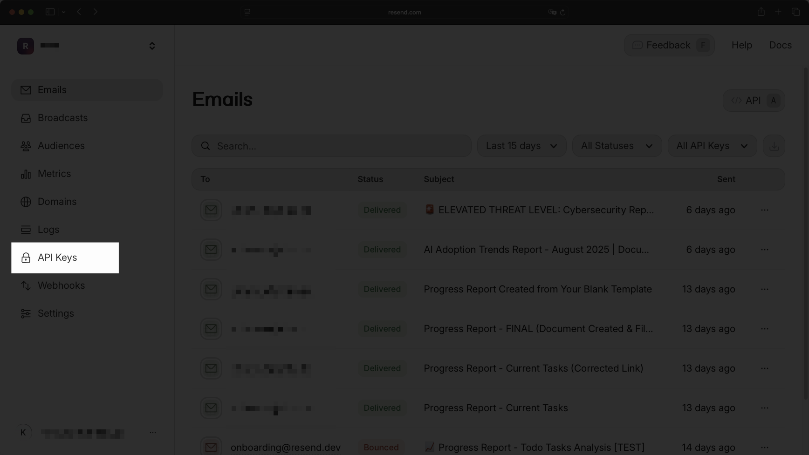
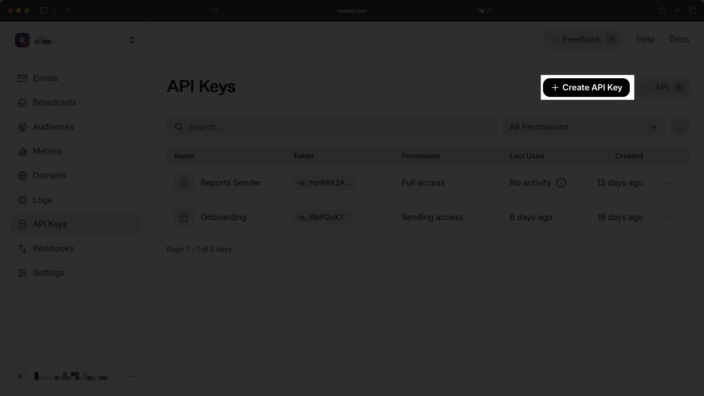
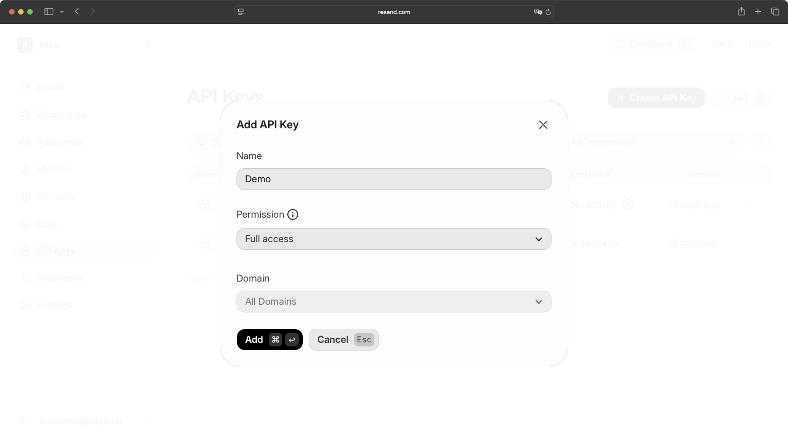
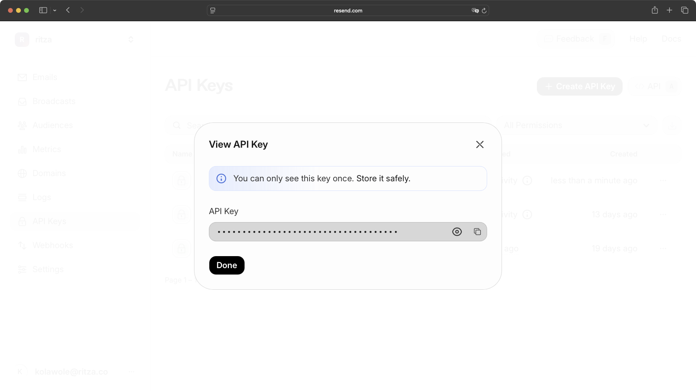
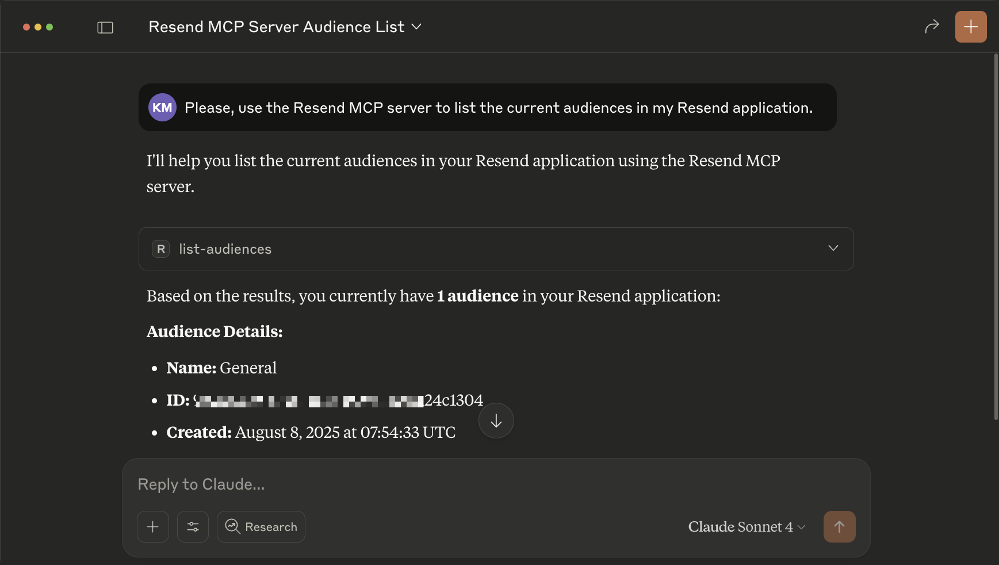
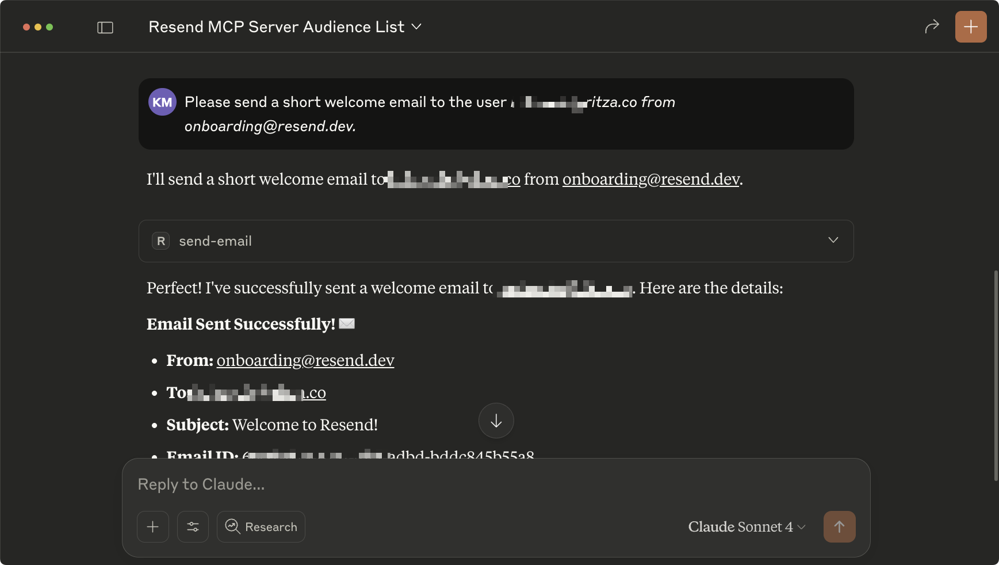

Email automation typically requires switching between your CRM, email platform, and other tools. The Resend MCP server lets you send emails, manage audiences, and create automated workflows directly from Claude Desktop using natural language commands.

In this guide, you will learn how to connect the Resend MCP server with Claude Desktop. 

<video src="./assets/resend-mcp-demo.mp4"></video>

## Prerequisites

For this guide, you will need: 

- [Resend Account](https://resend.com/). 
- [Claude Desktop](https://claude.ai/download). 
- [Node.js](https://nodejs.org/en/download/) installed on your system.

## Retrieve the Resend API key

You need a Resend API key for the MCP server to authenticate with your account. In your Resend dashboard, go to API Keys.



Click on the **Create API key button**.



Enter a name for your API key. Leave the Permission and Domain fields at their default values. These control sending limits and domain restrictions and the defaults allow unlimited sending from any domain, which works for development. In production, you'd restrict these for security.



Copy the API key and save it somewhere safe. You'll need it for the MCP server configuration.



## Connect the Resend MCP server to Claude Desktop

Clone the Resend MCP project:

```bash
git clone https://github.com/resend/mcp-send-email.git
cd mcp-send-email
```

Build the project:

```bash
npm install
npm run build
```

This generates an `index.js` file in a `build` directory. Building compiles the TypeScript source code into JavaScript that Claude Desktop can execute. The build step also bundles dependencies so the MCP server runs standalone.

Copy the absolute path to the `index.js` file. You'll need it for the Claude Desktop configuration.

### Install the MCP server

Add the Resend configuration to your `claude_desktop_config.json` file:

```json
{
  "mcpServers": {
    "resend": {
      "command": "node",
      "args": ["ABSOLUTE_PATH_TO_MCP_SEND_EMAIL_PROJECT/build/index.js"],
      "env": {
        "RESEND_API_KEY": "YOUR_RESEND_API_KEY"
      }
    }
  }
}
```

Replace the path with your actual project location and `YOUR_RESEND_API_KEY` with your Resend API key and restart Claude Desktop.

## Test the connection

Once you have Resend connected, test the integration by asking Claude to list your current audiences:

```txt
Please, use the Resend MCP server to list the current audiences in my Resend application.
```



You can then ask Claude to send an email to a specific audience or email address. For example, you might send from onboarding@resend.dev. Here is the prompt: 

```txt
Please, send a short welcoming email to the user kolawole@ritza.co from onboarding@resend.dev.
```



## Conclusion

In this guide, you learned how to connect the Resend MCP server with Claude Desktop. You can build on this by combining it with other MCP servers, like using the Slack MCP server to turn your best Slack threads into newsletter content that gets automatically sent through Resend.