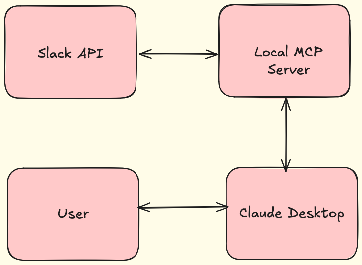
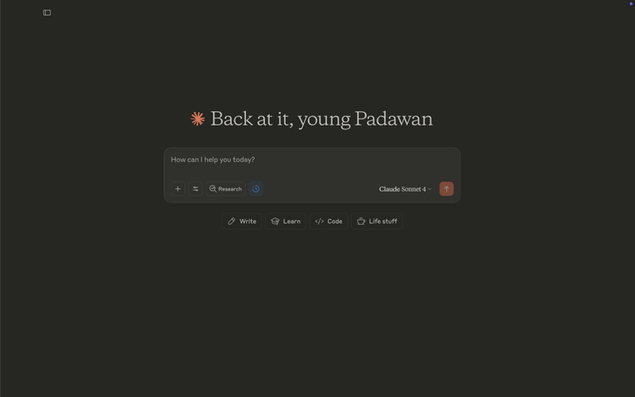
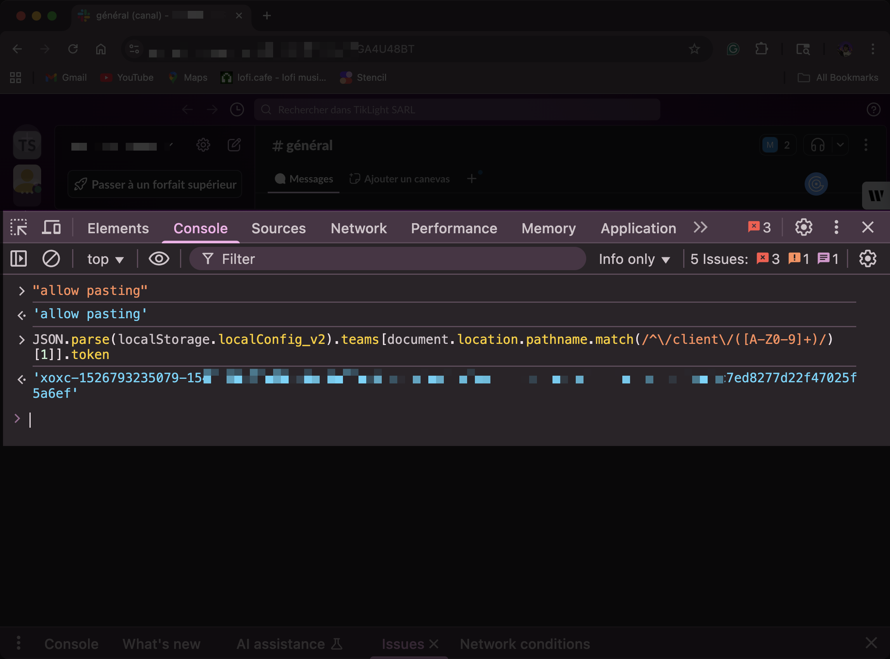
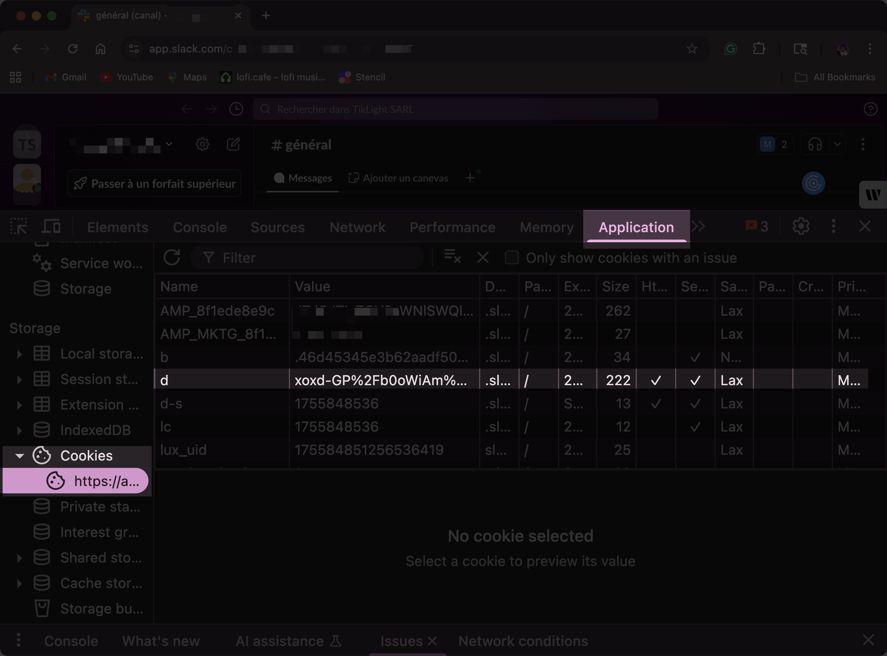
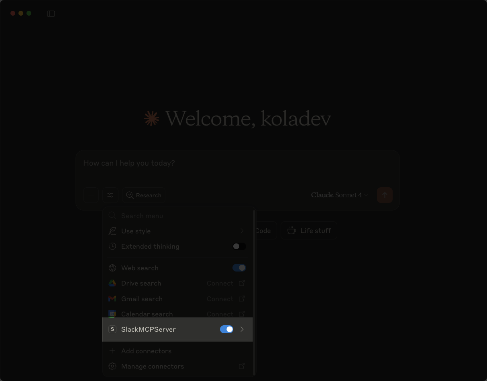
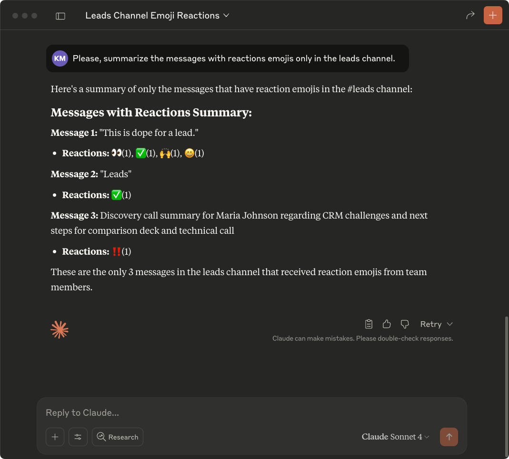

MCP (Model Context Protocol) lets Claude Desktop connect to external services like Slack to read and analyze your messages directly in the chat interface. 

The MCP server fetches data from Slack's API using your browser tokens, then provides that data to Claude Desktop when you ask questions about your Slack messages.

Slack doesn't officially support MCP servers. Anthropic published a reference Slack MCP server when MCP launched, but deprecated it due to [security vulnerabilities](https://embracethered.com/blog/posts/2025/security-advisory-anthropic-slack-mcp-server-data-leakage/).

This guide uses the [slack-mcp-server](https://github.com/korotovsky/slack-mcp-server) open source project that will act as a bridge between your Slack workspace and Claude Desktop.



## Prerequisites

You'll need:

- Go 1.23.4 or higher.
- Claude Desktop.
- A Slack workspace opened in your browser.
- A text editor.
- Basic familiarity with browser dev tools.

## Setup 

You need Slack API tokens for the MCP server to access your data. The slack-mcp-server supports two token types:

- `xoxc/xoxd` tokens are extracted from your browser session. These give the MCP server the same access you have in the Slack web app, without creating applications or managing permissions
- `xoxp` tokens require creating a Slack app, configuring scopes, and installing the app in each channel you want to access

This guide uses `xoxc/xoxd` tokens because they're faster to set up and work across all your channels immediately.

### Retrieving the tokens

Follow these instructions to retrieve the `xoxc` token.

Retrieve the `xoxc` token:

1. Open your browser's Developer Console.

2. In Chrome, click the three dots next to the URL bar, then select More Tools → Developer Tools.

3. Switch to the Console tab.

4. Type "allow pasting" and press ENTER.

5. Paste this snippet and press ENTER:

   ```text
   JSON.parse(localStorage.localConfig_v2).teams[document.location.pathname.match(/^\/client\/([A-Z0-9]+)/)[1]].token
   ```



The token starts with `xoxc-`. Save it for the next step.

Retrieve the `xoxd` token:

1. Switch to the Application tab (Storage tab in Firefox) and select Cookies in the left panel.
2. Find the cookie named `d`.
3. Double-click the cookie's value.
4. Copy it with Ctrl+C (or Cmd+C on Mac).



The token value starts with `xoxd-`, save it somewhere for now.

### Cloning and modifying the project

The slack-mcp-server reads messages, searches messages, and finds users. It doesn't support reading reactions, which limits useful workflows like having managers prioritize messages with specific reactions or triggering deployments through emoji responses.

You'll modify the source code to add reaction support.

Follow these instructions to add the reaction capability. 

1. Clone the project on your machine.

   ```
   git clone https://github.com/korotovsky/slack-mcp-server.git
   ```

2. Open the project and find the `conversation.go` file, located at `slack-mcp-server/pkg/handler/conversations.go`.

3. Replace the `Message` struct with the following to add the `Reactions` field.

   ```go
   type Message struct {
   	MsgID     string `json:"msgID"`
   	UserID    string `json:"userID"`
   	UserName  string `json:"userUser"`
   	RealName  string `json:"realName"`
   	Channel   string `json:"channelID"`
   	ThreadTs  string `json:"ThreadTs"`
   	Text      string `json:"text"`
   	Time      string `json:"time"`
   	Reactions string `json:"reactions,omitempty"`
   	Cursor    string `json:"cursor"`
   }
   ```

4. Add reaction processing to the `convertMessagesFromHistory` function. Around line 391, find this code:

   ```go
      		msgText := msg.Text + text.AttachmentsTo2CSV(msg.Text, msg.Attachments)
   
      		messages = append(messages, Message{
      			MsgID:     msg.Timestamp,
      			UserID:    msg.User,
      			UserName:  userName,
      			RealName:  realName,
      			Text:      text.ProcessText(msgText),
      			Channel:   channel,
      			ThreadTs:  msg.ThreadTimestamp,
      			Time:      timestamp,
      		})
   ```

   Replace it with:

   ```go
      		msgText := msg.Text + text.AttachmentsTo2CSV(msg.Text, msg.Attachments)
   
      		// Convert reactions to flat pipe-separated format: emoji:count|emoji:count
      		var reactionParts []string
      		for _, r := range msg.Reactions {
      			reactionParts = append(reactionParts, fmt.Sprintf("%s:%d", r.Name, r.Count))
      		}
      		reactionsString := strings.Join(reactionParts, "|")
   
      		messages = append(messages, Message{
      			MsgID:     msg.Timestamp,
      			UserID:    msg.User,
      			UserName:  userName,
      			RealName:  realName,
      			Text:      text.ProcessText(msgText),
      			Channel:   channel,
      			ThreadTs:  msg.ThreadTimestamp,
      			Time:      timestamp,
      			Reactions: reactionsString,
      		})
   ```

5. Update the `convertMessagesFromSearch` function to include the reactions field. Around line 440, find this code:

   ```go
      		messages = append(messages, Message{
      			MsgID:     msg.Timestamp,
      			UserID:    msg.User,
      			UserName:  userName,
      			RealName:  realName,
      			Text:      text.ProcessText(msgText),
      			Channel:   fmt.Sprintf("#%s", msg.Channel.Name),
      			ThreadTs:  threadTs,
      			Time:      timestamp,
      		})
   ```

   Replace it with: 

   ```go
      		messages = append(messages, Message{
      			MsgID:     msg.Timestamp,
      			UserID:    msg.User,
      			UserName:  userName,
      			RealName:  realName,
      			Text:      text.ProcessText(msgText),
      			Channel:   fmt.Sprintf("#%s", msg.Channel.Name),
      			ThreadTs:  threadTs,
      			Time:      timestamp,
      			Reactions: "",
      		})
   ```

6. Build the application: 

   ```bash
   go build -o slack-mcp-server ./cmd/slack-mcp-server
   ```

The build will be located in the root of the cloned project `slack-mcp-server/slack-mcp-server`. 

## Install the MCP server in Claude

Add the MCP server to your Claude Desktop configuration file `claude_desktop_config.json`:

```json
{
  "mcpServers": {
    "SlackMCPServer": {
      "command": "PATH_TO_/slack-mcp-server/slack-mcp-server",
      "args": ["-transport", "stdio"],
      "env": {
        "SLACK_MCP_XOXC_TOKEN": "xoxc-273XXXXX2a94b6e48c0e250",
        "SLACK_MCP_XOXD_TOKEN": "xoxd-XXXX%2BkuT",
        "SLACK_MCP_USERS_CACHE": "PATH_TO_/slack-mcp-server/.users_cache.json",
        "SLACK_MCP_CHANNELS_CACHE": "PATH_TO_/slack-mcp-server/.channels_cache.json"
      }
    }
  }
}

```

Replace `SLACK_MCP_XOXC_TOKEN` and `SLACK_MCP_XOXD_TOKEN` with your tokens. Replace `PATH_TO_` with the absolute path to your project directory.

Restart Claude Desktop to load the server.

## Test the integration 

Open Claude Desktop and start a new chat. Click the settings button to see the MCP server listed. Enable all tools if needed.



Test the integration by adding reactions to messages in your Slack workspace, then ask Claude to show you messages with reaction emojis.



Your integration is now working.

## Conclusion

You've installed the Slack MCP server in Claude Desktop and modified it to read message reactions. While the server can be installed directly using a [DXT file](https://github.com/korotovsky/slack-mcp-server/blob/master/docs/03-configuration-and-usage.md#Using-DXT), building from source lets you customize functionality for your workflows.