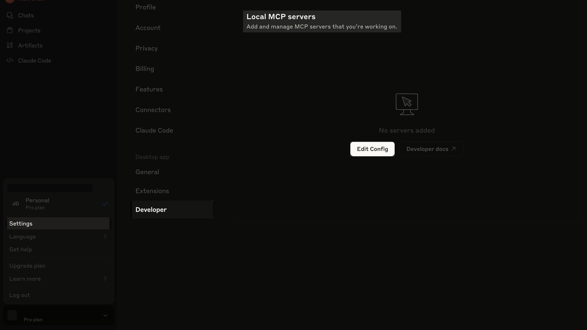

This guide demonstrates how to connect your Slack workspace to Claude Desktop using the Model Context Protocol (MCP). Once connected, you can read and summarize conversations, search message history, and analyze team communications without leaving the Claude interface.

As Slack doesn't provide an official MCP server, and Anthropic's reference implementation was deprecated due to [security vulnerabilities](https://embracethered.com/blog/posts/2025/security-advisory-anthropic-slack-mcp-server-data-leakage/), this guide uses the popular open-source [`slack-mcp-server`](https://github.com/korotovsky/slack-mcp-server) that safely bridges your Slack workspace and Claude Desktop.


Here's what the connection looks like in action:

<video
  controls={false}
  loop={true}
  autoPlay={true}
  muted={true}
  width="100%"
  className="mt-10"
>
  <source src="./assets/demo.mp4" type="video/mp4" />
</video>

## Prerequisites

- [Go](https://golang.org/dl/) 1.24.4 or higher
- [Claude Desktop](https://claude.ai/download)
- A [Slack](https://slack.com/) workspace

## Getting Slack API tokens

You need Slack API tokens for the MCP server to access Slack data. The server supports two token types:

- `xoxc/xoxd` tokens: Extracted from your browser session, these tokens give the MCP server the same access you have in the Slack web app without creating applications or managing permissions.
- `xoxp` tokens: These tokens require creating a Slack app, configuring scopes, and installing the app in each channel you want to access.

This guide uses `xoxc/xoxd` tokens because they're faster to set up and work across all your channels immediately.

To get the `xoxc` token:

1. Open the Slack workspace in your browser.
2. Open the developer console by pressing `Ctrl+Shift+I` (`Cmd+Option+I` on macOS) or `F12`.
3. Switch to the **Console** tab.
4. Type "allow pasting" into the console and press `Enter`.
5. Paste the following snippet into the console and press `Enter`:

   ```text
   JSON.parse(localStorage.localConfig_v2).teams[document.location.pathname.match(/^\/client\/([A-Z0-9]+)/)[1]].token
   ```

The token will be returned in the console. It starts with `xoxc-`. Copy and save it for the next step.


To get the `xoxd` token:

1. Switch to the **Application** tab (**Storage** in Firefox and Safari).
2. In the sidebar, under **Storage**, click **Cookies**.
3. Find the cookie named `d` in the table.
4. Copy the cookie's value to the clipboard.


The token value starts with `xoxd-`. Save it somewhere for now.

## Cloning and modifying the project

The server reads messages, searches messages, and finds users, but doesn't support reading reactions. As this limits useful workflows (like prioritizing messages with specific reactions or triggering deployments through emoji responses), let's modify the source code to add reaction support.

1. Create a directory and clone the project:

   ```bash
   mkdir slack-mcp-setup
   cd slack-mcp-setup
   git clone https://github.com/korotovsky/slack-mcp-server.git
   cd slack-mcp-server
   ```

2. Open the project and find the `conversation.go` file at `slack-mcp-server/pkg/handler/conversations.go`.

3. Replace the `Message` struct with the code below to add the `Reactions` field.

   ```go
   type Message struct {
   	MsgID     string `json:"msgID"`
   	UserID    string `json:"userID"`
   	UserName  string `json:"userUser"`
   	RealName  string `json:"realName"`
   	Channel   string `json:"channelID"`
   	ThreadTs  string `json:"ThreadTs"`
   	Text      string `json:"text"`
   	Time      string `json:"time"`
   	Reactions string `json:"reactions,omitempty"`
   	Cursor    string `json:"cursor"`
   }
   ```

4. We'll add reaction processing to the `convertMessagesFromHistory` function. Find the code below (around line 391):

   ```go
      		msgText := msg.Text + text.AttachmentsTo2CSV(msg.Text, msg.Attachments)

      		messages = append(messages, Message{
      			MsgID:     msg.Timestamp,
      			UserID:    msg.User,
      			UserName:  userName,
      			RealName:  realName,
      			Text:      text.ProcessText(msgText),
      			Channel:   channel,
      			ThreadTs:  msg.ThreadTimestamp,
      			Time:      timestamp,
      		})
   ```

    Replace it with this: 

    ```go
       		msgText := msg.Text + text.AttachmentsTo2CSV(msg.Text, msg.Attachments)
 
       		// Convert reactions to flat pipe-separated format: emoji:count|emoji:count
       		var reactionParts []string
       		for _, r := range msg.Reactions {
       			reactionParts = append(reactionParts, fmt.Sprintf("%s:%d", r.Name, r.Count))
       		}
      		reactionsString := strings.Join(reactionParts, "|")

      		messages = append(messages, Message{
      			MsgID:     msg.Timestamp,
      			UserID:    msg.User,
      			UserName:  userName,
      			RealName:  realName,
      			Text:      text.ProcessText(msgText),
      			Channel:   channel,
      			ThreadTs:  msg.ThreadTimestamp,
      			Time:      timestamp,
      			Reactions: reactionsString,
      		})
    ```

5. We'll update the `convertMessagesFromSearch` function to include the reactions field for consistency. Around line 449, find this code:

   ```go
      		messages = append(messages, Message{
      			MsgID:     msg.Timestamp,
      			UserID:    msg.User,
      			UserName:  userName,
      			RealName:  realName,
      			Text:      text.ProcessText(msgText),
      			Channel:   fmt.Sprintf("#%s", msg.Channel.Name),
      			ThreadTs:  threadTs,
      			Time:      timestamp,
      		})
   ```

   Replace it with this:

   ```go
      		messages = append(messages, Message{
      			MsgID:     msg.Timestamp,
      			UserID:    msg.User,
      			UserName:  userName,
      			RealName:  realName,
      			Text:      text.ProcessText(msgText),
      			Channel:   fmt.Sprintf("#%s", msg.Channel.Name),
      			ThreadTs:  threadTs,
      			Time:      timestamp,
      			Reactions: "",
      		})
   ```

6. Build the application:

   ```bash
   go build -o slack-mcp-server ./cmd/slack-mcp-server
   ```

The build will be located in the root of the cloned project at `slack-mcp-server/slack-mcp-server`.

## Installing the MCP server in Claude

Now update your Claude Desktop configuration to include the MCP server. 

In **Settings**, go to **Developer** > **Edit Config**. 



The `claude_desktop_config.json` file that opens will look something like this:

```json
{
  "mcpServers": {
    "SlackMCPServer": {
      "command": "PATH_TO_MCP_SERVER/slack-mcp-server",
      "args": ["-transport", "stdio"],
      "env": {
        "SLACK_MCP_XOXC_TOKEN": "YOUR_XOXC_TOKEN",
        "SLACK_MCP_XOXD_TOKEN": "YOUR_XOXD_TOKEN",
        "SLACK_MCP_USERS_CACHE": "PATH_TO_MCP_SERVER/.users_cache.json",
        "SLACK_MCP_CHANNELS_CACHE": "PATH_TO_MCP_SERVER/.channels_cache.json"
      }
    }
  }
}
```

Replace `PATH_TO_MCP_SERVER` with the absolute path to your cloned `slack-mcp-server` directory. Replace `YOUR_XOXC_TOKEN` and `YOUR_XOXD_TOKEN` with the Slack tokens you saved previously.

Restart Claude Desktop to load the server.

To test that the connection is working, ask Claude to list the current channels in your Slack workspace.

## Testing reaction functionality

In Claude Desktop, start a new chat. Click the **Search and tools** button to see the MCP server listed. Enable all tools if needed.


Add reaction emojis to messages in your Slack workspace, then ask Claude to show you messages with reactions to test the server's reaction-reading functionality.


## Conclusion

Claude Desktop can now access your Slack workspace and read message reactions through the customized MCP server. While the server can be installed directly using a [DXT file](https://github.com/korotovsky/slack-mcp-server/blob/master/docs/03-configuration-and-usage.md#Using-DXT), building from source lets you customize functionality for your workflows.
