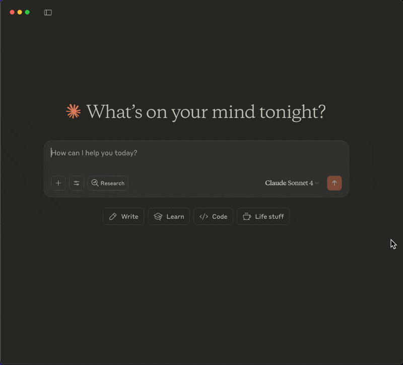

```
title: Using Slack MCP server and HubSpot MCP server
description: Learn how to integrate the Slack MCP server with the HubSpot MCP server
```

Multiple MCP servers unlock powerful automation workflows in Claude Desktop. 

This guide shows you how to automatically update HubSpot contacts based on Slack message reactions, turning emoji responses into CRM actions.



## Prerequisites

- You'll need both MCP servers installed:
  - Complete the [Slack MCP server setup guide](link-to-slack-guide).
  - Complete the [HubSpot MCP server setup guide.](link-to-hubspot-guide)
  - Claude Desktop.

## Your configuration

Your claude_desktop_config.json file should look like this:

```json
{
  "mcpServers": {
    "HubspotMCP": {
      "command": "npx",
      "args": ["-y", "@hubspot/mcp-server"],
      "env": {
        "PRIVATE_APP_ACCESS_TOKEN": "YOUR_HUBSPOT_KEY"
      }
    },
     "SlackMCPServer": {
      "command": "PATH_TO_/slack-mcp-server/slack-mcp-server",
      "args": ["-transport", "stdio"],
      "env": {
        "SLACK_MCP_XOXC_TOKEN": "YOUR_XOXC_TOKEN",
        "SLACK_MCP_XOXD_TOKEN": "YOUR_XOXD_TOKEN",
        "SLACK_MCP_USERS_CACHE": "PATH_TO_/slack-mcp-server/.users_cache.json",
        "SLACK_MCP_CHANNELS_CACHE": "PATH_TO_/slack-mcp-server/.channels_cache.json"
      }
    }
  }
}

```

Replace the token placeholders with your actual values and restart Claude Desktop.

## Testing the integration

Here's a practical scenario: Your team shares lead updates in a Slack channel and marks urgent ones with ‼️ reactions. You want Claude to automatically add "Schedule call ASAP" notes to those contacts in HubSpot.

Ask Claude:

```txt
In the #leads Slack channel, find the messages marked with :bangbang: emoji reactions as they are critical ones. Add a note only for the contacts in those messages using the HubSpot MCP server to schedule a call as soon as possible.
```


Claude will:

1. Search the #leads channel for messages with ‼️ reactions
2. Parse contact information from those messages
3. Look up matching contacts in HubSpot
4. Add priority notes to each contact record


The contacts in HubSpot will now have "schedule call ASAP" notes added to their records.


## Best practices for multiple MCP servers

- Be specific about which server to use: "Use HubSpot to get contact details for John Smith" is better than saying "Get the contact info for John Smith"
- Design prompts like workflows: If the steps make sense to you, they'll make sense to Claude. Break complex tasks into clear, sequential actions.
- Test individual servers first: Verify each MCP server works independently before combining them in complex workflows.

## Conclusion

Combined MCP servers turn Claude Desktop into a powerful automation hub. The key is writing clear prompts that specify which services to use and in what order