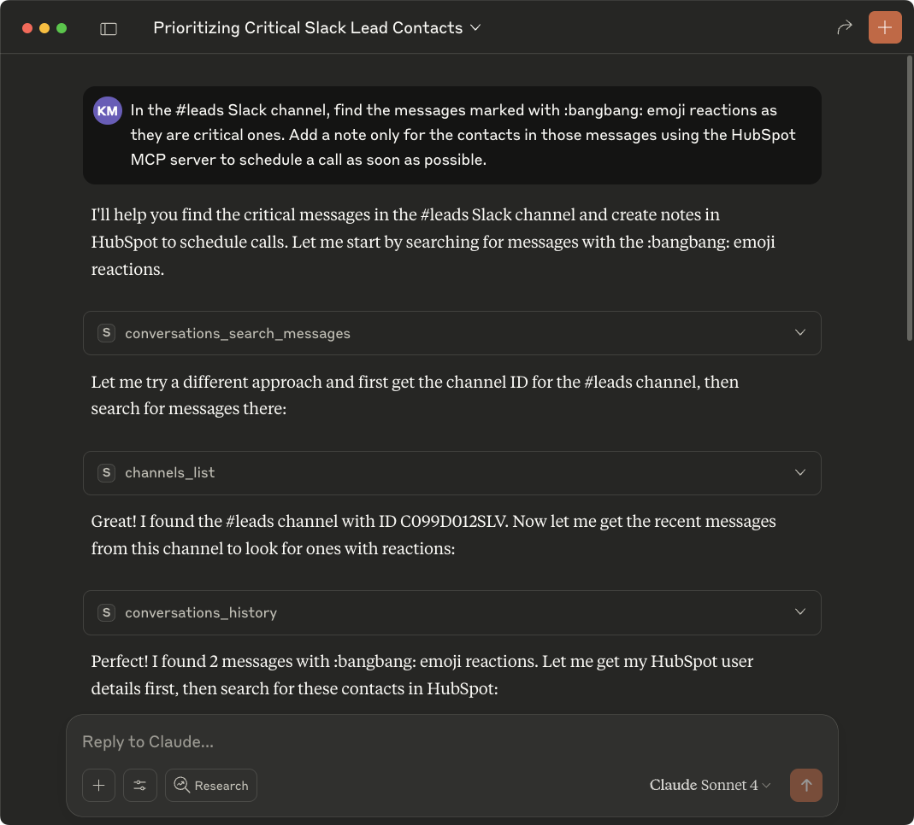
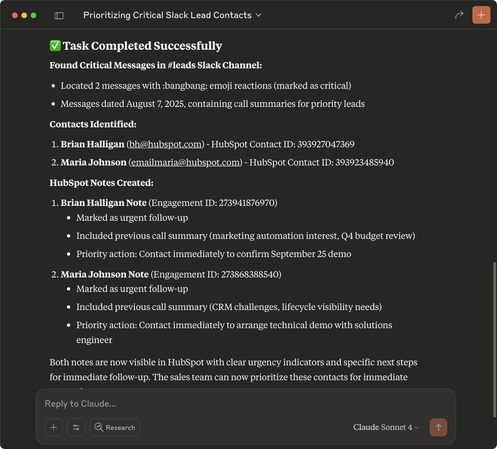
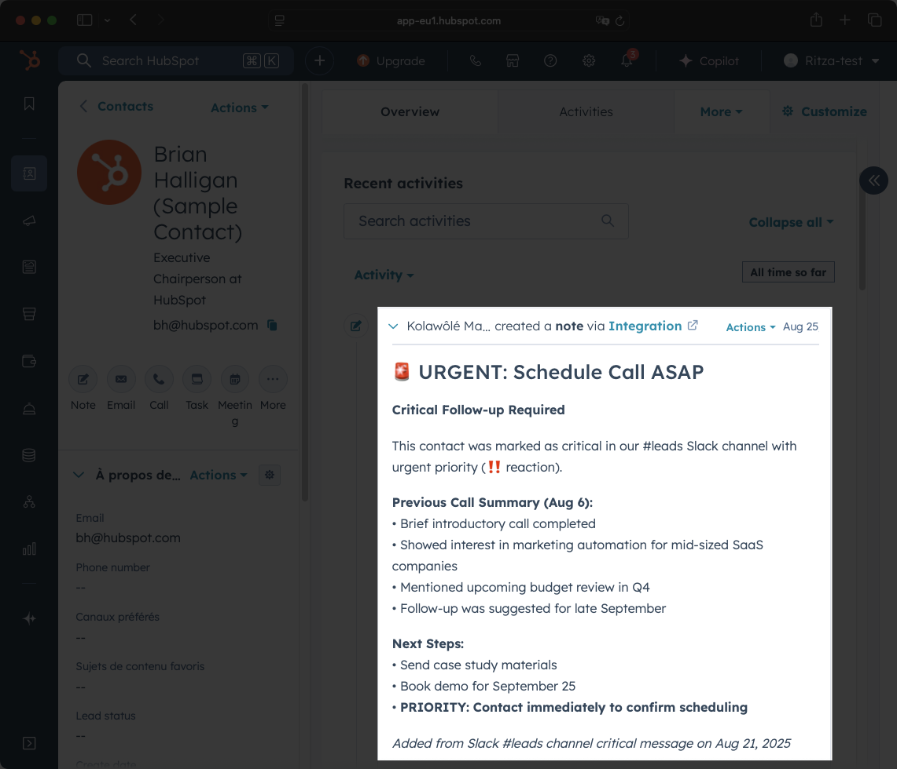

Multiple MCP servers unlock powerful automation workflows in Claude Desktop.

This guide shows you how to automatically update HubSpot contacts based on Slack message reactions, turning emoji responses into CRM actions.

<video
  controls={false}
  loop={true}
  autoPlay={true}
  muted={true}
  width="100%"
  className="mt-10"
>
  <source src="./assets/slack-hubspot-integration-demo.mp4" type="video/mp4" />
</video>

## Prerequisites

- Slack and HubSpot MCP servers installed. Follow the guides:
  - [Using Slack with MCP quickstart guide](/mcp/using-mcp/slack-claude-quickstart)
  - [Using HubSpot with MCP quickstart guide](/mcp/using-mcp/hubspot-claude-quickstart)
- [Claude Desktop](https://claude.ai/download)

## Adding the servers to Claude Desktop

Add the servers to the `claude_desktop_config.json` file:

```json
{
  "mcpServers": {
    "HubspotMCP": {
      "command": "npx",
      "args": ["-y", "@hubspot/mcp-server"],
      "env": {
        "PRIVATE_APP_ACCESS_TOKEN": "YOUR_HUBSPOT_KEY"
      }
    },
     "SlackMCPServer": {
      "command": "PATH_TO_/slack-mcp-server/slack-mcp-server",
      "args": ["-transport", "stdio"],
      "env": {
        "SLACK_MCP_XOXC_TOKEN": "YOUR_XOXC_TOKEN",
        "SLACK_MCP_XOXD_TOKEN": "YOUR_XOXD_TOKEN",
        "SLACK_MCP_USERS_CACHE": "PATH_TO_/slack-mcp-server/.users_cache.json",
        "SLACK_MCP_CHANNELS_CACHE": "PATH_TO_/slack-mcp-server/.channels_cache.json"
      }
    }
  }
}

```

Replace the token placeholders with your actual values.

Restart Claude Desktop.

## Testing the connection

Here's a practical scenario: Your team shares lead updates in a Slack channel and marks urgent ones with the ‼️ emoji. You want Claude to automatically add a "Schedule call ASAP" note to those contacts in HubSpot.

Ask Claude:

```txt
In the #leads Slack channel, find the messages marked with :bangbang: emoji reactions as they are critical. Add a note only for the contacts in those messages using the HubSpot MCP server to schedule a call as soon as possible.
```



Claude will:

1. Search the #leads channel for messages with ‼️ reactions.
2. Parse contact information from those messages.
3. Look up matching contacts in HubSpot.
4. Add a priority note to each contact record.



The contacts in HubSpot will now have a "schedule call ASAP" note added to their records.



## Best practices for multiple MCP servers

- **Be specific about which server to use:** "Use HubSpot to get contact details for John Smith" is better than saying "Get the contact info for John Smith."
- **Design prompts like workflows:** If the steps make sense to you, they'll make sense to Claude. Break complex tasks into clear, sequential actions.
- **Test individual servers first:** Verify each MCP server works independently before combining them in complex workflows.

## Conclusion

Combined MCP servers turn Claude Desktop into a powerful automation hub. The key is writing clear prompts that specify which services to use in what order.
