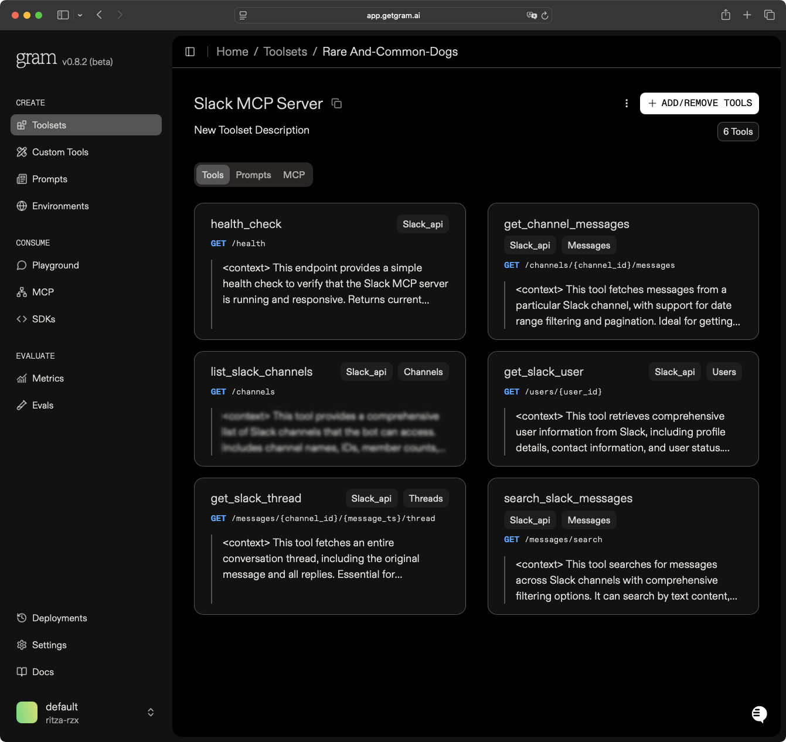
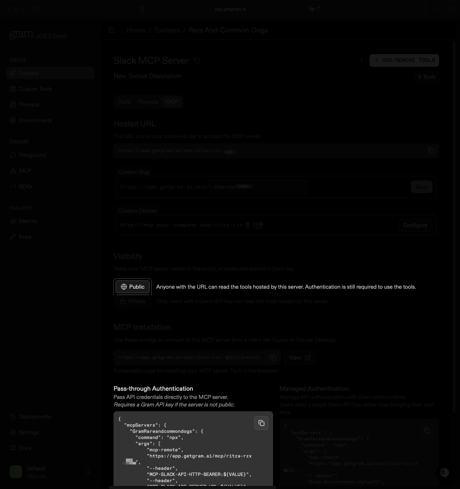
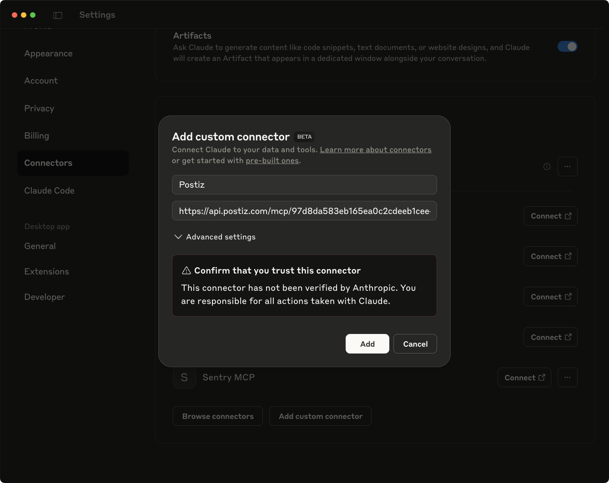
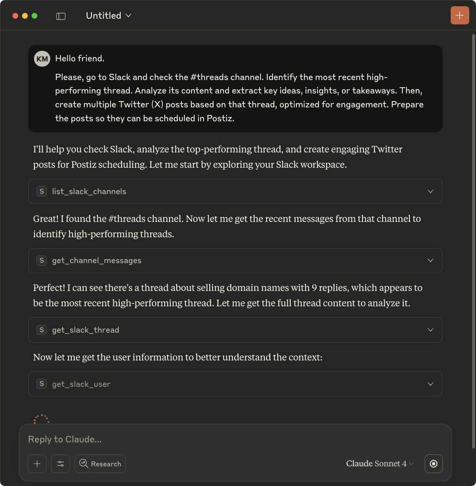
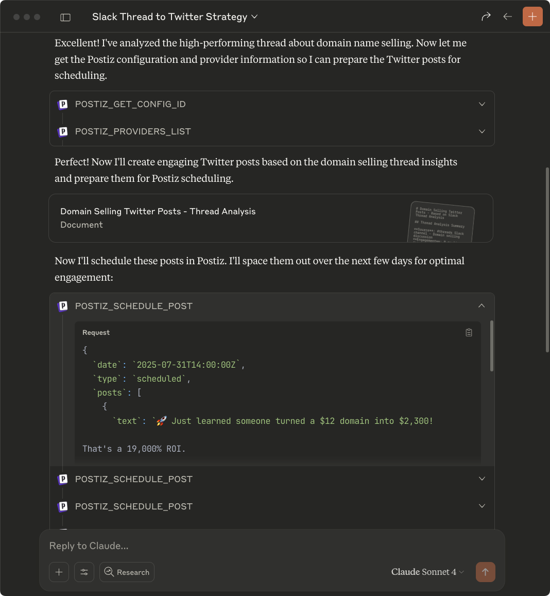

# Use MCP to turn your best Slack threads into social posts

Great conversation within teams tend to happen in discussions channels. Your developer, marketing person, CEO or anybody, adding information, interesting data and this hit you: so many stuff said in that discussion can make interesting social media posts.

You see that and you decided to pick each of the interesting messages, and post those on social media. The is seems easy if the thread is not long, and then you find the discussion is 50 messages. Let's say your team is capable of putitng out epiphanies like that every week. Now, you have tons of ideas for social media posts, but you need to go through every threads or discussions to extract interesitng posts, which can take time and let's not start with the manual posting or scheduling. 

But this should'nt be the case. With the evolution of AI and the adoption of MCP servers to allow AI to interact with producrts and services, you can build interesting integrations, such as one that will help you just say from Claude Desktop that you want to schedule your best threads as social media posts on X (formerly Twitter) for example. 

In this article, you will learn how to build an MCP server for Slack to search for messages and threads, host this MCP server on Gram, and then learn how to add the Slack MCP server and the Postiz MCP server to Claude, to allow the interactions. 

## Prerequisites

To follow along this article, you will need to have: 

- [Gram](https://getgram.ai) access
- Claude Desktop installed on your machine
- A Postiz account (They offer a 7 days trial)
- Ngrok to quickly expose your API for testing reasons, otherwise you can host it using any provider you want.
- Slack Bot token with the following scopes: 

     - `channels:history`
     - `channels:read`
     - `search:read`
     - `users:read`
     - `groups:history`

You can also find the code for the Slack API server used in this article at https://github.com/ritza-co/speakeasy-examples/slack-mcp-server-api. By following the README.md, you can get an application ready and jump straight to the [Hosting on Gram](#hosting-on-gram) section.

Creating our MCP integration will go the following way:

- Creating an API for retrieving Slack messages and exposing it. 
- Creating an MCP server to interact with on Gram. 
- Configure our Slack MCP server on Claude Desktop.
- Configure Postiz MCP server on Claude Desktop.

But before that, let's understand why we must use MCP. 

## Why use MCP? 

Because of its recency, MCP can be confusing to grasp or you can be afraid to embrace this new concept. After all, why bother? You can copy paste the whole slack thread in Claude and it will effectively summarize the posts for you, and then you will copy and paste these posts in your scheduler tool, or directly in the social media posting component. 

### Factor of time

This is slow. In a world, where information moves fast, you will want new ideas out there really quick. Also, managing all posts yourself from different social media platforms, scheduling, formatting according to context, hashtags, characters limit is exhausting. 

### Factor of errors

You can effectively create your own script with your own Anthropic or OpenAI integration, that will use function calling or tools to  format the posts as ideas, as they receive the data from slack from a script you will have written, and then another one to post it a scheduler or a tool. Then you will have to deal with formatting and having a data structure for each different post, which will make your code verbose, long and not easy to navigate.  

```javascript
import OpenAI from 'openai';

const openai = new OpenAI({
  apiKey: process.env.OPENAI_API_KEY,
});

// Function schema for OpenAI
const FUNCTION_SCHEMA = {
  name: "format_slack_thread_to_posts",
  description: "Convert Slack thread messages into formatted social media posts",
  parameters: {
    type: "object",
    properties: {
      posts: {
        type: "array",
        items: {
          type: "object",
          properties: {
            platform: {
              type: "string",
              enum: ["twitter", "linkedin"]
            },
            content: {
              type: "object",
              properties: {
                twitterPost: {
                  type: "object",
                  properties: {
                    text: { type: "string", maxLength: 280 },
                    hashtags: { 
                      type: "array", 
                      items: { type: "string" },
                      maxItems: 3 
                    }
                  }
                },
                linkedinPost: {
                  type: "object",
                  properties: {
                    text: { type: "string", maxLength: 3000 },
                    hashtags: { 
                      type: "array", 
                      items: { type: "string" },
                      maxItems: 5 
                    }
                  }
                }
              }
            }
          },
          required: ["platform", "content"]
        }
      }
    },
    required: ["posts"]
  }
};

async function processSlackThread(slackThreadData) {
  const prompt = `Convert this Slack thread into Twitter and LinkedIn posts:

Thread messages:
${slackThreadData.messages.map(msg => `${msg.user}: ${msg.text}`).join('\n')}

Create engaging posts for both platforms based on the discussion.`;

  try {
    const completion = await openai.chat.completions.create({
      model: "gpt-4",
      messages: [
        { role: "user", content: prompt }
      ],
      functions: [FUNCTION_SCHEMA],
      function_call: { name: "format_slack_thread_to_posts" },
      temperature: 0.7
    });

    const functionCall = completion.choices[0]?.message?.function_call;
    if (functionCall?.name === "format_slack_thread_to_posts") {
      return JSON.parse(functionCall.arguments);
    }
    
    throw new Error("No function call returned");
  } catch (error) {
    console.error("OpenAI processing failed:", error);
    return { posts: [] };
  }
}
```

Add to that the fact that each provider has its own way of dealing with functions, so if you are looking to migrate to an AI service, you will need to rewrite a lot. 

With MCP, you can have one server that your agent can call, and then make decisions. It's also accessible in many languages, but as we will see in the  [Hosting on Gram](#hosting-on-gram) section, you can create your MCP server without coding. Just the OpenAPI document from your API. 

## Adding the Slack API

The first step in the process is to add the Slack API. For that purpose, we will build an API with FastAPI who will expose the following endpoints: 

The API will expose the following endpoints:

- **GET /messages/search**: Search for messages across Slack channels with advanced filtering options.
- **GET /messages/{channel_id}/{message_ts}/thread**: Retrieve a complete message thread including parent message and all replies.
- **GET /users/{user_id}**: Get detailed information about a Slack user.
- **GET /channels**: List all accessible Slack channels.
- **GET /channels/{channel_id}/messages**: Retrieve messages from a specific channel.

So, we will follow these steps:

- Creating the project.
- Adding the FastAPI app and pydantic models.
- Adding endpoints.
- Enriching endpoints data with the `x-gram` extension.

### Step 1: Creating the project

The first step is to create the project. For this project, we are using uv to manage dependencies, but you can use any Python dependencies manager you find useful. In your working directory, following these commands

```
uv init
```

The command will create a Python project, with a `pyproject.toml` configuration file, detailing the name of the project, description, and dependencies. You can use the following configuration. 

```toml
[project]
name = "slack-mcp-server"
version = "0.1.0"
description = "A FastAPI server that integrates with Slack API for message search and thread operations, optimized for getgram MCP servers"
authors = [
    {name = "Your Name", email = "your.email@example.com"}
]
readme = "README.md"
requires-python = ">=3.9"
dependencies = [
    "fastapi[all]==0.115.5",
    "slack-sdk==3.29.0",
    "python-dotenv==1.0.1",
    "pydantic==2.10.5",
    "uvicorn[standard]==0.32.1",
]

[project.optional-dependencies]
test = [
    "pytest==8.3.4",
    "pytest-asyncio==0.25.0",
    "httpx==0.28.1",
]
dev = [
    "pytest==8.3.4",
    "pytest-asyncio==0.25.0",
    "httpx==0.28.1",
]

[build-system]
requires = ["hatchling"]
build-backend = "hatchling.build"

[tool.hatch.build.targets.wheel]
packages = ["app"]

[tool.uv]
dev-dependencies = [
    "pytest==8.3.4",
    "pytest-asyncio==0.25.0",
    "httpx==0.28.1",
] 
```

Next step is to run the sync command, to install the dependencies and create the `uv.lock` file. 

```bash
uv sync
```

Then, create a Python package called `app` that will contain a Python file called `main.py`. The `main.py` file will contain the endpoints of the FastAPI API. 

We have created the project. We can now move to adding the endpoints. 

### Step 2: Adding FastAPI App and Pydantic Models

We will add now the endpoints that will be used by MCP server tools to make requests to the Slack API. For that, we have to ensure three things: 

- Add an authorization layer, where the token we are expecting is a bot token or user token from Slack. 
- Initialize the Slack SDK instance and make a request to the Slack API. 
- Make sure the API are well described so we can import the openAPI definitions in Gram. To learn more about why it's important, you can read this [section](#adding-an-openapi-file-to-gram).

First, let's add the needed imports and define the FastAPI application and the authentication strategy, which will be `HTTPBearer` to state that the client should provide a Bearer token.

```python
from fastapi import FastAPI, HTTPException, Depends, Query, Path
from fastapi.security import HTTPBearer, HTTPAuthorizationCredentials
from fastapi.openapi.utils import get_openapi
from typing import Optional, List, Dict, Any
from pydantic import BaseModel, Field
from datetime import datetime
from dotenv import load_dotenv
from slack_sdk import WebClient
from slack_sdk.errors import SlackApiError

load_dotenv()

app = FastAPI(
    title="Slack MCP Server API",
    description="A comprehensive API for searching and retrieving Slack messages, threads, and user information",
    version="1.0.0",
    openapi_tags=[
        {
            "name": "messages",
            "description": "Operations for searching and retrieving Slack messages",
        },
        {"name": "threads", "description": "Operations for managing message threads"},
        {"name": "users", "description": "Operations for retrieving user information"},
        {
            "name": "channels",
            "description": "Operations for channel management and information",
        },
    ],
)

# Security
security = HTTPBearer()
```

Next, we need to define the Pydandic models, for a Slack mesage, Slack user, Slack channel, message search results and Thread response. These models are essential so FastAPI automatically validates request/response data against these models. 

```python
# Pydantic models
class SlackMessage(BaseModel):
    """Model representing a Slack message"""

    ts: str = Field(..., description="Message timestamp")
    text: str = Field(..., description="Message text content")
    user: str = Field(..., description="User ID who sent the message")
    channel: str = Field(..., description="Channel ID where message was sent")
    thread_ts: Optional[str] = Field(
        None, description="Thread timestamp if message is part of a thread"
    )
    reply_count: Optional[int] = Field(None, description="Number of replies in thread")
    reactions: Optional[List[Dict[str, Any]]] = Field(
        None, description="Message reactions"
    )


class SlackUser(BaseModel):
    """Model representing a Slack user"""

    id: str = Field(..., description="User ID")
    name: str = Field(..., description="Username")
    real_name: Optional[str] = Field(None, description="Real name")
    email: Optional[str] = Field(None, description="Email address")
    is_bot: bool = Field(..., description="Whether user is a bot")
    profile: Optional[Dict[str, Any]] = Field(
        None, description="User profile information"
    )


class SlackChannel(BaseModel):
    """Model representing a Slack channel"""

    id: str = Field(..., description="Channel ID")
    name: str = Field(..., description="Channel name")
    is_private: bool = Field(..., description="Whether channel is private")
    is_archived: bool = Field(..., description="Whether channel is archived")
    member_count: Optional[int] = Field(None, description="Number of members")
    topic: Optional[str] = Field(None, description="Channel topic")
    purpose: Optional[str] = Field(None, description="Channel purpose")


class MessageSearchResponse(BaseModel):
    """Response model for message search results"""

    messages: List[SlackMessage] = Field(..., description="List of matching messages")
    total: int = Field(..., description="Total number of results")
    has_more: bool = Field(..., description="Whether more results are available")


class ThreadResponse(BaseModel):
    """Response model for thread information"""

    parent_message: SlackMessage = Field(
        ..., description="Parent message of the thread"
    )
    replies: List[SlackMessage] = Field(..., description="Thread replies")
    reply_count: int = Field(..., description="Total number of replies")
```

And lastly, we need to add the slack client. 

```python
# Dependency to get authenticated Slack client
async def get_slack_client(
    credentials: HTTPAuthorizationCredentials = Depends(security),
) -> WebClient:
    """
    Get authenticated Slack WebClient

    Args:
        credentials: Bearer token from Authorization header

    Returns:
        WebClient: Authenticated Slack client

    Raises:
        HTTPException: If token is invalid
    """
    try:
        client = WebClient(token=credentials.credentials)
        # Test the token
        response = client.auth_test()
        if not response["ok"]:
            raise HTTPException(status_code=401, detail="Invalid Slack token")
        return client
    except SlackApiError as e:
        raise HTTPException(
            status_code=401,
            detail=f"Slack authentication failed: {e.response['error']}",
        )
```

With the pydantic models, slack client and FastAPI app configurationa added, we can move to adding the endpoints.

### Step 3: Adding the endpoints

We will add the following endpoints to the FastAPI application. 

- `GET /messages/search`: Search for messages across Slack channels with advanced filtering options.
- `GET /messages/{channel_id}/{message_ts}/thread`: Retrieve a complete message thread including parent message and all replies.
- `GET /users/{user_id}`: Get detailed information about a Slack user.
- `GET /channels`: List all accessible Slack channels.
- `GET /channels/{channel_id}/messages`: Retrieve messages from a specific channel.

**GET /messages/search**

This endpoint is responsible for searching for messages accross slack channels with some parameters. It will take a query params which is the text to match, and then other requests URL parameters such as channel and user, that represents IDs of the channel or the user. Then, we will also have parameters for dates, before, and after and the limit params to specify the limit of messages we want to retrieve. 

```python
@app.get(
    "/messages/search",
    response_model=MessageSearchResponse,
    tags=["messages"],
    summary="Search Slack messages",
    operation_id="search_messages",
    description="""
    Search for messages across Slack channels using various filters.
    Supports text search, user filtering, date ranges, and channel-specific searches.
    Requires a valid Slack bot token with search:read scope.
    """,
    responses={
        200: {"description": "Search results with matching messages"},
        401: {"description": "Authentication failed - invalid token"},
        403: {"description": "Insufficient permissions"},
        429: {"description": "Rate limit exceeded"},
    },
)
async def search_messages(
    query: str = Query(
        ..., description="Search query text", examples=["important meeting"]
    ),
    channel: Optional[str] = Query(
        None, description="Specific channel ID to search in", examples=["C1234567890"]
    ),
    user: Optional[str] = Query(
        None, description="Filter by user ID", examples=["U1234567890"]
    ),
    after: Optional[datetime] = Query(
        None, description="Search messages after this date"
    ),
    before: Optional[datetime] = Query(
        None, description="Search messages before this date"
    ),
    limit: int = Query(
        20, ge=1, le=100, description="Maximum number of results to return"
    ),
    slack_client: WebClient = Depends(get_slack_client),
):
    """Search for messages in Slack channels with comprehensive filtering options"""
    try:
        # Build search query
        search_query = query

        if channel:
            search_query += f" in:#{channel}"
        if user:
            search_query += f" from:@{user}"
        if after:
            search_query += f" after:{after.strftime('%Y-%m-%d')}"
        if before:
            search_query += f" before:{before.strftime('%Y-%m-%d')}"

        # Perform search
        response = slack_client.search_messages(
            query=search_query, count=limit, sort="timestamp"
        )

        if not response["ok"]:
            raise HTTPException(
                status_code=400, detail=f"Search failed: {response['error']}"
            )

        # Process results
        messages = []
        for match in response["messages"]["matches"]:
            message = SlackMessage(
                ts=match["ts"],
                text=match.get("text", ""),
                user=match.get("user", ""),
                channel=match.get("channel", {}).get("id", ""),
                thread_ts=match.get("thread_ts"),
                reply_count=match.get("reply_count", 0),
            )
            messages.append(message)

        return MessageSearchResponse(
            messages=messages,
            total=response["messages"]["total"],
            has_more=len(messages) < response["messages"]["total"],
        )

    except SlackApiError as e:
        raise HTTPException(
            status_code=400, detail=f"Slack API error: {e.response['error']}"
        )

```

The code above will take the query paramers, then construct the payload to send along the request call to the Slack API, using the SlackMessage api client. We then return a response. 

**GET /messages/{channel_id}/{message_ts}/thread**

This endpoint will retrieve all replies from a thread message. This is an important part of the API that the MCP server will interaact with. The controller will accept a channel ID, and the message timestamp. 

```python
@app.get(
    "/messages/{channel_id}/{message_ts}/thread",
    response_model=ThreadResponse,
    tags=["threads"],
    summary="Get message thread",
    operation_id="get_thread",
    description="""
    Retrieve a complete thread including the parent message and all replies.
    Useful for getting conversation context around a specific message.
    Requires a valid Slack bot token with channels:history scope and access to the channel.
    """,
    responses={
        200: {"description": "Thread information with parent message and replies"},
        401: {"description": "Authentication failed"},
        404: {"description": "Message or thread not found"},
        403: {"description": "Access denied to channel"},
    },
)
async def get_thread(
    channel_id: str = Path(..., description="Channel ID containing the message"),
    message_ts: str = Path(..., description="Timestamp of the parent message"),
    slack_client: WebClient = Depends(get_slack_client),
):
    """Retrieve a complete message thread with all replies"""
    try:
        # Get thread replies
        response = slack_client.conversations_replies(
            channel=channel_id, ts=message_ts, inclusive=True
        )

        if not response["ok"]:
            raise HTTPException(
                status_code=400, detail=f"Failed to get thread: {response['error']}"
            )

        messages_data = response["messages"]
        if not messages_data:
            raise HTTPException(status_code=404, detail="Thread not found")

        # Convert to SlackMessage objects
        messages = []
        for msg_data in messages_data:
            message = SlackMessage(
                ts=msg_data["ts"],
                text=msg_data.get("text", ""),
                user=msg_data.get("user", ""),
                channel=channel_id,
                thread_ts=msg_data.get("thread_ts"),
                reply_count=msg_data.get("reply_count", 0),
                reactions=msg_data.get("reactions", []),
            )
            messages.append(message)

        parent_message = messages[0]
        replies = messages[1:] if len(messages) > 1 else []

        return ThreadResponse(
            parent_message=parent_message, replies=replies, reply_count=len(replies)
        )

    except SlackApiError as e:
        raise HTTPException(
            status_code=400, detail=f"Slack API error: {e.response['error']}"
        )
```

Here, the message timestamp of the parent message is essential because in Slack, every message has a unique timestamp (like `1234567890.123456`) that serves as its primary identifier within a channel.

**GET /users/{user_id}**

This endpoint used to retrieve information about a Slack user. You might want to ask your AI agent to retrieve some messages, that this user or that user sent. The agent can then call the tool that will call this endpoint, to retrieve more information about the user, such as the ID for example, that can be used for filtering other requests. 

```python
@app.get(
    "/users/{user_id}",
    response_model=SlackUser,
    tags=["users"],
    summary="Get user information",
    operation_id="get_user",
    description="""
    Retrieve detailed information about a Slack user including profile details, 
    real name, and other metadata. Requires a valid Slack bot token with users:read scope.
    """,
    responses={
        200: {"description": "User information"},
        401: {"description": "Authentication failed"},
        404: {"description": "User not found"},
    },
)
async def get_user(
    user_id: str = Path(..., description="Slack user ID", examples=["U1234567890"]),
    slack_client: WebClient = Depends(get_slack_client),
):
    """Get detailed information about a Slack user"""
    try:
        response = slack_client.users_info(user=user_id)

        if not response["ok"]:
            if response["error"] == "user_not_found":
                raise HTTPException(status_code=404, detail="User not found")
            raise HTTPException(
                status_code=400, detail=f"Failed to get user: {response['error']}"
            )

        user_data = response["user"]

        return SlackUser(
            id=user_data["id"],
            name=user_data["name"],
            real_name=user_data.get("real_name"),
            email=user_data.get("profile", {}).get("email"),
            is_bot=user_data.get("is_bot", False),
            profile=user_data.get("profile", {}),
        )

    except SlackApiError as e:
        raise HTTPException(
            status_code=400, detail=f"Slack API error: {e.response['error']}"
        )

```

**GET /channels**

This endpoint is used to list channels in a workspace. This will be useful to the agent to target specific channels if you mention the name of the channel for example. Can be used for reserches. 

```python
@app.get(
    "/channels",
    response_model=List[SlackChannel],
    tags=["channels"],
    summary="List channels",
    operation_id="list_channels",
    description="""
    List all channels accessible to the bot, including public channels,
    private channels the bot is a member of, and optionally archived channels.
    Requires a valid Slack bot token with channels:read scope.
    """,
    responses={
        200: {"description": "List of accessible channels"},
        401: {"description": "Authentication failed"},
    },
)
async def list_channels(
    include_private: bool = Query(True, description="Include private channels"),
    include_archived: bool = Query(False, description="Include archived channels"),
    limit: int = Query(
        100, ge=1, le=1000, description="Maximum number of channels to return"
    ),
    slack_client: WebClient = Depends(get_slack_client),
):
    """List all accessible Slack channels"""
    try:
        # Get public channels
        channels = []

        # Get public channels
        response = slack_client.conversations_list(
            types="public_channel", exclude_archived=not include_archived, limit=limit
        )

        if response["ok"]:
            channels.extend(response["channels"])

        # Get private channels if requested
        if include_private:
            response = slack_client.conversations_list(
                types="private_channel",
                exclude_archived=not include_archived,
                limit=limit,
            )

            if response["ok"]:
                channels.extend(response["channels"])

        # Convert to SlackChannel objects
        result = []
        for channel_data in channels:
            channel = SlackChannel(
                id=channel_data["id"],
                name=channel_data["name"],
                is_private=channel_data.get("is_private", False),
                is_archived=channel_data.get("is_archived", False),
                member_count=channel_data.get("num_members"),
                topic=channel_data.get("topic", {}).get("value"),
                purpose=channel_data.get("purpose", {}).get("value"),
            )
            result.append(channel)

        return result

    except SlackApiError as e:
        raise HTTPException(
            status_code=400, detail=f"Slack API error: {e.response['error']}"
        )
```

**GET /channels/{channel_id}/message**

This endpoint will be used by the agent, to retrieve messages from a specific channel. It accepts the channel `id` and other query parameters such as `latest` and `oldest` to look for messages following timestamps. 

```python
@app.get(
    "/channels/{channel_id}/messages",
    response_model=List[SlackMessage],
    tags=["messages"],
    summary="Get channel messages",
    operation_id="get_channel_messages",
    description="""
    Retrieve messages from a specific channel with optional date range filtering 
    and pagination support. Requires a valid Slack bot token with channels:history 
    scope and access to the specified channel.
    """,
    responses={
        200: {"description": "List of channel messages"},
        401: {"description": "Authentication failed"},
        403: {"description": "Access denied to channel"},
        404: {"description": "Channel not found"},
    },
)
async def get_channel_messages(
    channel_id: str = Path(..., description="Channel ID to retrieve messages from"),
    latest: Optional[str] = Query(
        None, description="Latest message timestamp to include"
    ),
    oldest: Optional[str] = Query(
        None, description="Oldest message timestamp to include"
    ),
    limit: int = Query(
        50, ge=1, le=1000, description="Maximum number of messages to return"
    ),
    slack_client: WebClient = Depends(get_slack_client),
):
    """Retrieve messages from a specific channel"""
    try:
        response = slack_client.conversations_history(
            channel=channel_id,
            latest=latest,
            oldest=oldest,
            limit=limit,
            inclusive=True,
        )

        if not response["ok"]:
            if response["error"] == "channel_not_found":
                raise HTTPException(status_code=404, detail="Channel not found")
            elif response["error"] == "not_in_channel":
                raise HTTPException(status_code=403, detail="Bot not in channel")
            raise HTTPException(
                status_code=400, detail=f"Failed to get messages: {response['error']}"
            )

        # Convert to SlackMessage objects
        messages = []
        for msg_data in response["messages"]:
            message = SlackMessage(
                ts=msg_data["ts"],
                text=msg_data.get("text", ""),
                user=msg_data.get("user", ""),
                channel=channel_id,
                thread_ts=msg_data.get("thread_ts"),
                reply_count=msg_data.get("reply_count", 0),
                reactions=msg_data.get("reactions", []),
            )
            messages.append(message)

        return messages

    except SlackApiError as e:
        raise HTTPException(
            status_code=400, detail=f"Slack API error: {e.response['error']}"
        )
```

We have added all endpoints needed for the Slack API. Now, because we want to export our API definition in the OpenAPI definition format for Gram to build and host our MCP server, we will add a function to customize the OpenAPI output. 

### Step 4: Customizing the OpenAPI Output

OpenAPI descriptions are not designed for LLMs. OpenAPI descriptions that are either too verbose (causing token bloat and context window issues) or too vague (causing tool selection confusion) both lead to LLM errors. 

To avoid confusion, each operation should have a clear, precise description that explains exactly what it does and when to use it. Gram allows us to add an extension called `x-gram` to OpenAPI paths, to add more information such as an LLM oriented description, summary, other name for the operation. 

```python
def custom_openapi():
    """Customize OpenAPI Output with x-gram extensions for getgram MCP servers"""

    if app.openapi_schema:
        return app.openapi_schema

    openapi_schema = get_openapi(
        title=app.title,
        version=app.version,
        description=app.description,
        routes=app.routes,
        tags=app.openapi_tags,
    )

    # Add x-gram extensions to specific operations
    x_gram_extensions = {
        "search_messages": {
            "x-gram": {
                "name": "search_slack_messages",
                "summary": "Search for messages in Slack channels",
                "description": """<context>
                This tool searches for messages across Slack channels with comprehensive filtering options.
                It can search by text content, specific users, date ranges, and within specific channels.
                Perfect for finding important conversations, tracking mentions, or analyzing communication patterns.
                </context>

                <prerequisites>
                - If you have a channel name instead of ID, use the list_channels tool first to get the channel ID
                - If you have a username instead of user ID, use the get_user tool first to get the user ID  
                - Ensure the bot has appropriate permissions to search the target channels
                </prerequisites>""",
                "responseFilterType": "jq",
            }
        },
        "get_thread": {
            "x-gram": {
                "name": "get_slack_thread",
                "summary": "Retrieve complete message thread with replies",
                "description": """<context>
                This tool fetches an entire conversation thread, including the original message
                and all replies. Essential for understanding the full context of discussions
                and following conversation flows in Slack.
                </context>

                <prerequisites>
                - You need both the channel ID and the timestamp of the parent message
                - The message timestamp should be the thread_ts value from search results
                - Ensure the bot has access to the channel containing the thread
                </prerequisites>""",
                "responseFilterType": "jq",
            }
        },
        "get_user": {
            "x-gram": {
                "name": "get_slack_user",
                "summary": "Get detailed information about a Slack user",
                "description": """<context>
                This tool retrieves comprehensive user information from Slack, including
                profile details, contact information, and user status. Perfect for understanding
                message authorship and getting user context.
                </context>

                <prerequisites>
                - You need the user ID (starts with U) not the username
                - If you only have a username or display name, search for it first
                - User information availability depends on workspace privacy settings
                </prerequisites>""",
                "responseFilterType": "jq",
            }
        },
        "list_channels": {
            "x-gram": {
                "name": "list_slack_channels",
                "summary": "List all accessible Slack channels",
                "description": """<context>
                This tool provides a comprehensive list of Slack channels that the bot can access.
                Includes channel names, IDs, member counts, and topics. Use this to discover
                available channels before searching or retrieving messages.
                </context>

                <prerequisites>
                - The bot will only see public channels and private channels it's a member of
                - To access private channels, the bot must be explicitly added to them
                - Channel information depends on bot permissions and workspace settings
                </prerequisites>""",
                "responseFilterType": "jq",
            }
        },
        "get_channel_messages": {
            "x-gram": {
                "name": "get_channel_messages",
                "summary": "Retrieve messages from a specific channel",
                "description": """<context>
                This tool fetches messages from a particular Slack channel, with support
                for date range filtering and pagination. Ideal for getting recent channel
                activity or messages from specific time periods.
                </context>

                <prerequisites>
                - You need the channel ID (starts with C) not the channel name
                - Use the list_channels tool first if you only have the channel name
                - Ensure the bot is a member of private channels to access their messages
                </prerequisites>""",
                "responseFilterType": "jq",
            }
        },
        "health_check": {
            "x-gram": {
                "name": "health_check",
                "summary": "Check API health status",
                "description": """<context>
                This endpoint provides a simple health check to verify that the Slack MCP server
                is running and responsive. Returns current timestamp and status.
                </context>

                <prerequisites>
                - No authentication required
                - Always available for monitoring purposes
                </prerequisites>""",
                "responseFilterType": "jq",
            }
        },
    }

    # Apply x-gram extensions to paths
    if "paths" in openapi_schema:
        for path, path_item in openapi_schema["paths"].items():
            for method, operation in path_item.items():
                if method.lower() in ["get", "post", "put", "delete", "patch"]:
                    operation_id = operation.get("operationId")
                    if operation_id in x_gram_extensions:
                        operation.update(x_gram_extensions[operation_id])

    app.openapi_schema = openapi_schema
    return app.openapi_schema
```

In the code above, we have have a dictionary `x_gram_extensions` that contains the information to the paths, with the key being the operation ID. We when run a loop through the paths, to match with the operation, and then attach the `x-gram` component.

After that, we need to override the custom openapi definition from FastAPI and add the logic to run the FastAPI app.

```python
# Override the default OpenAPI function
app.openapi = custom_openapi

if __name__ == "__main__":
    import uvicorn

    uvicorn.run(app, host="0.0.0.0", port=8000)
```

Great! We have added the FastAPI Slack API and we can now run it. Last step, let's add some scripts that can run and generate openAPI files in Json or YAML format, we can use to import it Gram. 

### Step 5: Generating OpenAPI files

You can use the following script to generate OpenAPI files in JSON  and YAML. Create a file called `generate_openapi.py`.

```python
"""Save this FastAPI app's OpenAPI specification to JSON and YAML"""

import json
import yaml
from pathlib import Path

# Add the app directory to the path so we can import main
import sys
sys.path.insert(0, str(Path(__file__).parent / "app"))

from main import app


def save_openapi_to_json():
    """Save OpenAPI spec to JSON"""
    
    with open("openapi.json", "w", encoding="utf-8") as json_file:
        json.dump(
            app.openapi(),
            json_file,
            indent=2,
        )
    print("Generated openapi.json")


def save_openapi_to_yaml():
    """Save OpenAPI spec to YAML"""
    
    with open("openapi.yaml", "w", encoding="utf-8") as yaml_file:
        yaml.dump(
            app.openapi(),
            yaml_file,
            default_flow_style=False,
            sort_keys=False,
            indent=2,
        )
    print("Generated openapi.yaml")


if __name__ == "__main__":
    print("🚀 Generating OpenAPI specification files...")
    
    save_openapi_to_json()
    save_openapi_to_yaml()

```

In this script, we are importing the FastAPI app, and calling the `app.openapi()` method, which will return the dict version of the OpenAPI definition. 

You can then call the following command to generate the files. 

```
uv run python generate_openapi.py
```

You should have a similar output. 

```txt
🚀 Generating OpenAPI specification files...
Generated openapi.json
Generated openapi.yaml
```

### Step 5: Running the API

Final step, run the API. You will have to expose your API to the internet. For the sake of simplicity, we are using ngrok in this tutorial. 

First, run the FastAPI application. 

```bash
uv run uvicorn app.main:app --reload --host 0.0.0.0 --port 8000
```

And then, use ngrok to expose the application. 

```bash
ngrok http 127.0.0.1:8000
```


You will find the forwarding HTTPS URL. Copy the URL somewhere, we will need it when configuring the MCP server.

## Creating an MCP server In Gram

Gram is a service that helps you create MCP servers with just uploading an OpenAPI file. It gives you the possbilities to expose also these MCP servers publicly or privately. Here are few concepts to understand before moving on: 

* Tool definitions: They contain both the metadata needed to describe a tool to  an LLM and the configuration Gram uses to construct the corresponding  HTTP request to your API or a third-party integration. In Gram, the tool definition originates from the OpenAPI document.
* Tool variations: Gram allows you to edit your tools descriptions in the UI. You can also modify sumamries and descriptions using the `x-gram` extension, as we did when creating our API.
* Toolsets: They represent curated collections of tool definitions. Many API can have many operations. Toolsets allows you to add and select only the ones you want to expose to the agent. You can also confugure there, environment variables that will be used if the server is private.

To create an MCP server in Gram, we will follow these steps: 

- Upload an OpenAPI document.
- Configure Toolsets.
- Create an MCP server.
- Expose the server.

### Step 1: Upload the OpenAPI document

On the Gram dashboard, navigate to the Toolsets page.


Then, click on the **+ ADD API** button to add an API source. On that page, you will be shown a model, where you can uplload your OpenAPI document and name the API source. 


### Step 2: Create a toolset

To create a toolset, click on the **+ ADD TOOLSET** button, still on the `Toolsets` page of the dashboard. A modal will appear where you will have to enter a name for the toolset. After entering a name and validating, you will be redirected to a list of tools you can enable for your toolsets. You can find the tool definitions you created earlierm and click on `Enable All` to enable all tools definitions.

 

### Step 3: Create an MCP server

Go back on the Toolsets page, and select your newly created toolset to access your toolset zoom in page. You will see a similar page. 



Now, click on the `MCP` tab to access your MCP server deployment configurations. 

You can make your server public or private. For simplicity, this tutorial works with a public server. We will configure the API URL and the token, on the client side.



Copy the configuration under the `Pass-through Authentication` section. We will add this configuration in our `claude_desktop_config.json` file. 

```json
{
  "mcpServers": {
    "SlackMcpServer": {
      "command": "npx",
      "args": [
          "mcp-remote",
          "https://app.getgram.ai/mcp/ritza-rzx-zx36b",
          "--header",
          "MCP-SLACK-API-HTTP-BEARER:${VALUE}",
          "--header",
          "MCP-SLACK-API-SERVER-URL:${VALUE}"
        ]
    }
  }
}
```

Replace `${VALUE}` with the the values of the Slack token and the API server URL, which will just be the ngrok URL. 

With the Slack MCP server added, we can now configure Postiz. 

## Configuring Postiz

Postiz is a platform that allows you scheudle posts across media channels or discussions channels. They provide an interesting MCP integration, we can use in this guide. 

In this guide, we've added an X (formeerly Twitter) channel to Postiz. You can connect any social channel you want.

On the Postiz dashboard, navigate to the setting page and select Public API. You will see an MCP section with the MCP URL configuration. 


Copy the URL and open your Claude Desktop application. Navigate to `Settings -> Connectors` and click on **Add Custom Connector** button.



Validate the add and open a new conversation. We will start testing our integration. 

## Testing the integration 

Claude Desktop can now access your Slack and schedule posts on Postiz. Let's test the integration by using the following prompt and seing how Claude works. 

```txt
Hello friend. 

Please, go to Slack and check the #threads channel. Identify the most recent high-performing thread. Analyze its content and extract key ideas, insights, or takeaways. Then, create multiple Twitter (X) posts based on that thread, optimized for engagement. Prepare the posts so they can be scheduled in Postiz.
```



We can see Claude going trough Slack, analyzing channels, looking for threads and replies. After that, it retrieve the messages and start interacting with Postiz to schedule posts. 



And we can see the posts scheduled in Postiz. 


And now, we have an integration where you can convert your best Slack threads into X posts, using MCP server we've built and host on Gram and the Postiz MCP server. 

## Final Thoughts

In this guide, we have learned how to use MCP servers to transform your slack threads into social media posts. We have host an MCP server on  Gram that communicates with an API, and also configured an MCP server on Postiz on Claude Desktop. 

You can push this project further by: 

- Adding more media channels in Postiz. 
- Refining your prompts to include more needs or touches. 

If you want to know more about, Gram, check our documentation here.
