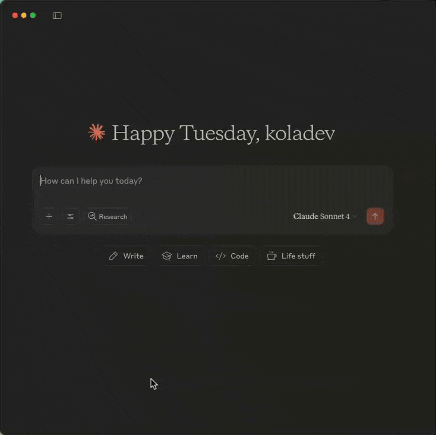
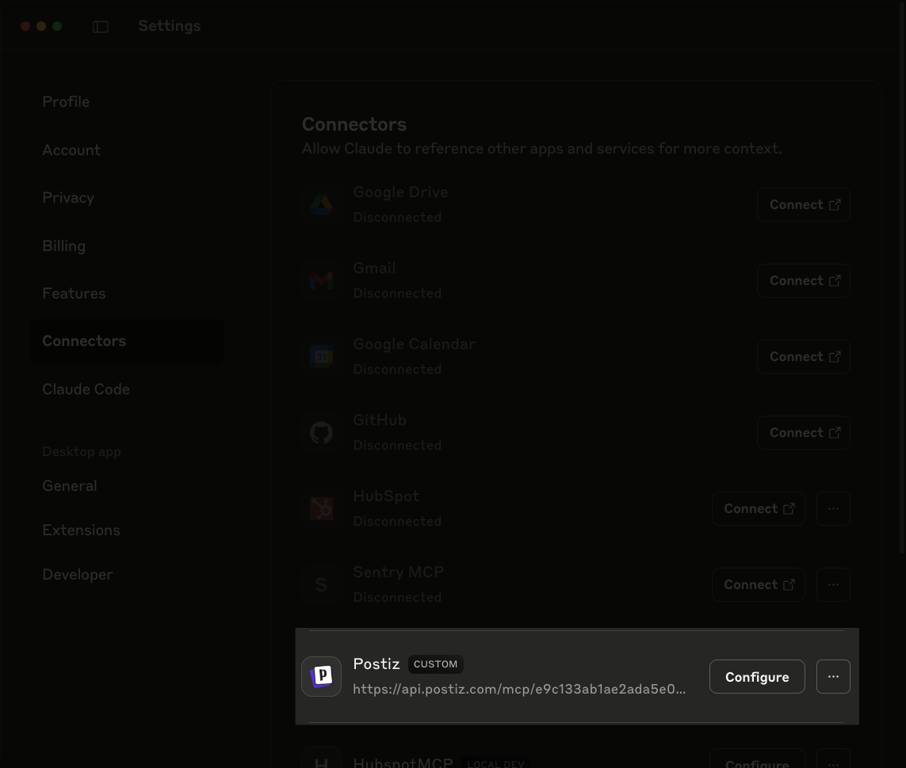
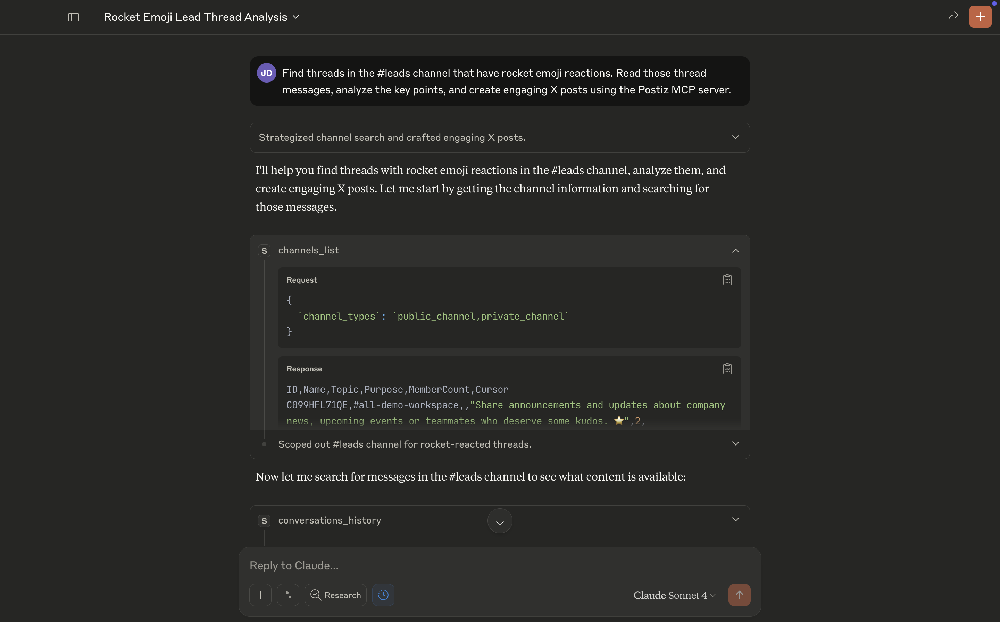
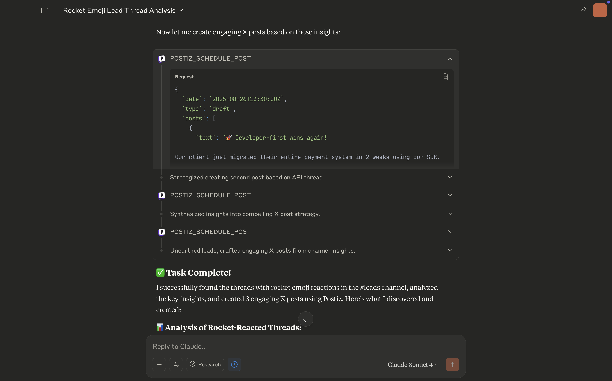

If you're like most communicative teams, your Slack channels are full of great insights, customer feedback, and interesting discussions that never make it beyond your workspace. 

In this guide, you will learn how to use the Slack and Postiz MCP servers with Claude Desktop to automatically transform those valuable conversations into social media content.



## Prerequisites

Before we get started, make sure you have:

- [Claude Desktop](https://claude.ai/download) installed.
- Both MCP servers set up:
  - [Slack MCP server setup](/mcp/using-mcp/slack-mcp-guide).
  - [Postiz MCP server setup](/mcp/using-mcp/postiz-mcp-guide).

## Installing the MCP servers

After following both setup guides, your `claude_desktop_config.json` should include the Slack MCP server:

```json
{
    "mcpServers": {
      "SlackMCPServer": {
        "command": "PATH_TO/slack-mcp-server",
        "args": [],
        "env": {
          "SLACK_MCP_XOXC_TOKEN": "YOUR_XOXC_TOKEN",
          "SLACK_MCP_XOXD_TOKEN": "YOUR_XOXD_TOKEN",
          "SLACK_MCP_SSE_API_KEY": "my-sse-secret-key-123"
        }
      }
    }
  }
```

You should also see your Postiz connector listed in Claude Desktop **Settings → Connectors**.



With these configuration available in your Claude Desktop application, we can test the integration. 

## Testing the integration

Here's a practical scenario: let's say your team uses 🚀 reactions to mark threads that contain insights worth sharing externally. You can ask Claude to find these conversations and turn them into social media posts:

Here is the prompt: 

```
Find threads in the #threads channel that have 🚀 emoji reactions. Read those thread messages, analyze the key points, and create engaging X posts using the Postiz MCP server.
```

When you run this prompt, Claude will search your Slack workspace, analyze the marked conversations, and create optimized posts for your social platforms.



The posts get scheduled through Postiz, and you can review them at [platform.postiz.com](https://platform.postiz.com/).



## Conclusion

In this guide, you learned how to transform your best Slack threads into social media posts by finding threads marked with 🚀 reactions. 

You can customize this workflow based on your team's needs, focusing on messages from specific channels or particular users to create content that resonates with your audience.