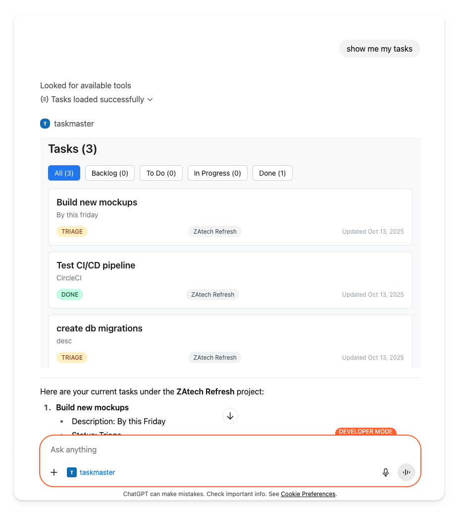
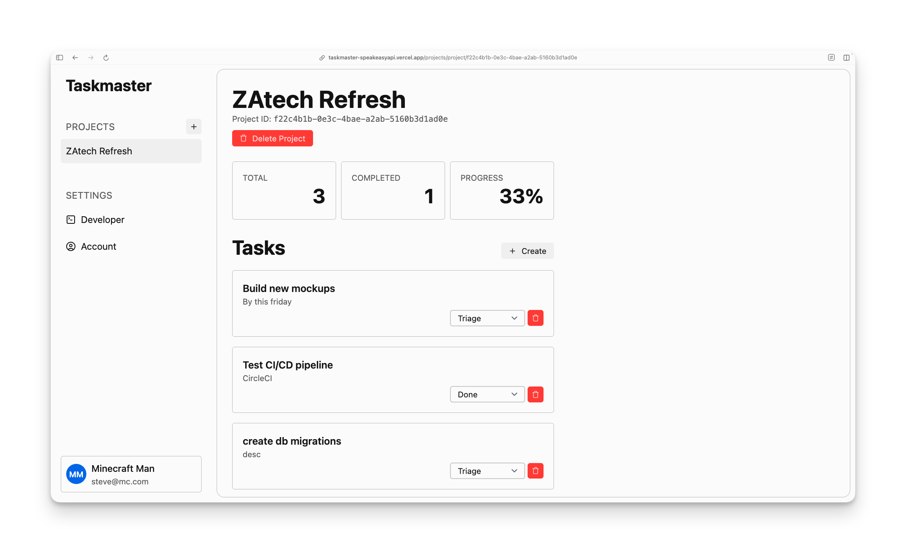
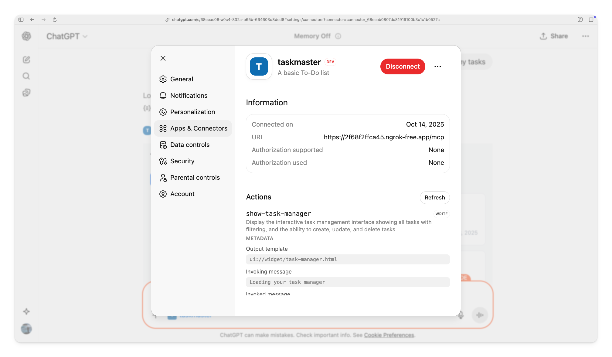

# Bringing your app to ChatGPT with MCP and Apps SDK

Most companies embed AI assistants into their applications. You build a chat interface, manage LLM connections, handle prompt engineering. Users have to visit your app to get AI help.

With MCP and OpenAI's Apps SDK, you flip this around. Instead of bringing AI to your app, you bring your app to ChatGPT. Users interact with your data through ChatGPT's interface using natural language. They stay in ChatGPT, where 800 million people already spend their time.



This guide walks through building a ChatGPT integration using TaskMaster as an example. TaskMaster is a task management application at [taskmaster-speakeasyapi.vercel.app](https://taskmaster-speakeasyapi.vercel.app/) with a REST API. You'll see how to expose your API as tools ChatGPT can use, and how to build visual components that render directly in conversations.

## What you're building

TaskMaster is a working task management app. Users sign in, create projects, manage tasks, and track their work. It has a REST API with endpoints for creating tasks, listing them, updating status, and managing relationships between tasks - the kind of CRUD API you probably already have.




You'll build a FastMCP server that exposes the TaskMaster API endpoints as tools and widgets. The server bridges ChatGPT and your API, giving users a visual, interactive way to manage their tasks through natural language.

## How the architecture works

When a user asks ChatGPT to interact with your app, several systems work together.

The Model Context Protocol is an open standard created by Anthropic. It defines how AI systems connect to external tools. Think of it as a universal adapter, you implement MCP once, and any MCP-compatible AI can use your tools.

OpenAI's Apps SDK builds on MCP by adding visual components. Tools can (and are recommended to) return widgets that render in ChatGPT's interface. This creates more rich, interactive experiences within ChatGPT.

For example, suppose a user asks "Show me my tasks":

1. ChatGPT discovers the `list-tasks` tool from your MCP server
2. ChatGPT calls that tool
3. Your server fetches tasks from the TaskMaster API
4. Your server returns structured data plus a widget reference
5. ChatGPT fetches the widget HTML
6. ChatGPT renders the widget in an iframe
7. The user sees an interactive task list

The MCP server acts as the translation layer. It takes ChatGPT's tool calls, talks to your API, and packages responses in a format ChatGPT understands.

## Building a TaskMaster MCP server using FastMCP

OpenAI's Apps SDK isn't a separate framework - it's functionality built into the official MCP SDKs. When you use the [Python MCP SDK](https://github.com/modelcontextprotocol/python-sdk) or [TypeScript MCP SDK](https://github.com/modelcontextprotocol/typescript-sdk), you get everything you need to create ChatGPT integrations with visual widgets. The term "Apps SDK" refers to these widget-rendering capabilities that OpenAI added to the MCP protocol.

Our TaskMaster MCP server uses [FastMCP](https://github.com/modelcontextprotocol/python-sdk), which is part of the official Python MCP SDK. FastMCP simplifies building MCP servers by handling protocol details and giving you a FastAPI app ready to deploy. You focus on defining tools and widgets, and FastMCP manages the rest.

### Prerequisites

To follow along, you'll need:

- Python 3.11 or later
- A TaskMaster account at [taskmaster-speakeasyapi.vercel.app](https://taskmaster-speakeasyapi.vercel.app/)
- An API key from the Developer settings in TaskMaster
- Basic familiarity with async Python and REST APIs

The complete working code is available at [github.com/ritza-co/taskmaster-openai-app-sdk](https://github.com/ritza-co/taskmaster-openai-app-sdk). You can clone and run it immediately to see the integration in action. The sections below walk through the key parts to help you understand how to build your own.

Here's how the TaskMaster integration is organized:

```
taskmaster-openai-app-sdk/
├── main.py                 # FastMCP server
├── taskmaster_client.py    # API client
├── models.py               # Data models
├── widgets/
│   ├── task_list.html      # Task list widget
│   └── task_creator.html   # Task creation widget
└── requirements.txt
```

The FastMCP server (`main.py`) registers tools, handles tool calls, fetches data, and returns widgets. The API client (`taskmaster_client.py`) handles authentication and requests to TaskMaster. Pydantic models (`models.py`) validate data. Widgets are HTML/CSS/JavaScript components that render in ChatGPT.

This separation keeps concerns clear. The MCP layer handles protocol details. The client handles API communication. Widgets handle presentation.

### Setting up FastMCP

FastMCP uses a basic server structure to define tools, resources, and handle tool calls.

```python
from fastmcp import FastMCP

mcp = FastMCP(name="taskmaster-mcp")

# Define tools
@mcp._mcp_server.list_tools()
async def _list_tools():
    return [...]

# Define resources (widgets)
@mcp._mcp_server.list_resources()
async def _list_resources():
    return [...]

# Handle tool calls
async def _call_tool_request(req):
    tool_name = req.params.name
    arguments = req.params.arguments
    # Handle the request
    pass

# Create FastAPI app
app = mcp.http_app()
```

FastMCP wraps the MCP protocol and provides a Pythonic API. You define tools and resources, handle calls, and FastMCP manages the rest.

### Defining tools

Tools are functions ChatGPT can invoke. Each tool has a name, description, input schema, and optional output widget.

Here's how we can define a `list-tasks` tool:

```python
types.Tool(
    name="list-tasks",
    title="Show Tasks",
    description="Show all tasks with ability to update, delete, and manage them",
    inputSchema={
        "type": "object",
        "properties": {
            "project_id": {
                "type": "string",
                "description": "Optional project ID to filter tasks"
            }
        }
    },
    _meta={
        "openai/outputTemplate": "ui://widget/task-manager.html",
        "openai/widgetAccessible": True,
    }
)
```

The `_meta` field tells ChatGPT this tool returns a widget. The `outputTemplate` points to the widget URI. When ChatGPT calls this tool, it will fetch and render that widget.

The `inputSchema` follows JSON Schema format. ChatGPT uses this to understand what parameters the tool accepts.

### Registering widgets as resources

Widgets are MCP resources. You register them with a URI that matches what you declared in the tool:

```python
types.Resource(
    uri="ui://widget/task-manager.html",
    mimeType="text/html+skybridge",
    text=load_widget_html(widget)
)
```

The URI must start with `ui://`. The special MIME type `text/html+skybridge` tells ChatGPT this is a renderable widget. The `text` field contains the actual HTML.

In our integration, `load_widget_html()` reads HTML files from the `widgets/` directory:

```python
def load_widget_html(widget):
    try:
        with open(widget.html_path, 'r') as f:
            return f.read()
    except FileNotFoundError:
        return f"<div>Widget not found</div>"
```

### Handling tool calls

When ChatGPT calls a tool, your server needs to fetch data and return it in the right format. Here's the integration's handler for `list-tasks`:

```python
async def handle_list_tasks(project_id=None):
    # Create API client
    client = TaskmasterClient(
        api_key=os.getenv("TASKMASTER_API_KEY")
    )

    # Fetch tasks
    tasks = await client.list_tasks(project_id=project_id)
    projects = await client.list_projects()

    # Build project lookup
    projects_dict = {p.id: p.name for p in projects}

    # Package for ChatGPT and widget
    structured_content = {
        "tasks": [t.model_dump(mode="json") for t in tasks],
        "projects": projects_dict,
    }

    # Return with widget metadata
    return types.CallToolResult(
        content=[
            types.TextContent(
                type="text",
                text=f"Retrieved {len(tasks)} task(s)."
            )
        ],
        structuredContent=structured_content,
        _meta={
            "openai.com/widget": widget_resource.model_dump(),
            "openai/outputTemplate": "ui://widget/task-manager.html",
        }
    )
```

The handler does three things:

1. Fetches data from the API
2. Transforms it into structured content
3. Returns it with widget metadata

ChatGPT gets the structured content for reasoning about tasks. The widget gets the same data to display visually.

### Building the API client

The API client wraps your REST API with async HTTP calls. We'll need this as Taskmaster requires an API key to authenticate requests.

```python
import httpx
from models import Task, Project

class TaskmasterClient:
    def __init__(self, api_key=None, oauth_token=None):
        self.base_url = "https://taskmaster-speakeasyapi.vercel.app/api"
        self.api_key = api_key
        self.oauth_token = oauth_token
        self.client = httpx.AsyncClient(timeout=30.0)

    def _get_headers(self):
        headers = {"Content-Type": "application/json"}
        if self.oauth_token:
            headers["Authorization"] = f"Bearer {self.oauth_token}"
        elif self.api_key:
            headers["x-api-key"] = self.api_key
        return headers

    async def list_tasks(self, project_id=None):
        url = f"{self.base_url}/tasks"
        params = {"project_id": project_id} if project_id else {}

        response = await self.client.get(
            url,
            headers=self._get_headers(),
            params=params
        )
        response.raise_for_status()

        return [Task(**task) for task in response.json()]
```

This handles authentication (API key or OAuth), makes requests, and validates responses with Pydantic models. You can get an API key by signing into [TaskMaster](https://taskmaster-speakeasyapi.vercel.app/) and visiting the Developer settings. The models in `models.py` match your API schema:


In `models.py` we define the data models for tasks and projects.

```python
from pydantic import BaseModel, Field
from datetime import datetime

class Task(BaseModel):
    id: str
    title: str = Field(..., max_length=255)
    description: str = Field(..., max_length=500)
    created_by: str
    project_id: str | None = None
    status: str = "todo"
    created_at: datetime
    updated_at: datetime
```

Pydantic automatically validates API responses and provides type hints throughout your code.

### Creating widgets

Widgets are HTML/CSS/JavaScript components that run in a sandboxed iframe inside ChatGPT. You can use any frontend framework, but the integration uses vanilla JavaScript to keep things simple.

Here's the basic structure of the task list widget:

```html
<!DOCTYPE html>
<html>
<head>
    <style>
        /* Styles for the task list */
    </style>
</head>
<body>
    <div id="taskmaster-list-root"></div>

    <script type="module">
        (async function() {
            const root = document.getElementById('taskmaster-list-root');

            // Load data from MCP tools
            const loadData = async () => {
                const tasksResult = await window.openai.callTool('list-tasks', {});
                const projectsResult = await window.openai.callTool('list-projects', {});

                const tasks = tasksResult?.structuredContent?.tasks || [];
                const projects = projectsResult?.structuredContent?.projects || [];

                render(tasks, projects);
            };

            // Render the UI
            function render(tasks, projects) {
                root.innerHTML = `
                    <div class="task-list">
                        ${tasks.map(task => `
                            <div class="task-card">
                                <h3>${task.title}</h3>
                                <p>${task.description}</p>
                                <span class="status">${task.status}</span>
                            </div>
                        `).join('')}
                    </div>
                `;
            }

            // Initialize
            await loadData();
        })();
    </script>
</body>
</html>
```

The key is `window.openai`, which bridges your widget and ChatGPT.

### The window.openai API

Widgets access ChatGPT functionality through `window.openai`. This API provides several capabilities:

**Calling tools** - `window.openai.callTool(name, args)` lets widgets invoke MCP tools directly:

```javascript
const result = await window.openai.callTool('list-tasks', {
    project_id: 'abc-123'
});
const tasks = result?.structuredContent?.tasks || [];
```

**Reading tool output** - `window.openai.toolOutput` contains the structured data from the tool call that opened the widget.

**Persisting state** - `window.openai.setWidgetState(state)` saves UI state across sessions:

```javascript
// Save filter preference
await window.openai.setWidgetState({
    currentFilter: 'in_progress'
});

// Restore on load
const state = window.openai.widgetState || {};
const filter = state.currentFilter || 'all';
```

**Sending messages** - `window.openai.sendFollowupMessage({prompt})` sends text to ChatGPT:

```javascript
await window.openai.sendFollowupMessage({
    prompt: "Create a summary of completed tasks"
});
```

**Theme detection** - `window.openai.theme` tells you if ChatGPT is in light or dark mode.

The task list widget uses `callTool()` to fetch fresh data and `setWidgetState()` to remember filter preferences.

### Mapping your API to tools

Start by deciding which API endpoints should be tools. The TaskMaster REST API maps naturally:

- `GET /tasks` → `list-tasks` tool (returns widget)
- `POST /tasks` → `create-task` tool (returns widget)
- `PUT /tasks/{id}` → `update-task` tool (no widget, just confirmation)
- `DELETE /tasks/{id}` → `delete-task` tool (no widget)
- `GET /projects` → `list-projects` tool (no widget, data only)

Read operations that return collections work well with widgets. Write operations typically just confirm success with text.

Some tools exist purely to support widgets. The `list-projects` tool doesn't have its own widget, but the task list widget calls it to display project names.

## Testing your integration

Run the MCP server locally:

```bash
python main.py
```

This starts a FastAPI server on `http://localhost:8000`. The MCP endpoint is at `http://localhost:8000/mcp/sse`.

Use the [MCP Inspector](https://modelcontextprotocol.io/docs/tools/inspector) to test tools without ChatGPT:

1. Point the inspector to `http://localhost:8000/mcp`
2. List available tools
3. Call tools with test parameters
4. Verify widgets render correctly

The inspector shows exactly what ChatGPT sees - the tool calls, structured responses, and rendered widgets.

## Connecting to ChatGPT

For development, expose your local server with [ngrok](https://ngrok.com/):

```bash
ngrok http 8000
```

This gives you an HTTPS URL like `https://abc123.ngrok.app`. ChatGPT requires HTTPS.

In ChatGPT, enable developer mode in settings. Add your MCP server:

1. Go to Settings → Developer
2. Click "Add Connector"
3. Configure the connector with the ngrok URL, a name and **turn off** authentication, then click "Connect".
4. Save and restart the chat



ChatGPT will discover your tools and make them available in conversations. Try asking "Show me my tasks" to test the integration.


## Patterns from TaskMaster

TaskMaster demonstrates several useful patterns.

**Widget-initiated actions** - Users click buttons in the task list to edit tasks. The widget calls tools directly:

```javascript
async function updateTask(taskId, updates) {
    await window.openai.callTool('update-task', {
        task_id: taskId,
        ...updates
    });

    // Refresh the list
    await loadData();
}
```

This keeps interactions fast. Users don't have to ask ChatGPT in natural language for every action.

**Dual-purpose data** - The `structuredContent` field contains data for ChatGPT's reasoning. The `_meta` field contains extra information only the widget needs:

```python
return types.CallToolResult(
    structuredContent={
        "tasks": [t.model_dump(mode="json") for t in tasks[:10]]
    },
    _meta={
        "all_task_ids": [t.id for t in tasks],  # Widget-only
        "filter_options": ["backlog", "todo", "done"]  # Widget-only
    }
)
```

This keeps what ChatGPT processes concise while giving widgets everything they need.

**Coordinated tools** - Widgets can call multiple tools to assemble a view. The task list calls both `list-tasks` and `list-projects` to show task cards with project names.

## Deploying to production

For production, you need a publicly accessible HTTPS endpoint. Here are a few options:

**Traditional hosting** - Deploy to any Python hosting platform (Heroku, Railway, Fly.io). Make sure your server runs on HTTPS and can handle Server-Sent Events (SSE) for MCP connections.

**Serverless** - FastMCP Cloud can host MCP servers. Check it out at [FastMCP Cloud](https://fastmcp.cloud/).

See OpenAI's [deployment guide](https://developers.openai.com/apps-sdk/deploy) for requirements and best practices.

## Next steps

The TaskMaster source code at [github.com/ritza-co/taskmaster-openai-app-sdk](https://github.com/ritza-co/taskmaster-openai-app-sdk) shows a complete working example. Clone it, run it locally, modify the widgets to see how changes affect the UI.

OpenAI's documentation covers topics we didn't explore here:

- [Defining tools](https://developers.openai.com/apps-sdk/plan/tools) - Input schemas, metadata, tool discovery
- [Building components](https://developers.openai.com/apps-sdk/plan/components) - Widget lifecycle, styling, advanced interactions
- [Planning your use case](https://developers.openai.com/apps-sdk/plan/use-case) - Designing tools, mapping user stories
- [Deploying](https://developers.openai.com/apps-sdk/deploy) - Production requirements, security, distribution

The paradigm is real. Instead of bringing AI to your app, bring your app to AI. Meet your users in ChatGPT, where they already spend their time.
