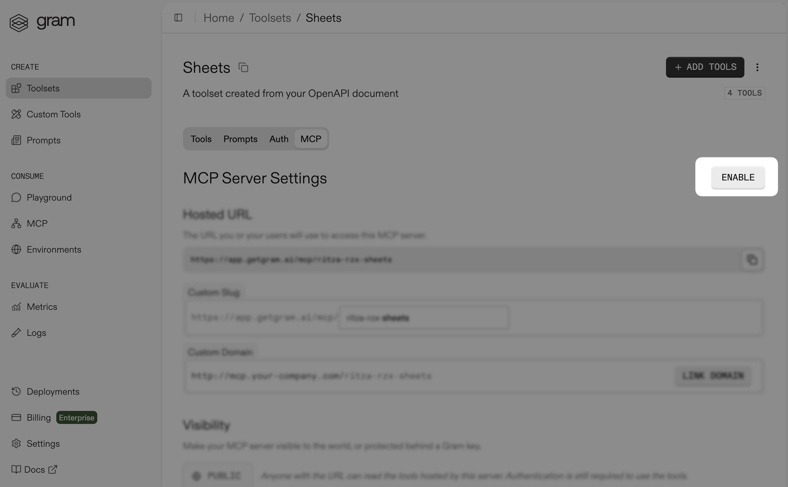
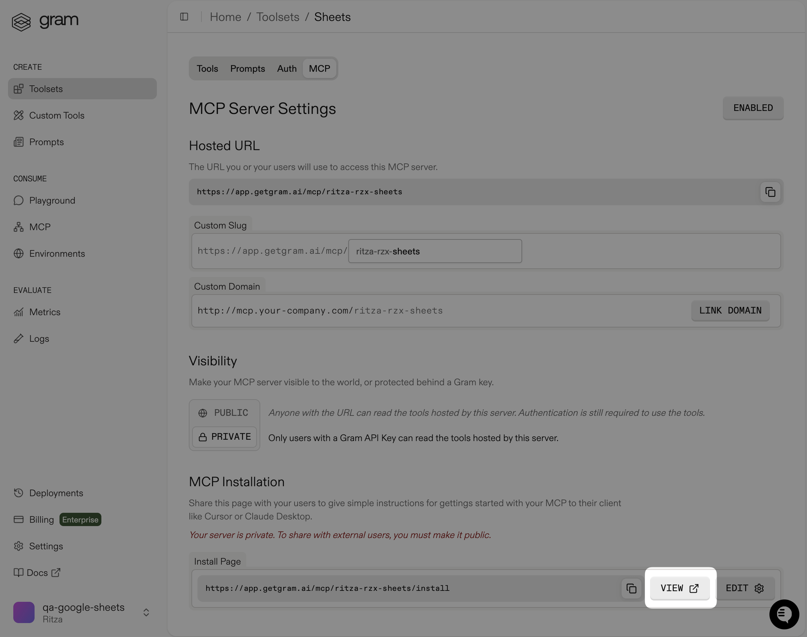
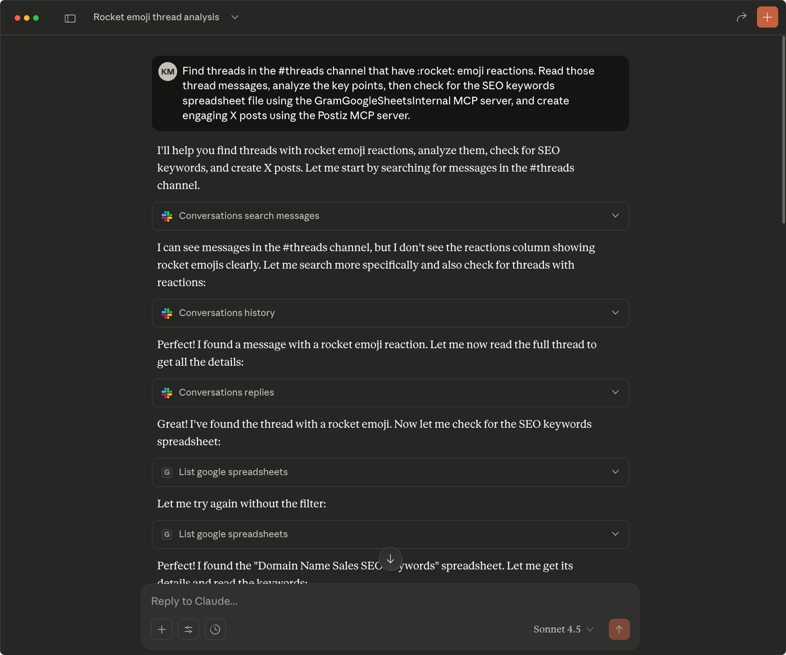

# Social media scheduling with MCP (Slack + Postiz)

If you're like most communicative teams, your Slack channels are full of great insights, customer feedback, and interesting discussions that never make it beyond your workspace.

This guide demonstrates how to use the Slack and Postiz MCP servers with Claude Desktop to automatically transform those valuable conversations into social media content.

<video
  controls={true}
  width="100%"
  className="mx-auto my-10"
  muted={true}
>
  <source src="/assets/videos/mcp/use-cases/demo.mp4" type="video/mp4" />
</video>

## Prerequisites

Before you get started, make sure you have:

- [Claude Desktop](https://claude.ai/download) installed
- Both MCP servers set up:
  - [Slack MCP setup guide](/mcp/using-mcp/mcp-server-providers/slack)
  - [Postiz MCP setup guide](/mcp/using-mcp/mcp-server-providers/postiz)

## Installing the MCP servers

You should also see your Postiz connector listed in Claude Desktop, under **Settings → Connectors**.


With Slack and Postiz configured in Claude, you can test the integration.

## Testing the integration

Here's a practical scenario: Let's say your team uses 🚀 emoji reactions to mark Slack threads that contain insights worth sharing externally. You can ask Claude to find these conversations and turn them into social media posts:

Here is the prompt:

```
Find threads in the #threads channel that have 🚀 emoji reactions. Read those thread messages, analyze the key points, and create engaging X posts using the Postiz MCP server.
```

When you run this prompt, Claude searches your Slack workspace, analyzes the marked conversations, and creates optimized posts for your social platforms.


Claude schedules the posts using Postiz, so you can review them at [platform.postiz.com](https://platform.postiz.com/).


## Adding keyword targeting with Google Sheets and Gram

Your marketing team likely has a keyword strategy for including specific terms they want to target in social content. Instead of manually checking if Slack conversations mention these keywords, you can store them in a Google Sheet (in a Google Drive folder) and have Claude reference them automatically.

You could use the Google Sheets MCP server from the quickstart [guide](/mcp/using-mcp/google-sheet-claude-quickstart), but that's overkill:

- Claude only needs to read the spreadsheet.
- The Google Sheets MCP server exposes 15+ operations when you need three at most. For internal data, building your own API gives you better control over privacy and security.

If you already have an API, make sure you have an OpenAPI document. You can create an MCP server by uploading the OpenAPI document to Gram.

For this guide, we've built a basic Google Sheets API with three operations: reading sheet data, listing sheets, and getting spreadsheet details. Clone the [example repository](https://github.com/speakeasy-api/examples/tree/main/google-sheet-mcp-server-api), follow the `README` to host it, and generate an OpenAPI document. Then continue to the next section.

### Creating the internal Google Sheets MCP server on Gram

[Gram](https://getgram.ai/) generates MCP servers from OpenAPI documents and handles hosting. Upload your OpenAPI document, configure your environment variables, and the server is ready.

[Sign up for Gram](https://getgram.ai/) and follow these steps:

- On the [**Toolsets** page](https://docs.getgram.ai/build-mcp/create-default-toolset), upload the OpenAPI document for your Google Sheets API.

- Create a toolset named `Google Sheets Tools` and enable the tools you need.

  

- In the [**Auth** tab](https://docs.getgram.ai/concepts/environments), set `SERVER_URL` to your deployed API's URL. If you're running the API locally, expose it with [ngrok](https://ngrok.com/) by running `ngrok http 127.0.0.1:8000` and use the forwarding URL for `SERVER_URL`.

- In **Settings**, create a [Gram API key](https://docs.getgram.ai/concepts/api-keys).

### Install the MCP server in Claude Desktop

In your Google Sheets toolset's **MCP** tab, click the **View** button on the **MCP Installation** section to view the installation configuration.



Open Claude Desktop, navigate to **Settings** → **Developer**, and click **Edit Config**. Open the `claude_desktop_config.json` file, paste the installation configuration from Gram, and replace `<your-key-here>` with your Gram API key. Your configuration will be similar to the following example:

```json
{
  "mcpServers": {
    "GramGooglesheetstools": {
      "command": "npx",
      "args": [
        "mcp-remote",
        "https://app.getgram.ai/mcp/xxxxx",
        "--header",
        "Gram-Environment:default",
        "--header",
        "Authorization:${GRAM_KEY}"
      ],
      "env": {
        "GRAM_KEY": "Bearer <your-key-here>"
      }
    }
  }
}
```

Restart Claude Desktop, open a new chat, and verify the integration by asking Claude to create posts based on your SEO keywords:

```txt
Find threads in the #threads channel that have 🚀 emoji reactions. Read those thread messages, analyze the key points, then check for the SEO keywords spreadsheet file using the GramGoogleSheets MCP server, and create engaging X posts using the Postiz MCP server.
```



## Conclusion

Claude can now automatically turn your best Slack threads into social media posts by finding threads marked with 🚀 reactions. With the Google Sheets MCP integration, Claude Desktop ensures your content targets your priority keywords.

Customize this workflow to suit your team's needs and skills. For example, telling Claude to focus on messages from specific channels or users may help it create content that resonates with your audience.
