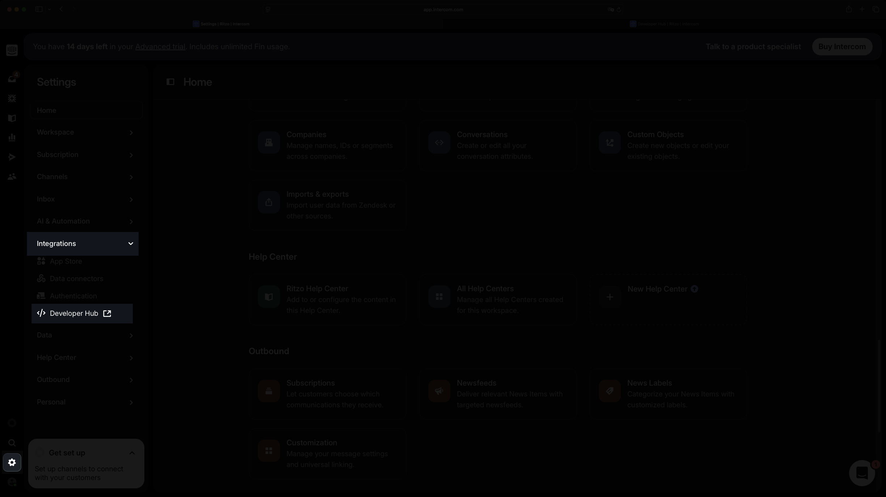
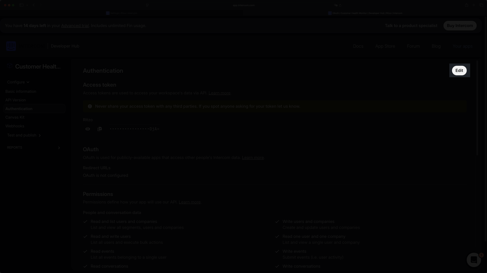
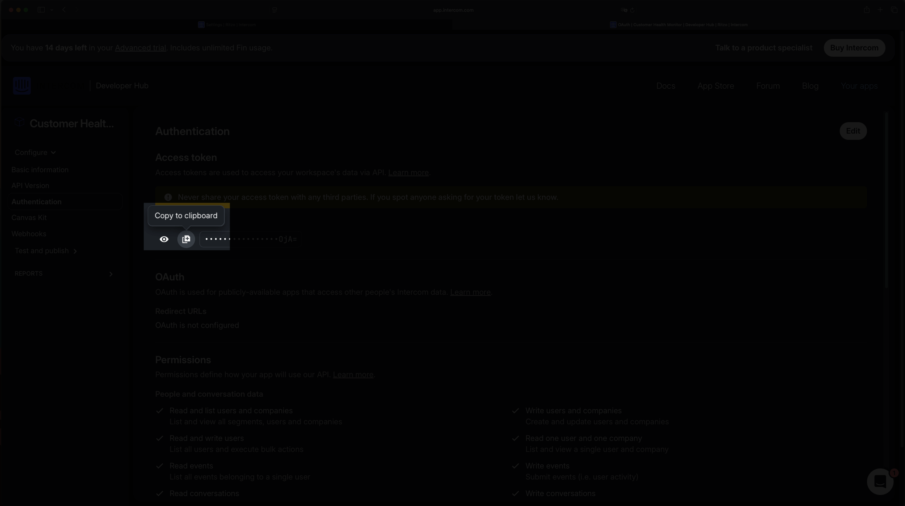

import { Screenshot } from "@/mdx/components";
import GramCallout from "../.partials/gram-callout.mdx";

<GramCallout />

[Intercom](https://www.intercom.com) is a customer messaging platform that helps teams manage support conversations and customer relationships.

Using the Intercom MCP Server, you can analyze customer conversations through Claude Desktop, identifying churn risks and sentiment patterns by describing what you need in natural language.

<Screenshot src="assets/intercom-inbox-demo.png" alt="Intercom inbox showing multiple conversations with varying customer health signals" />

At the end of this guide, you'll know how to connect the Intercom MCP Server to Claude Desktop.

## Prerequisites

Before we begin, make sure you have:

- [Claude Desktop](https://claude.ai/download) installed
- An [Intercom workspace](https://www.intercom.com/) with admin access or permission to create integrations
- A few sample conversations in Intercom (we'll show you how to set this up)

## Set up demo data in Intercom

For this guide, we need realistic customer data to analyze. We'll use the Intercom Messenger chat widget to create sample conversations.

### Install the Intercom Messenger component

Since we can't directly create conversations in Intercom, we'll use a Messenger widget component to create sample conversations.

<Screenshot src="assets/intercom-messenger-install.png" alt="Intercom Messenger installation page showing code snippet options" />

Navigate to **Settings** > **Channels** > **Messenger** in your Intercom workspace. Under **Install** you'll see installation options for different platforms. Choose "Code snippet" and follow the instructions to install the widget.

### Create sample customer conversations

Using the Messenger widget, we'll create several conversations that represent different customer health scenarios.

These messages will range from satisfied customers asking feature questions to frustrated users reporting technical issues and customers requesting cancellations. Here's an example of what one message might look like:

<Screenshot src="assets/intercom-conversation-example.png" alt="Example conversation showing a customer requesting subscription cancellation" />

James Wilson is a customer who is actively seeking to cancel his subscription due to poor ROI. This is a critical churn signal that needs immediate attention.

We'll create a few more messages with varying sentiment levels to build a realistic idea of what a messy inbox looks like. Once you've created these messages, your Intercom inbox should look like this:

## Install and configure the Intercom MCP server

We'll use the Intercom MCP server to connect your Intercom data to Claude Desktop.

### Get your Intercom access token

First, create an Intercom app to access your data:

1. In Intercom, go to **Settings** > **Integrations** > **Developer Hub**.

   

2. Click the **New app** button and create an internal integration.

3. Name it "Customer Health Monitor".

4. Under **Authentication**, you should have the following permissions enabled.

   - Read conversations.
   - Read contacts.
   - Read companies.
   - Read events.
   - Write events (for updating customer data).

5. If that's not the case, click on the **Edit** button to enable the permissions above.

   

6. Copy your **Access Token** from the authentication section.

   

### Configure Intercom MCP server in Claude Desktop

Open your Claude Desktop configuration file and add the Intercom MCP server:

- **macOS**: `~/Library/Application Support/Claude/claude_desktop_config.json`
- **Windows**: `%APPDATA%\Claude\claude_desktop_config.json`

```json
{
  "mcpServers": {
    "intercom": {
      "command": "npx",
      "args": [
        "mcp-remote",
        "https://mcp.intercom.com/mcp",
        "--header",
        "Authorization:${AUTH_HEADER}"
      ],
      "env": {
        "AUTH_HEADER": "Bearer YOUR_INTERCOM_ACCESS_TOKEN"
      }
    }
  }
}
```

Replace `YOUR_INTERCOM_ACCESS_TOKEN` with the access token you copied from the Intercom authentication page in the previous step.

Restart Claude Desktop. When you first try to use the Intercom tools, Claude will ask for permission to access them. Click "Allow always" or "Allow once" to proceed.

## Testing the connection

With the Intercom MCP server configured, you can now ask Claude to analyze your customer conversations. Test the integration with:

> List my recent Intercom conversations and identify any customer health signals. Summarize and give me a list of customers that are at risk of churning.

<video
  controls={false}
  loop={true}
  autoPlay={true}
  muted={true}
  width="100%"
  className="mx-auto my-10 max-w-6xl"
>
  <source src="assets/intercom-claude-desktop.mp4" type="video/mp4" />
</video>

Claude will use the Intercom MCP server to get the list of conversations, identify the conversations that are at risk of churning, and summarize the conversations.

## Automate your workflow

Once you've gotten the hang of it, you can automate it by:

1. **Creating a weekly reminder** to run the health check.
2. **Setting up templates** for common outreach scenarios.
3. **Building a simple dashboard** to track health score trends over time.

Ask Claude:

> Create a follow-up workflow for next week. Set a reminder to run this analysis again and track how our outreach affected the health scores.

## Conclusion

Now that you can analyze customer conversations in Claude Desktop using the Intercom MCP Server, try combining this functionality with other MCP servers. For example, you could use [Slack integration](/mcp/using-mcp/slack-mcp-guide) to automatically notify your customer success team about urgent cases.
