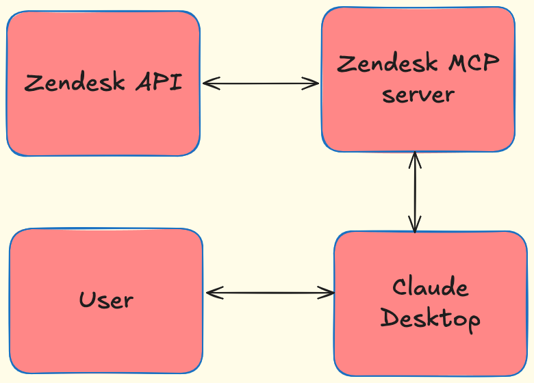
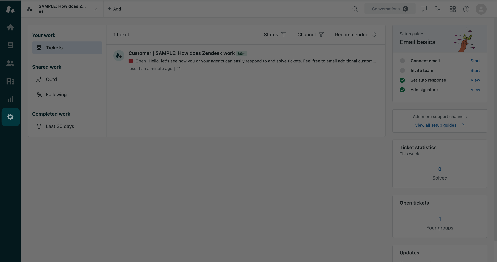
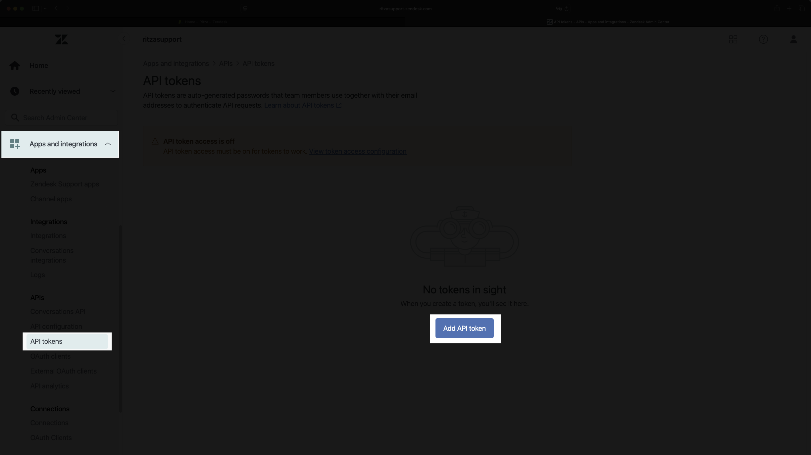
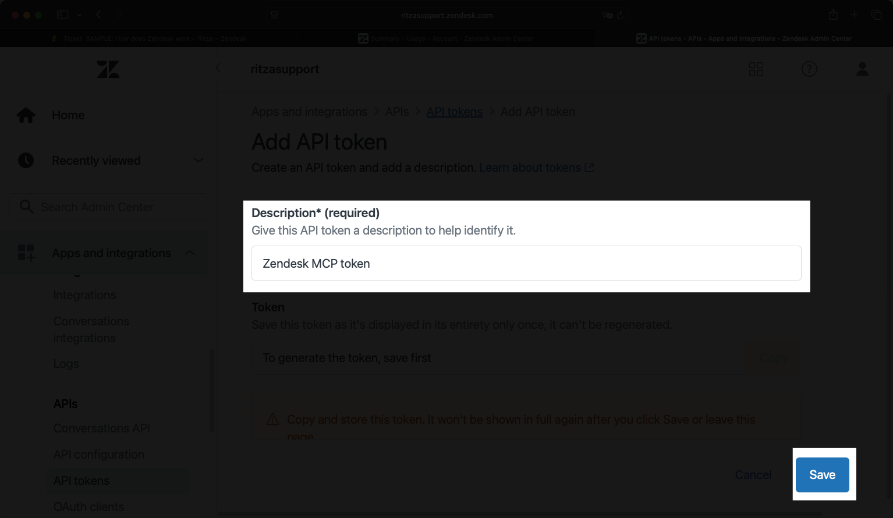
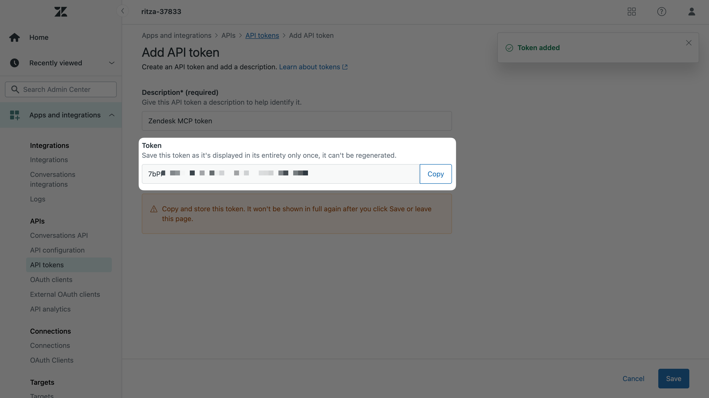
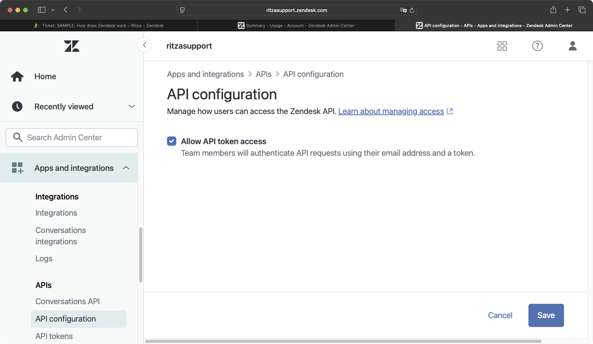
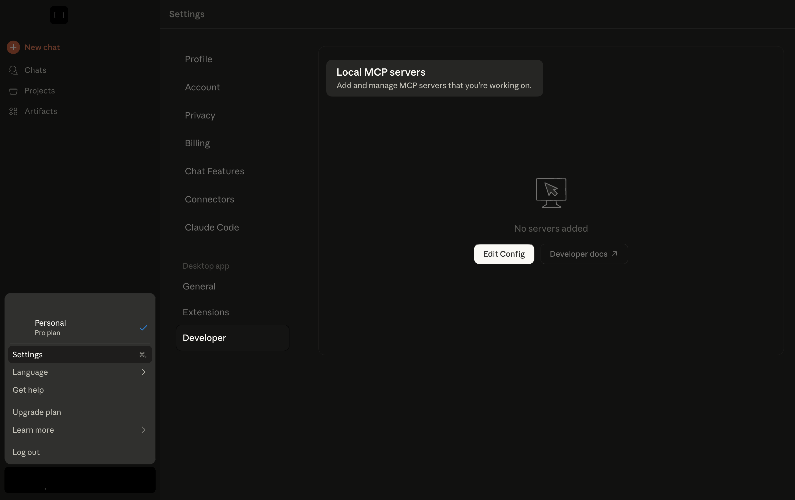
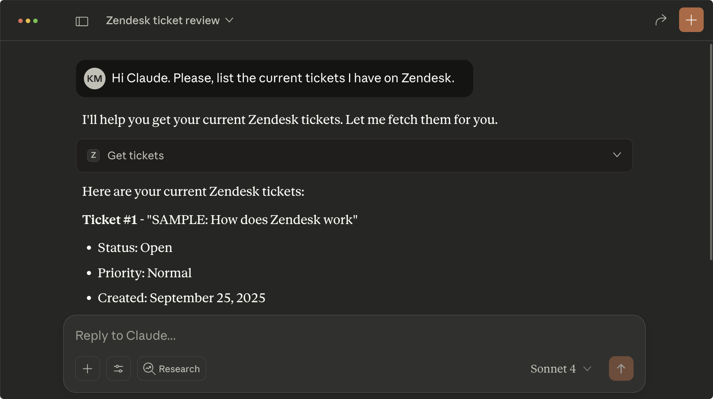
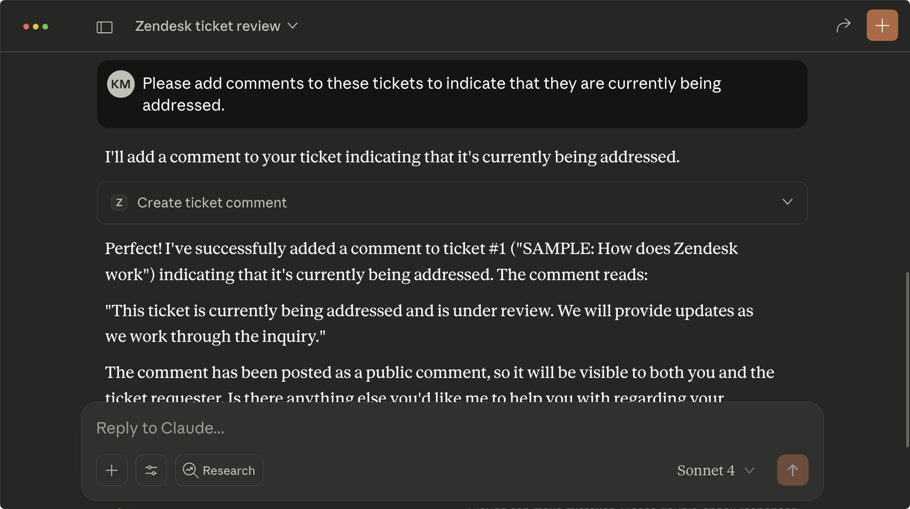
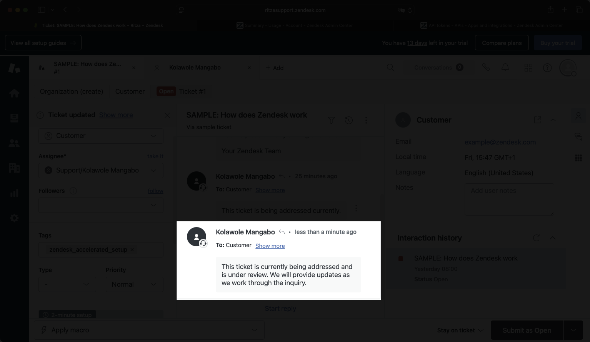

This guide demonstrates how to connect your Zendesk workspace to Claude Desktop using the Model Context Protocol (MCP). Once connected, you can analyze support tickets, track customer satisfaction trends, and generate response templates without leaving the Claude interface.

As Zendesk doesn't provide an official MCP server, this guide uses the open-source [zendesk-mcp-server](https://github.com/reminia/zendesk-mcp-server) that bridges your Zendesk workspace and Claude Desktop.



Here's what the connection looks like in action:

<video src=".assets/zendesk-mcp-demo.mp4" controls=""></video>

## Prerequisites

Before we begin, make sure you have:

- [Claude Desktop](https://claude.ai/download) installed
- A [Zendesk account](https://www.zendesk.com/) with admin access or API permissions
- [uv Python package manager](https://docs.astral.sh/uv/) installed

## Setting up a Zendesk application

In your Zendesk dashboard, click the **Settings** icon in the sidebar.



In the Settings page, click **Apps and integrations**. Then, Click **API tokens** in the left navigation menu and click the **Add API token** button.



After clicking the Add API token button, Zendesk will display the API token creation form. Enter "Zendesk MCP token" in the Description field and click Save.



Copy the generated token immediately and save it securely. You won't be able to view this token again. You'll need this token to configure the Claude Desktop connection in the next step.



To make sure you can make API requests to the Zendesk API with the token, navigate to the **API configuration** page and select the **Allow API token access** option displayed there.



## Installing the Zendesk MCP server in Claude

To install the Zendesk MCP server, you need uv installed on your machine. Execute one of the following commands in your terminal depending on your OS.

```bash
# For macOS and Linux
curl -LsSf https://astral.sh/uv/install.sh | sh
# or
wget -qO- https://astral.sh/uv/install.sh | sh

# For Windows
powershell -ExecutionPolicy ByPass -c "irm https://astral.sh/uv/install.ps1 | iex"
```

Once it's done, clone the `zendesk-mcp-server` project. 

```bash
git clone https://github.com/reminia/zendesk-mcp-server.git
```

Then, navigate to the newly cloned project. 

```bash
cd zendesk-mcp-server
```

Run the build command: 

```bash
uv build
```

Inside the project, create a file named `.env`. This file will contain your Zendesk credentials:

- `ZENDESK_SUBDOMAIN`: your Zendesk subdomain from `YOUR_SUBDOMAIN.zendesk.com`.
- `ZENDESK_EMAIL`: the email address associated with the account used to create the APIs tokens. 
- `ZENDESK_API_KEY` : the API token you created earlier.

The file should look like this: 

```txt
ZENDESK_SUBDOMAIN=xxx
ZENDESK_EMAIL=xxx
ZENDESK_API_KEY=xxx
```

Now update your Claude Desktop configuration to include the MCP server. In **Settings**, go to **Developer** > **Edit Config**. 



In the `claude_desktop_config.json` file that opens, add the Slack MCP Server configuration:

```json
{
  "mcpServers": {
    "zendesk": {
      "command": "uv",
      "args": [
        "--directory",
        "PATH_TO_MCP_SERVER/zendesk-mcp-server",
        "run",
        "zendesk"
      ]
    }
  }
}

```

Replace `PATH_TO_MCP_SERVER` with the absolute path to your cloned `zendesk-mcp-server` directory. 

Restart Claude Desktop to load the server.

## Testing the connection

Test that the Zendesk MCP server have been installed by entering the following prompt. 

```txt
Hi Claude. Please, list the current tickets I have on Zendesk.
```

You should have a similar reply. 



Then, ask Claude to add comments to the ticket that's it's being addressed for example. 

```txt
Please add comments to these tickets to indicate that they are currently being addressed.
```



You can see the comment added in your Zendesk dashboard. 



## Conclusion

Now that you can access your Zendesk workspace through Claude Desktop, try combining this functionality with other MCP servers. For example, you could use [Slack integration]() to automatically notify your support team about urgent tickets, or connect with your CRM to update customer records based on ticket resolutions.
