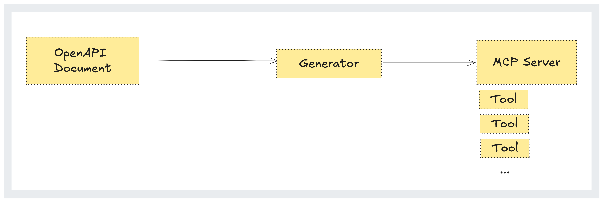
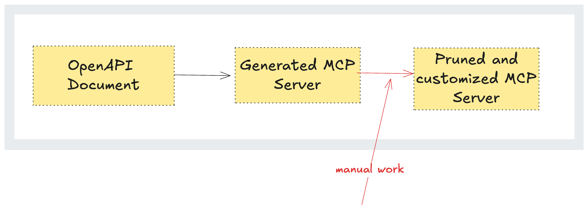
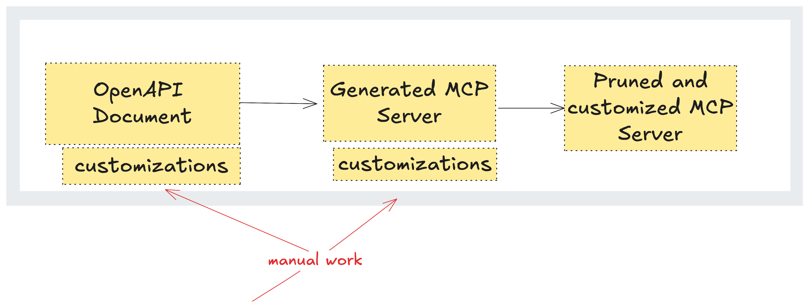
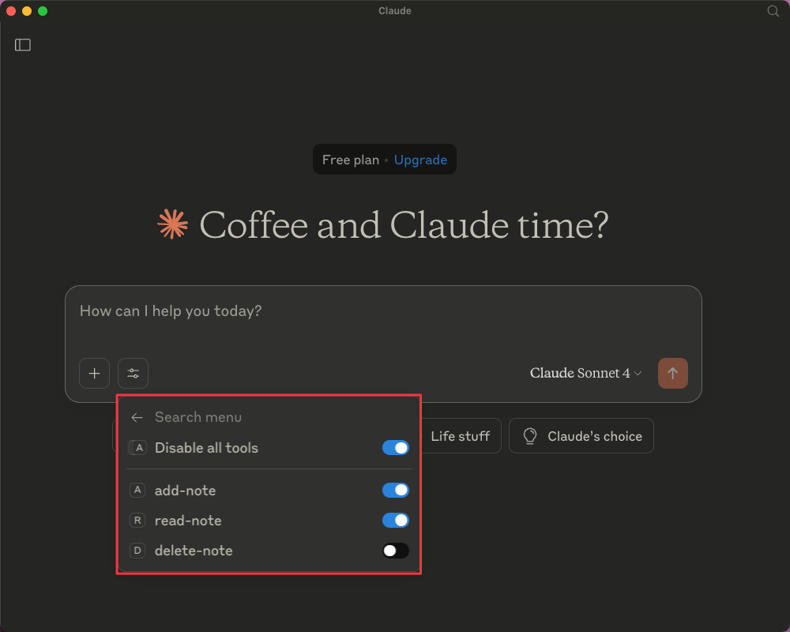
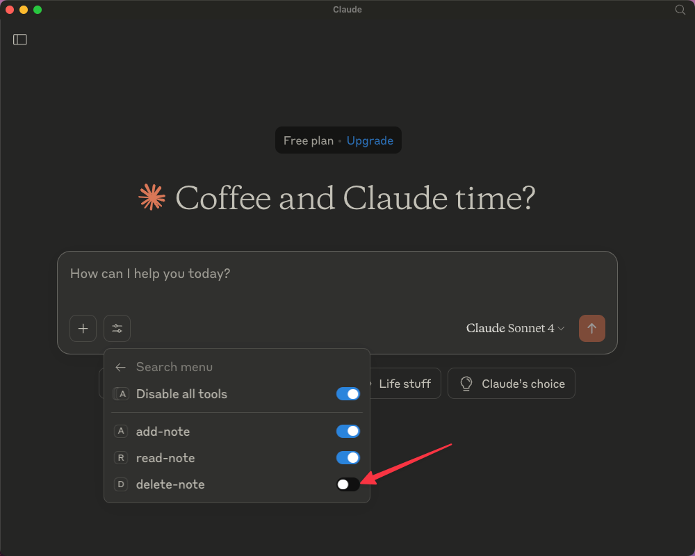

Suddenly, everyone wants an MCP server. You built an API for humans – now AI agents need to use it. That means you need an MCP server. What if you could just point to your OpenAPI document and generate one?

Actually, you can. We've [built a tool](/docs/model-context-protocol) that automatically generates an MCP server from your OpenAPI document.

So far, we've used it to [generate over 50 MCP servers](https://github.com/search?q="speakeasy"+path%3A**%2Fsrc%2Fmcp-server%2Fmcp-server.ts&type=code) for customers, with many already running in production. But generating MCP servers from OpenAPI isn't trivial. In the post [Auto-generating MCP Servers from OpenAPI Schemas: Yay or Nay?](https://neon.tech/blog/autogenerating-mcp-servers-openai-schemas), Neon captures many of the challenges, such as:

- An overwhelming decision space: MCP servers tend to have as many tools as there are operations, which is problematic for APIs with more than 500 operations, like GitHub's.
- Fragile interactions with complex JSON inputs.
- Difficulties with LLMs understanding workflows from the OpenAPI document, like recognizing that users add items to a cart before validating and paying.

To address those challenges, Neon recommends a hybrid approach:

> [Look] at the tools for generating an MCP server from OpenAPI specs, then begin aggressively pruning and removing the vast majority of the generated tools, keeping only low-level operations that represent genuinely useful, distinct capabilities that an LLM might perform.

This is the approach Speakeasy takes, but our generator automates pruning and supports customization for greater specificity. After generating more than 50 production MCP servers, we've seen what breaks, what matters, and what to avoid.

The lessons that follow will help you build and optimize your own MCP server, whether you use our tool or not.

## A short terminology refresher

MCP is a fast-evolving space and can get complex, but for this guide, you only need to understand a few key concepts:

- An **OpenAPI document** is a YAML or JSON file that describes your API, from endpoints to fields to schemas for request payloads, successful responses, and errors. See more on the [Speakeasy OpenAPI hub](/openapi).

- A **generator** is a tool that takes an OpenAPI document as input and produces an artifact. Previously, the Speakeasy generator focused on creating SDKs and documentation to help users interact with our clients' APIs. Now it generates MCP servers, too.

- **[MCP](https://modelcontextprotocol.io/introduction)** is a protocol for AI agents to interact with your API.

- A **[tool](/mcp/tools)** is a function that an agent can call. An MCP Tool consists of the following components:

  - Name
  - Schema
  - Description

  The description can be seen as the "prompt". You need a high-quality description to ensure agents accurately and correctly identify the tool they need to call for a specific action.

  

## Optimizing OpenAPI documents for MCP servers

Being verbose in OpenAPI documents is normal when they're used to generate SDKs and API documentation. Since we, humans, will read and interact with these artifacts, it's intuitive to repeat key information across endpoint, schema, or field descriptions. This helps readers understand things in context without having to jump around the entire document.

However, more words mean more characters and therefore more tokens consumed in the LLM's context window. LLMs prefer concise and direct descriptions. Since LLMs process the entire document at once, unlike humans, this creates a strong reason to modify the OpenAPI document for better efficiency.

So, how do you balance being both concise and clear while avoiding repetition? The truth is, it's impossible without drastically affecting your OpenAPI document, which must serve both the MCP server's needs and API documentation. That's why at Speakeasy, we shifted the optimization layer across three components:

- **The OpenAPI document:** This serves as your single source of truth, so you want to make as many changes directly here as possible. However, how much you can modify the document depends on balancing your MCP server's needs without compromising the clarity or usability of your API documentation and SDKs.
- **The generator itself:** It handles aspects like data formats, streaming, and other common API behaviors that don't work well with agents.
- **A custom function file:** Located alongside your generated MCP server, this lets you precisely control how specific tools behave.

Shifting the optimization layer helps us avoid manual changes directly on the generated MCP server that would need to be repeated after every regeneration.



Instead, our approach creates a workflow that allows us to elegantly control the MCP server while enabling regeneration at any time without losing customizations.



This change in workflow taught us how to tackle common problems when generating production-ready MCP servers. We addressed these challenges by adding customization options both in the OpenAPI document and within the MCP server generator. Let's take a closer look at the issues and our solutions.

## Too many endpoints = too many tools

Let's say you have 200 endpoints in your OpenAPI document. Generating an MCP server from this document will easily create around 200 tools. Now, assume you have 200 buttons in front of you, with a vague initial premise. You'd struggle to find the right button to press, whether it's taking time to analyze or taking a risk and pressing the wrong button.

It's no different for LLMs. When faced with 200 tools, the model becomes confused as its context window is overwhelmed. Since many users rely on smaller models with even shorter context windows, the tool overload problem is more severe than it first appears.

### Our solution to tool explosion

To resolve the tool explosion issue, start by pruning your OpenAPI document before generating MCP servers from it. Exclude non-useful endpoints (like `health/` and `inspect/`) and any that don't address the problem you're solving by using an MCP server.

For example, say you're building an MCP server to help users interact with your e-commerce API by ordering items through an AI agent. Remove endpoints for user authentication, user management, and payments, and keep only those for browsing products, creating carts, and setting addresses.

Another tactic for managing tool explosion is to disable the tools on the client side instead. Claude Desktop allows this, but if the server exposes over 200 tools, manually toggling them off one by one isn't much fun.



At Speakeasy, tool explosion was the first problem we needed to tackle, and fortunately, the easiest. Our generator looks for a custom `disabled` key in the OpenAPI document (defaulting to `false`). When set to `true`, a tool is not generated for this operation.

```yaml
x-speakeasy-mcp:
    disabled: true
```

### OpenAPI descriptions are not designed for LLMs

Some OpenAPI documents include lengthy descriptions written for humans, not large language models (LLMs). These multi-paragraph descriptions often repeat the same details and add noise. The extra text increases token usage, and with many users relying on multiple MCP servers and smaller LLMs, it can fill the context window before the prompt is processed. As a result, the LLM chooses the wrong tool or hallucinates a response.

However, short and vague descriptions also create issues. If several endpoints have similar names but do different things, the LLM won't know which one to use.

Consider the following OpenAPI document snippet:

```yaml
paths:
  /user/profile:
    get:
      summary: Get user profile
      description: Returns the user profile.
      responses:
        "200":
          description: OK
          content:
            application/json:
              schema:
                $ref: "#/components/schemas/UserProfile"

  /user/details:
    get:
      summary: Get user details
      description: Fetches user details.
      parameters:
        - name: userId
          in: query
          required: true
          schema:
            type: string
      responses:
        "200":
          description: OK
          content:
            application/json:
              schema:
                $ref: "#/components/schemas/UserDetails"

  /user/info:
    get:
      summary: Get user info
      description: Get user info.
      parameters:
        - name: userId
          in: query
          required: true
          schema:
            type: string
      responses:
        "200":
          description: OK
          content:
            application/json:
              schema:
                $ref: "#/components/schemas/UserPublicInfo"
```

Here, three endpoints return information about users. Because each operation has a vague description, the LLM may choose the wrong endpoint when making a call.

### Our solution to long or vague OpenAPI descriptions for MCP servers

To avoid confusion, each operation should have a clear, precise description that explains exactly what it does and when to use it.

```yaml
paths:
  /user/profile:
    get:
      summary: Get current user profile
      description: Retrieves the profile of the authenticated user, including display name, bio, and profile picture.
      responses:
        "200":
          description: OK
          content:
            application/json:
              schema:
                $ref: "#/components/schemas/UserProfile"

  /user/details:
    get:
      summary: Get internal user details by ID
      description: Retrieves detailed internal data for a specific user by ID, including email, role assignments, and account status. Requires admin access.
      parameters:
        - name: userId
          in: query
          required: true
          schema:
            type: string
      responses:
        "200":
          description: OK
          content:
            application/json:
              schema:
                $ref: "#/components/schemas/UserDetails"

  /user/info:
    get:
      summary: Get public user info
      description: Returns limited public-facing information for a specific user by ID, such as username and signup date. Useful for displaying user data in public or shared contexts.
      parameters:
        - name: userId
          in: query
          required: true
          schema:
            type: string
      responses:
        "200":
          description: OK
          content:
            application/json:
              schema:
                $ref: "#/components/schemas/UserPublicInfo"
```

However, you may still need a long description for your endpoint, especially if you are using your OpenAPI document for API references or developer documentation.

To address this, Speakeasy supports the custom `x-speakeasy-mcp` extension for describing endpoints to LLMs.

```yaml
paths:
  /products:
    post:
      operationId: createProduct
      tags: [products]
      summary: Create product
      description: API endpoint for creating a product in the CMS
      x-speakeasy-mcp:
        disabled: false
        name: create-product
        scopes: [write, ecommerce]
        description: |
          Creates a new product using the provided form. The product name should
          not contain any special characters or harmful words.
      # ...
```

And if you don't want to pollute your OpenAPI document with extensions or non-native terminologies, you can use an [overlay](/openapi/overlays), which is a separate document that modifies the OpenAPI document without directly editing the original.

## MCP servers struggle with complex formats

Agents generally expect simple JSON responses, but APIs often return complex and varied payloads. For example, if you build an MCP server for an API based on the TM Forum OpenAPI specification, the payloads can be quite large and complicated. Since LLMs struggle with complex JSON formats, it's common for them to have difficulty processing such responses. For instance, an agent might see:

- A streaming response, where the consumer is expected to keep a connection open until a stream of information has been completed.
- A binary response, such as an image or audio file.
- Unnecessary information included in responses, such as metadata.
- Complex structures, such as content returned within a nested `{result}` field wrapped in an envelope, like the  [`ProductOffering`](https://github.com/tmforum-apis/TMF620_ProductCatalog/blob/4a76d6bcef7ce63783ef2ffb93944cc9a9bbb075/TMF620-ProductCatalog-v4.1.0.swagger.json#L5780) object from the TM Forum [Product Catalog OpenAPI document](https://github.com/tmforum-apis/TMF620_ProductCatalog/blob/master/TMF620-ProductCatalog-v4.1.0.swagger.json).

### Our solution to MCP and complex formats

Speakeasy handles complex formats by automatically transforming data before sending it to the MCP server. For example, if Speakeasy detects an image or audio file, it encodes it in Base64 before passing it to the LLM. This step is crucial because generating reliable MCP server code depends on accurately detecting data types and formatting them correctly for the MCP client.

For streaming data, Speakeasy generates code that first streams the entire response and only passes it to the client once the stream completes.

Speakeasy also allows you to customize how data is transformed. For instance, say you need to extract information from a CSV file returned in a response and convert it to JSON. You can write an [SDK hook](/docs/customize/code/sdk-hooks) to run after a successful request and before the response moves on to the next step in the SDK lifecycle.

## MCP servers expose everything

Suppose you have a Salesforce MCP server, locally connected to Claude desktop. Even with restricted controls, you're one tool call away from leaking sensitive identity information or modifying accounts in unintended ways – whether due to hallucinations, missing context, or any of the issues we've already covered.

This risk exists because MCP servers expose capabilities directly to the client. If you're using a custom MCP client, you can choose not to expose certain tools. With Claude desktop, you can toggle off specific tools to prevent them from being called.



However, things become complicated when you have multiple tools or descriptive actions. Managing this complexity across multiple clients or environments quickly becomes unscalable.

So what if you could define these rules before the MCP server and clients are even generated?

### Our solution to MCP server access control

We have a complementary approach to resolving access control issues. By using scopes, you can restrict tool use on the server rather than the client, and configure that behavior directly instead of relying on a UI like Claude desktop. This way, the server configuration provides built-in protection, regardless of which client the user is on.

A scope is another kind of annotation you can apply to specific endpoints. For example, you can associate all `GET` requests with a `"read"` scope, and `POST`, `PUT`, `DELETE`, and `PATCH` methods with a `"write"` scope.

```yaml
overlay: 1.0.0
info:
  title: Add MCP scopes
  version: 0.0.0
actions:
  - target: $.paths.*["get","head","query"]
    update: { "x-speakeasy-mcp": { "scopes": ["read"] } }

  - target: $.paths.*["post","put","delete","patch"]
    update: { "x-speakeasy-mcp": { "scopes": ["write"] } }
```

With scopes in place, you can start the server with a `read` scope and only expose the corresponding operations. 

Scopes are not limited to `read` and `write`. You can define custom scopes to control access to tools based on domain or functionality. For example, to limit the MCP server to exposing only operations related to products, you can add the scope `product` to the relevant endpoints.

```json
{
  "mcpServers": {
    "MyAPI": {
      "command": "npx",
      "args": ["-y", "--", "your-sdk-package", "mcp", "start", "--scope", "product"]
      "env": {
        "API_TOKEN": "your-api-token-here"
      }
    }
  }
}
```

## Final thoughts

MCP servers are powerful tools that shape how users interact with AI agents. But given limitations like static context windows, insufficient descriptions, and the difficulty of handling complex data structures, they can quickly become sources of hallucinations and errors instead of enablers of great experiences for your users.

At Speakeasy, we believe these issues can be mitigated by following a few best practices:

- **Avoid tool explosion** by limiting the number of generated tools and focusing only on what's useful.
- **Write clear, concise descriptions** for fields, schemas, and endpoints to help LLMs reason accurately.
- **Transform complex data**, like binary files or deeply nested JSON, into simpler formats before sending the data to the client.
- **Use scopes and Azzario documents** to restrict tool exposure and control tool generation by domain.
