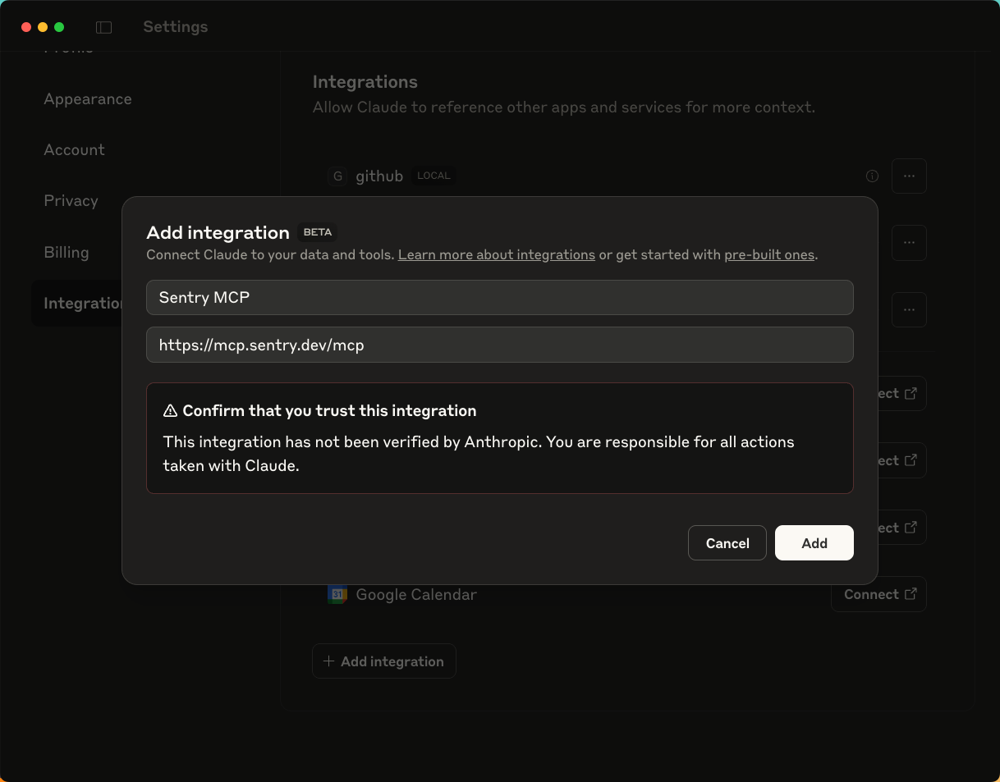
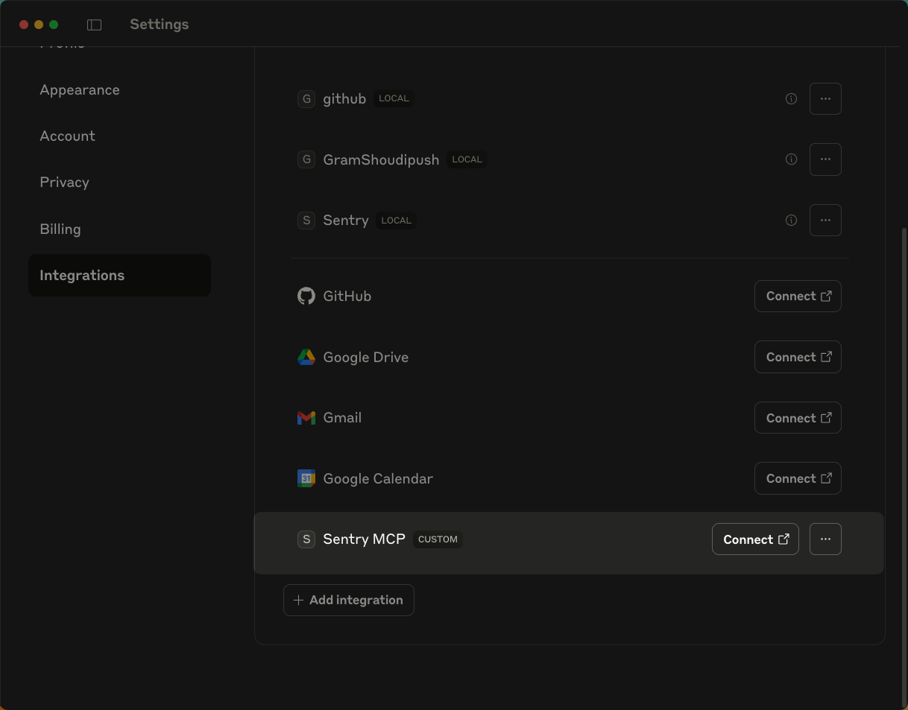
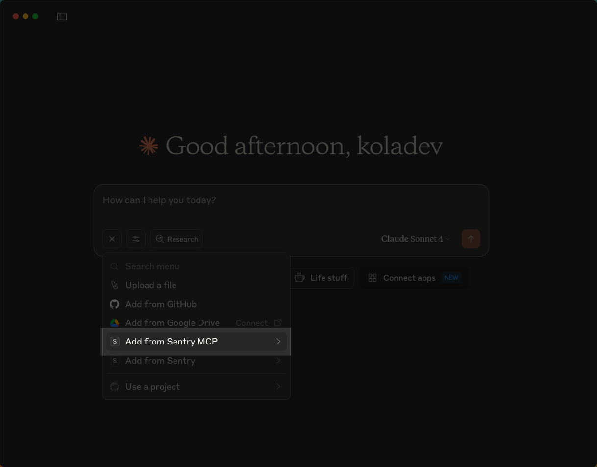
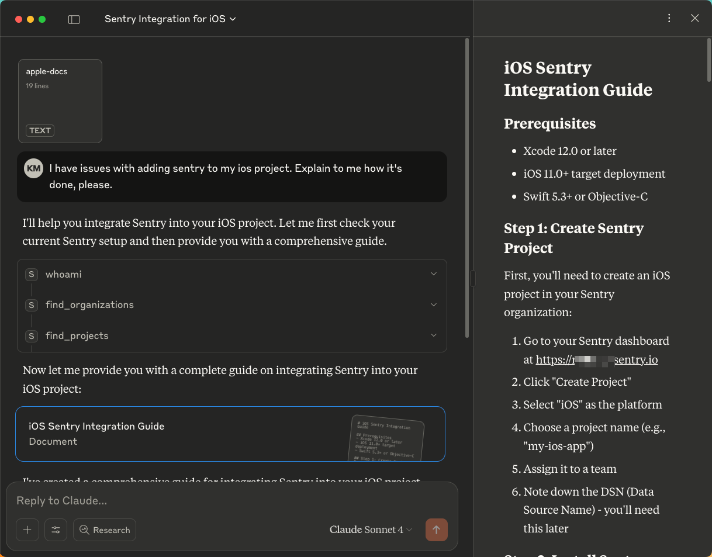
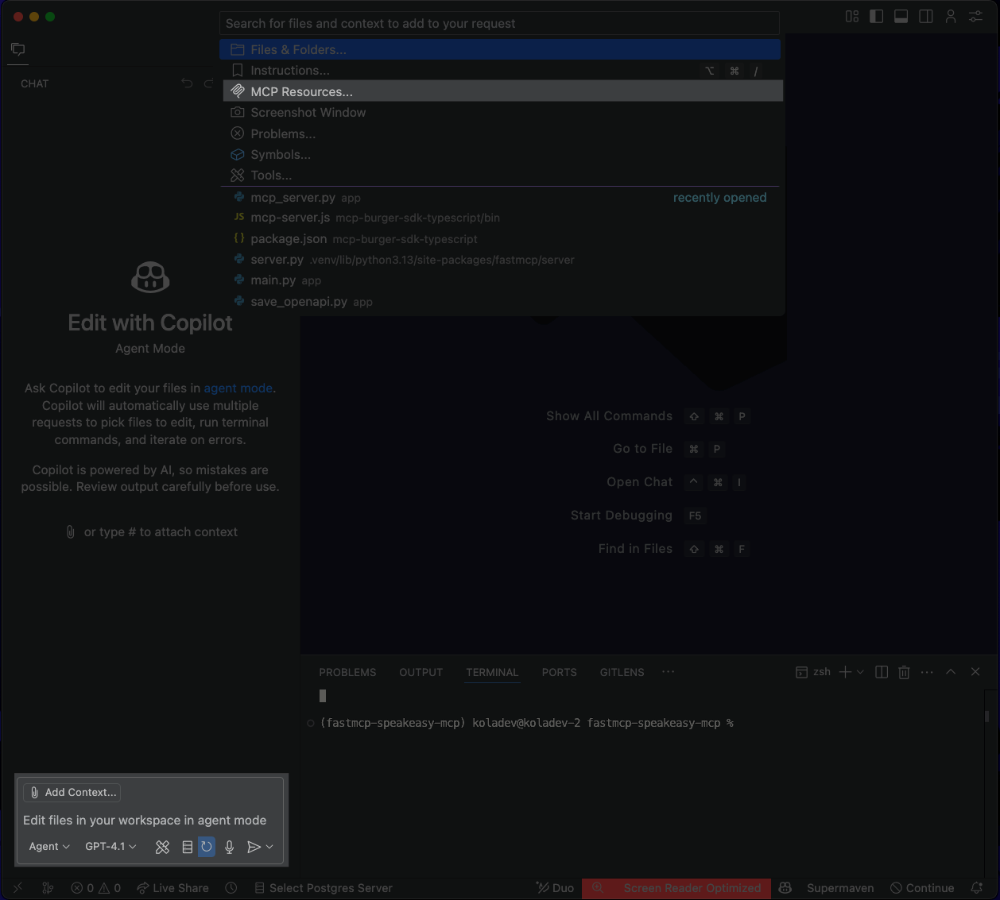
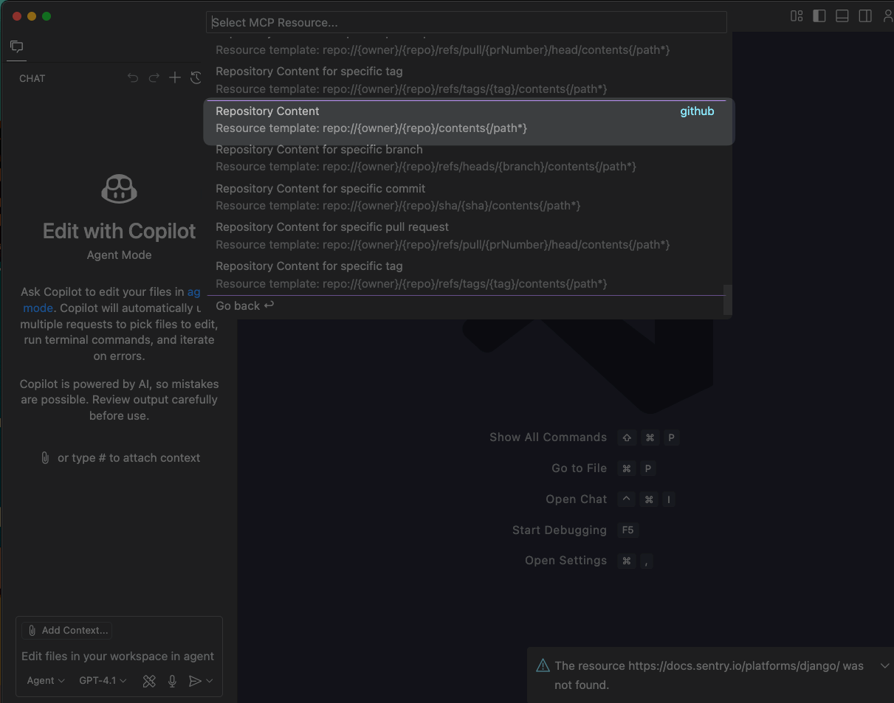
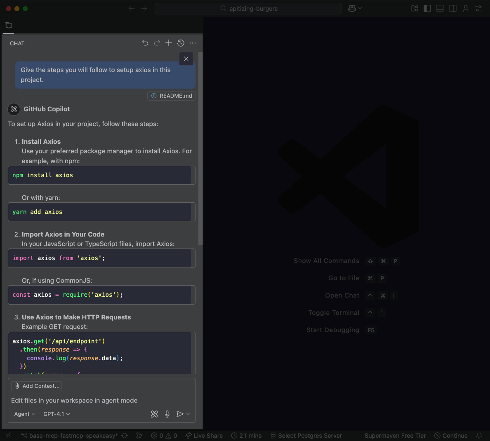

import { Screenshot } from "@/mdx/components";

MCP resources give LLMs direct access to static, read-only data without requiring user approval for each access. This includes documentation, configuration files, schemas, logs, or any reference material that the LLM might need to consult during conversation. Unlike MCP tools, which require user confirmation before execution, resources are treated as safe reference material that can be accessed freely.

For example, instead of manually copying a project's README.md file when asking installation questions, you can expose the README as a resource. The LLM can then access setup instructions directly whenever needed during the conversation, without interrupting the flow to ask for permission.

This tutorial will show you how to use MCP resources to:

- [Add Sentry documentation as context in Claude Desktop](#using-the-sentry-mcp-server-with-claude-desktop) for iOS integration guidance.
- [Add GitHub repository files as context in VS Code](#using-the-github-mcp-server-with-vs-code) for implementation guidance based on actual library documentation.

## Tools vs resources

Both [tools](/mcp/tools) and [resources](mcp/resources) can handle read-only operations, but the key difference lies in the interaction model. Tools are treated as operations that may have side effects or require deliberate execution, while resources are treated as safe reference material for direct access.

In most MCP clients such as Claude Desktop, Copilot or Cursor AI, tools require explicit approval or confirmation before execution, while resources can be accessed directly by the LLM without interrupting the conversation flow. Resources are designed for safe reference material that can be accessed immediately.

So, you should use tools for:
- Operations that modify state or have side effects.
- Accessing sensitive data that requires user consent.
- Dynamic operations with user-specific parameters (searches, queries).
- External API calls or processes that might have costs.
- Operations where the user should be aware something is happening.

And you should use resources for retrieving:
- Configuration files, documentation, schemas.
- Static reference data (catalogs, directories).
- Content the LLM might access multiple times during reasoning.
- Any read-only data you'd always want the LLM to access.

## Using the Sentry MCP Server with Claude Desktop

While [Claude Desktop](https://claude.ai/download) supports MCP resources on Pro and Team plans, it doesn't support resource templating, so you can't pass parameters to specify which content to retrieve dynamically.

The [Sentry MCP Server](https://docs.sentry.io/product/sentry-mcp/) provides access to your Sentry project data and Sentry documentation, enabling AI-assisted debugging and development workflows. 

We'll connect Claude Desktop to the Sentry MCP Server so Claude can reference Sentry's documentation when answering questions about integrating Sentry into an iOS project.

### Prerequisites

You'll need:

- [Claude Desktop](https://claude.ai/download) with a Pro or Team plan (required for MCP resources).
- A [Sentry account](https://sentry.io/signup/) (free tier works).

### Add the Sentry MCP integration

In Claude Desktop, click your username at the bottom left of the sidebar and select **Settings** from the popup. (If the sidebar isn't visible, click the menu icon in the top-left corner first.)

In **Settings**, click **Integrations** and then **+ Add integration**. Give the integration a name, set the URL to `https://mcp.sentry.dev/mcp`, and click **Add**.

<Screenshot url="./assets/claude-adding-sentry.png"></Screenshot>

In the **Integrations** tab, click **Connect** next to the integration. You'll be redirected to your browser to authorize Claude to access your Sentry organization. Note that you need to be logged in to your Claude account in your browser to complete the authorization.

<Screenshot url="./assets/claude-sentry-mcp-integration.png"></Screenshot>

### Add Sentry documentation as context

In any chat, click the **+** button and select **Add from Sentry MCP** from the options.

<Screenshot url="./assets/claude-finding-resources.png"></Screenshot>

Choose `apple-ios-guide` from the list.

<Screenshot url="./assets/claude-looking-for-ios-guide.png"></Screenshot>

### Test the setup

With the resource attached, ask Claude a question like: 

```
How do I set up Sentry crash reporting for my iOS project?
```

<Screenshot url="./assets/mcp-resources-sentry-testing.png"></Screenshot>

Claude responds with detailed iOS setup steps, including specific Swift code and configuration details. With the Sentry documentation as context, it provides platform-specific guidance rather than generic crash reporting advice.

## Using the GitHub MCP Server with VS Code

VS Code with GitHub Copilot has support for MCP servers and resources. 

We'll set up the GitHub MCP Server in VS Code so that we can include the [Axios](https://github.com/axios/axios) `README.md` file as context and ask Copilot for implementation help that references the actual library examples and API methods.

### Prerequisites

You'll need:

- [VS Code](https://code.visualstudio.com/) with [GitHub Copilot](https://github.com/copilot) enabled.
- A GitHub account with a [personal access token](https://docs.github.com/en/authentication/keeping-your-account-and-data-secure/managing-your-personal-access-tokens#creating-a-fine-grained-personal-access-token).

### Create the MCP configuration

In your project root, create a file named `mcp.json` in the `.vscode` directory. Add this configuration:

```json
{
  "servers": {
    "github": {
      "type": "http",
      "url": "https://api.githubcopilot.com/mcp/",
      "headers": {
        "Authorization": "Bearer ${input:github_mcp_pat}"
      }
    }
  },
  "inputs": [
    {
      "type": "promptString",
      "id": "github_mcp_pat",
      "description": "GitHub Personal Access Token",
      "password": true
    }
  ]
}
```

Once saved, VS Code will detect the configuration and display a **Start** button above it. Click this button to start the MCP server, and you will be prompted to enter your GitHub personal access token.

### Add a GitHub file as a resource

In any Copilot chat panel in VS Code, click **📎 Add Context...** and select **MCP Resources**.

<Screenshot url="./assets/mcp-resources-vscode.png"></Screenshot>

Select the **Repository Content** template and enter:

- Repository owner: `axios`
- Repository name: `axios`
- File path: `README.md`

<Screenshot url="./assets/mcp-github-content.png"></Screenshot>

### Test the setup

With the `README.md` file attached as context, write: 

```
Give the steps you will follow to set up axios in this project.
```

<Screenshot url="./assets/using-resource.png"></Screenshot>

Copilot suggests implementation steps for adding Axios to the project, using specific methods and examples from the Axios `README`.

## Next steps

Using MCP resources to provide direct access to reference material eliminates the need to manually find and copy relevant information into every conversation.

MCP resources work with any static, read-only content that you'd always want the LLM to access, such as documentation, configuration files, logs, or reference datasets. Consider what information you regularly consult that could be exposed as resources to streamline your AI workflows without requiring approval prompts or causing side effects.

Learn more about MCP:

- [Deploying remote MCP servers](/mcp/remote-servers).
- [MCP for skeptics](/mcp/mcp-for-skeptics).
- [How to define, expose, and use prompts in MCP servers](/mcp/prompts).
